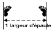
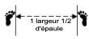
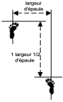
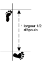
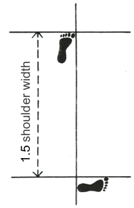
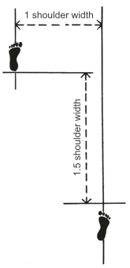
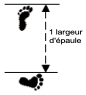
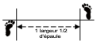
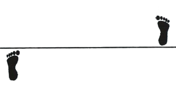
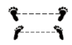

# Encyclopédie Intégrale de la grammaire du Taekwon-Do ITF

## Manuel de Référence Académique Réunissant les Armes Naturelles, les Formules Grammaticales, les Positions de Pieds et le Lexique Officiel

Ce document encyclopédique constitue la somme des connaissances linguistiques, géométriques, anatomiques et techniques du Taekwon-Do ITF (école Chang-Hun). Il a été élaboré en fusionnant de manière exhaustive, rigoureuse et structurée les trois sources actives de référence : **Lexique_TKD_Francais_Anglais_Coreen.md**, **positions.md** et **reference-encyclopedique-terminologie-itf.md**.

En Taekwon-Do ITF, les termes coréens ne désignent pas de simples attaques ou défenses passives. Ils traduisent avec une précision scientifique **la mécanique du mouvement**, **la trajectoire tridimensionnelle** et **l'intention tactique** de chaque action. Ce manuel est conçu pour servir de référence absolue pour les examens théoriques, l'enseignement technique et l'étude académique de l'art martial.

---

## 1. Introduction, Éthique et Terminologie Générale du Dojang

Le Taekwon-Do est régi par un ensemble de principes moraux et philosophiques qui s'incarnent dans la vie quotidienne de l'adepte, à l'intérieur comme à l'extérieur du dojang.

### A. Le Crédo du Taekwon-Do (Taekwon-Do Jungshin)

Chaque adepte doit s'efforcer d'assimiler et de manifester les cinq principes fondamentaux de l'art :

1. **Courtoisie (Ye Ui / 예의) :** Promouvoir l'esprit de concessions mutuelles, être poli, se conduire selon l'étiquette et respecter la dignité d'autrui.
2. **Intégrité (Yum Chi / 염치) :** Être capable de discerner le bien du mal, d'éprouver un regret sincère en cas de faute et de refuser tout compromis avec sa conscience.
3. **Persévérance (In Nae / 인내) :** Faire preuve d'une patience constante pour surmonter les difficultés rencontrées sur sa voie. "La patience mène au mérite et à la vertu".
4. **Contrôle de soi (Guk Gi / 극기) :** Maîtriser ses émotions, ses désirs et ses pulsions physiques, un principe essentiel pour éviter les blessures au combat.
5. **Esprit indomptable (Baekjul Boolgool / 백절불굴 / Courage) :** Agir avec honnêteté et humilité, mais se dresser sans peur ni hésitation face à l'injustice, quelle que soit la puissance de l'opposition.

### B. Vocabulaire Général de la Vie du Dojang et de la Compétition

Voici les termes de base indispensables à la pratique et à la gestion du dojang :

* **Dojang (도장) :** Salle d'entraînement officielle.
* **Tul (틀) :** Forme ou enchaînement codifié de mouvements de combat simulé (24 formes de l'école Chang-Hun).
* **Charyot (차렷) :** "Attention !" (Position protocolaire de recentrage).
* **Swiyo (쉬요) :** "Repos !" ou "Relâchez !".
* **Kyong Ye Jase (경예자세) :** Posture officielle de salut.
* **Taekwon-Do (태권도) :** Littéralement : *Tae* (frapper ou briser avec le pied), *Kwon* (frapper ou briser avec le poing), *Do* (la voie, l'art, le cheminement spirituel).

---

## 2. La Grammaire de l'ITF : Les Formules Magiques de Construction

Pour nommer et décoder n'importe quelle technique de Taekwon-Do ITF, la nomenclature officielle suit des équations grammaticales strictes et logiques qui décrivent précisément le corps en action.

### A. Formule Magique des Techniques de Mains / Bras (Membres Supérieurs)

$$\text{Technique} = [\text{Hauteur}] + [\text{Posture}] + [\text{Alignement}] + [\text{Direction}] + [\text{Surface d'impact}] + [\text{Action}]$$

### B. Formule Magique des Techniques de Jambes / Pieds (Membres Inférieurs)

$$\text{Technique} = [\text{Modalité de déplacement}] + [\text{Hauteur}] + [\text{Direction/Trajectoire}] + [\text{Arme/Surface}] + [\text{Verbe de mécanique}]$$

### C. Définition des Briques de Construction Grammaticales

#### 1. Hauteur (Nopai / 높이)

* **Nopunde (높은데) — Niveau Haut :** Cible située au niveau du visage et du cou (au-dessus des épaules).
* **Kaujunde (가운데) — Niveau Moyen :** Cible située au niveau du tronc, du plexus solaire et des côtes flottantes.
* **Najunde (낮은데) — Niveau Bas :** Cible située sous la ceinture, au niveau de l'abdomen et du bas-ventre.

#### 2. Alignement (Baro / Bandae)

* **Baro (바로) — En poursuite / Homologue :** La main ou le bras qui exécute l'action (frappe ou blocage) est du **même côté** que la jambe placée à l'avant.
* **Bandae (반대) — Contraire / Hétérologue :** La main ou le bras qui exécute l'action est du **côté opposé** à la jambe placée à l'avant.

#### 3. Direction et Trajectoire (Banghyang / 방향)

* **Ap (앞) :** De face.
* **Yop (옆) :** Latéral / De côté.
* **Dollyo (돌려) :** Circulaire.
* **Ollyo (올려) :** Ascendant / Montant.
* **Naeryo (내려) :** Descendant.
* **Anuro (안으로) :** De l'extérieur vers l'intérieur.
* **Bakuro (밖으로) :** De l'intérieur vers l'extérieur.

#### 4. Modificateurs de Déplacement et d'Exécution

* **Twimyo / Twio (뛰묘 / 뛰어) :** Technique sautée ou exécutée en suspension complète dans les airs.
* **Mikulgi (미끌기) :** Technique glissée (déplacement rasant pour fermer instantanément la distance).
* **Dora (돌아) :** Technique retournée (pivotement à 180° ou 360° par le dos).
* **Sangbal (쌍발) :** Technique à double pied simultané (les deux jambes attaquent en même temps en l'air).
* **Yonsok (연속) :** Technique consécutive ou enchaînée (plusieurs frappes de la même jambe sans la poser au sol).

---

## 3. Manuel Géométrique et Technique des 21 Positions de Pieds (Sogi)

La précision, la stabilité et l'agilité des techniques de Taekwon-Do dépendent directement d'une exécution rigoureuse de la position de pieds, qui sert de point d'appui et de départ à tout mouvement.

### A. Constantes Physiques de Référence

Pour assurer une parfaite répétabilité géométrique, les mesures s'appuient sur des dimensions physiques standardisées :

* **Largeur d'épaule standard :** **47 cm**.
* **Longueur de pied standard :** **25 cm**.
* **Largeur de pied standard :** **9 cm**.

### B. Principes Fondamentaux d'Exécution

1. **Tenir le dos parfaitement droit** (sauf de rares exceptions requises par la technique).
2. **Détendre les épaules** pour libérer la fluidité et tendre l'abdomen pour stabiliser le tronc.
3. **Maintenir le bon angle de face** (Pleine face, demi-face/45 degrés, ou de côté par rapport à l'adversaire).
4. **Maintenir l'équilibre** statique et dynamique en faisant bon usage de la force de ressort du genou (action sinusoïdale ou de vague).

---

### C. Fiches Techniques Exhaustives des 21 Positions de Pieds

#### 3.1 POSITION D'ATTENTE (Junbi Sogi)

* **Nomenclature coréenne :** *Junbi Sogi / 준비소기*.
* **Largeur :** **Une largeur d'épaule (47 cm)** mesurée de l'extérieur des deux pieds.
* **Orientation :** Les pieds sont strictement parallèles, les orteils pointant vers l'avant (0°).
* **Poids :** Réparti à 50% sur le pied gauche, 50% sur le pied droit.
* **Usage :** Posture neutre de concentration permettant de se recentrer avant d'entamer les exercices fondamentaux et les formes.
* **Schéma d'alignement :**



#### 3.2 POSITION D'ATTENTE RAPPROCHÉE (Moa Junbi Sogi)

* **Nomenclature coréenne :** *Moa Junbi Sogi / 모아준비소기*.
* **Largeur :** Pieds entièrement collés l'un contre l'autre (bords internes en contact).
* **Poids :** Réparti à 50% sur le pied gauche, 50% sur le pied droit.
* **Variantes de Garde (Mains) :**
  * **Type A :** Les poings fermés sont tenus haut devant le visage. La distance entre la racine du nez et les poings est d'environ **30 cm**.
  * **Type B :** Les poings sont placés devant le tronc. La distance entre les poings et le nombril est d'environ **15 cm**.
  * **Type C :** Les mains ouvertes sont placées bas devant l'abdomen. La distance entre les mains et l'abdomen est d'environ **10 cm**.
* **Schéma d'alignement :**


#### 3.3 POSITION D'ATTENTE FLÉCHIE (Goobooryo Junbi Sogi)

* **Nomenclature coréenne :** *Goobooryo Junbi Sogi / 굽히기준비소기*.
* **Exécution :** La jambe de support est fléchie, son pied pointant vers l'avant. L'autre pied est relevé et maintenu parallèle au sol à la hauteur du genou de soutien.
* **Poids :** 100% sur la jambe de support, 0% sur la jambe levée.
* **Variantes de Garde (Mains) :**
  * **Type A :** Posture préparatoire au coup de pied de côté (*Yop Chagi*). Les bras effectuent un double blocage des avant-bras (*Twin Forearm Block*).
  * **Type B :** Posture préparatoire au coup de pied arrière (*Dwit Chagi*). Distance d'environ **25 cm** entre les poings et les hanches, les coudes pliés à **30 degrés**.

#### 3.4 POSITION À L'ATTENTION (Charyo Sogi)

* **Nomenclature coréenne :** *Charyo Sogi / 차렷소기*.
* **Largeur :** Talons collés, bords internes ouverts.
* **Orientation :** Les pieds forment un angle de **45 degrés**.
* **Posture :** Les poings sont fermés et placés légèrement le long du corps de chaque côté au naturel, les épaules inclinées et le regard fixé vers l'avant.
* **Schéma d'alignement :**

  ```text
     /   \
    /     \   <- Pieds ouverts à 45°
   [ Talons  ]
   [ Collés  ]
  ```

#### 3.5 POSITION DE SALUT (Kyong Ye Jase)

* **Nomenclature coréenne :** *Kyong Ye Jase / 경예자세*.
* **Exécution :** À partir de la position à l'attention (*Charyo Sogi*), on incline le corps de **15 degrés** vers l'avant.
* **Regard :** Maintenir impérativement le regard fixé dans les yeux de l'adversaire ou du senior.

#### 3.6 POSITION PARALLÈLE (Narani Sogi)

* **Nomenclature coréenne :** *Narani Sogi / 나란히소기*.
* **Largeur :** Les pieds sont écartés d'**une largeur d'épaule (47 cm)** entre les gros orteils.
* **Orientation :** Les pieds sont strictement parallèles, les orteils pointant droit devant (0°).
* **Poids :** Réparti à 50% sur le pied gauche, 50% sur le pied droit.
* **Schéma d'alignement (ASCII) :**


#### 3.7 POSITION D'ATTENTE PARALLÈLE (Narani Junbi Sogi)

* **Nomenclature coréenne :** *Narani Junbi Sogi / 나란히준비소기*.
* **Base :** Identique à la position parallèle (*Narani Sogi*).
* **Posture des bras :** Les deux poings sont placés devant l'abdomen.
* **Distances de contrôle :**
  * Écart entre les deux poings : **5 cm**.
  * Distance entre les poings et l'abdomen : **7 cm**.
* **Schéma d'alignement (ASCII) :**


#### 3.8 POSITION ASSISE (Annun Sogi)

* **Nomenclature coréenne :** *Annun Sogi / 앉은소기*.
* **Largeur :** **Une largeur et demie d'épaule (70,5 cm)** mesurée de centre à centre de chaque pied.
* **Orientation :** Les pieds sont strictement parallèles, les orteils pointant vers l'avant (0°).
* **Genoux :** Forcer puissamment les genoux vers l'extérieur.
* **Poids et Posture :** Poids réparti à 50% sur chaque jambe, abdomen contracté et tendu pour assurer une stabilité maximale lors des mouvements latéraux.
* **Schéma d'alignement (ASCII) :**



#### 3.9 POSITION DE MARCHE (Gunnun Sogi)

* **Nomenclature coréenne :** *Gunnun Sogi / 걷는소기*.
* **Longueur :** **Une largeur et demie d'épaule (70,5 cm)** mesurée entre les gros orteils du pied avant et du pied arrière.
* **Largeur :** **Une largeur d'épaule (47 cm)** mesurée de centre à centre de chaque pied.
* **Orientation :**
  * Pied avant : Pointe strictement vers l'avant (0°).
  * Pied arrière : Ouvert à un angle précis de **25 degrés vers l'extérieur**. *Un angle supérieur à 25° affaiblit l'articulation du genou face à une attaque par l'arrière.*
* **Flexion des jambes :**
  * Jambe avant : Fléchie jusqu'à ce que la rotule forme une **ligne droite verticale avec l'arrière du talon**.
  * Jambe arrière : Maintenue complètement droite et tendue.
* **Poids :** Réparti équitablement (50/50).
* **Musculature :** Tendre les muscles des pieds en les sentant tirer l'un vers l'autre pour sceller l'ancrage au sol.
* **Schéma d'alignement (ASCII) :**



#### 3.10 POSITION EN « L » (Niunja Sogi)

* **Nomenclature coréenne :** *Niunja Sogi / ㄴ자소기*.
* **Longueur :** **Une largeur et demie d'épaule (70,5 cm)** mesurée entre le gros orteil du pied avant et le petit orteil du pied arrière.
* **Alignement et décalage :** Les pieds forment presque un angle droit (90°). Les orteils de chaque pied pointent à environ **15 degrés vers l'intérieur**. Le talon du pied avant est décalé et placé à environ **2,5 cm en avant** de la ligne du talon du pied arrière pour assurer la stabilité latérale.
* **Poids :** Réparti à **70% sur la jambe arrière** et **30% sur la jambe avant**.
* **Flexion :**
  * Jambe arrière : Fléchie jusqu'à ce que la rotule forme une ligne verticale droite avec les orteils. Conserver la hanche parfaitement alignée avec la jointure interne du genou arrière.
  * Jambe avant : Fléchie en conséquence.
* **Usage :** Posture de garde principalement défensive permettant d'intercepter, bloquer ou contre-attaquer instantanément de la jambe avant sans transfert préalable du centre de gravité.
* **Schéma d'alignement (ASCII) :**



#### 3.11 POSITION FIXE (Gojung Sogi)

* **Nomenclature coréenne :** *Gojung Sogi / 고정소기*.
* **Structure :** Identique à la position en L (*Niunja Sogi*), à l'exception de la répartition du poids et de la longueur.
* **Longueur :** **Une largeur et demie d'épaule (70,5 cm)** mesurée du gros orteil du pied avant au gros orteil du pied arrière.
* **Poids :** Réparti équitablement à **50% sur chaque jambe**.
* **Usage :** Position extrêmement forte et stable pour les attaques et défenses de côté en puissance.
* **Schéma d'alignement :**



#### 3.12 POSITION SUR UNE JAMBE (Waebal Sogi)

* **Nomenclature coréenne :** *Waebal Sogi / 외발소기*.
* **Exécution :** Étirer complètement la jambe d'appui immobile au sol. Placer le tranchant externe du pied de la jambe relevée directement **sur la rotule** (ou dans le creux poplité) du genou de support.
* **Poids :** 100% sur la jambe d'appui, 0% sur la jambe pliée.

#### 3.13 POSITION FLÉCHIE (Guburyo Sogi)

* **Nomenclature coréenne :** *Guburyo Sogi / 굽혀소기*.
* **Structure :** Identique à la position sur une jambe (*Waebal Sogi*), à la seule différence que la jambe d'appui au sol est **fléchie** pour amortir et stocker l'énergie cinétique.
* **Usage :** Posture de préparation dynamique avant de délivrer un coup de pied de côté (*Yop Chagi*) ou vers l'arrière (*Dwit Chagi*).

#### 3.14 POSITION EN « X » (Kyocha Sogi)

* **Nomenclature coréenne :** *Kyocha Sogi / 교차소기*.
* **Exécution :** Croiser un pied devant ou derrière l'autre.
* **Appuis :** Le pied de soutien (immobile) est posé à plat au sol et supporte **l'intégralité du poids du corps (100%)**. Le pied croisé touche le sol très légèrement uniquement avec **la plante du pied (les orteils)** pour servir de stabilisateur directionnel.
* **Usage :** Position de transition très fluide et propice aux attaques de face ou de côté en déplacement.
* **Schéma d'alignement (ASCII) :**

  ```text
          [ Pied d'appui à plat (100% Poids) ]
                      |    |
                      |____|
                        \
                         \  <- Croisement serré
                          o   [ Plante du pied croisé (0% Poids) ]
  ```

#### 3.15 POSITION ARRIÈRE RAPPROCHÉE (Dwitbal Sogi)

* **Nomenclature coréenne :** *Dwitbal Sogi / 뒷발소기*.
* **Longueur :** Écartement très court d'**une largeur d'épaule (47 cm)** mesurée entre les deux petits orteils.
* **Alignement :** Les genoux sont fléchis. Le talon du pied arrière est positionné en ligne droite verticale directement derrière le talon du pied avant.
* **Orientation :**
  * Pied arrière : À plat au sol. Les orteils pointent vers l'intérieur à **35 degrés**, et le genou arrière doit impérativement **pointer légèrement vers l'intérieur**.
  * Pied avant : Talon décollé du sol, le pied ne fait que **frôler le sol avec la plante**. Les orteils pointent vers l'intérieur à **25 degrés**.
* **Poids :** Presque 100% sur la jambe arrière fléchie (le pied avant restant libre pour frapper instantanément ou ajuster la distance).
* **Schéma d'alignement :**


#### 3.16 POSITION BASSE (Nachuo Sogi)

* **Nomenclature coréenne :** *Nachuo Sogi / 낮춘소기*.
* **Structure :** Identique à la position de marche (*Gunnun Sogi*), à la seule différence qu'elle est **plus longue d'une longueur de pied standard (25 cm)**.
* **Poids :** Réparti à 50% sur la jambe avant, 50% sur la jambe arrière.
* **Usage :** Allonger la portée des armes corporelles d'attaque et renforcer la musculature des cuisses.
* **Schéma d'alignement :**



#### 3.17 POSITION RAPPROCHÉE (Moa Sogi)

* **Nomenclature coréenne :** *Moa Sogi / 모아소기*.
* **Exécution :** Se tenir simplement debout, les **pieds entièrement collés** l'un contre l'autre (bords internes des talons et des gros orteils en contact).
* **Poids :** Réparti équitablement (50/50).
* **Schéma d'alignement :**


#### 3.18 POSITION VERTICALE (Soojik Sogi)

* **Nomenclature coréenne :** *Soojik Sogi / 수직소기*.
* **Longueur :** Écartement d'**une largeur d'épaule (47 cm)** mesurée entre les deux gros orteils.
* **Orientation :** Les deux pieds sont orientés à un angle précis de **15 degrés vers l'intérieur**.
* **Jambes :** Les deux jambes sont maintenues **parfaitement droites et tendues** (sans aucune flexion des genoux).
* **Poids :** Réparti à **60% sur la jambe arrière** et **40% sur la jambe avant**.
* **Schéma d'alignement :**



#### 3.19 POSITION EN DIAGONALE (Sasun Sogi)

* **Nomenclature coréenne :** *Sasun Sogi / 사선소기*.
* **Structure :** Reprend les dimensions de la position assise (*Annun Sogi*), mais avec un décalage longitudinal.
* **Décalage :** Le **talon du pied avant est placé sur la même ligne horizontale que les orteils du pied arrière**.
* **Usage :** Très utile pour basculer instantanément vers la position de marche (*Gunnun Sogi*) sans avoir à déplacer les appuis au sol.
* **Schéma d'alignement :**



#### 3.20 POSITION ACCROUPIE (Oguryo Sogi)

* **Nomenclature coréenne :** *Oguryo Sogi / 오구려소기*.
* **Structure :** Il s'agit d'une variante de la position en diagonale (*Sasun Sogi*).
* **Flexion :** Les deux genoux sont fléchis et **forcés vers l'intérieur** l'un vers l'autre pour créer une tension dynamique active dans les cuisses.
* **Dimensions :** L'écartement entre les pieds peut être ajusté librement selon les besoins tactiques.
* **Schéma d'alignement :**



#### 3.21 POSITIONS OUVERTES (Palja Sogi)

* **Nomenclature coréenne :** *Palja Sogi / 팔자소기*.
* **Usage :** Postures d'attente peu stables utilisées pour le relâchement ou la relaxation des membres.
* **Variantes :**
  * **Ouverte à l'intérieur (An Palja Sogi) :** Les pieds sont écartés d'une largeur d'épaule et les **orteils pointent vers l'intérieur** l'un de l'autre.
  * **Ouverte à l'extérieur (Bakat Palja Sogi) :** Les pieds sont écartés d'une largeur d'épaule et les **orteils pointent vers l'extérieur à un angle de 45 degrés**.



---

## 4. Les Armes Naturelles (Surfaces d'Impact — Jook Bang)

L'efficacité du transfert d'énergie cinétique à l'impact et la sécurité articulaire du pratiquant dépendent directement d'une sélection et d'un alignement rigoureux de la surface de frappe ou de blocage.

### A. Membres Supérieurs (Mains, Avant-bras, Coudes)

#### 1. Les Poings (Joomuk / 주먹)

* **Ap Joomuk (앞주먹) — Face avant du poing :** Surface d'impact principale formée par les articulations métacarpophalangiennes de l'index et du majeur. Utilisée pour les coups directs (*Jirugi*).
* **Dung Joomuk (등주먹) — Revers du poing :** Face dorsale du poing (articulations de l'index et du majeur). Très utilisé pour les frappes cinglantes (*Taerigi*).
* **Yop Joomuk (옆주먹) — Côté du poing (Poing marteau) :** Bord externe du poing fermé (côté du petit doigt). Idéal pour les frappes descendantes ou latérales.
* **Pyun Joomuk (편주먹) — Poing plat :** Poing semi-ouvert où la frappe s'effectue avec les deuxièmes phalanges pliées. Utilisé pour viser des zones molles (gorge, sous le nez).
* **Sewo Joomuk (세워주먹) — Poing vertical :** Poing fermé tenu verticalement à l'impact (pouce vers le haut).
* **Dwijibo Joomuk (뒤집어주먹) — Poing retourné :** Poing tenu horizontalement, paume tournée vers le haut.
* **Injadung Joomuk (인자등주먹) — Nodule de l'index :** Poing fermé avec la deuxième phalange de l'index ressortie pour une pique localisée.
* **Middung Joomuk (중지등주먹) — Nodule du majeur :** Poing fermé avec la deuxième phalange du majeur ressortie.

#### 2. Les Mains Ouvertes (Son / 손)

* **Sonkal (손칼) — Tranchant externe de la main :** Bord extérieur de la main ouverte, s'étendant de la base du petit doigt jusqu'au poignet. Utilisé pour bloquer (*Sonkal Makgi*) ou frapper (*Sonkal Taerigi*).
* **Sonkal Dung (손칼등) — Tranchant interne de la main :** Bord intérieur de la main ouverte, du côté de l'index (le pouce étant replié vers l'intérieur). Utilisé pour des attaques circulaires ou des déviations.
* **Sun Sonkut (선손끝) — Pique de main verticale :** Bout des trois doigts médians (index, majeur, annulaire) alignés, la main étant tenue verticalement. Idéal pour percer la gorge ou le plexus (*Sonkut Tulgi*).
* **Opun Sonkut (오픈손끝) — Pique de main horizontale paume bas :** Bout des doigts alignés, paume tournée vers le sol.
* **Dwijibun Sonkut (뒤집은손끝) — Pique de main horizontale paume haut :** Bout des doigts alignés, paume tournée vers le haut (vise le bas-ventre ou les aisselles).
* **Sonbadak (손바닥) — Paume :** Surface plane intérieure de la main ouverte. Utilisée pour les déviations ou amortissements d'attaques.
* **Bandalson (반달손) — Gueule du tigre / Main en arc :** Zone semi-circulaire située entre le pouce et l'index, utilisée pour frapper la trachée.
* **Jibakson / Pyojeokson (표적손) — Main cible / d'agrippement :** Main ouverte servant de repère visuel de frappe ou utilisée pour agripper et verrouiller un membre adverse.

#### 3. Avant-bras (Palmok / 팔목) et Coudes (Palkup / 팔굽)

* **Bakat Palmok (밖팔목) — Tranchant externe de l'avant-bras :** Face de l'avant-bras située du côté du radius (côté pouce). Utilisé pour les blocages externes.
* **An Palmok (안팔목) — Tranchant interne de l'avant-bras :** Face de l'avant-bras située du côté du cubitus (côté petit doigt). Utilisé pour les blocages internes.
* **Dung Palmok (등팔목) — Dessus de l'avant-bras :** Face supérieure ou dorsale de l'avant-bras.
* **Mit Palmok (밑팔목) — Dessous de l'avant-bras :** Face inférieure ou ventrale de l'avant-bras.
* **Palkup (팔굽) — Coude :** La pointe osseuse ou la face solide de l'articulation du coude. Utilisée pour des frappes de démolition à très courte portée (*Palkup Taerigi*).

---

### B. Membres Inférieurs (Pieds, Chevilles, Genoux)

* **Apkumchi (앞꿈치) — Bol du pied :** Coussinet charnu situé sous la base des orteils. Exige une flexion dorsale maximale de la cheville et des orteils pour éviter les fractures. Utilisé pour les coups fouettés de face (*Ap Cha Busigi*).
* **Dwitchuk (뒤축) — Base / Dessous du talon :** Partie inférieure et plate de l'os du talon. Utilisé pour les poussées ou coups de côté en puissance (*Yop Cha Jirugi*).
* **Dwikumchi (뒤꿈치) — Arrière du talon :** Face postérieure verticale du talon. Utilisé pour les coups directs vers l'arrière (*Dwit Chagi*).
* **Balkal (발칼) — Tranchant externe du pied :** Bord extérieur du pied s'étendant du petit orteil jusqu'au talon, cheville verrouillée à 90°. C'est l'arme de destruction absolue pour le coup de pied latéral perçant (*Yop Cha Jirugi*).
* **Balkal Anchae (발칼안채) — Tranchant interne du pied :** Bord intérieur de la voûte plantaire, utilisé pour crocheter ou faucher (*Suroh Chagi*).
* **Balbadak (발바닥) — Plante du pied :** Toute la surface inférieure sous le pied. Utilisée pour repousser l'adversaire (*Cha Milgi*).
* **Baldong (발등) — Coup-de-pied (Dessus) :** Face supérieure du pied, cheville tendue au maximum. Utilisé pour les coups circulaires sportifs (*Dollyo Chagi*).
* **Murup (무릎) — Genou :** Face avant de l'articulation de la rotule. Utilisé pour les percussions montantes à courte distance (*Murup Chagi*).

---

## 5. Dictionnaire Lexical des Mouvements et Déplacements (Dolgi)

### A. Terminologie des Déplacements (Dolgi)

Les déplacements décrivent la manière dont le pratiquant ajuste sa distance et pivote pour générer de la puissance cinétique :

* **Didimyo nagagi (디디며나가기) :** Pas vers l'avant (avancer d'un pas).
* **Didimyo duruogi (디디며두루오기) :** Pas vers l'arrière (reculer d'un pas).
* **Ibo omgyo didimyo nagagi (이보옮겨디디며나가기) :** Double pas vers l'avant.
* **Ibo omgyo didimyo duruggi (이보옮겨디디며두루기) :** Double pas vers l'arrière.
* **Gujari dolgi (구자리돌기) :** Pivotement/Rotation sur place.
* **Dwiro omgyo didimyo dolgi (뒤로옮겨디디며돌기) :** Pivotement complet sur un pas arrière.
* **Ibo omgyo didimyo dolgi (이보옮겨디디며돌기) :** Pivotement complet sur deux pas.
* **Mikulgi (미끌기) :** Pas chassé / Glissement rasant au sol.
* **Omgyo didigo mikulmyo dolgi (옮겨디디고미끌며돌기) :** Pivotement combiné sur un pas chassé.
* **Durogamyo jajunbal (두로가며자준발) :** Transfert ou décalage rapide de pied.

---

### B. Répertoire des Techniques de Bras (Membres Supérieurs)

#### 1. Les Coups de Poing et Frappes Directes (Jirugi)

* **Ap Jirugi (앞지르기) :** Coup de poing direct de face.
* **Yop Jirugi (옆지르기) :** Coup de poing direct latéral (porté sur le côté).
* **Dollyo Jirugi (돌려지르기) :** Coup de poing circulaire perçant (mécanique en piston avec trajectoire en crochet).
* **Ollyo Jirugi (올려지르기) :** Coup de poing ascendant (uppercut perçant).
* **Naeryo Jirugi (내려지르기) :** Coup de poing direct de haut en bas.
* **Dwijibo Jirugi (뒤집어지르기) :** Coup de poing retourné (corps de face, paume vers le haut).
* **Digutja Jirugi (디귿자지르기) :** Coup de poing en U (une main au visage, une main au tronc simultanément).
* **Kiokja Jirugi (기억자지르기) :** Coup de poing à angle droit.
* **Sewo Jirugi (세워지르기) :** Coup de poing vertical.

#### 2. Les Frappes Percutantes et Cinglantes (Taerigi)

* **Sonkal Taerigi (손칼때리기) :** Coup cinglant du tranchant de la main (vers l'intérieur *Anuro* ou vers l'extérieur *Bakuro*).
* **Sonkal Dung Taerigi (손칼등때리기) :** Coup cinglant du tranchant interne de la main.
* **Dung Joomuk Taerigi (등주먹때리기) :** Coup de revers de poing (de face, latéral ou descendant).
* **Yop Joomuk Taerigi (옆주먹때리기) :** Coup de poing marteau descendant ou latéral.
* **Palkup Taerigi (팔굽때리기) :** Coup de coude balistique (exécuté vers l'avant, le côté, le haut ou le bas).
* **Bandol Son Taerigi (반달손때리기) :** Coup de la gueule du tigre à la gorge.

#### 3. Les Piques de Précision (Tulgi)

* **Sun Sonkut Tulgi (선손끝뚫기) :** Pique des doigts verticale au plexus.
* **Opun Sonkut Tulgi (오픈손끝뚫기) :** Pique des doigts horizontale, paume vers le bas.
* **Dwijibun Sonkut Tulgi (뒤집은손끝뚫기) :** Pique des doigts horizontale, paume vers le haut.

#### 4. Les Blocages et Techniques Défensives (Makgi)

* **Bakat Palmok Makgi (밖팔목막기) :** Blocage externe de l'avant-bras.
* **An Palmok Makgi (안팔목막기) :** Blocage interne de l'avant-bras.
* **Sonkal Makgi (손칼막기) :** Blocage du tranchant de la main.
* **Heetchyo Makgi (헤쳐막기) :** Double blocage d'écartement (de l'intérieur vers l'extérieur).
* **Sang Palmok Makgi (쌍팔목막기) :** Double blocage protecteur des avant-bras.
* **Kyocha Makgi (교차막기) :** Blocage croisé (en X) haut ou bas.
* **Mokuro Makgi (몽둥이막기) :** Blocage bimanuel en berceau / en U.
* **Sonbadak Naeryo Makgi (손바닥내려막기) :** Blocage descendant amortissant avec la paume.

---

### C. Répertoire des Techniques de Jambes (Membres Inférieurs)

#### 1. Typologie des Verbes d'Action de la Jambe

* **Busigi (부시기) — Fouetté (Snap) :** Vitesse explosive et réarmement instantané du genou.
* **Jirugi (지르기) — Perçant (Piston) :** Poussée rectiligne lourde avec engagement du bassin.
* **Tulgi (뚫기) — Pique / Transperçant :** Pénétration incisive visant une faille anatomique étroite.
* **Milgi (밀기) — Poussant :** Pression continue en force projetant le centre de gravité.
* **Olligi (올리기) — Montant tendu :** Élévation rectiligne sans aucune pliure du genou.
* **Suroh (쓸어) — Balayé :** Fauchage circulaire rasant le sol.
* **Naeryo (내려) — Descendant (Hache) :** Percussion lourde du haut vers le bas.
* **Nullo (눌러) — Pressant :** Écrasement vertical vers le bas pour briser un appui.
* **Goro (걸어) — Crocheté :** Trajectoire circulaire dépassant la cible pour la ramener en crochet.
* **Bituro (비틀어) — Vrillé :** Départ axial s'ouvrant en torsion vers l'extérieur à l'impact.

#### 2. Les Coups de Pied Classiques et Avancés (Chagi)

* **Ap Cha Busigi (앞차부시기) :** Coup de pied avant fouetté (avec le bol du pied *Apkumchi*).
* **Ap Cha Jirugi (앞차지르기) :** Coup de pied avant perçant (avec le bol du pied ou le talon).
* **Ap Cha Olligi (앞차올리기) :** Coup de pied montant jambe tendue.
* **Naeryo Chagi (내려차기) :** Coup de pied descendant en hache (avec le talon ou la plante).
* **Anuro Sewo Chagi (안으로세워차기) :** Coup de pied vertical intérieur (trajectoire circulaire externe-interne).
* **Bakuro Sewo Chagi (밖으로세워차기) :** Coup de pied vertical extérieur (trajectoire interne-externe).
* **Yop Cha Jirugi (옆차지르기) :** Coup de pied latéral perçant (avec le tranchant externe du pied *Balkal*).
* **Yop Cha Milgi (옆차밀기) :** Coup de pied latéral poussant (avec la plante *Balbadak*).
* **Yop Nullo Chagi (옆눌러차기) :** Coup de pied pressant latéral (écrasement du genou adverse).
* **Dollyo Chagi (돌려차기) :** Coup de pied circulaire (avec le bol *Apkumchi* ou le dessus du pied *Baldong*).
* **Bandae Dollyo Chagi (반대돌려차기) :** Coup de pied circulaire retourné (par le dos, impact avec le talon).
* **Goro Chagi (걸어차기) :** Coup de pied crocheté de face (avec l'arrière du talon *Dwikumchi*).
* **Bandae Dollyo Goro Chagi (반대돌려걸어차기) :** Coup de pied crocheté retourné (par le dos).
* **Bituro Chagi (비틀어차기) :** Coup de pied vrillé (ouverture en torsion externe avec le bol).
* **Dwit Chagi (뒤차기) :** Coup de pied arrière direct rectiligne (en piston, impact avec le talon).
* **Suroh Chagi (쓸어차기) :** Balayage rasant horizontal pour faucher l'appui.
* **Ap Murup Chagi (앞무릎차기) :** Coup de genou direct de face.

#### 3. Les Techniques Sautées et Spéciales (Special & Flying)

* **Twimyo Ap Cha Busigi (뛰묘앞차부시기) :** Coup de pied avant fouetté sauté en suspension.
* **Twimyo Yop Cha Jirugi (뛰묘옆차지르기) :** Coup de pied latéral perçant sauté.
* **Twimyo Dollyo Chagi (뛰묘돌려차기) :** Coup de pied circulaire sauté en suspension.
* **Twimyo Bandae Dollyo Chagi (뛰묘반대돌려차기) :** Coup de pied circulaire retourné sauté.
* **Twimyo Nopi Chagi (뛰묘높이차기) :** Coup de pied sauté en hauteur maximale.
* **Sangbal Apcha Busigi (쌍발앞차부시기) :** Double coup de pied avant sauté simultané.
* **Sangbal Yopcha Jirugi (쌍발옆차지르기) :** Double coup de pied latéral sauté simultané (gauche et droite).
* **Mikulgi Yop Cha Jirugi (미끌기옆차지르기) :** Coup de pied latéral glissé pour fermer la distance.

---

## 6. Guide d'Application de Décryptage de la Grammaire

Grâce aux équations de la grammaire ITF, décrypter une technique complexe devient un exercice d'une logique limpide.

### Exemple 1 : *Gunnun So Nopunde Bandae Sonkal Taerigi*

* **Gunnun So :** Posture de marche (*Gunnun Sogi*).
* **Nopunde :** Hauteur de la cible au niveau haut (visage/cou).
* **Bandae :** Exécuté du côté opposé à la jambe placée à l'avant (alignement contraire).
* **Sonkal :** Arme naturelle utilisée : le tranchant externe de la main.
* **Taerigi :** Mécanique d'impact : frappe percutante/cinglante en trajectoire courbe.
* **Traduction technique :** *Coup percutant du tranchant de la main opposé au niveau haut, exécuté en posture de marche.*

### Exemple 2 : *Twimyo Nopunde Dora Yop Cha Jirugi*

* **Twimyo :** Modalité d'exécution sautée (en suspension complète dans les airs).
* **Nopunde :** Hauteur de la cible au niveau haut (visage).
* **Dora :** Exécuté après une rotation complète de 180° ou 360° par le dos.
* **Yop :** Direction de l'attaque latérale (de côté).
* **Cha :** Action de coup de pied (*Chagi*).
* **Jirugi :** Mécanique d'impact : poussée rectiligne en piston avec le tranchant externe du pied (*Balkal*).
* **Traduction technique :** *Coup de pied latéral perçant sauté au niveau haut, exécuté avec rotation par le dos.*

---

## 7. Index de Référence de la Terminologie des Mouvements

| Terme ITF | Catégorie | Mécanique / Action Corporelle | Cible / Arme Corporelle |
| ------ | ------ | ------ | ------ |
| **Chagi** | Catégorie | Action offensive de la jambe ou du pied. | Membres inférieurs. |
| **Makgi** | Catégorie | Action défensive de blocage, protection ou déviation. | Membres supérieurs ou inférieurs. |
| **Jirugi** | Impact | Frappe rectiligne et pénétrante en piston (ligne droite). | *Ap Joomuk*, *Dwitchuk*, etc. |
| **Taerigi** | Impact | Frappe balistique, circulaire ou cinglante (courbe). | *Dung Joomuk*, *Sonkal*, etc. |
| **Tulgi** | Impact | Frappe en pique précise avec une surface réduite. | *Sonkut*, *Apkumchi*, etc. |
| **Busigi** | Dynamique | Extension explosive suivie d'un réarmement instantané (*Snap*). | Genou (ex. *Ap Cha Busigi*). |
| **Olligi** | Dynamique | Élévation continue de bas en haut, jambe ou bras tendu. | Jambe tendue (ex. *Ap Cha Olligi*). |
| **Milgi** | Dynamique | Poussée continue en force exploitant le poids du corps. | Plante du pied (ex. *Cha Milgi*). |
| **Suroh** | Dynamique | Fauchage ou balayage circulaire rasant le sol. | Voûte plantaire (ex. *Suroh Chagi*). |
| **Naeryo** | Dynamique | Percussion lourde verticale de haut en bas. | Talon ou tranchant externe. |
| **Nullo** | Dynamique | Écrasement vertical vers le bas pour neutraliser un appui. | Plante du pied ou paume de la main. |
