# Manuel de Taekwon-Do ITF

Ce manuel réunit la théorie du Taekwon-Do ITF en un seul parcours : la doctrine
et l'histoire de l'art, les principes physiques qui font la puissance, la
grammaire qui permet de nommer et de comprendre chaque technique, les positions
qui les portent, le répertoire technique, les formes, l'autodéfense, puis deux
annexes de consultation — le lexique trilingue et les distances de saut des
formes.

L'ordre est celui de l'apprentissage : ce qu'est l'art avant les techniques, les
principes de puissance avant la grammaire qui les nomme, la grammaire avant les
positions et le répertoire dont elle donne la clé de lecture, enfin les formes et
l'autodéfense en application.

Chaque notion n'apparaît qu'une fois : le crédo, les principes de position, les
modificateurs de nomenclature, les déplacements, les verbes d'action et le
vocabulaire du dojang sont traités à un seul endroit, et les renvois indiquent
lequel.

## Table des matières

- [Manuel de Taekwon-Do ITF](#manuel-de-taekwon-do-itf)
  - [Table des matières](#table-des-matières)
  - [Partie I — L'art et sa voie](#partie-i--lart-et-sa-voie)
    - [1. Ce qu'est le Taekwon-Do](#1-ce-quest-le-taekwon-do)
    - [2. Histoire et filiation](#2-histoire-et-filiation)
      - [Genèse du Taekwon-Do moderne](#genèse-du-taekwon-do-moderne)
      - [Le Général Choi Hong Hi, fondateur](#le-général-choi-hong-hi-fondateur)
      - [Maître J. André Blake, pionnier québécois](#maître-j-andré-blake-pionnier-québécois)
      - [Instructeurs fondateurs du club de Blainville](#instructeurs-fondateurs-du-club-de-blainville)
      - [Racines des arts martiaux](#racines-des-arts-martiaux)
    - [3. Le Do : la culture morale de l'adepte](#3-le-do--la-culture-morale-de-ladepte)
      - [Le crédo (Taekwon-Do Jungshin)](#le-crédo-taekwon-do-jungshin)
      - [Le serment de l'adepte](#le-serment-de-ladepte)
      - [La charte du Taekwon-Do (Taekwon-Do Jang)](#la-charte-du-taekwon-do-taekwon-do-jang)
      - [Philosophie de la société et vertus cardinales](#philosophie-de-la-société-et-vertus-cardinales)
      - [Règles de vie pour l'auto-culture](#règles-de-vie-pour-lauto-culture)
    - [4. Étiquette et vie du dojang](#4-étiquette-et-vie-du-dojang)
      - [Le salut (Kyong Ye)](#le-salut-kyong-ye)
      - [Communication et conduite](#communication-et-conduite)
      - [Les douze directives de discipline](#les-douze-directives-de-discipline)
    - [5. Le dobok et les ceintures](#5-le-dobok-et-les-ceintures)
      - [Rôle et conception du dobok](#rôle-et-conception-du-dobok)
      - [La réforme du 28 mars 1968](#la-réforme-du-28-mars-1968)
      - [Spécifications de l'uniforme](#spécifications-de-luniforme)
      - [Symbolisme des couleurs de ceinture](#symbolisme-des-couleurs-de-ceinture)
  - [Partie II — Les principes physiques](#partie-ii--les-principes-physiques)
    - [6. La théorie de la puissance (Him Ui Wolli)](#6-la-théorie-de-la-puissance-him-ui-wolli)
    - [7. Le mouvement de vague](#7-le-mouvement-de-vague)
      - [1. Déroulement du mouvement (La trajectoire sinusoïdale)](#1-déroulement-du-mouvement-la-trajectoire-sinusoïdale)
      - [2. Utilité dans la Théorie de la Puissance (*Him Ui Wolli*)](#2-utilité-dans-la-théorie-de-la-puissance-him-ui-wolli)
      - [3. Les clés d'une bonne exécution](#3-les-clés-dune-bonne-exécution)
    - [8. Respiration, ki et méditation](#8-respiration-ki-et-méditation)
      - [La respiration et le ki](#la-respiration-et-le-ki)
      - [Le protocole de respiration isotonique](#le-protocole-de-respiration-isotonique)
      - [Méditation zen active (Jung-Joong-Dong)](#méditation-zen-active-jung-joong-dong)
  - [Partie III — La grammaire des techniques](#partie-iii--la-grammaire-des-techniques)
    - [9. Les deux formules de construction](#9-les-deux-formules-de-construction)
      - [Techniques de mains et de bras](#techniques-de-mains-et-de-bras)
      - [Techniques de jambes et de pieds](#techniques-de-jambes-et-de-pieds)
    - [10. Les briques de la formule](#10-les-briques-de-la-formule)
    - [11. Les verbes d'action](#11-les-verbes-daction)
    - [12. Les armes naturelles (Jook Bang)](#12-les-armes-naturelles-jook-bang)
      - [Membres supérieurs : mains, avant-bras, coudes](#membres-supérieurs--mains-avant-bras-coudes)
      - [Membres inférieurs : pieds, chevilles, genoux](#membres-inférieurs--pieds-chevilles-genoux)
    - [13. Décrypter un nom de technique](#13-décrypter-un-nom-de-technique)
      - [Exemple 1 : *Gunnun So Nopunde Bandae Sonkal Taerigi*](#exemple-1--gunnun-so-nopunde-bandae-sonkal-taerigi)
      - [Exemple 2 : *Twimyo Nopunde Dora Yop Cha Jirugi*](#exemple-2--twimyo-nopunde-dora-yop-cha-jirugi)
  - [Partie IV — Les positions (Sogi)](#partie-iv--les-positions-sogi)
    - [14. Principes et constantes](#14-principes-et-constantes)
    - [15. Les positions d'un coup d'œil](#15-les-positions-dun-coup-dœil)
    - [16. Les 21 positions en détail](#16-les-21-positions-en-détail)
      - [16.1 Position d'attente (Junbi Sogi)](#161-position-dattente-junbi-sogi)
      - [16.2 Position d'attente rapprochée (Moa Junbi Sogi)](#162-position-dattente-rapprochée-moa-junbi-sogi)
      - [16.3 Position d'attente fléchie (Guburyo Junbi Sogi)](#163-position-dattente-fléchie-guburyo-junbi-sogi)
      - [16.4 Position à l'attention (Charyo Sogi)](#164-position-à-lattention-charyo-sogi)
      - [16.5 Position de salut (Kyong Ye Jase)](#165-position-de-salut-kyong-ye-jase)
      - [16.6 Position parallèle (Narani Sogi)](#166-position-parallèle-narani-sogi)
      - [16.7 Position d'attente parallèle (Narani Junbi Sogi)](#167-position-dattente-parallèle-narani-junbi-sogi)
      - [16.8 Position assise (Annun Sogi)](#168-position-assise-annun-sogi)
      - [16.9 Position de marche (Gunnun Sogi)](#169-position-de-marche-gunnun-sogi)
      - [16.10 Position en « L » (Niunja Sogi)](#1610-position-en--l--niunja-sogi)
      - [16.11 Position fixe (Gojung Sogi)](#1611-position-fixe-gojung-sogi)
      - [16.12 Position sur une jambe (Waebal Sogi)](#1612-position-sur-une-jambe-waebal-sogi)
      - [16.13 Position fléchie (Guburyo Sogi)](#1613-position-fléchie-guburyo-sogi)
      - [16.14 Position en « X » (Kyocha Sogi)](#1614-position-en--x--kyocha-sogi)
      - [16.15 Position arrière rapprochée (Dwitbal Sogi)](#1615-position-arrière-rapprochée-dwitbal-sogi)
      - [16.16 Position basse (Nachuo Sogi)](#1616-position-basse-nachuo-sogi)
      - [16.17 Position rapprochée (Moa Sogi)](#1617-position-rapprochée-moa-sogi)
      - [16.18 Position verticale (Soojik Sogi)](#1618-position-verticale-soojik-sogi)
      - [16.19 Position en diagonale (Sasun Sogi)](#1619-position-en-diagonale-sasun-sogi)
      - [16.20 Position accroupie (Oguryo Sogi)](#1620-position-accroupie-oguryo-sogi)
      - [16.21 Positions ouvertes (Palja Sogi)](#1621-positions-ouvertes-palja-sogi)
  - [Partie V — Le répertoire technique](#partie-v--le-répertoire-technique)
    - [17. Les déplacements (Dolgi)](#17-les-déplacements-dolgi)
    - [18. Les techniques de bras](#18-les-techniques-de-bras)
      - [1. Les Coups de Poing et Frappes Directes (Jirugi)](#1-les-coups-de-poing-et-frappes-directes-jirugi)
      - [2. Les Frappes Percutantes et Cinglantes (Taerigi)](#2-les-frappes-percutantes-et-cinglantes-taerigi)
      - [3. Les Piques de Précision (Tulgi)](#3-les-piques-de-précision-tulgi)
      - [4. Les Blocages et Techniques Défensives (Makgi)](#4-les-blocages-et-techniques-défensives-makgi)
    - [19. Les techniques de jambes](#19-les-techniques-de-jambes)
      - [Les coups de pied (Chagi)](#les-coups-de-pied-chagi)
      - [Techniques sautées et spéciales](#techniques-sautées-et-spéciales)
  - [Partie VI — Les formes (Tul)](#partie-vi--les-formes-tul)
    - [20. La forme comme héritage](#20-la-forme-comme-héritage)
    - [21. Directives d'exécution](#21-directives-dexécution)
    - [22. Les exercices fondamentaux (Saju)](#22-les-exercices-fondamentaux-saju)
      - [Saju Jirugi (Quatre directions - Attaque)](#saju-jirugi-quatre-directions---attaque)
      - [Saju Makgi (Quatre directions - Blocage)](#saju-makgi-quatre-directions---blocage)
      - [Saju Tulgi (Quatre directions - Pique de coude)](#saju-tulgi-quatre-directions---pique-de-coude)
    - [23. Les vingt-quatre formes en un tableau](#23-les-vingt-quatre-formes-en-un-tableau)
    - [24. Les formes une à une](#24-les-formes-une-à-une)
      - [24.1 Chon-Ji (10e Gup à 9e Gup)](#241-chon-ji-10e-gup-à-9e-gup)
      - [24.2 Dan-Gun (9e Gup à 8e Gup)](#242-dan-gun-9e-gup-à-8e-gup)
      - [24.3 Do-San (8e Gup à 7e Gup)](#243-do-san-8e-gup-à-7e-gup)
      - [24.4 Won-Hyo (7e Gup à 6e Gup)](#244-won-hyo-7e-gup-à-6e-gup)
      - [24.5 Yul-Gok (6e Gup à 5e Gup)](#245-yul-gok-6e-gup-à-5e-gup)
      - [24.6 Joong-Gun (5e Gup à 4e Gup)](#246-joong-gun-5e-gup-à-4e-gup)
      - [24.7 Toi-Gye (4e Gup à 3e Gup)](#247-toi-gye-4e-gup-à-3e-gup)
      - [24.8 Hwa-Rang (3e Gup à 2e Gup)](#248-hwa-rang-3e-gup-à-2e-gup)
      - [24.9 Choong-Moo (2e Gup à 1er Gup)](#249-choong-moo-2e-gup-à-1er-gup)
      - [24.10 Kwang-Gae (1er Dan)](#2410-kwang-gae-1er-dan)
      - [24.11 Po-Eun (1er Dan)](#2411-po-eun-1er-dan)
      - [24.12 Ge-Baek (1er Dan)](#2412-ge-baek-1er-dan)
      - [24.13 Eui-Am (2e Dan)](#2413-eui-am-2e-dan)
      - [24.14 Choong-Jang (2e Dan)](#2414-choong-jang-2e-dan)
      - [24.15 Juche (2e Dan)](#2415-juche-2e-dan)
      - [24.16 Sam-Il (3e Dan)](#2416-sam-il-3e-dan)
      - [24.17 Yoo-Sin (3e Dan)](#2417-yoo-sin-3e-dan)
      - [24.18 Choi-Yong (3e Dan)](#2418-choi-yong-3e-dan)
      - [24.19 Yon-Gae (4e Dan)](#2419-yon-gae-4e-dan)
      - [24.20 Ul-Ji (4e Dan)](#2420-ul-ji-4e-dan)
      - [24.21 Moon-Moo (4e Dan)](#2421-moon-moo-4e-dan)
      - [24.22 So-San (5e Dan)](#2422-so-san-5e-dan)
      - [24.23 Se-Jong (5e Dan)](#2423-se-jong-5e-dan)
      - [24.24 Tong-Il (6e Dan)](#2424-tong-il-6e-dan)
  - [Partie VII — L'autodéfense (Hosinsul)](#partie-vii--lautodéfense-hosinsul)
    - [25. Ceinture blanche — dégagements sur saisies](#25-ceinture-blanche--dégagements-sur-saisies)
    - [26. Ceinture blanche I — défenses sur poussées](#26-ceinture-blanche-i--défenses-sur-poussées)
    - [27. Ceinture jaune — attaques de face](#27-ceinture-jaune--attaques-de-face)
    - [28. Ceinture jaune I — attaques par l'arrière](#28-ceinture-jaune-i--attaques-par-larrière)
    - [29. Ceinture verte — attaques de côté](#29-ceinture-verte--attaques-de-côté)
    - [30. Ceinture verte I — attaques au sol](#30-ceinture-verte-i--attaques-au-sol)
    - [31. Ceinture bleue — attaques combinées](#31-ceinture-bleue--attaques-combinées)
  - [Annexe A — Lexique trilingue](#annexe-a--lexique-trilingue)
    - [A. Termes généraux, dojang et compétition](#a-termes-généraux-dojang-et-compétition)
    - [B. Coups de pied (Chagi)](#b-coups-de-pied-chagi)
    - [C. Blocages (Makgi)](#c-blocages-makgi)
    - [D. Frappes et attaques (Jirugi / Taerigi / Tulgi)](#d-frappes-et-attaques-jirugi--taerigi--tulgi)
  - [Annexe B — Distances de saut dans les formes](#annexe-b--distances-de-saut-dans-les-formes)
    - [Sources](#sources)

---

## Partie I — L'art et sa voie

Avant les techniques : ce qu'est le Taekwon-Do, d'où il vient, et la conduite qu'il demande. C'est la matière des examens théoriques de tous les grades.

### 1. Ce qu'est le Taekwon-Do

**Taekwon-Do** ([태권도](../audio/grammaire/Taekwon-Do.m4a)) : *Tae*, frapper ou briser avec le pied ; *Kwon*, frapper ou briser avec le poing ; *Do*, la voie, l'art, le cheminement spirituel. Au-delà de sa dimension sportive et de combat, le Taekwon-Do ITF se définit comme un mode de vie et de pensée, fusion de la discipline corporelle et du réarmement moral.

Le Taekwon-Do est un système unifié où chaque aspect est intimement lié à un autre. Il est composé de cinq facettes :

| Facette | Description |
| --- | --- |
| **Les mouvements de base (Bases)** | Ils sont l'alphabet de l'art, indispensables aux combats et aux formes. |
| **Les formes (Tuls)** | Elles constituent la grammaire de l'art martial. Ce sont des combats solitaires logiquement structurés contre des adversaires imaginaires pour développer la précision, le rythme et le contrôle respiratoire. |
| **Les jeux d'équilibre** | Essentiels pour parfaire la posture et la stabilité statique et dynamique. |
| **Les combats (Sportifs ou Arrangés)** | Ils représentent la rédaction, où l'adepte applique ses techniques contre un adversaire réel afin de renforcer son corps et ses armes naturelles. |
| **L'autodéfense (Hosinsul)** | La validation finale où l'adepte teste sa coordination, sa vitesse et sa concentration face à une agression spontanée réelle. |

Dans ce cycle d'entraînement, il n'y a ni début ni fin. Même à un haut niveau de perfectionnement, l'adepte retourne constamment aux mouvements de base pour peaufiner ses techniques.

### 2. Histoire et filiation

#### Genèse du Taekwon-Do moderne

Bien que l'autoprotection à base de mouvements de mains et de pieds soit millénaire, le Taekwon-Do moderne est une discipline scientifique unique se distinguant par sa sophistication technique, sa terminologie et ses principes fondamentaux rigoureux.

Le Taekwon-Do a pris forme à la suite d'une combinaison de circonstances historiques. Le fondateur a appris l'art coréen traditionnel du **Taek Kyon** en Corée, puis le **Karaté** au Japon pendant l'occupation japonaise (1910-1945). Après la libération en 1945, sa position au sein des nouvelles forces armées de la Corée du Sud lui a permis de surmonter les oppositions pour intégrer et diffuser cette méthode nouvelle, scientifiquement validée et distincte des arts japonais. Le nom officiel de **« Taekwon-Do »** a été formellement adopté le **11 avril 1955** après délibération d'un comité de maîtres, d'historiens et de personnalités de la société coréenne.

#### Le Général Choi Hong Hi, fondateur

| Événement | Description |
| --- | --- |
| **Origines et jeunesse** | Né le 9 novembre 1918 dans la région de Hwa Dae (aujourd'hui en Corée du Nord). De constitution frêle et faible, il est encouragé à 15 ans à pratiquer le Taek Kyon par son maître de calligraphie, M. Han Il Dong. |
| **Séjour au Japon (1937-1938)** | Il part étudier à Kyoto et décide de s'entraîner intensivement pour devenir ceinture noire de Karaté afin de se protéger contre des menaces de représailles après un incident inattendu en Corée. |
| **Emprisonnement et promesse patriotique** | Engagé dans le mouvement de libération nationale (l'incident du soldat-étudiant de Pyongyang), il est arrêté et emprisonné dans une cellule militaire japonaise. C'est en détention, aux côtés de trois camarades, qu'il formule le vœu solennel de ne pas devenir un « maître » oppressif pour son peuple après la libération, mais de se dévouer à conseiller sagement les gouvernants. |
| **Développement militaire** | En 1946, breveté sous-lieutenant du 4e Régiment d'infanterie de Kwangju, il commence à enseigner sa méthode à ses soldats, initiant le développement systématique de nouvelles techniques basées sur la physique newtonienne.|
| **Expansion internationale** | En 1959, il préside la première équipe militaire de démonstration au Vietnam et à Taïwan, publie ses premiers écrits théoriques et devient président de l'Association Coréenne de Taekwon-Do. Il est nommé ambassadeur en Malaisie en 1962. |
| **Fondation de l'ITF** | Le 22 mars 1966, il fonde l'**International Taekwon-Do Federation (ITF)** à Séoul. En 1972, pour des motifs politiques, il s'exile et déménage le siège mondial de l'ITF à Toronto, au Canada. Il publie son Encyclopédie en 15 volumes en 1983. |
| **Dernier rêve et décès** | En 1988, il réalise son rêve ultime d'enseigner son art à Moscou (U.R.S.S.), sans distinction de race, d'idéologie ou de religion. Il s'éteint des suites d'un cancer le 15 juin 2002 à Pyongyang, en Corée du Nord, à l'âge de 83 ans. |

#### Maître J. André Blake, pionnier québécois

| Événement | Description |
| --- | --- |
| **Jeunesse** | Né le 26 février 1944 à Montréal, il débute par la boxe à 15 ans, puis pratique la lutte amateur, le judo, le jiu-jitsu (2e Dan sous Maître Kuniba). |
| **Engagement ITF** | En 1972, il rencontre Maître Kim Jong Chang et s'implique activement pour transformer sa section de karaté du centre Immaculée-Conception en la première section officielle de Taekwon-Do ITF de Montréal. Il reçoit son 4e Dan d'instructeur international en 1976. |
| **Grandes réalisations** | Il fonde l'**Académie Québécoise de Taekwon-Do** le 23 février 1978. Le 22 mars 1991, il est promu ceinture noire 7e degré par le Général Choi, devenant le **premier Canadien d'origine** à accéder au rang de Maître Instructeur. Nommé président de la fédération canadienne en 1993, il reçoit son 8e degré du Général Choi en septembre 1999. |
| **Décès** | Il décède subitement d'un infarctus le 2 mai 2001 à l'âge de 57 ans. |

#### Instructeurs fondateurs du club de Blainville

| Nom | Description |
| --- | --- |
| **Yannick Drolet** | Initié à de multiples styles (kung-fu, judo, kickboxing, kempo, aïkibudo, WTF), il obtient son 1er degré ITF en 1991 sous Pierre Laquerre et Tran Trieu Quan. Instructeur international certifié PNCE #1, #2 et #3, il a enseigné à plus de 350 élèves, entraîné des champions nationaux et dispensé des cours dans plusieurs pays (États-Unis, Espagne, France, Suisse, Équateur, Italie) avant de s'établir à Blainville. Il détient un 7e degré ITF. |
| **Sylvain Audet** | Débute le judo à 10 ans, s'entraîne à Montréal sous Me André Blake (qui instruisait alors l'escouade tactique de la police). Il s'est entraîné au Kim's TKD à Tokyo, a obtenu son 3e degré en 2004 et s'entraîne avec Richard Lajeunesse et Rock Soucy. Il détient un 5e degré ITF. |
| **Yves Morin** | Pratique le TaeKwon-DO ITF depuis 1993, ancien président et assistant du club de Baie-Comeau, il s'est spécialisé en autodéfense et instruit au Centre Richard Lajeunesse de Verdun. Il est président du club de TaeKwon-DO Hosinsul. Il détient un 5e degré ITF. |
| **Marc-André Fairfield** | Pratique depuis 1996. Élève de Yannick Drolet, Alain Dumaine et Me Blake, il obtient sa ceinture noire 1er degré en 2005 sous Richard Lajeunesse, se focalisant sur les points de pression et l'autodéfense. Il détient un 4e degré ITF. |

#### Racines des arts martiaux

Les sources retracent le développement des techniques de combat à mains nues à travers l'histoire de l'humanité, des peintures murales du Nil en 3000 av. J.-C. jusqu'aux arènes du pancrace grec et des gladiateurs romains.

| Titre | Description |
| --- | --- |
| **Le Moine Bodhidharma (Daruma)** | En 520 apr. J.-C., ce moine bouddhiste de l'Inde du Sud arrive en Chine au Temple de Shaolin. Constatant l'épuisement physique des moines soumis à une méditation rigoureuse, il introduit des exercices de conditionnement physique et spirituel issus des traités *L-Jin Kyong* (développement musculaire) et *Si Shim Kyong* (purification de l'esprit), jetant ainsi les bases de la boxe Shaolin (*Ch’yan Fa*).
| **La Péninsule Coréenne et le Hwa-Rang-Do** | Durant l'époque des Trois Royaumes (Silla, Koguryo, Baek Je), le petit royaume de Silla forme un corps d'élite de jeunes guerriers aristocrates, les **Hwa-Rang**. Pour défendre leur patrie, ils endurcissent leur corps et leur esprit en escaladant des montagnes et en nageant dans des fleuves glacés. Ils adoptent un **Code de conduite en 5 points** rédigé par le moine Won Kang : 1. *Soyez loyal envers votre Roi (ou patrie).* 2. *Soyez obéissant envers vos parents.* 3. *Soyez d'honneur (fidèle) envers vos amis.* 4. *Ne retraitez jamais en combat.* 5. *Faites des morts justes (tuer avec discernement).* |

### 3. Le Do : la culture morale de l'adepte

#### Le crédo (Taekwon-Do Jungshin)

Le but ultime du Taekwon-Do est d'éliminer le combat en décourageant l'agression
par une force morale. Chaque adepte s'efforce d'assimiler et de manifester les
cinq principes fondamentaux de l'art :

| Principe | Ce qu'il engage |
| --- | --- |
| **Courtoisie** — *Ye Ui / [예의](../audio/lexique/Ye-Ui.m4a)* | Promouvoir un esprit de concessions mutuelles, être poli, se conduire selon l'étiquette (*Sajeji Do*), respecter les possessions d'autrui et agir avec équité. |
| **Intégrité** — *Yum Chi / [염치](../audio/lexique/Yum-Chi.m4a)* | Distinguer clairement le bien du mal et ressentir une culpabilité sincère face à l'erreur. L'intégrité fait défaut chez l'instructeur apathique qui enseigne de mauvaises techniques, chez l'étudiant qui triche dans ses cassages ou tente d'acheter un grade, chez le professeur guidé par le seul commerce. |
| **Persévérance** — *In Nae / [인내](../audio/lexique/In-Nae.m4a)* | *« La patience mène à la vertu et au mérite. Un foyer peut connaître la paix si l'on est cent fois patient. »* La ténacité permet de surmonter toutes les difficultés pour perfectionner son art. |
| **Contrôle de soi** — *Guk Gi / [극기](../audio/lexique/Guk-Gi.m4a)* | Essentiel tant à l'intérieur qu'à l'extérieur du dojang : une perte de contrôle peut être désastreuse en combat comme dans les affaires personnelles. Lao-Tzu : *« On appelle "fort" celui qui se vainc soi-même et non celui qui vainc les autres. »* |
| **Esprit indomptable** — *Baekjul Boolgool / [백절불굴](../audio/lexique/Baekjul-Boolgool.m4a)* | Être modeste et honnête, mais affronter l'injustice sans peur ni hésitation, peu importe le nombre d'adversaires. Confucius : *« C'est un geste de lâcheté que de se taire en face de l'injustice. »* |

#### Le serment de l'adepte

Tout nouvel adepte doit prononcer et vivre selon ce serment réitéré régulièrement :

1. *Je respecterai le crédo du Taekwon-Do.*
2. *Je respecterai mon instructeur et les seniors.*
3. *J'utiliserai le Taekwon-Do à de bonnes fins.*
4. *Je serai un champion de la liberté et de la justice.*
5. *Je bâtirai un monde meilleur et pacifique.*

#### La charte du Taekwon-Do (Taekwon-Do Jang)

Établie par le fondateur pour baliser la transmission pure et noble de l'art martial :

| Article | Description |
| --- | --- |
| **1** | Améliorer la santé physique et nourrir l'intellect par la pratique scientifique pour promouvoir la justice et une société pacifique. |
| **2** | Étudier l'art en vue de maîtriser la vie et la mort, en léguant un héritage spirituel de valeur illimitée aux générations futures. |
| **3** | Demeurer humble, indulgent et imperméable aux motifs égoïstes ou à l'avarice pour préserver l'indépendance pure du Taekwon-Do. |
| **4** | Traiter tous les adeptes de façon égale, indépendamment du statut social, de la race ou des convictions religieuses, démontrant ainsi la fraternité humaine. |
| **5** | Contrecarrer les excès matériels et la dépendance inutile envers la machine de la société moderne en promouvant l'autodiscipline, le sacrifice et la dévotion. |
| **6** | Vivre selon sa conscience, faire preuve de respect envers les professeurs, les aînés et d'empressement attentionné envers ses cadets. |

#### Philosophie de la société et vertus cardinales

| Type | Description |
| --- | --- |
| **La société idéale** | Le souverain gouverne naturellement par sa haute moralité, sans ingérence ni peur, en faisant appel à la bonne nature du peuple. |
| **La société morale*** | Le peuple admire et fait l'éloge du souverain en gratitude pour sa bienveillance. |
| **La société légale** | Le souverain utilise des lois strictes et la peur de la sanction pour gouverner. |
| **La pire société (tyrannie)** | Le souverain utilise la ruse, la tricherie et la force brute pour asseoir son ambition personnelle. Il est haï et provoque inévitablement sa chute. |

Afin de bâtir une société morale, l'adepte doit cultiver cinq vertus fondamentales :

| Vertu | Description |
| --- | --- |
| **L'Humanité (In)** | Ressentir de la peine pour le malheur des autres et les aimer sincèrement. Elle s'exprime par la prudence, la modestie et la discrétion. |
| **La Droiture (Ui)** | Se sentir coupable d'actes injustes et faire son devoir. Préférer mourir pour la droiture plutôt que de tolérer l'injustice. |
| **La Courtoisie (Ye)** | Agir selon les bonnes manières et le respect mutuel. *« La franchise sans courtoisie peut être plutôt impitoyable ; le respect sans courtoisie rend inconfortable ; le courage sans courtoisie peut être violent »*. |
| **La Sagesse (Ji)** | Juger le bien du mal dans ses propres affaires avant de juger autrui. |
| **L'Honnêteté (Shin)** | Tenir scrupuleusement parole et promesse envers tous sous peine de perdre sa dignité. |

#### Règles de vie pour l'auto-culture

| Titre | Description |
| --- | --- |
| **L'Autocritique quotidienne** | L'adepte doit s'interroger trois fois par jour : *Ai-je été égoïste ? Ai-je été sincère avec mes amis ? Ai-je enseigné avec certitude ? Ai-je négligé la vertu ou mes études ? Me suis-je corrigé immédiatement après une erreur ?* |
| **La Douceur et la Flexibilité** | À l'instar de l'eau et de la lumière, l'adepte doit être fluide et adaptable. Un jeune arbre flexible survit à la tempête, tandis qu'un vieil arbre sec est brisé par le vent. |
| **Le Respect des Aînés** | Indispensable pour éviter le chaos social. Les trois valeurs fondamentales de la société sont la fonction, l'honneur et l'intégrité morale. |
| **Le Frugalisme** | Éviter le luxe excessif et l'extravagance qui mènent à la ruine, illustré par le poème de Lee-Mong-Yong dénonçant les festins financés par les larmes du peuple souffrant. |
| **La Paix de l'esprit (Jung-Joong-Dong)** | Atteinte par la méditation active en silence pour réfléchir sur ses erreurs passées et viser l'auto-amélioration. |
| **L'Esprit Ferme (Ki et Chi)** | Nourrir le *Ki* (énergie active) par la justice et l'humanité, et le guider par le *Chi* (la volonté motrice) pour garder l'esprit alerte face à l'adversité. |

### 4. Étiquette et vie du dojang

#### Le salut (Kyong Ye)

| Étape | Description |
| --- | --- |
| **Exécution technique** | Immobilisation totale (ne pas saluer en marchant). Pieds joints en « V », poings naturellement fermés le long du corps, bras à 30 degrés. S'incliner vers l'avant à un angle de 15 degrés, en maintenant les yeux fixés dans les yeux du partenaire ou du senior. Poser au sol tout objet tenu à la main et retirer son chapeau. |
| **Cibles obligatoires** | Saluer les tableaux du crédo/serment, les drapeaux et l'instructeur en entrant et en sortant du dojang. |
| **Hiérarchie** | Les juniors saluent systématiquement les seniors avant de leur adresser la parole ou lorsqu'ils s'approchent. Un senior doit toujours retourner poliment le salut. Si un grand senior ou maître visite une classe, l'instructeur en fonction doit interrompre son cours et ordonner à ses élèves de saluer le visiteur en même temps que lui. |

> La position de salut elle-même est décrite avec les positions de pieds, au chapitre 16.

#### Communication et conduite

| Règle | Description |
| --- | --- |
| **Façon de s'exprimer** | Les interpellations familières (« eh », « aie »), les claquements de doigts ou les réponses non formelles (« ouais ») sont strictement interdits. L'élève doit répondre par « oui maître », « oui monsieur » ou « oui madame ». Pour poser une question, il doit lever le bras et attendre l'autorisation. |
| **Respect physique** | Éviter de couper la parole à un senior. Laisser passer les seniors devant soi. Ne jamais s'asseoir à une hauteur supérieure à celle d'un senior ou commencer à manger avant lui lors d'un repas. Éviter absolument de traverser ou de passer devant un groupe en entraînement ou devant l'instructeur (faire un détour par l'arrière). |
| **Règles relatives aux cours et retards** | Le silence complet est exigé dès que l'instructeur parle ou en attendant la fin d'un cours. Tout retardataire doit obligatoirement obtenir la permission de l'instructeur pour intégrer le cours et s'expose à une pénalité (diminution du crédit d'heures ou pénalité physique). |

#### Les douze directives de discipline

Ces douze règlements intérieurs codifient la vie du club pour préserver la sécurité et le respect :

1. Se conformer scrupuleusement au serment de l'adepte et aux règles intérieures.
2. Témoigner un respect total envers les instructeurs et ceintures noires, en s'adressant à eux par « Monsieur » ou « Madame ».
3. Saluer obligatoirement en entrant et en sortant du dojang, ainsi qu'avant de s'adresser à une ceinture noire.
4. Être présent à temps pour le début des cours. Les retardataires doivent attendre l'autorisation au bord du plateau.
5. Une fois le cours commencé, il est interdit de quitter le dojang sans l'accord exprès de l'instructeur.
6. Limiter strictement les commentaires et conversations ; le chahut est banni.
7. Maîtriser ses émotions et son langage afin de préserver la réputation de l'art.
8. Respecter mutuellement ses pairs et s'efforcer de maintenir la propreté du dojang.
9. **Pour éviter les blessures** : interdiction absolue de porter des bijoux, interdiction de mâcher de la gomme et obligation de maintenir les ongles des mains et des pieds propres et coupés très courts.
10. Les chaussures de ville sont rigoureusement interdites sur la surface d'entraînement.
11. Interdiction stricte de boire, de manger ou de fumer dans ou à proximité du dojang.
12. Le Dobok doit être impeccable, propre et complet, représentant le respect que l'élève porte à son art.

### 5. Le dobok et les ceintures

#### Rôle et conception du dobok

Le port de l'uniforme officiel répond à cinq objectifs précis :

* Instiller une fierté profonde chez l'adepte à titre de pratiquant.
* Identifier visuellement le niveau technique et culturel atteint.
* Symboliser l'héritage historique et la tradition traditionnelle de l'art.
* Stimuler la motivation au progrès tout en préservant l'humilité lors des promotions.
* Offrir une tenue extrêmement saine, souple et pratique pour l'entraînement.

#### La réforme du 28 mars 1968

Un comité d'étude de l'ITF a réformé le Dobok en se basant sur six arguments majeurs :

* Distinguer clairement le Taekwon-Do des autres arts martiaux traditionnels.
* Éviter que la veste ne s'ouvre continuellement pendant les mouvements et les épreuves de combat.
* Différencier aisément les ceintures de couleur des ceintures noires.
* Intégrer la tradition : la bordure noire de la veste s'inspire directement des tenues royales et de l'aristocratie du **Royaume de Silla**, et est réservée exclusivement aux ceintures noires.
* Remplacer l'ancien système de ceintures qui limitait la distinction précise des grades.
* Autoriser uniquement le port d'un T-shirt blanc (col en « V ») sous le Dobok pour des questions d'hygiène (ou sous le plastron).

#### Spécifications de l'uniforme

| Composante | Description |
| --- | --- |
| **La Veste (Sang I)** | Doit être légèrement ample et s'étendre jusqu'à la naissance des cuisses. Les manches doivent atteindre au minimum le milieu de l'avant-bras. L'ouverture latérale à la base ne doit pas dépasser 7 cm. Pour les ceintures noires, la bordure noire au bas de la veste ne doit pas excéder 2,5 cm de largeur. Les détenteurs d'un grade d'instructeur international (4e degré et plus) portent un liseré noir de 2,5 cm le long du côté extérieur de chaque manche et jambe de pantalon. |
| **Le Pantalon (Ha I)** | Plus ajusté que l'ancien modèle coréen flottant. Sa longueur se situe entre le genou et la cheville, avec une fente de 7 cm au bas pour libérer les techniques de jambe. |
| **La Ceinture (Ti)** | Largeur fixe de 5 cm, épaisseur de 5 mm. Les barres de gradation mesurent 5 mm de large et sont placées à 5 cm de l'extrémité de la ceinture. |

#### Symbolisme des couleurs de ceinture

Inspirées des rangs de la dynastie Silla, les couleurs reflètent le parcours de vie de l'adepte :

| Couleurs | Description |
| --- | --- |
| **BLANC (La neige)** | Symbolise l'innocence pure du débutant qui ne possède aucune connaissance préalable du Taekwon-Do. |
| **JAUNE (La terre)** | Symbolise la fondation fertile dans laquelle la graine a été plantée et prend racine pour sa progression future. |
| **VERT (L'arbre)** | Symbolise la croissance de la plante et le développement progressif des habiletés de l'adepte à force d'entraînement. |
| **BLEU (Le ciel)** | Symbolise l'immensité vers laquelle l'adepte s'élève, mesurant le chemin parcouru et l'immensité de ce qu'il lui reste à découvrir. |
| **ROUGE (Le feu et le sang)** | Symbolise la découverte de la puissance (le soleil levant), mais représente également le danger d'une force encore incontrôlée. Un avertissement à l'adversaire de se tenir à distance, et à l'adepte d'exercer une maîtrise absolue de ses gestes. |
| **NOIR (L'univers, l'obscurité et la nuit)** | L'opposé du blanc. Symbolise la maturité technique, la connaissance globale de l'art et l'imperméabilité de l'adepte à la peur et aux ténèbres sous toutes leurs formes. |

---

## Partie II — Les principes physiques

Ce qui distingue le Taekwon-Do d'une gymnastique : la puissance y est calculée. Ces principes commandent l'exécution de toutes les techniques des parties suivantes.

### 6. La théorie de la puissance (Him Ui Wolli)

Le secret de la force dévastatrice du Taekwon-Do réside dans l'application mathématique et scientifique des principes de la physique newtonienne. Un entraînement scientifique permet d'exploiter 100% de son potentiel corporel.

| Facteur | Description |
| --- | --- |
| **Force de Réaction (Bandong Ryok)** | Loi d'action-réaction de Newton. La force d'impact est démultipliée en combinant la force du coup avec la force d'impulsion de l'adversaire qui fonce vers soi. De plus, lors d'un coup de poing droit, le retrait simultané et vigoureux du poing gauche à la hanche génère une force de réaction interne optimale. |
| **Concentration (Jip Joong)** | Appliquer la force d'impact sur la plus petite surface possible (tranchant externe de la main, jointures) pour maximiser la pression. La force doit être déployée de manière fluide puis concentrée à l'extrême au moment de l'impact. Les cuisses et l'abdomen (gros muscles lents) se contractent immédiatement avant les mains et les pieds. |
| **Équilibre (Kyun Hyung)** | L'équilibre assure la stabilité nécessaire pour qu'un coup soit puissant et efficace. Le centre de gravité doit être aligné au milieu des deux jambes ou au centre du pied d'appui. **Le talon du pied arrière ne doit jamais quitter le sol au moment de l'impact** pour sceller la puissance. |
| **Contrôle de la Respiration (Hohup Jojul)** | Une expiration sèche au moment de l'impact tend l'abdomen, rigidifie le corps pour encaisser un éventuel contre-coup et décuple la force de frappe. Il ne faut jamais inhaler pendant l'exécution d'un blocage ou d'une attaque, sous peine de perdre sa puissance. |
| **Masse (Zilyang)** | L'énergie cinétique maximale est obtenue en projetant la masse du corps par une rotation des hanches. De plus, l'adepte utilise l'action de ressort du genou (mouvement de vague) : monter légèrement le corps au début de la technique pour le descendre brusquement au moment de l'impact. |
| **Vitesse (Sokdo)** | La vitesse est le facteur le plus déterminant de la puissance. Selon la formule de l'énergie cinétique ($E = (1/2)mv^2$), si la masse est multipliée par 3, la puissance est multipliée par 3 ; mais si la vitesse est multipliée par 3, la puissance est multipliée par 9. |
| **Vitesse et Réflexes (Sokdo wa Baung)** | L'étude strobo-photographique menée au MIT en 1973 a démontré que la vitesse d'exécution d'un coup de pied de côté ou avant sauté est plus rapide que le temps de réflexe humain le plus rapide (2/10 de seconde). Il est donc physiologiquement impossible de parer ces attaques si on attend le départ du coup ; l'adepte doit anticiper en fixant continuellement les yeux de son adversaire. |

### 7. Le mouvement de vague

En Taekwon-Do ITF, le **mouvement de vague** (aussi appelé *principe de la vague* ou *courbe sinusoïdale*) est un concept fondamental créé par le Général Choi Hong Hi pour maximiser la puissance des attaques et des blocages.

Il s'agit du mouvement vertical (bas - haut - bas) du centre de gravité du corps produit par la flexion et l'extension des genoux lors de chaque déplacement ou technique.

#### 1. Déroulement du mouvement (La trajectoire sinusoïdale)

Le mouvement de vague se divise en trois phases principales :

* **Flexion initiale (Bas / Down)** :
  * Au début du déplacement, l'adepte fléchit légèrement la jointure des genoux.
  * Cela permet de débloquer la position, de créer l'élan initial et de détendre la musculature.
* **Élévation (Haut / Up)** :
  * Au cours du déplacement vers la cible, le centre de gravité (les hanches) s'élève de manière fluide.
  * Cette élévation accumule de l'énergie potentielle et garde le corps relâché pendant la transition.
* **Impact et abaissement (Bas / Down)** :
  * Au moment précis de l'impact (fin de la technique), l'adepte abaisse brusquement sa hanche et son corps en utilisant l'action à ressort des genoux.
  * Le corps retombe en position finale ancrée au sol, projetant toute sa masse vers la cible.

#### 2. Utilité dans la Théorie de la Puissance (*Him Ui Wolli*)

Le mouvement de vague n'est pas esthétique, il répond aux lois de la physique moderne :

* **Augmentation de la Masse (*Zilyang*)** : En baissant la hanche au moment de l'impact, on jette le poids total du corps dans le mouvement.
* **Énergie potentielle et Pesanteur** : En vertu des lois de la physique, tout objet augmente sa vitesse et son énergie lorsqu'il se déplace vers le bas sous l'effet de la gravité.
* **Maximisation de la Vitesse (*Sokdo*)** : Comme la puissance équivaut à la moitié de la masse multipliée par la vitesse au carré ($E = \frac{1}{2} M V^2$), l'accélération descendante combinée à la détente musculaire génère une force d'impact maximale au point de contact.
* **Relâchement et Contraction (Chok-jin)** : La vague permet aux muscles de rester souples et détendus pendant le déplacement. La contraction maximale survient exclusivement au moment précis de l'impact, ce qui diminue la fatigue et accélère l'exécution des réflexes.

#### 3. Les clés d'une bonne exécution

Pour bien réussir le mouvement de vague lors de l'entraînement :

* Utiliser en tout temps la **force de ressort des genoux**.
* Garder les bras et les jambes légèrement fléchis durant la phase de transition.
* Ne jamais décoller le talon du pied arrière du sol au moment de l'impact, car l'ancrage au sol garantit un équilibre optimal et un transfert total de l'énergie.

### 8. Respiration, ki et méditation

#### La respiration et le ki

Le contrôle respiratoire permet de tonifier le corps, d'améliorer la sangle abdominale et d'endurcir le corps contre les chocs. Bloquer la respiration en fin d'expiration permet de neutraliser l'onde de choc d'un coup adverse.

#### Le protocole de respiration isotonique

Cet exercice de musculation interne vise à expulser totalement l'air des poumons par une contraction isotonique des abdominaux. Procédure pas à pas (pieds joints, dos droit) :

1. Étendre lentement les bras au-dessus de la tête jusqu'à extension complète en expirant l'air des poumons.
2. En fin d'extension, contracter vigoureusement tous les muscles du corps (abdominaux en particulier) pendant 3 secondes en apnée vide.
3. Ramener les bras aux épaules, puis pousser lentement vers les côtés en contractant le corps pour vider l'air, et tenir la contraction 3 secondes.
4. Ramener aux épaules, pousser vers l'avant, expulser l'air et contracter 3 secondes.
5. Ramener aux épaules, pousser vers le bas, expulser l'air et contracter 3 secondes.
6. Ouvrir les jambes, fermer les poings et effectuer une rotation interne des poignets en écrasant les muscles abdominaux les uns contre les autres (comme un accordéon) pour évacuer tout l'air résiduel.
*Pratiquer cet exercice 2 à 3 fois par semaine pendant au moins 3 mois avant d'endurer un coup au plexus solaire*.

#### Méditation zen active (Jung-Joong-Dong)

Inspirée du zen bouddhiste, elle vise à calmer l'esprit et à éliminer le stress. S'asseoir confortablement, colonne droite appuyée contre un mur, lumière tamisée. Fermer les yeux et compter les respirations (1 cycle inspiration/expiration = 1) de 1 à 10. En cas de distraction, recommencer à 1. Pratiquer de 5 à 15 minutes, puis patienter 2 minutes les yeux fermés avant de terminer.

---

## Partie III — La grammaire des techniques

En Taekwon-Do ITF, le nom d'une technique n'est pas une étiquette : il en décrit la mécanique, la trajectoire et l'intention. Savoir lire un nom, c'est savoir exécuter le mouvement sans l'avoir vu.

### 9. Les deux formules de construction

#### Techniques de mains et de bras

$$\text{Technique} = [\text{Hauteur}] + [\text{Posture}] + [\text{Alignement}] + [\text{Direction}] + [\text{Surface d'impact}] + [\text{Action}]$$

#### Techniques de jambes et de pieds

$$\text{Technique} = [\text{Modalité de déplacement}] + [\text{Hauteur}] + [\text{Direction/Trajectoire}] + [\text{Arme/Surface}] + [\text{Verbe de mécanique}]$$

### 10. Les briques de la formule

Chaque brique de la formule a un nom coréen, un équivalent anglais employé dans
les manuels de l'ITF, et un sens mécanique précis.

**Hauteur de la cible** — *Nopai / [높이](../audio/grammaire/Nopai.m4a)*

* **Nopunde** ([높은데](../audio/grammaire/Nopunde.m4a)) — *high section* — niveau haut : le visage et le cou, au-dessus des épaules.
* **Kaunde** ([가운데](../audio/grammaire/Kaunde.m4a)) — *middle section* — niveau moyen : le tronc, le plexus solaire, les côtes flottantes.
* **Najunde** ([낮은데](../audio/grammaire/Najunde.m4a)) — *low section* — niveau bas : sous la ceinture, l'abdomen et le bas-ventre.

**Alignement du bras par rapport à la jambe avancée**

* **Baro** ([바로](../audio/grammaire/Baro.m4a)) — *obverse, same side* — en poursuite : le bras qui agit est du **même côté** que la jambe placée à l'avant.
* **Bandae** ([반대](../audio/grammaire/Bandae.m4a)) — *reverse, opposite side* — contraire : le bras qui agit est du **côté opposé** à la jambe avant.

**Direction et trajectoire** — *Banghyang / [방향](../audio/grammaire/Banghyang.m4a)*

* **Ap** ([앞](../audio/grammaire/Ap.m4a)) — *front* — de face.
* **Yop** ([옆](../audio/grammaire/Yop.m4a)) — *side* — latéral, de côté.
* **Dollyo** ([돌려](../audio/grammaire/Dollyo.m4a)) — *turning, round* — circulaire.
* **Ollyo** ([올려](../audio/grammaire/Ollyo.m4a)) — *rising, upward* — ascendant.
* **Naeryo** ([내려](../audio/grammaire/Naeryo.m4a)) — *downward* — descendant.
* **Anuro** ([안으로](../audio/grammaire/Anuro.m4a)) — *inward* — de l'extérieur vers l'intérieur.
* **Bakuro** ([밖으로](../audio/grammaire/Bakuro.m4a)) — *outward* — de l'intérieur vers l'extérieur.

**Modalité de déplacement et d'exécution**

* **Twimyo / Twio** ([뛰며](../audio/grammaire/Twimyo.m4a) / [뛰어](../audio/grammaire/Twio.m4a)) — *jumping, flying* — technique sautée, en suspension complète.
* **Mikulgi** ([미끌기](../audio/grammaire/Mikulgi.m4a)) — *sliding* — technique glissée : déplacement rasant qui ferme instantanément la distance.
* **Dora** ([돌아](../audio/grammaire/Dora.m4a)) — *spinning* — technique retournée : pivot de 180° ou 360° par le dos.
* **Sangbal** ([쌍발](../audio/grammaire/Sangbal.m4a)) — *twin foot* — les deux jambes attaquent en même temps, en l'air.
* **Yonsok** ([연속](../audio/grammaire/Yonsok.m4a)) — *consecutive* — plusieurs frappes de la même jambe sans la reposer.

**Latéralité** — s'emploie lorsque le nom seul ne lève pas l'ambiguïté, notamment
en position assise (*Annun So*) où les deux côtés travaillent alternativement
sans changement de posture.

* **Wen** ([왼](../audio/grammaire/Wen.m4a)) — *left* — le membre gauche exécute l'action.
* **Orun** ([오른](../audio/grammaire/Orun.m4a)) — *right* — le membre droit exécute l'action.

> *Annun So **Orun** Joomuk Kaunde Jirugi* = en position assise, coup de poing moyen du **poing droit**.

### 11. Les verbes d'action

Le dernier mot d'un nom de technique dit **comment** le corps frappe. Deux
techniques qui visent la même cible avec la même arme mais ne portent pas le
même verbe ne s'exécutent pas de la même façon.

| Terme | Famille | Mécanique corporelle | Arme ou exemple |
| --- | --- | --- | --- |
| **Chagi** | Catégorie | Action offensive de la jambe ou du pied. | Membres inférieurs. |
| **Makgi** | Catégorie | Action défensive : blocage, protection, déviation. | Membres supérieurs ou inférieurs. |
| **Jirugi** | Impact | Frappe rectiligne et pénétrante, en piston, avec engagement du bassin. | *Ap Joomuk*, *Dwitchuk*… |
| **Taerigi** | Impact | Frappe balistique, circulaire ou cinglante, en courbe. | *Dung Joomuk*, *Sonkal*… |
| **Tulgi** | Impact | Pique incisive sur une surface réduite, visant une faille anatomique. | *Sonkut*, *Apkumchi*… |
| **Busigi** | Dynamique | Extension explosive suivie d'un réarmement instantané du genou (*snap*). | Genou — *Ap Cha Busigi*. |
| **Olligi** | Dynamique | Élévation rectiligne continue, sans pliure du genou. | Jambe tendue — *Ap Cha Olligi*. |
| **Milgi** | Dynamique | Poussée continue en force, projetant le centre de gravité. | Plante du pied — *Cha Milgi*. |
| **Suroh** | Dynamique | Fauchage circulaire rasant le sol. | Voûte plantaire — *Suroh Chagi*. |
| **Naeryo** | Dynamique | Percussion lourde verticale, du haut vers le bas. | Talon ou tranchant externe. |
| **Nullo** | Dynamique | Écrasement vertical vers le bas pour briser un appui. | Plante du pied ou paume. |
| **Goro** | Dynamique | Trajectoire circulaire qui dépasse la cible pour la ramener en crochet. | Arrière du talon — *Goro Chagi*. |
| **Bituro** | Dynamique | Départ axial s'ouvrant en torsion vers l'extérieur à l'impact. | Bol du pied — *Bituro Chagi*. |

### 12. Les armes naturelles (Jook Bang)

L'efficacité du transfert d'énergie cinétique à l'impact et la sécurité articulaire du pratiquant dépendent directement d'une sélection et d'un alignement rigoureux de la surface de frappe ou de blocage.

#### Membres supérieurs : mains, avant-bras, coudes

##### 1. Les Poings (Joomuk / [주먹](../audio/grammaire/Joomuk.m4a))

* **Ap Joomuk ([앞주먹](../audio/grammaire/Ap-Joomuk.m4a)) — Face avant du poing :** Surface d'impact principale formée par les articulations métacarpophalangiennes de l'index et du majeur. Utilisée pour les coups directs (*Jirugi*).
* **Dung Joomuk ([등주먹](../audio/grammaire/Dung-Joomuk.m4a)) — Revers du poing :** Face dorsale du poing (articulations de l'index et du majeur). Très utilisé pour les frappes cinglantes (*Taerigi*).
* **Yop Joomuk ([옆주먹](../audio/grammaire/Yop-Joomuk.m4a)) — Côté du poing (Poing marteau) :** Bord externe du poing fermé (côté du petit doigt). Idéal pour les frappes descendantes ou latérales.
* **Pyun Joomuk ([편주먹](../audio/grammaire/Pyun-Joomuk.m4a)) — Poing plat :** Poing semi-ouvert où la frappe s'effectue avec les deuxièmes phalanges pliées. Utilisé pour viser des zones molles (gorge, sous le nez).
* **Sewo Joomuk ([세워주먹](../audio/grammaire/Sewo-Joomuk.m4a)) — Poing vertical :** Poing fermé tenu verticalement à l'impact (pouce vers le haut).
* **Dwijibo Joomuk ([뒤집어주먹](../audio/grammaire/Dwijibo-Joomuk.m4a)) — Poing retourné :** Poing tenu horizontalement, paume tournée vers le haut.
* **Injadung Joomuk ([인자등주먹](../audio/grammaire/Injadung-Joomuk.m4a)) — Nodule de l'index :** Poing fermé avec la deuxième phalange de l'index ressortie pour une pique localisée.
* **Middung Joomuk ([중지등주먹](../audio/grammaire/Middung-Joomuk.m4a)) — Nodule du majeur :** Poing fermé avec la deuxième phalange du majeur ressortie.

##### 2. Les Mains Ouvertes (Son / [손](../audio/grammaire/Son.m4a))

* **Sonkal ([손칼](../audio/grammaire/Sonkal.m4a)) — Tranchant externe de la main :** Bord extérieur de la main ouverte, s'étendant de la base du petit doigt jusqu'au poignet. Utilisé pour bloquer (*Sonkal Makgi*) ou frapper (*Sonkal Taerigi*).
* **Sonkal Dung ([손칼등](../audio/grammaire/Sonkal-Dung.m4a)) — Tranchant interne de la main :** Bord intérieur de la main ouverte, du côté de l'index (le pouce étant replié vers l'intérieur). Utilisé pour des attaques circulaires ou des déviations.
* **Sun Sonkut ([선손끝](../audio/grammaire/Sun-Sonkut.m4a)) — Pique de main verticale :** Bout des trois doigts médians (index, majeur, annulaire) alignés, la main étant tenue verticalement. Idéal pour percer la gorge ou le plexus (*Sonkut Tulgi*).
* **Opun Sonkut ([오픈손끝](../audio/grammaire/Opun-Sonkut.m4a)) — Pique de main horizontale paume bas :** Bout des doigts alignés, paume tournée vers le sol.
* **Dwijibun Sonkut ([뒤집은손끝](../audio/grammaire/Dwijibun-Sonkut.m4a)) — Pique de main horizontale paume haut :** Bout des doigts alignés, paume tournée vers le haut (vise le bas-ventre ou les aisselles).
* **Sonbadak ([손바닥](../audio/grammaire/Sonbadak.m4a)) — Paume :** Surface plane intérieure de la main ouverte. Utilisée pour les déviations ou amortissements d'attaques.
* **Bandalson ([반달손](../audio/grammaire/Bandalson.m4a)) — Gueule du tigre / Main en arc :** Zone semi-circulaire située entre le pouce et l'index, utilisée pour frapper la trachée.
* **Jibakson / Pyojeokson ([표적손](../audio/grammaire/Pyojeokson.m4a)) — Main cible / d'agrippement :** Main ouverte servant de repère visuel de frappe ou utilisée pour agripper et verrouiller un membre adverse.

##### 3. Avant-bras (Palmok / [팔목](../audio/grammaire/Palmok.m4a)) et Coudes (Palkup / [팔굽](../audio/grammaire/Palkup.m4a))

* **Bakat Palmok ([밖팔목](../audio/grammaire/Bakat-Palmok.m4a)) — Tranchant externe de l'avant-bras :** Face de l'avant-bras située du côté du radius (côté pouce). Utilisé pour les blocages externes.
* **An Palmok ([안팔목](../audio/grammaire/An-Palmok.m4a)) — Tranchant interne de l'avant-bras :** Face de l'avant-bras située du côté du cubitus (côté petit doigt). Utilisé pour les blocages internes.
* **Dung Palmok ([등팔목](../audio/grammaire/Dung-Palmok.m4a)) — Dessus de l'avant-bras :** Face supérieure ou dorsale de l'avant-bras.
* **Mit Palmok ([밑팔목](../audio/grammaire/Mit-Palmok.m4a)) — Dessous de l'avant-bras :** Face inférieure ou ventrale de l'avant-bras.
* **Palkup ([팔굽](../audio/grammaire/Palkup.m4a)) — Coude :** La pointe osseuse ou la face solide de l'articulation du coude. Utilisée pour des frappes de démolition à très courte portée (*Palkup Taerigi*).

#### Membres inférieurs : pieds, chevilles, genoux

* **Apkumchi ([앞꿈치](../audio/grammaire/Apkumchi.m4a)) — Bol du pied :** Coussinet charnu situé sous la base des orteils. Exige une flexion dorsale maximale de la cheville et des orteils pour éviter les fractures. Utilisé pour les coups fouettés de face (*Ap Cha Busigi*).
* **Dwitchuk ([뒤축](../audio/chagi/dwit-chagi.m4a)) — Base / Dessous du talon :** Partie inférieure et plate de l'os du talon. Utilisé pour les poussées ou coups de côté en puissance (*Yop Cha Jirugi*).
* **Dwikumchi ([뒤꿈치](../audio/grammaire/Dwikumchi.m4a)) — Arrière du talon :** Face postérieure verticale du talon. Utilisé pour les coups directs vers l'arrière (*Dwit Chagi*).
* **Balkal ([발칼](../audio/grammaire/Balkal.m4a)) — Tranchant externe du pied :** Bord extérieur du pied s'étendant du petit orteil jusqu'au talon, cheville verrouillée à 90°. C'est l'arme de destruction absolue pour le coup de pied latéral perçant (*Yop Cha Jirugi*).
* **Balkal Anchae ([발칼안채](../audio/grammaire/Balkal-Anchae.m4a)) — Tranchant interne du pied :** Bord intérieur de la voûte plantaire, utilisé pour crocheter ou faucher (*Suroh Chagi*).
* **Balbadak ([발바닥](../audio/grammaire/Balbadak.m4a)) — Plante du pied :** Toute la surface inférieure sous le pied. Utilisée pour repousser l'adversaire (*Cha Milgi*).
* **Baldong ([발등](../audio/grammaire/Baldong.m4a)) — Coup-de-pied (Dessus) :** Face supérieure du pied, cheville tendue au maximum. Utilisé pour les coups circulaires sportifs (*Dollyo Chagi*).
* **Murup ([무릎](../audio/grammaire/Murup.m4a)) — Genou :** Face avant de l'articulation de la rotule. Utilisé pour les percussions montantes à courte distance (*Murup Chagi*).

### 13. Décrypter un nom de technique

Grâce aux équations de la grammaire ITF, décrypter une technique complexe devient un exercice d'une logique limpide.

#### Exemple 1 : *Gunnun So Nopunde Bandae Sonkal Taerigi*

* **Gunnun So :** Posture de marche (*Gunnun Sogi*).
* **Nopunde :** Hauteur de la cible au niveau haut (visage/cou).
* **Bandae :** Exécuté du côté opposé à la jambe placée à l'avant (alignement contraire).
* **Sonkal :** Arme naturelle utilisée : le tranchant externe de la main.
* **Taerigi :** Mécanique d'impact : frappe percutante/cinglante en trajectoire courbe.
* **Traduction technique :** *Coup percutant du tranchant de la main opposé au niveau haut, exécuté en posture de marche.*

#### Exemple 2 : *Twimyo Nopunde Dora Yop Cha Jirugi*

* **Twimyo :** Modalité d'exécution sautée (en suspension complète dans les airs).
* **Nopunde :** Hauteur de la cible au niveau haut (visage).
* **Dora :** Exécuté après une rotation complète de 180° ou 360° par le dos.
* **Yop :** Direction de l'attaque latérale (de côté).
* **Cha :** Action de coup de pied (*Chagi*).
* **Jirugi :** Mécanique d'impact : poussée rectiligne en piston avec le tranchant externe du pied (*Balkal*).
* **Traduction technique :** *Coup de pied latéral perçant sauté au niveau haut, exécuté avec rotation par le dos.*

---

## Partie IV — Les positions (Sogi)

La position est le point de départ et d'appui de tout mouvement : sa géométrie décide de la stabilité, de la portée et de la puissance de la technique qu'elle porte.

### 14. Principes et constantes

Une position juste obéit à six principes, valables de la première à la dernière
ceinture :

1. **Tenir le dos parfaitement droit**, sauf les rares exceptions exigées par la technique.
2. **Détendre complètement les épaules** pour libérer la fluidité du haut du corps.
3. **Contracter et tendre l'abdomen** pour stabiliser le tronc.
4. **Conserver le bon angle de face** : pleine face, demi-face (45 degrés) ou de côté par rapport à l'adversaire.
5. **Assurer un équilibre stable mais dynamique**, en statique comme en mouvement.
6. **Utiliser la force de ressort du genou** — l'action sinusoïdale décrite au chapitre du mouvement de vague — pour amorcer et conclure le mouvement.

Pour assurer une parfaite répétabilité géométrique, les mesures s'appuient sur des dimensions physiques standardisées :

* **Largeur d'épaule standard :** **47 cm**.
* **Longueur de pied standard :** **25 cm**.
* **Largeur de pied standard :** **9 cm**.

*Note sur la répartition du poids :* Si le poids est inégalement réparti, la position prend le nom de la jambe qui supporte la charge la plus lourde (ex. : position en L gauche si 70% du poids repose sur le pied gauche situé à l'arrière). Si le poids est réparti également (50/50), la jambe située à l'avant détermine le côté de la position.

### 15. Les positions d'un coup d'œil

Nom français, nom anglais des manuels ITF, nom coréen et prononciation. Le détail géométrique de chacune suit au chapitre 16.

| Terme français                  | Terme anglais                   | Terme coréen         | Hangul                                                         |
| ------------------------------- | ------------------------------- | -------------------- | :------------------------------------------------------------- |
| Position "à l'attention"        | attention stance                | Charyot              | [차렷](../audio/lexique/Charyot.m4a)                           |
| Position fléchie                | bending stance                  | Guburyo sogi         | [구부려 서기](../audio/lexique/Guburyo-sogi.m4a)               |
| Position d'attente fléchie      | bending ready stance            | Guburyo junbi sogi   | [구부려 준비 서기](../audio/lexique/Guburyo-junbi-sogi.m4a)    |
| Position de salut               | bow posture                     | Kyong ye jase        | [경례 자세](../audio/lexique/Kyong-ye-jase.m4a)                |
| Position pieds joints           | close stance                    | Moa sogi             | [모아 서기](../audio/lexique/Moa-sogi.m4a)                     |
| Position d'attente-pieds joints | close ready stance              | Moa junbi sogi       | [모아 준비 서기](../audio/lexique/Moa-junbi-sogi.m4a)          |
| Position accroupie              | crouched stance                 | Oguryo sogi          | [오구려 서기](../audio/lexique/Oguryo-sogi.m4a)                |
| Position diagonale              | diagonal stance                 | Sasun sogi           | [사선 서기](../audio/lexique/Sasun-sogi.m4a)                   |
| Position immobile               | fixed stance                    | Gojung sogi          | [고정 서기](../audio/lexique/Gojung-sogi.m4a)                  |
| Position en "L"                 | L-stance                        | Niunja sogi          | [ㄴ자 서기](../audio/Techniques/Niunja-Sogi.m4a)               |
| Position basse                  | low stance                      | Nachuo sogi          | [낮추어 서기](../audio/lexique/Nachuo-sogi.m4a)                |
| Position sur une jambe          | one-leg stance                  | Waebal sogi          | [외발 서기](../audio/Techniques/Waebal-Sogi.m4a)               |
| Position ouverte                | open stance                     | Palja sogi           | [팔자 서기](../audio/lexique/Palja-sogi.m4a)                   |
| Position parallèle              | parallel stance                 | Narani sogi          | [나란히 서기](../audio/lexique/Narani-sogi.m4a)                |
| Position d'attente parallèle    | parallel ready stance           | Narani junbi sogi    | [나란히 준비 서기](../audio/lexique/Narani-junbi-sogi.m4a)     |
| Position d'attente              | ready stance                    | Junbi sogi           | [준비 서기](../audio/lexique/Junbi-sogi.m4a)                   |
| Position d'attente mains levées | ready stance with a heaven hand | Hanulson Junbi Sogi  | [하늘손 준비서기](../audio/grammaire/하늘손-준비서기.m4a)                                         |
| Position arrière rapprochée     | rear foot stance                | Dwitbal sogi         | [뒷발 서기](../audio/Techniques/Dwitbal-Sogi.m4a)              |
| Position du cavalier            | sitting stance                  | Annun sogi           | [앉은 서기](../audio/Techniques/Annun-Sogi.m4a)                |
| Position verticale              | vertical stance                 | Soo jik sogi         | [수직 서기](../audio/lexique/Soo-jik-sogi.m4a)                 |
| Position de marche              | walking stance                  | Gunnun sogi          | [걷는 서기](../audio/lexique/Gunnun-sogi.m4a)                  |
| Position d'attente avant        | walking ready stance            | Gunnun so junbi sogi | [걷는 서 준비 서기](../audio/lexique/Gunnun-so-junbi-sogi.m4a) |
| Position croisée                | X-stance                        | Kyocha sogi          | [교차 서기](../audio/lexique/Kyocha-sogi.m4a)                  |

### 16. Les 21 positions en détail

Chaque fiche donne les dimensions, l'orientation des pieds, la répartition du poids et le schéma d'alignement coté. Les schémas sont générés par [../scripts/generer-sogi.py](../scripts/generer-sogi.py) ; les longueurs y sont exprimées en largeurs d'épaule.

#### 16.1 Position d'attente (Junbi Sogi)

* **Nomenclature coréenne :** *Junbi Sogi / [준비 서기](../audio/grammaire/Junbi-Sogi.m4a)*.
* **Largeur :** **Une largeur d'épaule** mesurée de l'extérieur des deux pieds.
* **Orientation :** Les pieds sont strictement parallèles, les orteils pointant vers l'avant (0°).
* **Poids :** Réparti à 50% sur le pied gauche, 50% sur le pied droit.
* **Usage :** Posture neutre de concentration permettant de se recentrer avant d'entamer les exercices fondamentaux et les formes.
* **Schéma d'alignement :**

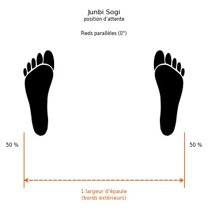

#### 16.2 Position d'attente rapprochée (Moa Junbi Sogi)

* **Nomenclature coréenne :** *Moa Junbi Sogi / [모아 준비 서기](../audio/grammaire/Moa-Junbi-Sogi.m4a)*.
* **Largeur :** Pieds entièrement collés l'un contre l'autre (bords internes en contact).
* **Poids :** Réparti à 50% sur le pied gauche, 50% sur le pied droit.
* **Variantes de Garde (Mains) :**
  * **Type A :** Les poings fermés sont tenus haut devant le visage. La distance entre la racine du nez et les poings est d'environ **30 cm**.
  * **Type B :** Les poings sont placés devant le tronc. La distance entre les poings et le nombril est d'environ **15 cm**.
  * **Type C :** Les mains ouvertes sont placées bas devant l'abdomen. La distance entre les mains et l'abdomen est d'environ **10 cm**.
* **Schéma d'alignement :**

#### 16.3 Position d'attente fléchie (Guburyo Junbi Sogi)

* **Nomenclature coréenne :** *Guburyo Junbi Sogi / [구부려 준비 서기](../audio/grammaire/Guburyo-Junbi-Sogi.m4a)*.
* **Exécution :** La jambe de support est fléchie, son pied pointant vers l'avant. L'autre pied est relevé et maintenu parallèle au sol à la hauteur du genou de soutien.
* **Poids :** 100% sur la jambe de support, 0% sur la jambe levée.
* **Variantes de Garde (Mains) :**
  * **Type A :** Posture préparatoire au coup de pied de côté (*Yop Chagi*). Les bras effectuent un double blocage des avant-bras (*Twin Forearm Block*).
  * **Type B :** Posture préparatoire au coup de pied arrière (*Dwit Chagi*). Distance d'environ **25 cm** entre les poings et les hanches, les coudes pliés à **30 degrés**.
* **Schéma d'alignement :**

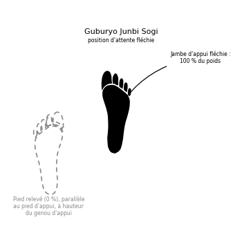

#### 16.4 Position à l'attention (Charyo Sogi)

* **Nomenclature coréenne :** *Charyo Sogi / [차렷 서기](../audio/grammaire/Charyo-Sogi.m4a)*.
* **Largeur :** Talons collés, bords internes ouverts.
* **Orientation :** Les pieds forment un angle de **45 degrés**.
* **Posture :** Les poings sont fermés et placés légèrement le long du corps de chaque côté au naturel, les épaules inclinées et le regard fixé vers l'avant.
* **Usage :** Position prise avant et après le cours.
* **Schéma d'alignement :**

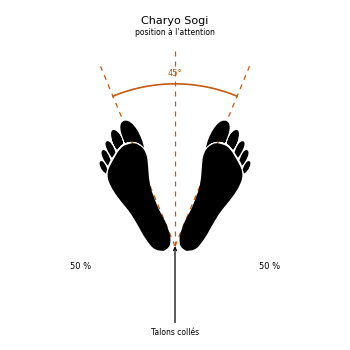

#### 16.5 Position de salut (Kyong Ye Jase)

* **Nomenclature coréenne :** *Kyong Ye Jase / [경례 자세](../audio/grammaire/Kyong-Ye-Jase.m4a)*.
* **Exécution :** À partir de la position à l'attention (*Charyo Sogi*), on incline le corps de **15 degrés** vers l'avant.
* **Regard :** Maintenir impérativement le regard fixé dans les yeux de l'adversaire ou du senior.
* **Schéma d'alignement :**

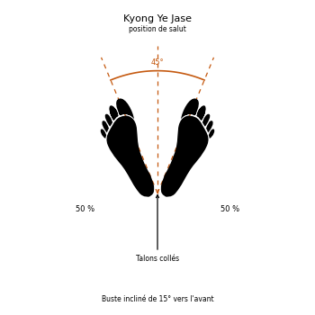

#### 16.6 Position parallèle (Narani Sogi)

* **Nomenclature coréenne :** *Narani Sogi / [나란히 서기](../audio/grammaire/Narani-Sogi.m4a)*.
* **Largeur :** Les pieds sont écartés d'**une largeur d'épaule** entre les gros orteils.
* **Orientation :** Les pieds sont strictement parallèles, les orteils pointant droit devant (0°).
* **Poids :** Réparti à 50% sur le pied gauche, 50% sur le pied droit.
* **Schéma d'alignement :**

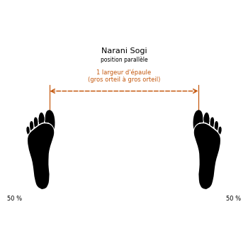

#### 16.7 Position d'attente parallèle (Narani Junbi Sogi)

* **Nomenclature coréenne :** *Narani Junbi Sogi / [나란히 준비 서기](../audio/grammaire/Narani-Junbi-Sogi.m4a)*.
* **Base :** Identique à la position parallèle (*Narani Sogi*).
* **Posture des bras :** Les deux poings sont placés devant l'abdomen.
* **Distances de contrôle :**
  * Écart entre les deux poings : **5 cm**.
  * Distance entre les poings et l'abdomen : **7 cm**.
* **Schéma d'alignement :**

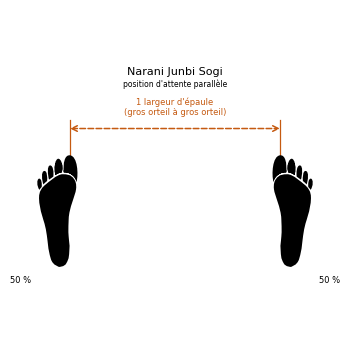

#### 16.8 Position assise (Annun Sogi)

* **Nomenclature coréenne :** *Annun Sogi / [앉은 서기](../audio/grammaire/Annun-Sogi.m4a)*.
* **Largeur :** **Une largeur et demie d'épaule** mesurée de centre à centre de chaque pied.
* **Orientation :** Les pieds sont strictement parallèles, les orteils pointant vers l'avant (0°).
* **Genoux :** Forcer puissamment les genoux vers l'extérieur.
* **Poids et Posture :** Poids réparti à 50% sur chaque jambe, abdomen contracté et tendu pour assurer une stabilité maximale lors des mouvements latéraux.
* **Schéma d'alignement :**

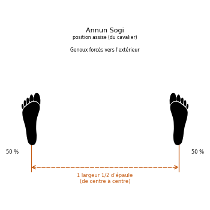

#### 16.9 Position de marche (Gunnun Sogi)

* **Nomenclature coréenne :** *Gunnun Sogi / [걷는 서기](../audio/grammaire/Gunnun-Sogi.m4a)*.
* **Longueur :** **Une largeur et demie d'épaule** mesurée entre les gros orteils du pied avant et du pied arrière.
* **Largeur :** **Une largeur d'épaule** mesurée de centre à centre de chaque pied.
* **Orientation :**
  * Pied avant : Pointe strictement vers l'avant (0°).
  * Pied arrière : Ouvert à un angle précis de **25 degrés vers l'extérieur**. *Un angle supérieur à 25° affaiblit l'articulation du genou face à une attaque par l'arrière.*
* **Flexion des jambes :**
  * Jambe avant : Fléchie jusqu'à ce que la rotule forme une **ligne droite verticale avec l'arrière du talon**.
  * Jambe arrière : Maintenue complètement droite et tendue.
* **Poids :** Réparti équitablement (50/50).
* **Musculature :** Tendre les muscles des pieds en les sentant tirer l'un vers l'autre pour sceller l'ancrage au sol.
* **Usage :** Position forte vers l'avant comme vers l'arrière.
* **Erreur courante :** Une position plus longue que prévu rend le déplacement lent et fragilise la posture contre une attaque de côté comme contre une attaque de face ou de dos.
* **Schéma d'alignement :**

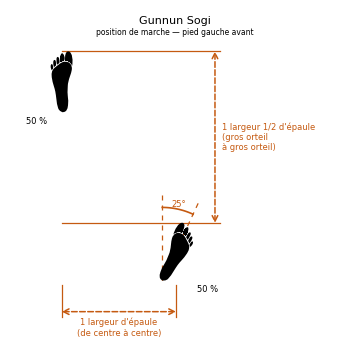

#### 16.10 Position en « L » (Niunja Sogi)

* **Nomenclature coréenne :** *Niunja Sogi / [ㄴ자 서기](../audio/grammaire/Niunja-Sogi.m4a)*.
* **Longueur :** **Une largeur et demie d'épaule** mesurée entre le gros orteil du pied avant et le petit orteil du pied arrière.
* **Alignement et décalage :** Les pieds forment presque un angle droit (90°). Les orteils de chaque pied pointent à environ **15 degrés vers l'intérieur**. Le talon du pied avant est décalé et placé à environ **2,5 cm en avant** de la ligne du talon du pied arrière pour assurer la stabilité latérale.
* **Poids :** Réparti à **70% sur la jambe arrière** et **30% sur la jambe avant**.
* **Flexion :**
  * Jambe arrière : Fléchie jusqu'à ce que la rotule forme une ligne verticale droite avec les orteils. Conserver la hanche parfaitement alignée avec la jointure interne du genou arrière.
  * Jambe avant : Fléchie en conséquence.
* **Usage :** Posture de garde principalement défensive permettant d'intercepter, bloquer ou contre-attaquer instantanément de la jambe avant sans transfert préalable du centre de gravité.
* **Schéma d'alignement :**

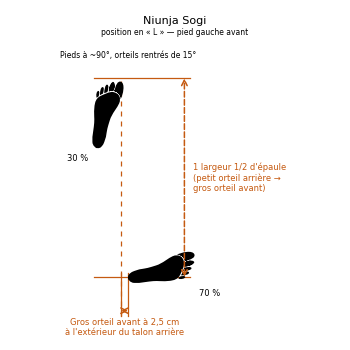

#### 16.11 Position fixe (Gojung Sogi)

* **Nomenclature coréenne :** *Gojung Sogi / [고정 서기](../audio/grammaire/Gojung-Sogi.m4a)*.
* **Structure :** Identique à la position en L (*Niunja Sogi*), à l'exception de la répartition du poids et de la longueur.
* **Longueur :** **Une largeur et demie d'épaule** mesurée du gros orteil du pied avant au gros orteil du pied arrière.
* **Poids :** Réparti équitablement à **50% sur chaque jambe**.
* **Usage :** Position extrêmement forte et stable pour les attaques et défenses de côté en puissance.
* **Schéma d'alignement :**

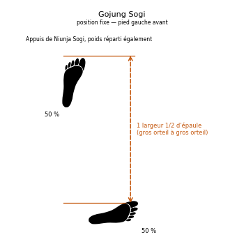

#### 16.12 Position sur une jambe (Waebal Sogi)

* **Nomenclature coréenne :** *Waebal Sogi / [외발 서기](../audio/grammaire/Waebal-Sogi.m4a)*.
* **Exécution :** Étirer complètement la jambe d'appui immobile au sol. Placer le tranchant externe du pied de la jambe relevée directement **sur la rotule** (ou dans le creux poplité) du genou de support.
* **Poids :** 100% sur la jambe d'appui, 0% sur la jambe pliée.
* **Usage :** Exercices d'équilibre, mais aussi techniques d'attaque et de défense sur un seul appui.
* **Schéma d'alignement :**

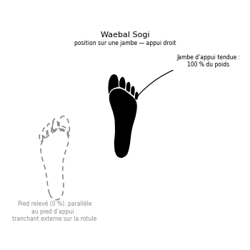

#### 16.13 Position fléchie (Guburyo Sogi)

* **Nomenclature coréenne :** *Guburyo Sogi / [구부려 서기](../audio/grammaire/Guburyo-Sogi.m4a)*.
* **Structure :** Identique à la position sur une jambe (*Waebal Sogi*), à la seule différence que la jambe d'appui au sol est **fléchie** pour amortir et stocker l'énergie cinétique.
* **Usage :** Posture de préparation dynamique avant de délivrer un coup de pied de côté (*Yop Chagi*) ou vers l'arrière (*Dwit Chagi*), et parfois posture de défense.
* **Schéma d'alignement :**

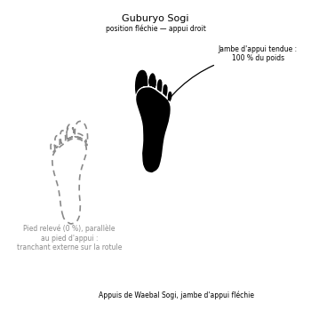

#### 16.14 Position en « X » (Kyocha Sogi)

* **Nomenclature coréenne :** *Kyocha Sogi / [교차 서기](../audio/grammaire/Kyocha-Sogi.m4a)*.
* **Exécution :** Croiser un pied devant ou derrière l'autre.
* **Appuis :** Le pied de soutien (immobile) est posé à plat au sol et supporte **l'intégralité du poids du corps (100%)**. Le pied croisé touche le sol très légèrement uniquement avec **la plante du pied (les orteils)** pour servir de stabilisateur directionnel.
* **Usage :** Position de transition très fluide et propice aux attaques de face ou de côté en déplacement.
* **Schéma d'alignement :**

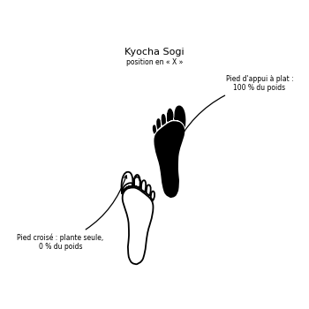

#### 16.15 Position arrière rapprochée (Dwitbal Sogi)

* **Nomenclature coréenne :** *Dwitbal Sogi / [뒷발 서기](../audio/grammaire/Dwitbal-Sogi.m4a)*.
* **Longueur :** Écartement très court d'**une largeur d'épaule** mesurée entre les deux petits orteils.
* **Alignement :** Les genoux sont fléchis. Le talon du pied arrière est positionné en ligne droite verticale directement derrière le talon du pied avant.
* **Orientation :**
  * Pied arrière : À plat au sol. Les orteils pointent vers l'intérieur à **35 degrés**, et le genou arrière doit impérativement **pointer légèrement vers l'intérieur**.
  * Pied avant : Talon décollé du sol, le pied ne fait que **frôler le sol avec la plante**. Les orteils pointent vers l'intérieur à **25 degrés**.
* **Poids :** Presque 100% sur la jambe arrière fléchie (le pied avant restant libre pour frapper instantanément ou ajuster la distance).
* **Schéma d'alignement :**

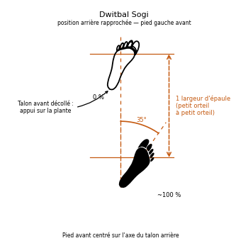

#### 16.16 Position basse (Nachuo Sogi)

* **Nomenclature coréenne :** *Nachuo Sogi / [낮추어 서기](../audio/grammaire/Nachuo-Sogi.m4a)*.
* **Structure :** Identique à la position de marche (*Gunnun Sogi*), à la seule différence qu'elle est **plus longue d'une longueur de pied**.
* **Poids :** Réparti à 50% sur la jambe avant, 50% sur la jambe arrière.
* **Usage :** Allonger la portée des armes corporelles d'attaque et renforcer la musculature des cuisses.
* **Schéma d'alignement :**

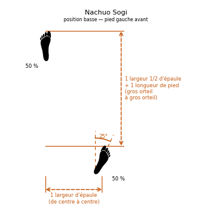

#### 16.17 Position rapprochée (Moa Sogi)

* **Nomenclature coréenne :** *Moa Sogi / [모아 서기](../audio/grammaire/Moa-Sogi.m4a)*.
* **Exécution :** Se tenir simplement debout, les **pieds entièrement collés** l'un contre l'autre (bords internes des talons et des gros orteils en contact).
* **Poids :** Réparti équitablement (50/50).
* **Schéma d'alignement :**

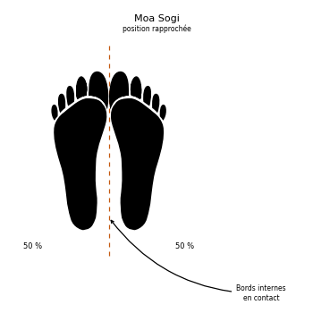

#### 16.18 Position verticale (Soojik Sogi)

* **Nomenclature coréenne :** *Soojik Sogi / [수직 서기](../audio/grammaire/Soojik-Sogi.m4a)*.
* **Longueur :** Écartement d'**une largeur d'épaule** mesurée entre les deux gros orteils.
* **Orientation :** Le pied avant pointe vers l'avant, orteils rentrés de **15 degrés**. Le pied arrière est ouvert à **90 degrés**, orteils vers le côté.
* **Jambes :** Les deux jambes sont maintenues **parfaitement droites et tendues** (sans aucune flexion des genoux).
* **Poids :** Réparti à **60% sur la jambe arrière** et **40% sur la jambe avant**.
* **Schéma d'alignement :**

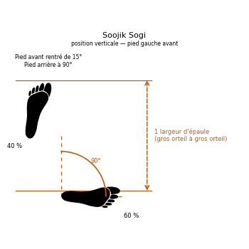

#### 16.19 Position en diagonale (Sasun Sogi)

* **Nomenclature coréenne :** *Sasun Sogi / [사선 서기](../audio/grammaire/Sasun-Sogi.m4a)*.
* **Structure :** Reprend les dimensions de la position assise (*Annun Sogi*), mais avec un décalage longitudinal.
* **Décalage :** Le **talon du pied avant est placé sur la même ligne horizontale que les orteils du pied arrière**.
* **Usage :** Très utile pour basculer instantanément vers la position de marche (*Gunnun Sogi*) sans avoir à déplacer les appuis au sol.
* **Schéma d'alignement :**

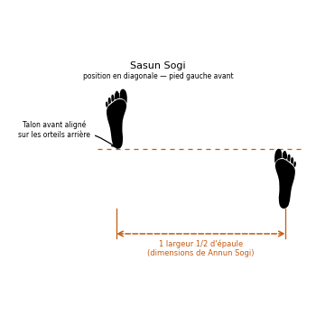

#### 16.20 Position accroupie (Oguryo Sogi)

* **Nomenclature coréenne :** *Oguryo Sogi / [오구려 서기](../audio/grammaire/Oguryo-Sogi.m4a)*.
* **Structure :** Il s'agit d'une variante de la position en diagonale (*Sasun Sogi*).
* **Flexion :** Les deux genoux sont fléchis et **forcés vers l'intérieur** l'un vers l'autre pour créer une tension dynamique active dans les cuisses.
* **Dimensions :** L'écartement entre les pieds peut être ajusté librement selon les besoins tactiques.
* **Schéma d'alignement :**

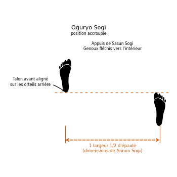

#### 16.21 Positions ouvertes (Palja Sogi)

* **Nomenclature coréenne :** *Palja Sogi / [팔자 서기](../audio/grammaire/Palja-Sogi.m4a)*.
* **Usage :** Postures d'attente peu stables utilisées pour le relâchement ou la relaxation des membres.
* **Variantes :**
  * **Ouverte à l'intérieur (An Palja Sogi) :** Les pieds sont écartés d'une largeur d'épaule et les **orteils pointent vers l'intérieur** l'un de l'autre.
  * **Ouverte à l'extérieur (Bakat Palja Sogi) :** Les pieds sont écartés d'une largeur d'épaule et les **orteils pointent vers l'extérieur à un angle de 45 degrés**.
* **Schémas d'alignement :**

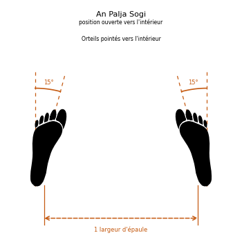

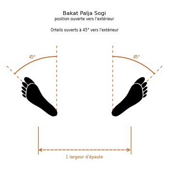

---

## Partie V — Le répertoire technique

Les techniques elles-mêmes, classées par famille. Le commentaire donne la mécanique ; l'annexe donne la traduction et la prononciation de chaque terme.

### 17. Les déplacements (Dolgi)

Les déplacements décrivent la manière dont le pratiquant ajuste sa distance et pivote pour générer de la puissance cinétique.

| Terme français           | Terme anglais            | Terme coréen                | Hangul                                                                      |
| ------------------------ | ------------------------ | --------------------------- | :-------------------------------------------------------------------------- |
| Pivot sur un pas arrière | backward step-turning    | Dwiro omgyo didimyo dolgi   | [뒤로 옮겨 디디며 돌기](../audio/lexique/Dwiro-omgyo-didimyo-dolgi.m4a)     |
| Deux pas arrière         | double stepping backward | Ibo omgyo didimyo duruggi   | [이보 옮겨 디디며 들어가기](../audio/lexique/Ibo-omgyo-didimyo-duruggi.m4a) |
| Deux pas avant           | double stepping forward  | Ibo omgyo didimyo nagagi    | [이보 옮겨 디디며 나가기](../audio/lexique/Ibo-omgyo-didimyo-nagagi.m4a)    |
| Pivot sur deux pas       | double step turning      | Ibo omgyo didimyo dolgi     | [이보 옮겨 디디며 돌기](../audio/lexique/Ibo-omgyo-didimyo-dolgi.m4a)       |
| Transfert (de pied)      | foot shifting            | Durogamyo jajunbal          | [들어가며 자진발](../audio/lexique/Durogamyo-jajunbal.m4a)                  |
| Pivot sur un pas avant   | forward step-turning     | Opuro omgyo didimyo         | [앞으로 옮겨 디디며](../audio/lexique/Opuro-omgyo-didimyo.m4a)              |
| Pas chassé               | sliding                  | Mikulgi                     | [미끌기](../audio/lexique/Mikulgi.m4a)                                      |
| Pivot sur pas chassé     | step-slide               | Omgyo didigo mikulmyo dolgi | [옮겨 디디고 미끄며 돌기](../audio/lexique/Omgyo-didigo-mikulmyo-dolgi.m4a) |
| Pas arrière              | stepping backward        | Didimyo duruogi             | [디디며 들어가기](../audio/lexique/Didimyo-duruogi.m4a)                     |
| Pas avant                | stepping forward         | Didimyo nagagi              | [디디며 나가기](../audio/lexique/Didimyo-nagagi.m4a)                        |
| Pivot sur place          | spot turning             | Gujari dolgi                | [그 자리 돌기](../audio/lexique/Gujari-dolgi.m4a)                           |

### 18. Les techniques de bras

#### 1. Les Coups de Poing et Frappes Directes (Jirugi)

* **Ap Jirugi ([앞지르기](../audio/grammaire/Ap-Jirugi.m4a)) :** Coup de poing direct de face.
* **Yop Jirugi ([옆지르기](../audio/grammaire/Yop-Jirugi.m4a)) :** Coup de poing direct latéral (porté sur le côté).
* **Dollyo Jirugi ([돌려지르기](../audio/grammaire/Dollyo-Jirugi.m4a)) :** Coup de poing circulaire perçant (mécanique en piston avec trajectoire en crochet).
* **Ollyo Jirugi ([올려지르기](../audio/grammaire/Ollyo-Jirugi.m4a)) :** Coup de poing ascendant (uppercut perçant).
* **Naeryo Jirugi ([내려지르기](../audio/grammaire/Naeryo-Jirugi.m4a)) :** Coup de poing direct de haut en bas.
* **Dwijibo Jirugi ([뒤집어지르기](../audio/grammaire/Dwijibo-Jirugi.m4a)) :** Coup de poing retourné (corps de face, paume vers le haut).
* **Digutja Jirugi ([디귿자지르기](../audio/grammaire/Digutja-Jirugi.m4a)) :** Coup de poing en U (une main au visage, une main au tronc simultanément).
* **Kiokja Jirugi ([기억자지르기](../audio/grammaire/Kiokja-Jirugi.m4a)) :** Coup de poing à angle droit.
* **Sewo Jirugi ([세워지르기](../audio/grammaire/Sewo-Jirugi.m4a)) :** Coup de poing vertical.

#### 2. Les Frappes Percutantes et Cinglantes (Taerigi)

* **Sonkal Taerigi ([손칼때리기](../audio/grammaire/Sonkal-Taerigi.m4a)) :** Coup cinglant du tranchant de la main (vers l'intérieur *Anuro* ou vers l'extérieur *Bakuro*).
* **Sonkal Dung Taerigi ([손칼등때리기](../audio/grammaire/Sonkal-Dung-Taerigi.m4a)) :** Coup cinglant du tranchant interne de la main.
* **Dung Joomuk Taerigi ([등주먹때리기](../audio/grammaire/Dung-Joomuk-Taerigi.m4a)) :** Coup de revers de poing (de face, latéral ou descendant).
* **Yop Joomuk Taerigi ([옆주먹때리기](../audio/grammaire/Yop-Joomuk-Taerigi.m4a)) :** Coup de poing marteau descendant ou latéral.
* **Palkup Taerigi ([팔굽때리기](../audio/grammaire/Palkup-Taerigi.m4a)) :** Coup de coude balistique (exécuté vers l'avant, le côté, le haut ou le bas).
* **Bandol Son Taerigi ([반달손때리기](../audio/grammaire/Bandol-Son-Taerigi.m4a)) :** Coup de la gueule du tigre à la gorge.

#### 3. Les Piques de Précision (Tulgi)

* **Sun Sonkut Tulgi ([선손끝뚫기](../audio/grammaire/Sun-Sonkut-Tulgi.m4a)) :** Pique des doigts verticale au plexus.
* **Opun Sonkut Tulgi ([오픈손끝뚫기](../audio/grammaire/Opun-Sonkut-Tulgi.m4a)) :** Pique des doigts horizontale, paume vers le bas.
* **Dwijibun Sonkut Tulgi ([뒤집은손끝뚫기](../audio/grammaire/Dwijibun-Sonkut-Tulgi.m4a)) :** Pique des doigts horizontale, paume vers le haut.

#### 4. Les Blocages et Techniques Défensives (Makgi)

* **Bakat Palmok Makgi ([밖팔목막기](../audio/grammaire/Bakat-Palmok-Makgi.m4a)) :** Blocage externe de l'avant-bras.
* **An Palmok Makgi ([안팔목막기](../audio/grammaire/An-Palmok-Makgi.m4a)) :** Blocage interne de l'avant-bras.
* **Sonkal Makgi ([손칼막기](../audio/grammaire/Sonkal-Makgi.m4a)) :** Blocage du tranchant de la main.
* **Heetchyo Makgi ([헤쳐막기](../audio/grammaire/Heetchyo-Makgi.m4a)) :** Double blocage d'écartement (de l'intérieur vers l'extérieur).
* **Sang Palmok Makgi ([쌍팔목막기](../audio/grammaire/Sang-Palmok-Makgi.m4a)) :** Double blocage protecteur des avant-bras.
* **Kyocha Makgi ([교차막기](../audio/grammaire/Kyocha-Makgi.m4a)) :** Blocage croisé (en X) haut ou bas.
* **Mokuro Makgi ([몽둥이막기](../audio/grammaire/Mokuro-Makgi.m4a)) :** Blocage bimanuel en berceau / en U.
* **Sonbadak Naeryo Makgi ([손바닥내려막기](../audio/grammaire/Sonbadak-Naeryo-Makgi.m4a)) :** Blocage descendant amortissant avec la paume.

### 19. Les techniques de jambes

#### Les coups de pied (Chagi)

* **Ap Cha Busigi ([앞차부시기](../audio/grammaire/Ap-Cha-Busigi.m4a)) :** Coup de pied avant fouetté (avec le bol du pied *Apkumchi*).
* **Ap Cha Jirugi ([앞차지르기](../audio/grammaire/Ap-Cha-Jirugi.m4a)) :** Coup de pied avant perçant (avec le bol du pied ou le talon).
* **Ap Cha Olligi ([앞차올리기](../audio/grammaire/Ap-Cha-Olligi.m4a)) :** Coup de pied montant jambe tendue.
* **Naeryo Chagi ([내려차기](../audio/chagi/naeryo-chagi.m4a)) :** Coup de pied descendant en hache (avec le talon ou la plante).
* **Anuro Sewo Chagi ([안으로세워차기](../audio/grammaire/Anuro-Sewo-Chagi.m4a)) :** Coup de pied vertical intérieur (trajectoire circulaire externe-interne).
* **Bakuro Sewo Chagi ([밖으로세워차기](../audio/grammaire/Bakuro-Sewo-Chagi.m4a)) :** Coup de pied vertical extérieur (trajectoire interne-externe).
* **Yop Cha Jirugi ([옆차지르기](../audio/chagi/yop-cha-jirugi.m4a)) :** Coup de pied latéral perçant (avec le tranchant externe du pied *Balkal*).
* **Yop Cha Milgi ([옆차밀기](../audio/chagi/yop-cha-milgi.m4a)) :** Coup de pied latéral poussant (avec la plante *Balbadak*).
* **Yop Nullo Chagi ([옆눌러차기](../audio/grammaire/Yop-Nullo-Chagi.m4a)) :** Coup de pied pressant latéral (écrasement du genou adverse).
* **Dollyo Chagi ([돌려차기](../audio/chagi/dollyo-chagi.m4a)) :** Coup de pied circulaire (avec le bol *Apkumchi* ou le dessus du pied *Baldong*).
* **Bandae Dollyo Chagi ([반대돌려차기](../audio/grammaire/Bandae-Dollyo-Chagi.m4a)) :** Coup de pied circulaire retourné (par le dos, impact avec le talon).
* **Goro Chagi ([걸어차기](../audio/grammaire/Goro-Chagi.m4a)) :** Coup de pied crocheté de face (avec l'arrière du talon *Dwikumchi*).
* **Bandae Dollyo Goro Chagi ([반대돌려걸어차기](../audio/grammaire/Bandae-Dollyo-Goro-Chagi.m4a)) :** Coup de pied crocheté retourné (par le dos).
* **Bituro Chagi ([비틀어차기](../audio/grammaire/Bituro-Chagi.m4a)) :** Coup de pied vrillé (ouverture en torsion externe avec le bol).
* **Dwit Chagi ([뒤차기](../audio/grammaire/Dwit-Chagi.m4a)) :** Coup de pied arrière direct rectiligne (en piston, impact avec le talon).
* **Suroh Chagi ([쓸어차기](../audio/grammaire/Suroh-Chagi.m4a)) :** Balayage rasant horizontal pour faucher l'appui.
* **Ap Murup Chagi ([앞무릎차기](../audio/grammaire/Ap-Murup-Chagi.m4a)) :** Coup de genou direct de face.

#### Techniques sautées et spéciales

* **Twimyo Ap Cha Busigi ([뛰며앞차부시기](../audio/grammaire/Twimyo-Ap-Cha-Busigi.m4a)) :** Coup de pied avant fouetté sauté en suspension.
* **Twimyo Yop Cha Jirugi ([뛰며옆차지르기](../audio/grammaire/Twimyo-Yop-Cha-Jirugi.m4a)) :** Coup de pied latéral perçant sauté.
* **Twimyo Dollyo Chagi ([뛰며돌려차기](../audio/grammaire/Twimyo-Dollyo-Chagi.m4a)) :** Coup de pied circulaire sauté en suspension.
* **Twimyo Bandae Dollyo Chagi ([뛰며반대돌려차기](../audio/grammaire/Twimyo-Bandae-Dollyo-Chagi.m4a)) :** Coup de pied circulaire retourné sauté.
* **Twimyo Nopi Chagi ([뛰며높이차기](../audio/grammaire/Twimyo-Nopi-Chagi.m4a)) :** Coup de pied sauté en hauteur maximale.
* **Sangbal Apcha Busigi ([쌍발앞차부시기](../audio/grammaire/Sangbal-Apcha-Busigi.m4a)) :** Double coup de pied avant sauté simultané.
* **Sangbal Yopcha Jirugi ([쌍발옆차지르기](../audio/grammaire/Sangbal-Yopcha-Jirugi.m4a)) :** Double coup de pied latéral sauté simultané (gauche et droite).
* **Mikulgi Yop Cha Jirugi ([미끌기옆차지르기](../audio/grammaire/Mikulgi-Yop-Cha-Jirugi.m4a)) :** Coup de pied latéral glissé pour fermer la distance.

---

## Partie VI — Les formes (Tul)

La forme est le cœur de l'art : un combat simulé contre des adversaires
imaginaires, qui fixe la technique, le rythme et la respiration, et qui porte en
même temps la mémoire historique de la Corée.

### 20. La forme comme héritage

Historiquement, la pratique des arts martiaux en Orient était soumise à la loi stricte du Talion (« œil pour œil, dent pour dent »), issue de principes antiques tels que le code de Hammourabi. En cas de blessure ou de mort accidentelle lors d'un entraînement, la responsabilité de l'adepte était pleinement engagée, rendant l'étude du combat réel extrêmement restreinte et dangereuse. 

C'est dans ce contexte que des maîtres imaginatifs ont développé les premières **formes (Tuls)** : des combats simulés et solitaires contre des adversaires virtuels. Le Général Choi Hong Hi a conçu les 24 Tuls au sein de son école, la **Chang Do Kwan** (littéralement « la maison des vagues bleues »), afin d'offrir une grammaire technique rigoureuse à l'art martial.

La vie humaine, même si elle dure un siècle, ne représente qu'une fraction infime du temps cosmique — l'équivalent d'un seul jour face à l'éternité. Le Général Choi a ainsi conçu **24 formes pour symboliser les 24 heures d'une journée**, représentant l'intégralité de sa vie dédiée à l'humanité et la recherche de l'immortalité spirituelle par l'héritage d'une œuvre impérissable. 

Chaque forme possède :

1. Un **point de départ et d'arrivée identique**, symbolisant l'ordre et la discipline.
2. Un **tracé au sol (Hanja ou symbole)** exprimant l'essence philosophique du personnage ou du concept historique.
3. Un **rythme**, une alternance de contractions et décontractions musculaires (*Chok-jin*) et une gestion respiratoire synchronisée avec le mouvement de vague (*Sine Wave*).

### 21. Directives d'exécution

Pour exécuter correctement un Tul, l'adepte doit respecter neuf règles d'or :

1. Chaque forme débute et se termine exactement au même endroit.
2. Chaque posture et attitude doit être prise et maintenue correctement.
3. Chaque forme possède son propre rythme et sa fluidité.
4. Contracter et décontracter la musculature au moment opportun.
5. Expirer sèchement par la bouche entrouverte à la conclusion de chaque technique.
6. Exécuter chaque mouvement avec un réalisme de combat.
7. Comprendre parfaitement la raison d'être de chaque mouvement.
8. Répartir équitablement les techniques de défense et d'attaque à gauche et à droite.
9. Maîtriser complètement une forme avant de passer à l'apprentissage de la suivante.

### 22. Les exercices fondamentaux (Saju)

Bien que ne faisant pas partie des 24 formes officielles, ces exercices à quatre directions constituent le socle technique indispensable pour l'initiation des novices (10e Gup).

#### Saju Jirugi (Quatre directions - Attaque)

* **Mouvements :** 14 (7 de chaque côté).
* **Diagramme :** Croix ($+$).
* **Signification :** Premier contact avec l'orientation spatiale. Enseigne l'alignement de la position de marche (*Gunnun Sogi*) et la mécanique de frappe rectiligne en piston (*Kaunde Jirugi*).
* **Contexte socio-technique :** Conçu pour donner une confiance immédiate au débutant en isolant l'attaque de base d'un environnement de combat complexe.

> Exécution mouvement par mouvement : [../tul/saju-jirugi.md](../tul/saju-jirugi.md).

#### Saju Makgi (Quatre directions - Blocage)

* **Mouvements :** 16 (8 de chaque côté).
* **Diagramme :** Croix ($+$).
* **Signification :** Initiation à l'art de la défense. Enseigne le blocage bas avec le tranchant de la main (*Sonkal Najunde Makgi*) et le blocage moyen de l'avant-bras intérieur (*An Palmok Kaunde Makgi*).
* **Contexte socio-technique :** Établit la notion de protection et de préservation de soi, pilier moral du Taekwon-Do où la défense précède toujours l'attaque.

> Exécution mouvement par mouvement : [../tul/saju-makgi.md](../tul/saju-makgi.md).

#### Saju Tulgi (Quatre directions - Pique de coude)

* **Mouvements :** 8 (4 de chaque côté).
* **Diagramme :** Croix ($+$).
* **Signification :** Enseigne la position en L (*Niunja Sogi*) et la frappe de coude latérale (*Yop Palkup Tulgi*).
* **Contexte socio-technique :** Transition vers la garde de défense serrée, typique des situations d'autodéfense rapprochée en milieu urbain confiné.

> Exécution mouvement par mouvement : [../tul/saju-tulgi.md](../tul/saju-tulgi.md).

### 23. Les vingt-quatre formes en un tableau

| Ordre | Nom du Tul | Niveau de Grade | Mouvements | Diagramme Géométrique | Thématique Historique et Majeure |
| :---: | :--- | :---: | :---: | :--- | :--- |
| **-** | *Saju Jirugi* | 10e Gup | 14 | Croix ($+$) | Initiation spatiale et de marche |
| **-** | *Saju Makgi* | 10e Gup | 16 | Croix ($+$) | Apprentissage de la défense |
| **-** | *Saju Tulgi* | 10e Gup | 8 | Croix ($+$) | Posture rapprochée de coude |
| **1** | *Chon-Ji* | 9e Gup | 19 | Croix ($+$) | Le Ciel et la Terre (Création) |
| **2** | *Dan-Gun* | 8e Gup | 21 | Hanja $I$ | Dan-Gun, fondateur de la Corée |
| **3** | *Do-San* | 7e Gup | 24 | Escalier | Ahn Chang-Ho (Éducation / Indépendance) |
| **4** | *Won-Hyo* | 6e Gup | 28 | Hanja $I$ | Won-Hyo (Introduction du bouddhisme) |
| **5** | *Yul-Gok* | 5e Gup | 38 | Érudit | Yi I (Confucius de la Corée) |
| **6** | *Joong-Gun* | 4e Gup | 32 | Hanja $I$ | Ahn Joong-Gun (Assassinat de Hirobumi Ito) |
| **7** | *Toi-Gye* | 3e Gup | 37 | Érudit | Yi Hwang (Néo-confucianisme) |
| **8** | *Hwa-Rang* | 2e Gup | 29 | Hanja $I$ | Jeunes chevaliers d'élite de Silla |
| **9** | *Choong-Moo* | 1er Gup | 30 | Hanja $I$ | Amiral Yi Sun-Sin (Navire-tortue) |
| **10** | *Kwang-Gae* | 1er Dan | 39 | Expansion | Roi Kwang-Gae (Reconquête Mandchourie) |
| **11** | *Po-Eun* | 1er Dan | 36 | Ligne ($-$) | Chong Mong-Chu (Fidélité au roi) |
| **12** | *Ge-Baek* | 1er Dan | 44 | Ligne ($I$) | Général Ge-Baek (Héros de Baekje) |
| **13** | *Eui-Am* | 2e Dan | 45 | Ligne ($I$) | Son Byong-Hi (Mouvement du 1er mars) |
| **14** | *Choong-Jang*| 2e Dan | 52 | Hanja $I$ | Général Kim Duk-Ryang (Martyre) |
| **15** | *Juche* | 2e Dan | 45 | Mont Baekdu | L'homme maître de son destin |
| **16** | *Sam-Il* | 3e Dan | 33 | Croix ($+$) | Date historique de la déclaration (1er mars) |
| **17** | *Yoo-Sin* | 3e Dan | 68 | Érudit | Général Kim Yoo-Sin (Unification de Silla) |
| **18** | *Choi-Yong* | 3e Dan | 46 | Hanja $I$ | Général Choi Yong (Koryo / Humilité) |
| **19** | *Yon-Gae* | 4e Dan | 49 | Hanja $I$ | Général Yon-Gae (Victoire contre les Tang) |
| **20** | *Ul-Ji* | 4e Dan | 42 | Lettre *乙* | Général Ul-Ji Moon-Dok (Bataille Salsu) |
| **21** | *Moon-Moo* | 4e Dan | 61 | Érudit | Roi Moon-Moo (Dragon protecteur) |
| **22** | *So-San* | 5e Dan | 72 | Érudit | Moine So-San (Moines-soldats) |
| **23** | *Se-Jong* | 5e Dan | 24 | Roi (王) | Roi Se-Jong (Invention du Hangul) |
| **24** | *Tong-Il* | 6e Dan | 56 | Ligne ($I$) | Résolution de l'Unification de la Corée |

### 24. Les formes une à une

Pour chaque forme : le nombre de mouvements, le tracé au sol, la signification
du nom, et le contexte historique ou politique dont elle est issue.

#### 24.1 Chon-Ji (10e Gup à 9e Gup)

* **Mouvements :** 19.
* **Diagramme :** Croix ($+$) représentant le Ciel et la Terre, et l'assemblage des quatre forces cosmiques : la terre, l'eau, le feu et le ciel.
* **Signification :** Littéralement « Le Ciel et la Terre ». En Orient, cela symbolise la création du monde et le commencement de l'histoire humaine, ce qui explique pourquoi cette forme est attribuée à l'adepte novice.
* **Structure symbolique :** Le Tul est divisé en deux parties symétriques : la première (mouvements 1 à 8) représente le Ciel (blocages bas et coups de poing en position de marche) ; la seconde (mouvements 9 à 19) représente la Terre (blocages moyens en position en L et frappes en position de marche).
* **Contexte socio-politique :** Représente l'état originel de paix et de pureté d'esprit recherché par l'adepte, imperméable aux corruptions de la société matérialiste moderne.

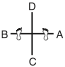

> Exécution mouvement par mouvement : [../tul/chon-ji.md](../tul/chon-ji.md).

#### 24.2 Dan-Gun (9e Gup à 8e Gup)

* **Mouvements :** 21.
* **Diagramme :** La lettre capitale $I$ (représentant le concept de « l'étudiant » ou de l'ancrage fondateur).
* **Signification :** Nommé en l'honneur du saint **Dan-Gun**, fondateur mythique de la Corée en l'an 2333 avant J.-C..
* **Contexte historique et politique :** Dan-Gun unit les tribus nomades de la péninsule pour fonder le royaume antique de **Gojoseon** (Chosun). Le Général Choi utilise cette figure historique pour enraciner le Taekwon-Do dans l'identité nationale coréenne, affirmant l'autonomie et l'antiquité culturelle de la Corée face aux tentatives historiques d'assimilation chinoise et japonaise.

> Exécution mouvement par mouvement : [../tul/dan-gun.md](../tul/dan-gun.md).

#### 24.3 Do-San (8e Gup à 7e Gup)

* **Mouvements :** 24.
* **Diagramme :** Une marche d'escalier en zigzag (symbolisant la « voie » ou l'ascension par l'éducation).
* **Signification :** Pseudonyme du grand patriote et éducateur **Ahn Chang-Ho** (1878-1938). Les 24 mouvements représentent l'intégralité de sa vie qu'il a consacrée à l'avancement de l'éducation en Corée et au mouvement d'indépendance nationale.
* **Contexte socio-politique :** Ahn Chang-Ho a lutté activement contre l'occupation coloniale japonaise (1910-1945) par la fondation d'écoles indépendantes (*Shinminhoe*). Son combat n'était pas seulement militaire, mais profondément social et économique, considérant que l'indépendance de la Corée passait par l'éducation de la jeunesse et le réarmement moral de la population.

> Exécution mouvement par mouvement : [../tul/do-san.md](../tul/do-san.md).

#### 24.4 Won-Hyo (7e Gup à 6e Gup)

* **Mouvements :** 28.
* **Diagramme :** La lettre capitale $I$ (symbole de l'étudiant).
* **Signification :** Nommé en l'honneur du moine bouddhiste **Won-Hyo** (617-686 apr. J.-C.), qui introduisit et popularisa le bouddhisme sous la dynastie de Silla.
* **Contexte religieux et philosophique :** Won-Hyo vécut sous le règne de Silla, à une époque d'intenses guerres intestines entre les trois royaumes (Silla, Koguryo, Baekje). Contrairement aux moines de l'époque qui s'isolaient dans les monastères de l'aristocratie, Won-Hyo parcourut les campagnes pour enseigner le bouddhisme au peuple démuni, unifiant spirituellement la nation brisée par la misère économique et la guerre.

> Exécution mouvement par mouvement : [../tul/won-hyo.md](../tul/won-hyo.md).

#### 24.5 Yul-Gok (6e Gup à 5e Gup)

* **Mouvements :** 38.
* **Diagramme :** Le caractère chinois représentant l'« Érudit » / le « Lettré ».
* **Signification :** Pseudonyme du grand philosophe, écrivain et politicien **Yi I** (1536-1584), surnommé le « Confucius de la Corée ». Les 38 mouvements font référence à sa ville natale située sur le 38e degré de latitude (qui deviendra plus tard la ligne de démarcation politique de la Corée divisée).
* **Contexte socio-politique :** Yi I vécut sous la dynastie Joseon (Yi). Esprit visionnaire, il tenta de réformer l'économie nationale et proposa d'entraîner une armée de 100 000 soldats pour défendre le pays contre l'invasion imminente des samouraïs japonais de Toyotomi Hideyoshi. Ses propositions furent rejetées par une cour rongée par les querelles de factions politiques égoïstes, menant la Corée à la catastrophe lors de la guerre d'Imjin (1592).

> Exécution mouvement par mouvement : [../tul/yul-gok.md](../tul/yul-gok.md).

#### 24.6 Joong-Gun (5e Gup à 4e Gup)

* **Mouvements :** 32.
* **Diagramme :** La lettre capitale $I$.
* **Signification :** Nommé d'après le célèbre patriote **Ahn Joong-Gun**. Les 32 mouvements rappellent l'âge auquel il fut exécuté à la prison impériale de Lui-Shung en 1910.
* **Contexte politique d'oppression :** Le 26 octobre 1909, Ahn Joong-Gun assassina **Hirobumi Ito**, le premier gouverneur général japonais de la Corée et principal artisan du traité de protectorat forcé de 1905, qui dépouilla économiquement et politiquement la Corée de sa souveraineté. M. Ahn accomplit cet acte non par vengeance, mais au nom de la justice internationale et de la paix en Asie de l'Est.

> Exécution mouvement par mouvement : [../tul/joong-gun.md](../tul/joong-gun.md).

#### 24.7 Toi-Gye (4e Gup à 3e Gup)

* **Mouvements :** 37.
* **Diagramme :** Le caractère de l'« Érudit » / le « Lettré ».
* **Signification :** Pseudonyme du grand érudit **Yi Hwang** (1501-1570), une autorité mondiale incontournable du néo-confucianisme. Les 37 mouvements de la forme font référence à son lieu de naissance situé au 37e degré de latitude.
* **Contexte philosophique et éthique :** Yi Hwang a consacré sa vie à l'étude des classiques confucéens, établissant l'éthique de la culture morale et de l'auto-discipline comme piliers du service public. Il a fondé l'académie privée de *Dosan Seowon* pour enseigner l'humilité et la recherche de la vérité, fuyant le luxe et l'arrogance de la cour politique de Séoul pour préserver l'intégrité de sa pensée.

> Exécution mouvement par mouvement : [../tul/toi-gye.md](../tul/toi-gye.md).

#### 24.8 Hwa-Rang (3e Gup à 2e Gup)

* **Mouvements :** 29.
* **Diagramme :** La lettre capitale $I$ (symbole de l'étudiant).
* **Signification :** Nommé d'après le groupe de jeunes guerriers d'élite **Hwa-Rang** (littéralement « Fleur de la jeunesse »), originaire du royaume de Silla au début du VIIe siècle. Les 29 mouvements font référence à la **29e division d'infanterie** de l'armée de la Corée du Sud, au sein de laquelle le Général Choi développa et amena le Taekwon-Do à maturité technique.
* **Contexte de chevalerie militaire :** Les Hwa-Rangs s'entraînaient à escalader les montagnes et nager dans les eaux glacées tout en respectant un code de conduite en 5 points dicté par le moine Won Kang (loyauté envers le roi, obéissance aux parents, honneur envers les amis, bravoure au combat, et justice dans l'usage de la force). Ce code spirituel et moral a transformé des techniques de combat primitives en un art martial noble et structuré.

> Exécution mouvement par mouvement : [../tul/hwa-rang.md](../tul/hwa-rang.md).

#### 24.9 Choong-Moo (2e Gup à 1er Gup)

* **Mouvements :** 30.
* **Diagramme :** La lettre capitale $I$.
* **Signification :** Surnom posthume donné au grand amiral **Yi Sun-Sin** de la dynastie Joseon, inventeur en 1592 du *Kobukson* (le célèbre navire-tortue blindé), précurseur du cuirassé moderne.
* **Asymétrie symbolique :** La forme se termine par une attaque de la main gauche pour symboliser la mort tragique et prématurée de l'amiral lors de la bataille de Noryang (1598), sans qu'il ait pu démontrer son plein potentiel en raison de la jalousie politique de son roi qui l'avait injustement emprisonné.
* **Contexte socio-militaire :** Face à l'invasion navale japonaise dévastatrice, l'amiral Yi Sun-Sin sauva la dynastie Joseon d'une annihilation complète par son génie tactique et sa loyauté indéfectible, luttant avec un budget économique inexistant et des ressources navales infimes contre une flotte ennemie écrasante.

---

> Exécution mouvement par mouvement : [../tul/choong-moo.md](../tul/choong-moo.md).

#### 24.10 Kwang-Gae (1er Dan)

* **Mouvements :** 39.
* **Diagramme :** Le caractère chinois symbolisant la reconquête et l'expansion territoriale.
* **Signification :** En l'honneur de **Kwang-Gae-Toh-Wang**, le 19e roi de la dynastie Koguryo, qui reconquit tous les territoires perdus de la Mandchourie. Les 39 mouvements correspondent aux deux premiers chiffres de l'an 391 apr. J.-C., l'année de son couronnement.
* **Contexte géopolitique de souveraineté :** Sous son règne, le royaume de Koguryo connut son apogée économique et militaire, s'affirmant comme une superpuissance asiatique capable de rivaliser avec l'empire chinois. Le tracé de la forme symbolise la reconquête territoriale et la fierté d'une nation forte face aux agressions extérieures.

> Exécution mouvement par mouvement : [../tul/kwang-gae.md](../tul/kwang-gae.md).

#### 24.11 Po-Eun (1er Dan)

* **Mouvements :** 36.
* **Diagramme :** Une ligne horizontale droite ($-$) représentant la loyauté indéfectible.
* **Signification :** Pseudonyme du poète et pionnier de la physique **Chong Mong-Chu** (1337-1392). Son poème patriotique (« *Je ne servirais pas d'autre maître même si l'on me crucifierait cent fois* ») est gravé dans la mémoire de tous les Coréens.
* **Contexte de transition politique :** Chong Mong-Chu resta loyal à la dynastie de Koryo en déclin, s'opposant au général Yi Sung-Gae qui allait usurper le trône pour fonder la dynastie Joseon. Il fut assassiné sur le pont Seonjuk par les partisans de la nouvelle faction politique. Son tracé sur une seule ligne droite symbolise sa fidélité inflexible.

> Exécution mouvement par mouvement : [../tul/po-eun.md](../tul/po-eun.md).

#### 24.12 Ge-Baek (1er Dan)

* **Mouvements :** 44.
* **Diagramme :** Une ligne verticale unique (symbolisant la sévérité et l'intégrité de sa discipline militaire).
* **Signification :** Nommé en l'honneur du légendaire général **Ge-Baek** du royaume de Baekje (660 apr. J.-C.).
* **Contexte tragique et militaire :** En 660, le royaume de Baekje fut envahi par une coalition écrasante de 50 000 soldats de Silla alliés à 130 000 troupes de la dynastie chinoise des Tang. Conscient de l'issue fatale de la bataille, le général Ge-Baek préféra tuer sa propre famille pour lui éviter l'esclavage et le viol par les vainqueurs avant de charger héroïquement à la tête de ses 5 000 guerriers lors de la bataille de Hwangsanbeol, illustrant la rigueur d'un code moral militaire poussé jusqu'au sacrifice suprême.

> Exécution mouvement par mouvement : [../tul/ge-baek.md](../tul/ge-baek.md).

#### 24.13 Eui-Am (2e Dan)

* **Mouvements :** 45.
* **Diagramme :** Une ligne verticale unique (démontrant un esprit indomptable).
* **Signification :** Pseudonyme de **Son Byong-Hi**, chef spirituel et leader du mouvement d'indépendance de la Corée du 1er mars 1919. Les 45 mouvements rappellent l'âge auquel il substitua au terme de *DongHak* (culture orientale) celui de *Chondo Kyo* (religion de la voie céleste) en 1905.
* **Contexte d'éveil social et d'insurrection :** Son Byong-Hi fut l'un des 33 signataires de la déclaration d'indépendance de 1919. Il utilisa la force pacifique et l'organisation spirituelle de la religion *Chondo Kyo* pour mobiliser des millions de paysans coréens contre la spoliation foncière et l'oppression policière brutale de l'impérialisme japonais, prônant le réarmement moral face aux fusils.

> Exécution mouvement par mouvement : [../tul/eui-am.md](../tul/eui-am.md).

#### 24.14 Choong-Jang (2e Dan)

* **Mouvements :** 52.
* **Diagramme :** La lettre capitale $I$.
* **Signification :** Pseudonyme du général **Kim Duk-Ryang** (1567-1596) de la dynastie Joseon.
* **Asymétrie symbolique :** Le dernier mouvement est une attaque de la main gauche pour souligner sa mort tragique et injuste en prison à l'âge de 27 ans, avant même d'avoir pu exprimer son plein potentiel militaire.
* **Contexte politique d'injustice :** Leader d'une armée de volontaires patriotiques contre les invasions japonaises, il fut victime de fausses accusations de trahison politique montées de toutes pièces par des rivaux jaloux au sein de la cour Joseon. Son martyre symbolise la tragédie d'un esprit juste brisé par la paranoïa et la corruption des élites au pouvoir.

> Exécution mouvement par mouvement : [../tul/choong-jang.md](../tul/choong-jang.md).

#### 24.15 Juche (2e Dan)

* **Mouvements :** 45.
* **Diagramme :** Le contour du mont sacré **Baekdu**, symbole de la force du peuple coréen.
* **Signification :** Idée philosophique selon laquelle l'homme est le maître de tout et décide de son propre destin.
* **Contexte socio-philosophique :** Conçu à l'origine sous le nom de *Ko-Dang* (en l'honneur de Cho Man-Shik), ce Tul fut renommé *Juche* par le Général Choi pour exprimer l'esprit d'indépendance nationale totale et de souveraineté de la Corée face à l'influence culturelle et politique des grandes puissances mondiales (États-Unis, URSS, Chine).

> Exécution mouvement par mouvement : [../tul/juche.md](../tul/juche.md).

#### 24.16 Sam-Il (3e Dan)

* **Mouvements :** 33.
* **Diagramme :** Une croix ($+$) représentant le soulèvement national ou le lettré.
* **Signification :** Désigne la date historique du **1er mars 1919** (Sam-Il, 3-1), jour où débuta le mouvement indépendantiste pacifique à travers toute la Corée occupée. Les 33 mouvements honorent les **33 patriotes chrétiens, bouddhistes et chondoistes** qui ont rédigé la déclaration d'indépendance nationale.
* **Contexte d'insurrection populaire :** Le mouvement du 1er mars fut une protestation de masse pacifique contre la domination impériale japonaise. Près de 2 millions de Coréens participèrent aux manifestations. La répression japonaise fut sanglante (des milliers de morts, des villages entiers brûlés). Cette date fondatrice de la Corée moderne incarne l'esprit indomptable d'un peuple uni pour sa liberté.

> Exécution mouvement par mouvement : [../tul/sam-il.md](../tul/sam-il.md).

#### 24.17 Yoo-Sin (3e Dan)

* **Mouvements :** 68.
* **Diagramme :** Le caractère chinois de l'« Érudit ».
* **Signification :** Nommé en l'honneur du célèbre général **Kim Yoo-Sin** (595-673 apr. J.-C.), commandant en chef des armées du royaume de Silla qui unifia la Corée. Les 68 mouvements font référence à l'année de l'unification de la péninsule (668 apr. J.-C.).
* **Symbole de la posture de départ (Le sabre dégainé à droite) :** La posture simule le geste de dégainer un sabre du côté droit plutôt que gauche, symbolisant l'erreur tragique de Yoo-Sin d'avoir obéi aux ordres de son roi d'allier des forces chinoises étrangères (la dynastie Tang) pour combattre ses propres frères de sang des royaumes de Baekje et Koguryo, menant à une souveraineté coréenne amputée au profit de la Chine.

> Exécution mouvement par mouvement : [../tul/yoo-sin.md](../tul/yoo-sin.md).

#### 24.18 Choi-Yong (3e Dan)

* **Mouvements :** 46.
* **Diagramme :** La lettre capitale $I$.
* **Signification :** Nommé d'après le général **Choi Yong**, premier ministre et commandant en chef des forces armées du royaume de Koryo au XIVe siècle.
* **Contexte de coup d'État politique :** Hautement respecté pour sa loyauté absolue et sa profonde humilité, il fut exécuté par son subordonné direct, le général Yi Sung-Gae, qui usurpa le trône pour fonder la dynastie Joseon en 1392. Sa mort marqua la fin d'une ère d'intégrité et la chute de la dynastie de Koryo.

> Exécution mouvement par mouvement : [../tul/choi-yong.md](../tul/choi-yong.md).

#### 24.19 Yon-Gae (4e Dan)

* **Mouvements :** 49.
* **Diagramme :** La lettre capitale $I$.
* **Signification :** Nommé d'après le célèbre général de Koguryo, **Yon-Gae-Somun**. Les 49 mouvements représentent l'année 649 apr. J.-C. lorsqu'il écrasa les armées d'invasion de la dynastie Tang, forçant l'empereur chinois de l'époque à battre en retraite après avoir perdu près de 300 000 troupes chinoises à la bataille d'Ansi Sung.
* **Contexte socio-politique :** Représente l'affirmation d'une résistance nationale farouche et le refus catégorique de se soumettre à un empire étranger expansionniste, un message puissant de fierté pour les générations futures.

> Exécution mouvement par mouvement : [../tul/yon-gae.md](../tul/yon-gae.md).

#### 24.20 Ul-Ji (4e Dan)

* **Mouvements :** 42.
* **Diagramme :** Le caractère chinois *乙* (Z inversé), représentant son nom de famille. Les 42 mouvements correspondent à l'âge du Général Choi lorsqu'il créa ce Tul.
* **Signification :** Nommé en l'honneur du général **Ul-Ji Moon-Dok**, qui défendit la Corée contre une invasion chinoise massive de près d'un million d'hommes de la dynastie Sui, menée par l'empereur Yang Je en l'an 612 apr. J.-C..
* **Contexte de stratégie militaire asymétrique :** Grâce à des tactiques d'usure et de harcèlement rapide (guerrière d'usure), le général Ul-Ji Moon-Dok parvint à anéantir les troupes Sui lors de la célèbre bataille de la rivière Salsu, sauvant la Corée d'une colonisation totale.

> Exécution mouvement par mouvement : [../tul/ul-ji.md](../tul/ul-ji.md).

#### 24.21 Moon-Moo (4e Dan)

* **Mouvements :** 61.
* **Diagramme :** Le caractère chinois de l'« Érudit ».
* **Signification :** Nommé en hommage au 30e roi de la dynastie Silla, le roi **Moon-Moo**. Les 61 mouvements rappellent l'année 661 apr. J.-C. lorsqu'il accéda au trône.
* **Contexte socio-politique et sacrifice spirituel :** Suivant sa volonté, son corps fut immergé en mer près du rocher de *DaeWang Am* afin que son âme se réincarne en dragon de mer pour protéger la Corée contre les invasions maritimes japonaises de pirates de l'Est. Sa mémoire incarne le sacrifice suprême de la royauté au service de la paix nationale.

> Exécution mouvement par mouvement : [../tul/moon-moo.md](../tul/moon-moo.md).

#### 24.22 So-San (5e Dan)

* **Mouvements :** 72.
* **Diagramme :** Le caractère chinois de l'« Érudit ».
* **Signification :** Pseudonyme du grand bonze **Choi Hyong-Ung** (1520-1604) de la dynastie Joseon. Les 72 mouvements font référence à son âge lorsqu'il organisa un corps d'élite de moines-soldats en 1592 pour repousser les forces japonaises qui dévastaient la Corée lors de la guerre d'Imjin.
* **Contexte socio-religieux :** Alors que les moines étaient socialement marginalisés par les élites confucéennes Joseon, So-San et son disciple Sa-Myung Dang prirent les armes par compassion humaine pour sauver la population de la famine et de l'extermination, illustrant l'intégration totale de la force au service de la préservation de la vie.

> Exécution mouvement par mouvement : [../tul/so-san.md](../tul/so-san.md).

#### 24.23 Se-Jong (5e Dan)

* **Mouvements :** 24.
* **Diagramme :** Le caractère chinois représentant le « Roi » (王).
* **Signification :** Nommé en l'honneur du plus grand monarque de l'histoire coréenne, **Se-Jong le Grand**. Les 24 mouvements représentent les 24 lettres de l'alphabet phonétique coréen, le **Hangul**, qu'il inventa en 1443.
* **Contexte de révolution socio-culturelle et économique :** Avant Se-Jong, la population coréenne était analphabète en raison de l'utilisation complexe des caractères chinois, ce qui permettait à l'aristocratie féodale d'abuser du peuple. En créant un alphabet simple de 24 lettres, le roi Se-Jong a démocratisé l'accès au savoir, à l'éducation, et a stimulé le développement agricole et météorologique national.

> Exécution mouvement par mouvement : [../tul/se-jong.md](../tul/se-jong.md).

#### 24.24 Tong-Il (6e Dan)

* **Mouvements :** 56.
* **Diagramme :** Une ligne verticale unique (symbolisant la race coréenne unifiée et homogène).
* **Signification :** Symbolise la résolution et la détermination de réunir à nouveau la Corée divisée en deux nations depuis la partition politique de 1945.
* **Contexte géopolitique moderne :** Tong-Il est le Tul le plus haut de l'école Chang-Hun. Il incarne l'aspiration suprême de paix, d'unité fraternelle et le deuil spirituel d'une nation scindée en deux par les tensions idéologiques de la Guerre Froide. Il appelle chaque pratiquant à œuvrer activement pour la justice internationale et l'unification pacifique des peuples.

> Exécution mouvement par mouvement : [../tul/tong-il.md](../tul/tong-il.md).

---

## Partie VII — L'autodéfense (Hosinsul)

Programme de la FQTI, grade par grade. C'est la validation finale du cycle : coordination, vitesse et concentration face à une agression spontanée.

### 25. Ceinture blanche — dégagements sur saisies

| Technique | Description |
| --- | --- |
| **Saisie de poignet directe** | Tirer vers soi en pivotant le poignet pour le faire glisser hors de la prise entre le pouce et les doigts de l'agresseur. En cas de résistance, faire un pas en avant et frapper vigoureusement avec l'avant-bras libre sur le point de pression situé sur l'avant-bras de l'agresseur. |
| **Saisie de poignet croisée** | Faire un pas en avant, pivoter le poignet pour le dégager de la prise, et frapper simultanément l'avant-bras libre sur le point de pression de l'agresseur. |
| **Saisie des deux poignets** | Frapper le tibia ou l'intérieur de la jambe de l'agresseur avec son propre tibia. Avancer d'un pas et frapper le poignet de l'agresseur avec la paume ouverte pour le libérer. |
| **Saisie d'un poignet à deux mains** | Passer la main libre entre les deux bras de l'agresseur pour saisir sa propre main saisie. Tirer puissamment vers soi et vers le haut pour dégager, puis asséner un coup de coude à la poitrine de l'agresseur. |

### 26. Ceinture blanche I — défenses sur poussées

| Technique | Description |
| --- | --- |
| **Poussée directe à l'épaule gauche** | Effectuer une rotation arrière gauche du corps, reculer la jambe gauche, exécuter un blocage moyen du bras gauche, puis pousser avec la main arquée au cou de l'agresseur et frapper l'intérieur de son biceps avec l'avant-bras droit. |
| **Poussée croisée à l'épaule droite** | Effectuer une rotation arrière droite, reculer la jambe droite, puis riposter par une poussée de la main arquée à la gorge et un coup de genou sur le côté de la cuisse de l'agresseur. |
| **Poussée à deux mains** | Écarter les deux bras de l'agresseur, pousser avec la main arquée à la gorge et asséner un coup de poing au plexus avec l'autre bras, ou appliquer un bloc de l'avant-bras sur son biceps. |

### 27. Ceinture jaune — attaques de face

| Technique | Description |
| --- | --- |
| **Étranglement de face à deux mains** | Lever un bras très haut, faire un pas en arrière en pivotant pour abaisser énergiquement le bras levé et briser l'étreinte, puis frapper du coude ou du tranchant de la main. |
| **Étranglement de face au mur** | Feinter une rotation de côté, frapper au visage ou piquer de la main à la gorge pour forcer le recul de l'agresseur, puis frapper avec le tibia ou le genou au bas-ventre ou à l'intérieur du genou. |
| **Saisie du corps, bras pris** | Reculer légèrement les hanches avec l'aide des deux mains, puis asséner un coup de genou au bas-ventre. |
| **Saisie du corps, bras libres** | Appliquer une forte pression avec les pouces sous les oreilles de l'agresseur (points de pression) ou appliquer une rotation de sa tête, puis enchaîner par un coup de genou au bas-ventre. |
| **Saisie du collet à deux mains** | Frapper de ses avant-bras sur les avant-bras de l'agresseur, puis appliquer un coup de pied circulaire à la hauteur du genou. |

### 28. Ceinture jaune I — attaques par l'arrière

| Technique | Description |
| --- | --- |
| **Étranglement arrière à un bras** | Saisir le bras étrangleur pour créer du mou. Asséner un coup de poing aux parties et des coups de coude arrière aux côtes. Tirer le bras et pivoter vers la droite pour faire face à l'agresseur, puis pousser ou frapper de la main arquée au cou. |
| **Full Nelson** | Contracter les bras pour empêcher que la prise ne se finalise, saisir un doigt de l'agresseur et le plier vers l'arrière pour rompre la prise. Frapper du pied sur le pied ou le tibia de l'agresseur, passer une jambe derrière lui pour le projeter et frapper du coude. |
| **Saisie arrière, bras pris** | Contracter les épaules en appuyant ses mains sur ses cuisses pour déplacer le bassin sur le côté, puis asséner des coups de coude aux côtes ou un tranchant de main aux parties, ou plier un doigt. |
| **Saisie arrière, bras libres** | Frapper sur le dos des mains de l'agresseur pour lui faire lâcher prise, ou plier un de ses doigts, ou frapper du coude au visage. |

### 29. Ceinture verte — attaques de côté

| Technique | Description |
| --- | --- |
| **Saisie du bras de côté** | Frapper du bras libre un bloc intérieur sur le biceps de l'agresseur, puis asséner un coup de poing aux côtes flottantes, appliquer une pression à la gorge de la main arquée et un coup de genou à la cuisse. |
| **Étranglement de côté** | Asséner un coup de paume au visage, piquer de la main au cou, ou briser la prise par un blocage intérieur poussé entre ses bras, puis asséner un coup de coude au visage. |
| **Prise de tête latérale / Guillotine** | Saisir les cheveux pour renverser l'agresseur, ou poser un genou au sol en frappant au bas-ventre et saisir la jambe proche pour le projeter au sol, ou appuyer sa main derrière sa tête pour lui faire baisser le visage et le frapper. |

### 30. Ceinture verte I — attaques au sol

| Technique | Description |
| --- | --- |
| **Saisie au collet au sol** | Agripper les bras de l'agresseur, prendre appui sur ses pieds et soulever le bassin pour le projeter sur le côté, puis se relever immédiatement. |
| **Étranglement au sol** | Piquer de la main arquée à la gorge, saisir immédiatement les bras de l'agresseur et le projeter sur le côté. |
| **Prise de cou par un bras, corps couché de côté** | Saisir les cheveux ou appuyer sur le point de pression situé sous le nez de l'agresseur. Renverser sa tête tout en lui appliquant un ciseau de jambes à la tête, et finaliser par une frappe. |

### 31. Ceinture bleue — attaques combinées

| Technique | Description |
| --- | --- |
| **Saisie au collet et coup de poing** | Coller de près l'agresseur, bloquer son épaule avec le bras fléchi, coup de genou au bas-ventre, puis saisir son bras en clé de bras tout en frappant au cou de la main arquée. |
| **Saisie des cheveux et coup de poing** | Appliquer une forte pression à deux mains sur la main qui saisit, pencher le corps vers l'avant pour projeter l'agresseur au sol et riposter. |
| **Saisie au collet et coup de genou** | Saisir ses avant-bras en pesant vers le bas, pivoter de côté pour esquiver le genou, et frapper du coude au visage. |
| **TÉtranglement arrière et clé de bras** | Lever le bras et effectuer une rotation rapide pour rompre la saisie, faire face et frapper de la main aux parties. |

---

## Annexe A — Lexique trilingue

Français, anglais et coréen, avec la prononciation. Les positions figurent au chapitre 15, les modificateurs au chapitre 10 et les déplacements au chapitre 17 : ils ne sont pas repris ici.

### A. Termes généraux, dojang et compétition

| Terme français                            | Terme anglais                       | Terme coréen        | Hangul                                                  |
| ----------------------------------------- | ----------------------------------- | ------------------- | :------------------------------------------------------ |
| Attaque de l'adversaire au sol            | attacking a fallen opponent         | -                   | -                                                       |
| Attention!                                | attention!                          | Charyot             | [차렷](../audio/lexique/Charyot.m4a)                    |
| Technique de cassage                      | breaking technique                  | -                   | -                                                       |
| Plastron                                  | breastplate                         | -                   | -                                                       |
| Prévention; observation                   | caution                             | -                   | -                                                       |
| Championnat                               | championship                        | -                   | -                                                       |
| Techniques combinées                      | combined techniques                 | -                   | -                                                       |
| Compétition                               | competition                         | -                   | -                                                       |
| Feuille de compétition                    | competition chart                   | -                   | -                                                       |
| Concurrent; participant; compétiteur      | competitor                          | -                   | -                                                       |
| Juges de coin                             | corner judges                       | -                   | -                                                       |
| Technique de contre-attaque               | counter-attack technique            | -                   | -                                                       |
| Courtoisie                                | courtesy                            | Ye Ui               | [예의](../audio/lexique/Ye-Ui.m4a)                      |
| Coup précis                               | decisive blow                       | -                   | -                                                       |
| Technique de défense                      | defence technique                   | -                   | -                                                       |
| Point de démérite                         | demerit                             | -                   | -                                                       |
| Disqualification                          | disqualification                    | -                   | -                                                       |
| Match nul                                 | draw                                | -                   | -                                                       |
| Comité directeur                          | executive committee                 | -                   | -                                                       |
| Technique de brise-chute                  | falling technique                   | -                   | -                                                       |
| Coup interdit                             | foul strike                         | -                   | -                                                       |
| Faute; coup interdit                      | fouls                               | -                   | -                                                       |
| Combat libre                              | free sparring                       | -                   | -                                                       |
| Plein contact                             | full contact                        | -                   | -                                                       |
| Grand écart                               | full split                          | -                   | -                                                       |
| Demi-écart                                | half split                          | -                   | -                                                       |
| Poids lourd                               | heavy weight                        | -                   | -                                                       |
| Retenir ou s'agripper à l'adversaire      | holding                             | -                   | -                                                       |
| Compétition individuelle                  | individual competition              | -                   | -                                                       |
| Courage                                   | indomitable spirit                  | Baekjul Boolgool    | [백절불굴](../audio/lexique/Baekjul-Boolgool.m4a)       |
| Blessure                                  | injury                              | -                   | -                                                       |
| Insulter l'adversaire                     | insulting an opponent               | -                   | -                                                       |
| Intégrité                                 | integrity                           | Yum Chi             | [염치](../audio/lexique/Yum-Chi.m4a)                    |
| Causer volontairement des lésions         | intentionally disabling an opponent | -                   | -                                                       |
| Juge                                      | judge                               | -                   | -                                                       |
| Feuille de pointage                       | judge paper                         | -                   | -                                                       |
| Jury                                      | jury                                | -                   | -                                                       |
| Léger contact                             | light contact                       | -                   | -                                                       |
| Poids léger                               | light weight                        | -                   | -                                                       |
| Perte d'équilibre et chute                | loss of balance and fall            | -                   | -                                                       |
| Perte du contrôle de soi                  | loss of temper                      | -                   | -                                                       |
| Poids moyen                               | middle weight                       | -                   | -                                                       |
| Manque de respect envers l'arbitre        | misconduct against the referee      | -                   | -                                                       |
| Protège-dent                              | mouth piece                         | -                   | -                                                       |
| Combat en un pas                          | one step sparring                   | -                   | -                                                       |
| Toutes catégories de poids                | open weight category                | -                   | -                                                       |
| Comité organisateur                       | organizing committee                | -                   | -                                                       |
| Feuille d'appariement                     | pairing sheet                       | -                   | -                                                       |
| Forme                                     | pattern                             | Tul                 | [틀](../audio/lexique/Tul.m4a)                          |
| Blocage parfait                           | perfect block                       | -                   | -                                                       |
| Persévérance                              | perseverance                        | In Nae              | [인내](../audio/lexique/In-Nae.m4a)                     |
| Épreuve de puissance                      | power test                          | -                   | -                                                       |
| Combat organisé                           | pre-arranged sparring               | Yaksok Matsogi      | [약속 맞서기](../audio/grammaire/약속-맞서기.m4a)                                            |
| Flexion des bras (au sol)                 | push up                             | -                   | -                                                       |
| Prêt!                                     | ready!                              | -                   | -                                                       |
| Marqueur des points                       | recorder                            | -                   | -                                                       |
| Arbitre                                   | referee                             | -                   | -                                                       |
| Repos!                                    | relax!                              | Swiyo               | [쉬어](../audio/lexique/Swiyo.m4a)                      |
| Période de repos                          | rest period                         | -                   | -                                                       |
| Plateau; surface de combat                | ring                                | -                   | -                                                       |
| Tableau des résultats                     | score-board                         | -                   | -                                                       |
| Feuille de pointage; bulletin de pointage | score sheet                         | -                   | -                                                       |
| Pointage                                  | scoring                             | -                   | -                                                       |
| Maîtrise de soi                           | self control                        | Guk Gi              | [극기](../audio/lexique/Guk-Gi.m4a)                     |
| Technique d'autodéfense                   | self defence technique              | -                   | -                                                       |
| Bouclier                                  | shield                              | -                   | -                                                       |
| Protège-tibias                            | shin pads                           | -                   | -                                                       |
| Chaussures de combat                      | sparring boots; "safe-T-kick"       | -                   | -                                                       |
| Gants de combat                           | sparring gloves; "safe-T-punch"     | -                   | -                                                       |
| Techniques spéciales                      | special techniques                  | -                   | -                                                       |
| Sortie de la surface de combat            | stepping out of the ring            | -                   | -                                                       |
| Compétition par équipe                    | team competition; team match        | -                   | -                                                       |
| Crédo de Taekwon-do                       | tenets of Taekwon-do                | Taekwon-Do Jungshin | [태권도 정신](../audio/lexique/Taekwon-Do-Jungshin.m4a) |
| Combat en trois pas                       | three-step sparring                 | -                   | -                                                       |
| Durée de combat                           | time allowance                      | -                   | -                                                       |
| Chronométreur                             | time keeper                         | -                   | -                                                       |
| Signal de début/fin de combat             | time signal                         | -                   | -                                                       |
| Tournoi (rencontre amicale)               | tournament                          | -                   | -                                                       |
| Sac d'entraînement                        | training bag                        | -                   | -                                                       |
| Gant d'entraînement                       | training glove                      | -                   | -                                                       |
| Salle d'entraînement                      | training hall                       | Dojang              | [도장](../audio/lexique/Dojang.m4a)                     |
| Combat en deux pas                        | two-step sparring                   | -                   | -                                                       |
| Points vitaux                             | vital spots                         | -                   | -                                                       |
| Avertissement                             | warning                             | -                   | -                                                       |
| Catégorie de poids                        | weight class                        | -                   | -                                                       |

### B. Coups de pied (Chagi)

| Terme français                             | Terme anglais                | Terme coréen                | Hangul                                                                       |
| ------------------------------------------ | ---------------------------- | --------------------------- | :--------------------------------------------------------------------------- |
| Coup de pied arrière                       | back kick                    | Dwitchuk chagi              | [뒤축 차기](../audio/lexique/Dwitchuk-chagi.m4a)                             |
| Coup de pied arrière tranchant             | back piercing kick           | Dwitchuk jirugi             | [뒤축 지르기](../audio/lexique/Dwitchuk-jirugi.m4a)                          |
| Coup de pied arrière fouetté               | back snapping kick           | Dwitchuk busigi             | [뒤축 부시기](../audio/chagi/dwitchuk-busigi.m4a)                            |
| Coup de pied d'arrêt                       | checking kick                | Cho momchugi                | [초 멈추기](../audio/lexique/Cho-momchugi.m4a)                               |
| Coup de pied consécutif                    | consecutive kick             | Yonsok chagi                | [연속차기](../audio/chagi/yonsok-chagi.m4a)                                  |
| Coup de pied croissant                     | crescent kick                | Bandal chagi                | [반달차기](../audio/chagi/bandal-chagi.m4a)                                  |
| Coup de pied combiné                       | combination kick             | Hon shik chagi              | [혼식차기](../audio/chagi/hon-shik-chagi.m4a)                                |
| Coup de pied circulaire inversé en esquive | dodging reverse turning kick | Pihamyo bandae dollyo chagi | [피하며 반대 돌려 차기](../audio/Techniques/Pihamyo-Bandae-Dollyo-Chagi.m4a) |
| Double coup de pied                        | double kick                  | Ijun chagi                  | [이중차기](../audio/chagi/ijun-chagi.m4a)                                    |
| Coup de pied vers le bas                   | downward kick                | Naeryo chagi                | [내려차기](../audio/chagi/naeryo-chagi.m4a)                                  |
| Coup de pied en chute                      | drop kick                    | Opo chagi                   | [어포차기](../audio/chagi/opo-chagi.m4a)                                     |
| Coup de pied sauté                         | flying kick                  | Twimyo chagi                | [뛰며차기](../audio/chagi/twimyo-chagi.m4a)                                  |
| Coup de pied sauté avant en hauteur        | flying high kick             | Twimyo hopi chagi           | [뛰며 호피차기](../audio/chagi/twimyo-hopi-chagi.m4a)                        |
| Coup de pied circulaire inversé sauté      | flying reverse turning kick  | Twimyo bandae dollyo chagi  | [뛰며 반대 돌려차기](../audio/chagi/twimyo-bandae-dollyo-chagi.m4a)          |
| Coup de pied latéral tranchant sauté       | flying side piercing kick    | Twimyo yopcha jirugi        | [뛰며 옆차 지르기](../audio/Techniques/Twimyo-Yopcha-Jirugi.m4a)             |
| Double coup de pied sauté                  | flying two directions kick   | Twimyo sangband chagi       | [뛰며 쌍방차기](../audio/chagi/twimyo-sangband-chagi.m4a)                    |
| Coup de pied sauté pénétrant               | flying thrusting kick        | Twimyo cha-tulgi            | [뛰며 차 찌르기](../audio/lexique/Twimyo-cha-tulgi.m4a)                      |
| Coup de pied avant                         | front kick                   | Ap jirugi                   | [앞 지르기](../audio/lexique/Ap-jirugi.m4a)                                  |
| Coup de pied avant soulevé                 | front rising kick            | Apcha olligi                | [앞차 올리기](../audio/chagi/apcha-olligi.m4a)                               |
| Coup de pied du talon                      | front heel kick              | Kumchi ollyo chagi          | [꿈치 올려차기](../audio/chagi/kumchi-ollyo-chagi.m4a)                       |
| Coup de pied avant fouetté                 | front snap kick              | Apcha busigi                | [앞차 부시기](../audio/chagi/apcha-busigi.m4a)                               |
| Coup de pied saisie                        | grasping kick                | Japgo chagi                 | [잡고차기](../audio/chagi/japgo-chagi.m4a)                                   |
| Coup de pied en hauteur                    | high kick                    | Nopunde chagi               | [높은데 차기](../audio/chagi/nopunde-chagi.m4a)                              |
| Coup de pied crocheté                      | hooking kick                 | Dollyo goro chagi           | [돌려 걸어 차기](../audio/chagi/dollyo-goro-chagi.m4a)                       |
| Coup de pied vers l'intérieur              | inward kick                  | Anuro chagi                 | [안으로 차기](../audio/chagi/anuro-chagi.m4a)                                |
| Coup de genou fouetté avant                | knee low front snap kick     | Moorup apcha busigi         | [무릎 앞차부시기](../audio/chagi/moorup-apcha-busigi.m4a)                    |
| Coup de genou remontant                    | knee upward kick             | Moorup ollyo chagi          | [무릎 올려차기](../audio/chagi/moorup-ollyo-chagi.m4a)                       |
| Coup de pied bas                           | low kick                     | Hache chagi                 | [하체 차기](../audio/chagi/hache-chagi.m4a)                                  |
| Coup de pied vers l'extérieur              | outward kick                 | Bakuro chagi                | [밖으로 차기](../audio/chagi/bakuro-chagi.m4a)                               |
| Coup de pied par-dessus obstacle           | overhead kick                | Twio nomo chagi             | [뛰어 넘어 차기](../audio/chagi/twio-nomo-chagi.m4a)                         |
| Coup de pied avec pression                 | pressing kick                | Nullo chagi                 | [눌러 차기](../audio/chagi/nullo-chagi.m4a)                                  |
| Coup de pied avec poussée                  | pushing kick                 | Cha milgi                   | [차 밀기](../audio/chagi/cha-milgi.m4a)                                      |
| Coup de pied crocheté inversé              | reverse hooking kick         | Bandae dollyo goro chagi    | [반대 돌려 걸어 차기](../audio/chagi/bandae-dollyo-goro-chagi.m4a)           |
| Coup de pied circulaire inversé            | reverse turning kick         | Bandae dollyo chagi         | [반대 돌려 차기](../audio/chagi/bandae-dollyo-chagi.m4a)                     |
| Coup de pied remontant                     | rising kick                  | Cha olligi                  | [차 올리기](../audio/chagi/cha-olligi.m4a)                                   |
| Coup de pied latéral                       | side kick                    | Yop jirugi                  | [옆 지르기](../audio/lexique/Yop-jirugi.m4a)                                 |
| Coup de pied latéral tranchant             | side piercing kick           | Yopcha jirugi               | [옆차지르기](../audio/chagi/yop-cha-jirugi.m4a)                              |
| Coup de pied latéral avec poussée          | side pushing kick            | Yop-cha milgi               | [옆차밀기](../audio/chagi/yop-cha-milgi.m4a)                                 |
| Coup de pied latéral pénétrant             | side thrusting kick          | Yopcha tulgi                | [옆차틀기](../audio/chagi/yop-cha-tulgi.m4a)                                 |
| Coup de pied chassé                        | sliding kick                 | Mikulgi chagi               | [미끌기 차기](../audio/chagi/mikulgi-chagi.m4a)                              |
| Croc-en-jambe                              | sweeping kick                | Suroh chagi                 | [쓸어 차기](../audio/chagi/suroh-chagi.m4a)                                  |
| Coup de pied circulaire                    | turning kick                 | Dollyo chagi                | [돌려차기](../audio/chagi/dollyo-chagi.m4a)                                  |
| Double coup de pied avant                  | twin foot front kick         | Sangbal chagi               | [쌍발 차기](../audio/chagi/sangbal-chagi.m4a)                                |
| Coup de pied dévié                         | twisting kick                | Bituro chagi                | [비틀어 차기](../audio/chagi/bituro-chagi.m4a)                               |
| Coup de pied vertical                      | vertical kick                | Sewo chagi                  | [세워 차기](../audio/chagi/sewo-chagi.m4a)                                   |
| Coup de pied d'arrêt balayé                | waving kick                  | Doro chagi                  | [도로 차기](../audio/Techniques/Doro-Chagi.m4a)                              |

### C. Blocages (Makgi)

| Terme français                       | Terme anglais             | Terme coréen          | Hangul                                                        |
| ------------------------------------ | ------------------------- | --------------------- | :------------------------------------------------------------ |
| Blocage avec main arquée             | arc-hand block            | Bandalson makgi       | [반달손 막기](../audio/makgi/bandalson-makgi.m4a)             |
| Blocage du revers de poignet         | bow wrist block           | Sonmok dung makgi     | [손목등 막기](../audio/makgi/sonmok-dung-makgi.m4a)           |
| Blocage d'arrêt                      | checking block            | Momchau makgi         | [멈춰 막기](../audio/makgi/momchau-makgi.m4a)                 |
| Blocage circulaire                   | circular block            | Dollimyo makgi        | [돌리며 막기](../audio/makgi/dollimyo-makgi.m4a)              |
| Double blocage des mains arquées     | double arc-hand block     | Doo bandalson makgi   | [두 반달손 막기](../audio/makgi/doo-bandalson-makgi.m4a)      |
| Double blocage des avant-bras        | double forearm block      | Sang palmok makgi     | [쌍팔목 막기](../audio/makgi/sang-palmok-makgi.m4a)           |
| Double blocage du tranchant de main  | double knife-hand block   | Sang sonkal makgi     | [쌍손칼 막기](../audio/makgi/sang-sonkal-makgi.m4a)           |
| Blocage parallèle des paumes         | double palm block         | Doo sonbadak makgi    | [두 손바닥 막기](../audio/makgi/doo-sonbadak-makgi.m4a)       |
| Blocage vers le bas                  | downward block            | Naeryo makgi          | [내려 막기](../audio/makgi/naeryo-makgi.m4a)                  |
| Défense avec avant-bras              | forearm guarding block    | Palmok daebi makgi    | [팔목 대비 막기](../audio/makgi/palmok-daebi-makgi.m4a)       |
| Blocage dans les quatre directions   | four direction block      | Saju makgi            | [사주 막기](../audio/tul/saju-makgi.m4a)                      |
| Blocage avant                        | front block               | Ap makgi              | [앞 막기](../audio/makgi/ap-makgi.m4a)                        |
| Blocage avec saisie                  | grasping block            | Butjaba makgi         | [붙잡아 막기](../audio/makgi/butjaba-makgi.m4a)               |
| Blocage haut latéral                 | high side block           | Nopunde yop makgi     | [높인데 옆 막기](../audio/makgi/nopunde-yop-makgi.m4a)        |
| Blocage crocheté                     | hooking palm block        | Golcho sonbadak makgi | [걸쳐 손바닥 막기](../audio/makgi/golcho-sonbadak-makgi.m4a)  |
| Blocage de l'avant-bras interne      | inner forearm block       | An palmok makgi       | [안팔목 막기](../audio/makgi/an-palmok-makgi.m4a)             |
| Blocage de l'intérieur               | inside block              | An makgi              | [안 막기](../audio/makgi/an-makgi.m4a)                        |
| Blocage vers l'intérieur             | inward block              | Anuro makgi           | [안으로 막기](../audio/makgi/anuro-makgi.m4a)                 |
| Défense avec tranchant de main       | knife hand guarding block | Sonkal daebi makgi    | [손칼 대비 막기](../audio/makgi/sonkal-daebi-makgi.m4a)       |
| Blocage bas                          | low block                 | Najunde makgi         | [낮인데 막기](../audio/makgi/najunde-makgi.m4a)               |
| Défense basse                        | low guarding block        | Najunde daebi makgi   | [낮인데 대비 막기](../audio/makgi/najunde-daebi-makgi.m4a)    |
| Blocage moyen                        | middle block              | Kaunde makgi          | [가운데 막기](../audio/makgi/kaunde-makgi.m4a)                |
| Blocage en "9"                       | nine shape block          | Gutja makgi           | [ㄱ자 막기](../audio/makgi/gutja-makgi.m4a)                   |
| Blocage même côté                    | obverse block             | Baro makgi            | [바로 막기](../audio/makgi/baro-makgi.m4a)                    |
| Blocage de l'avant-bras externe      | outer forearm block       | Bakat palmok makgi    | [바깥 팔목 막기](../audio/makgi/bakat-palmok-makgi.m4a)       |
| Blocage de l'extérieur               | outside block             | Bakat makgi           | [바깥 막기](../audio/lexique/Bakat-makgi.m4a)                 |
| Blocage vers l'extérieur             | outward block             | Bakwo makgi           | [바꿔 막기](../audio/makgi/bakwo-makgi.m4a)                   |
| Blocage parallèle                    | parallel block            | Narani makgi          | [나란히 막기](../audio/makgi/narani-makgi.m4a)                |
| Blocage avec pression                | pressing block            | Nullo makgi           | [눌러 막기](../audio/makgi/nullo-makgi.m4a)                   |
| Blocage avec poussée                 | pushing block             | Miro makgi            | [미뤄 막기](../audio/makgi/miro-makgi.m4a)                    |
| Blocage contraire                    | reverse block             | Bandae makgi          | [반대 막기](../audio/makgi/bandae-makgi.m4a)                  |
| Blocage du tranchant de main inversé | reverse knife-hand block  | Sonkal dung makgi     | [손칼등 막기](../audio/makgi/sonkal-dung-makgi.m4a)           |
| Blocage soulevé                      | rising block              | Chookyo makgi         | [추교 막기](../audio/makgi/chookyo-makgi.m4a)                 |
| Blocage "pelleté"                    | scooping block            | Duro makgi            | [들어 막기](../audio/lexique/Duro-makgi.m4a)                  |
| Blocage latéral                      | side block                | Yop makgi             | [옆 막기](../audio/makgi/yop-makgi.m4a)                       |
| Blocage avant de biais               | side front block          | Yobap makgi           | [옆앞 막기](../audio/lexique/Yobap-makgi.m4a)                 |
| Blocage des paumes jointes           | twin palm block           | Doo sonbadak makgi    | [두 손바닥 막기](../audio/makgi/doo-sonbadak-makgi.m4a)       |
| Blocage vers le haut                 | upward palm block         | Ollyo sonbadak makgi  | [올려 손바닥 막기](../audio/lexique/Ollyo-sonbadak-makgi.m4a) |
| Blocage en "U"                       | u-shape block             | Mongdung-i makgi      | [몽둥이 막기](../audio/makgi/mongdung-i-makgi.m4a)            |
| Saisie en "U"                        | u-shape grasp             | Mongdung-i japgi      | [몽둥이 잡기](../audio/makgi/mongdung-i-japgi.m4a)            |
| Blocage balayé de l'avant-bras       | waist block               | Hori makgi            | [허리 막기](../audio/makgi/hori-makgi.m4a)                    |
| Double blocage d'arrêt               | wedging block             | Hechyo makgi          | [헤쳐 막기](../audio/makgi/hechyo-makgi.m4a)                  |
| Blocage du poignet                   | wrist block               | Sonmok makgi          | [손목 막기](../audio/makgi/sonmok-makgi.m4a)                  |
| Blocage en "W"                       | w-shape block             | San makgi             | [산 막기](../audio/makgi/san-makgi.m4a)                       |
| Blocage avec poings croisés          | x-fist block              | Kyocha joomuk makgi   | [교차 주먹 막기](../audio/makgi/kyocha-joomuk-makgi.m4a)      |

### D. Frappes et attaques (Jirugi / Taerigi / Tulgi)

| Terme français                     | Terme anglais                  | Terme coréen               | Hangul                                                                |
| ---------------------------------- | ------------------------------ | -------------------------- | :-------------------------------------------------------------------- |
| Pique de main angulaire            | angle fingertip thrust         | Homi-sunkut tulgi          | [호미 손끝 찌르기](../audio/jirugi/homi-sunkut-tulgi.m4a)             |
| Coup de poing à angle droit        | angle punch                    | Kiokja jirugi              | [ㄱ자 지르기](../audio/jirugi/kiokja-jirugi.m4a)                      |
| Coup de main arquée                | arc-hand strike                | Bandol son taerigi         | [반돌 손 때리기](../audio/jirugi/bandol-son-taerigi.m4a)              |
| Coup de coude arrière              | back elbow thrust              | Dwit palkup tulgi          | [뒷 팔굽 찌르기](../audio/jirugi/dwit-palkup-tulgi.m4a)               |
| Revers du poing                    | back fist strike               | Dung joomuk taerigi        | [등주먹 때리기](../audio/jirugi/dung-joomuk-taerigi.m4a)              |
| Revers du poing latéral            | back fist side strike          | Dung joomuk yoptaerigi     | [등주먹 옆때리기](../audio/jirugi/dung-joomuk-yop-taerigi.m4a)        |
| Coup du revers de main             | backhand strike                | Sondung taerigi            | [손등 때리기](../audio/jirugi/sondung-taerigi.m4a)                    |
| Revers du poing avec phalanges     | back knuckle strike            | Ikwon taerigi              | [이권 때리기](../audio/jirugi/ikwon-taerigi.m4a)                      |
| Coups de poing consécutifs         | consecutive punch              | Yonsok jirugi              | [연속 지르기](../audio/jirugi/yonsok-jirugi.m4a)                      |
| Coup de poing en croissant         | crescent punch                 | Bandol jirugi              | [반달 지르기](../audio/jirugi/bandol-jirugi.m4a)                      |
| Frappe diagonale                   | diagonal strike                | Sasun taerigi              | [사선 때리기](../audio/jirugi/sasun-taerigi.m4a)                      |
| Pique de deux doigts               | double finger thrust           | Doo songarak tulgi         | [두 손가락 찌르기](../audio/jirugi/doo-songarak-tulgi.m4a)            |
| Double coup de coude horizontal    | double horizontal elbow thrust | Sang scopyong palkup tulgi | [쌍 수평 팔굽 찌르기](../audio/jirugi/sang-scopyong-palkup-tulgi.m4a) |
| Double coup de coude latéral       | double side elbow thrust       | Sang yop palkup tulgi      | [쌍 옆 팔굽 찌르기](../audio/jirugi/sang-yop-palkup-tulgi.m4a)        |
| Coup de coude vers le bas          | downward elbow thrust          | Naeryo palkup tulgi        | [내려 팔굽 찌르기](../audio/jirugi/naeryo-palkup-tulgi.m4a)           |
| Coup de poing vers le bas          | downward punch                 | Naeryo jirugi              | [내려 지르기](../audio/jirugi/naeryo-jirugi.m4a)                      |
| Frappe vers le bas                 | downward strike                | Naeryo taerigi             | [내려 때리기](../audio/jirugi/naeryo-taerigi.m4a)                     |
| Pique de main horizontale          | flat fingertip thrust          | Apun sonkut tulgi          | [엎은 손끝 찌르기](../audio/jirugi/apun-sonkut-tulgi.m4a)             |
| Double coup de poing avec sauté    | flying double front punch      | Twimyo ijung ap jirugi     | [뛰며 이중 앞 지르기](../audio/jirugi/twimyo-ijung-ap-jirugi.m4a)     |
| Coup de poing direct               | forefist strike                | Ap joomuk taerigi          | [앞주먹 때리기](../audio/jirugi/ap-joomuk-taerigi.m4a)                |
| Coup de phalange de l'index        | foreknuckle fist strike        | Inji joomuk taerigi        | [인지주먹 때리기](../audio/jirugi/Inji-joomuk-taerigi.m4a)            |
| Coup de poing quatre directions    | four direction punch           | Saju jirugi                | [사주 지르기](../audio/tul/saju-jirugi.m4a)                           |
| Coup de coude avant                | front elbow strike             | Ap palkup taerigi          | [앞 팔굽 때리기](../audio/lexique/Ap-palkup-taerigi.m4a)              |
| Coup de poing avant                | front punch                    | Op jirugi                  | [앞 지르기](../audio/lexique/Op-jirugi.m4a)                           |
| Frappe avant                       | front strike                   | Ap taerigi                 | [앞 때리기](../audio/lexique/Ap-taerigi.m4a)                          |
| Coup de poing avec saisie          | grasping punch                 | Japgo jirugi               | [잡고 지르기](../audio/lexique/Japgo-jirugi.m4a)                      |
| Coup de poing haut                 | high punch                     | Nopunde jirugi             | [높은데 지르기](../audio/lexique/Nopunde-jirugi.m4a)                  |
| Crochet                            | hooking punch                  | Galcho jirugi              | [걸쳐 지르기](../audio/lexique/Galcho-jirugi.m4a)                     |
| Coup de poing horizontal           | horizontal punch               | Soop yong jirugi           | [수평 지르기](../audio/lexique/Soop-yong-jirugi.m4a)                  |
| Coup du tranchant de main interne  | inward knife-hand strike       | Anuro sunkal taerigi       | [안으로 손칼 때리기](../audio/lexique/Anuro-sunkal-taerigi.m4a)       |
| Coup du tranchant de main          | knife-hand strike              | Sonkal taerigi             | [손칼 때리기](../audio/lexique/Sonkal-taerigi.m4a)                    |
| Coup avec phalanges                | knuckle fist punch             | Songarak joomuk jirugi     | [손가락 주먹 지르기](../audio/lexique/Songarak-joomuk-jirugi.m4a)     |
| Coup de poing allongé              | long fist punch                | Ghin joomuk jirugi         | [긴 주먹 지르기](../audio/lexique/Ghin-joomuk-jirugi.m4a)             |
| Coup de poing bas                  | low punch                      | Najunde jirugi             | [낮은데 지르기](../audio/lexique/Najunde-jirugi.m4a)                  |
| Pique bas                          | low thrust                     | Najunde tulgi              | [낮은데 찌르기](../audio/lexique/Najunde-tulgi.m4a)                   |
| Coup avec deuxième phalange        | middle knuckle fist punch      | Joongi joomuk jirugi       | [중지 주먹 지르기](../audio/lexique/Joongi-joomuk-jirugi.m4a)         |
| Coup de poing moyen                | middle punch                   | Kaunde jirugi              | [가운데 지르기](../audio/lexique/Kaunde-jirugi.m4a)                   |
| Coup de poing en poursuite         | obverse punch                  | Baro jirugi                | [바로 지르기](../audio/lexique/Baro-jirugi.m4a)                       |
| Coup de poing ouvert               | open fist punch                | Pyun joomuk jirugi         | [편 주먹 지르기](../audio/lexique/Pyun-joomuk-jirugi.m4a)             |
| Frappe vers l'extérieur            | outward strike                 | Bakuro taerigi             | [바깥으로 때리기](../audio/lexique/Bakuro-taerigi.m4a)                |
| Frappe avec la paume               | palm strike                    | Sonbadak taerigi           | [손바닥 때리기](../audio/lexique/Sonbadak-taerigi.m4a)                |
| Coup du tranchant de main inversé  | reverse knife-hand strike      | Sonkal dung taerigi        | [손칼등 때리기](../audio/lexique/Sonkal-dung-taerigi.m4a)             |
| Coup de poing contraire            | reverse punch                  | Bandae jirugi              | [반대 지르기](../audio/lexique/Bandae-jirugi.m4a)                     |
| Coup de coude latéral              | side elbow thrust              | Yop palkup tulgi           | [옆 팔굽 찌르기](../audio/lexique/Yop-palkup-tulgi.m4a)               |
| Coup du côté du poing              | side fist strike               | Yop joomuk taerigi         | [옆 주먹 때리기](../audio/lexique/Yop-joomuk-taerigi.m4a)             |
| Frappe latérale, tranchant de main | side knife-hand strike         | Yop sonkal taerigi         | [옆 손칼 때리기](../audio/lexique/Yop-sonkal-taerigi.m4a)             |
| Coup de poing latéral              | side punch                     | Yop jirugi                 | [옆 지르기](../audio/lexique/Yop-jirugi.m4a)                          |
| Coup de coude direct               | straight elbow strike          | Sun palkup taerigi         | [선 팔굽 때리기](../audio/lexique/Sun-palkup-taerigi.m4a)             |
| Pique de main directe              | straight fingertip thrust      | Sun sonkut tulgi           | [선 손끝 찌르기](../audio/lexique/Sun-sonkut-tulgi.m4a)               |
| Coup de poing circulaire           | turning punch                  | Dollyo jirugi              | [돌려 지르기](../audio/lexique/Dollyo-jirugi.m4a)                     |
| Double coup de poing vertical      | twin fist vertical punch       | Song joomuk sewo jirugi    | [쌍 주먹 세워 지르기](../audio/lexique/Song-joomuk-sewo-jirugi.m4a)   |
| Double coup de paume               | twin palm strike               | Doo sonbadak taerigi       | [두 손바닥 때리기](../audio/lexique/Doo-sonbadak-taerigi.m4a)         |
| Double coup de poing inversé       | twin upset punch               | Sang dwijibo jirugi        | [쌍 뒤집어 지르기](../audio/lexique/Sang-dwijibo-jirugi.m4a)          |
| Coup de coude vers le haut         | upper elbow strike             | Wi palkup taerigi          | [위 팔굽 때리기](../audio/lexique/Wi-palkup-taerigi.m4a)              |
| Pique de main inversée             | upset fingertip thrust         | Dwijibun sonkut taerigi    | [뒤집은 손끝 때리기](../audio/lexique/Dwijibun-sonkut-taerigi.m4a)    |
| Coup de poing inversé              | upset punch                    | Dwijibo jirugi             | [뒤집어 지르기](../audio/lexique/Dwijibo-jirugi.m4a)                  |
| Uppercut                           | upward punch                   | Dlyo jirugi                | [올려 지르기](../audio/lexique/Dlyo-jirugi.m4a)                       |
| Coup de poing en "U"               | u-shape punch                  | Digutja jirugi             | [디귿자 지르기](../audio/lexique/Digutja-jirugi.m4a)                  |
| Coup de poing vertical             | vertical punch                 | Sewo-jirugi                | [세워 지르기](../audio/lexique/Sewo-jirugi.m4a)                       |

---

## Annexe B — Distances de saut dans les formes

Distance à franchir, et non hauteur à atteindre : chaque saut des formes a une
longueur d'arrivée définie, mesurée depuis la position de départ. La distance
s'exprime en positions ou en largeurs d'épaule, comme toutes les mesures du
manuel. « Sur place » signifie que le saut se fait sans déplacement au sol.

| Forme | Mouvements | Technique | Distance |
| --- | --- | --- | --- |
| Yul-Gok | 36 | X-stance backfist strike | 1 position basse |
| Toi-Gye | 29 | X-stance X-fist pressing block | 1 position de marche |
| Choong-Moo | 9 | Flying side kick | 1 position de marche |
| | 19 | L-stance knifehand guarding block | Sur place |
| Ge-Baek | 23 | Flying side kick | 1 position de marche du pied arrière de la position précédente 1 largeur d'épaules du pied avant |
| | 28 | X-stance double forearm block | 1 position de marche |
| | 33 | Turning kick | 1/2 largeur d'épaules |
| Eui-Am | 7 et 20 | X-stance backfist strike | 1 position de marche |
| Juche | 6 et 18 | X-stance backfist downward strike | 1 position de marche |
| | 12 et 24 | Mid-air strike | 1 position en L |
| | 34 et 36 | Dodging reverse turning kick | 1 position en L |
| | 37 | 2-direction kick | 1 position de marche |
| | 43 | Flying consecutive punch | 1 position en L |
| Sam-Il | 17 | L-stance knifehand guarding block | Sur place |
| Choi-Yong | 36 et 43 | X-stance backfist strike | 1 position de marche |
| Yon-Gae | 4 et 15 | Flying knifehand strike | 1 position en L |
| | 8 et 19 | X-stance backfist strike | 1 position de marche |
| | 29 et 36 | X-stance backfist downward strike | 1 position de marche |
| | 44 et 45 | Mid-air kicks | 1 largeur d'épaules du pied avant |
| Ul-Ji | 17 | Mid-air kick | 1 position de marche, le pied avant restant sur place |
| | 20 | X-stance backfist strike | 1 position de marche |
| | 27 | Flying high kick | Atterrir 1 longueur de pied derrière la position initiale du pied avant dans la position de marche |
| | 34 | Jump to L-stance guarding block | 1 position en L |
| Moon-Moo | 6 et 15 | X-stance knifehand strike | 1 position de marche |
| | 56 et 57 | X-stance low punch | 1 position de marche |
| | 58 | Mid-air kick | 1 largeur d'épaule du pied avant |
| So-San | 12 et 16 | X-stance backfist strike | 1 position de marche |
| | 28 | Flying front snap kick | 1 position de marche |
| | 51 et 56 | Jump to L-stance guarding block | 1 position en L |
| Se-Jong | 7 | X-stance backfist strike | 1 position de marche |
| | 14 | X-stance double forearm block | 1 position de marche |
| Tong-Il | 47 | X-stance X-fist pressing block | 1 position de marche |

### Sources

* D'après *Flying and Jumping Distances*, document du GM Paul McPhail.
* Complété par les informations reçues lors des différents IIC.
