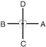

# CHOI-YONG

> 🔊 **Prononciation :** [최영](../audio/tul/choi-yong.m4a)

> **Grade :** 3e Dan

* **Nombre de mouvements :**  46
* **Diagramme au sol :**  (Hanja ou lettre capitale I)

| Diagramme | Description |
| ------ | ------ |
|  | CHOOI-YONG est nommé d'après le général Choi Yong, premier ministre et commandant en chef des forces armées sous la dynastie Koryo au XIVe siècle. Il était hautement respecté pour sa loyauté absolue, son patriotisme et sa profonde humilité. Il fut exécuté par son subordonné, le général Yi Sung Gae, qui devint plus tard le premier roi de la dynastie Yi. |

[CHOI-YONG](https://youtu.be/utktT20XLW0?si=MEq_GSCyrUjBIiFG)

## Origine et contexte historique

* **Contexte de coup d'État politique :** Hautement respecté pour sa loyauté absolue et sa profonde humilité, il fut exécuté par son subordonné direct, le général Yi Sung-Gae, qui usurpa le trône pour fonder la dynastie Joseon en 1392. Sa mort marqua la fin d'une ère d'intégrité et la chute de la dynastie de Koryo.

## Liste Détaillée des Mouvements

### Posture de départ : position de préparation fermée C

1. Déplacer le pied gauche vers D pour former une position arrière rapprochée sur la jambe droite vers D tout en exécutant un blocage de garde moyen vers D avec l'avant-bras.
   *([Dwitbal so palmok kaunde daebi makgi](../Techniques/Dwitbal-So-Palmok-Kaunde-Daebi-Makgi.md))*
2. Exécuter un coup de poing haut vers D avec le poing à phalange médiane gauche tout en maintenant une position arrière rapprochée sur la jambe droite vers D
   *([Dwitbal so joongji joomuk nopunde bandae jirugi](../Techniques/Dwitbal-So-Joongji-Joomuk-Nopunde-Bandae-Jirugi.md))*
3. Déplacer le pied gauche sur ligne CD pour former une position arrière rapprochée sur la jambe gauche vers C tout en exécutant un blocage de garde moyen vers C avec l'avant-bras.
   *([Dwitbal so palmok kaunde daebi makgi](../Techniques/Dwitbal-So-Palmok-Kaunde-Daebi-Makgi.md))*
4. Exécuter un coup de poing haut vers C avec le poing à phalange médiane droit tout en maintenant une position arrière rapprochée sur la jambe gauche vers C
   *([Dwitbal so joongji joomuk nopunde bandae jirugi](../Techniques/Dwitbal-So-Joongji-Joomuk-Nopunde-Bandae-Jirugi.md))*
5. Déplacer le pied droit sur ligne CD pour former une position de marche gauche vers D tout en exécutant un blocage montant avec le tranchant de la main gauche.
   *([Gunnun so sonkal chookyo makgi](../makgi/chookyo-makgi.md))*
6. Exécuter un blocage circulaire vers AD avec l'avant-bras intérieur droit tout en maintenant une position de marche gauche vers D.
   *([Gunnun so an palmok dollimyo makgi](../makgi/dollimyo-makgi.md))*
7. Exécuter un coup de poing moyen vers D avec le poing gauche tout en maintenant une position de marche gauche vers D.
   *([Gunnun so kaunde jirugi](../Techniques/Gunnun-So-Kaunde-Jirugi.md))*
8. Déplacer le pied gauche sur ligne CD pour former une position de marche droite vers C tout en exécutant un blocage montant avec le tranchant de la main droite.
   *([Gunnun so sonkal chookyo makgi](../makgi/chookyo-makgi.md))*
9. Exécuter un blocage circulaire vers AC avec l'avant-bras intérieur gauche tout en maintenant une position de marche droite vers C.
   *([Gunnun so an palmok dollimyo makgi](../makgi/dollimyo-makgi.md))*
10. Exécuter un coup de poing moyen vers C avec le poing droit tout en maintenant une position de marche droite vers C.
   *([Gunnun so kaunde jirugi](../Techniques/Gunnun-So-Kaunde-Jirugi.md))*
11. Déplacer le pied droit sur ligne CD pour former une position en L droite vers D tout en exécutant un blocage de garde bas vers D avec le tranchant de la main.
   *([Niunja so sonkal najunde daebi makgi](../makgi/sonkal-daebi-makgi.md))*
12. Exécuter un coup de pied circulaire moyen vers AD avec le pied droit puis l'abaisser vers le côté avant du pied gauche.
   *([Kaunde dollyo chagi](../chagi/dollyo-chagi.md))*
13. Exécuter un coup de pied crocheté inversé haut vers D avec le pied gauche.
   *([Nopunde bandae dollyo gorochagi](../chagi/bandae-dollyo-goro-chagi.md))*
14. Exécuter un coup de pied latéral perçant moyen vers D avec le pied gauche, en tirant les deux mains dans la direction opposée.
   *([Kaunde yopcha jirugi](../chagi/yop-cha-jirugi.md))*
   > *Exécuter 13 et 14 en un coup de pied consécutif.*
15. Abaisser le pied gauche vers D pour former une position de marche gauche vers D tout en frappant la paume gauche avec le coude droit.
   *([Gunnun so ap palkup bandae taerigi](../Techniques/Gunnun-So-Ap-Palkup-Bandae-Taerigi.md))*
16. Déplacer le pied gauche sur ligne CD pour former une position en L gauche vers C tout en exécutant un blocage de garde bas vers C avec le tranchant de la main.
   *([Niunja so sonkal najunde daebi makgi](../makgi/sonkal-daebi-makgi.md))*
17. Exécuter un coup de pied circulaire moyen vers AC avec le pied gauche puis l'abaisser vers le côté avant du pied droit.
   *([Kaunde dollyo chagi](../chagi/dollyo-chagi.md))*
18. Exécuter un coup de pied crocheté inversé haut vers C avec le pied droit.
   *([Nopunde bandae dollyo gorochagi](../chagi/bandae-dollyo-goro-chagi.md))*
19. Exécuter un coup de pied latéral perçant moyen vers C avec le pied droit, en tirant les deux mains dans la direction opposée.
   *([Kaunde yopcha jirugi](../chagi/yop-cha-jirugi.md))*
   > *Exécuter 18 et 19 en un coup de pied consécutif.*
20. Abaisser le pied droit vers C pour former une position de marche droite vers C tout en frappant la paume droite avec le coude gauche.
   *([Gunnun so ap palkup bandae taerigi](../Techniques/Gunnun-So-Ap-Palkup-Bandae-Taerigi.md))*
21. Déplacer le pied gauche vers C pour former une position de marche gauche vers C tout en exécutant un blocage en pression avec la paume droite.
   *([Gunnun so sonbadak bandae noollo makgi](../Techniques/Gunnun-So-Sonbadak-Bandae-Noollo-Makgi.md))*
22. Déplacer le pied droit vers C pour former une position de marche droite vers C tout en exécutant un blocage en pression avec la paume gauche.
   *([Gunnun so sonbadak bandae noollo makgi](../Techniques/Gunnun-So-Sonbadak-Bandae-Noollo-Makgi.md))*
   > *Exécuter 21 et 22 en mouvement rapide.*
23. Déplacer le pied droit vers D puis le pied gauche vers D, en tournant dans le sens anti-horaire pour former une position de marche gauche vers D tout en exécutant un blocage en W avec le tranchant de la main.
   *([Gunnun so sonkal san makgi](../makgi/san-makgi.md))*
24. Exécuter un coup de pied avant fouetté moyen vers D avec le pied droit en gardant les mains dans la position du mouvement 23.
   *([Kaunde apcha busigi](../chagi/apcha-busigi.md))*
25. Abaisser le pied droit vers C pour former une position en L droite vers D tout en exécutant un blocage de garde moyen vers D avec l'avant-bras.
   *([Niunja so palmok kaunde daebi makgi](../makgi/palmok-daebi-makgi.md))*
26. Déplacer le pied droit vers D pour former une position de marche droite vers D tout en exécutant un blocage en W avec le tranchant de la main.
   *([Gunnun so sonkal san makgi](../makgi/san-makgi.md))*
27. Exécuter un coup de pied avant fouetté moyen vers D avec le pied gauche en gardant les mains dans la position du mouvement 26.
   *([Kaunde apcha busigi](../chagi/apcha-busigi.md))*
28. Abaisser le pied gauche vers D pour former une position en L gauche vers C tout en exécutant un blocage de garde moyen vers C avec l'avant-bras.
   *([Niunja so palmok kaunde daebi makgi](../makgi/palmok-daebi-makgi.md))*
29. Déplacer le pied gauche vers C et le pied droit vers C puis glisser vers C en tournant dans le sens horaire pour former une position en L gauche vers D tout en exécutant un blocage de garde moyen vers D avec l'avant-bras.
   *([Niunja so palmok kaunde daebi makgi](../makgi/palmok-daebi-makgi.md))*
30. Déplacer le pied gauche vers D pour former une position de marche gauche vers D tout en exécutant une pique haute vers D avec la pique de doigts à plat gauche.
   *([Gunnun so opun sonkut nopunde tulgi](../Techniques/Gunnun-So-Opun-Sonkut-Nopunde-Tulgi.md))*
31. Déplacer le pied gauche sur ligne CD pour former une position de marche droite vers C tout en exécutant une pique haute vers C avec la pique de doigts à plat droit.
   *([Gunnun so opun sonkut nopunde tulgi](../Techniques/Gunnun-So-Opun-Sonkut-Nopunde-Tulgi.md))*
32. Déplacer le pied droit vers D en tournant dans le sens horaire pour former une position parallèle vers B tout en exécutant un blocage crocheté moyen vers B avec la paume droite.
   *([Narani so orun sonbadak kaunde golcho makgi](../Techniques/Sonbadak-Kaunde-Golcho-Makgi.md))*
33. Exécuter un coup de poing moyen vers B avec le poing gauche tout en maintenant une position parallèle vers B.
   *(Narani so wen joomuk kaunde jirugi)*
34. Tourner le visage vers A tout en formant un gauche position de préparation pliée A vers A.
   *([Guburyo junbi sogi A](../Techniques/Guburyo-Junbi-Sogi-A.md))*
35. Exécuter un coup de pied latéral perçant moyen vers A avec le pied droit pour former un blocage de garde de l'avant-bras.
   *([Kaunde yopcha jirugi](../chagi/yop-cha-jirugi.md))*
36. Abaisser le pied droit vers A en mouvement sauté pour former une position en X droite vers AD tout en exécutant une frappe latérale haute vers A avec le revers du poing droit et en amenant la pulpe des doigts de la main gauche vers le côté du poing droit.
   *(Twigi, [orun kyocha so dung joomuk nopunde yop taerigi](../Techniques/Dung-Joomuk-Nopunde-Yop-Taerigi.md))*
   > *Distance de saut : 1 position de marche.*
37. Exécuter un coup de pied crocheté inversé haut vers B avec le pied droit.
   *([Nopunde bandae dollyo gorochagi](../chagi/bandae-dollyo-goro-chagi.md))*
38. Abaisser le pied droit vers B en un mouvement étampé pour former une position en L gauche vers B tout en exécutant une frappe extérieure moyenne vers B avec le tranchant de la main droite.
   *([Niunja so sonkal kaunde bakuro taerigi](../Techniques/Niunja-So-Sonkal-Kaunde-Bakuro-Taerigi.md))*
39. Déplacer le pied gauche vers D en tournant dans le sens anti-horaire pour former une position parallèle vers A tout en exécutant un blocage crocheté moyen vers A avec la paume gauche.
   *([Narani so wen sonbadak kaunde golcho makgi](../Techniques/Sonbadak-Kaunde-Golcho-Makgi.md))*
40. Exécuter un coup de poing moyen vers A avec le poing droit tout en maintenant une position parallèle vers A.
   *(Narani so orun joomuk kaunde jirugi)*
41. Tourner le visage vers B tout en formant un droit position de préparation pliée A vers B.
   *([Guburyo junbi sogi A](../Techniques/Guburyo-Junbi-Sogi-A.md))*
42. Exécuter un coup de pied latéral perçant moyen vers B avec le pied gauche pour former un blocage de garde de l'avant-bras.
   *([Kaunde yopcha jirugi](../chagi/yop-cha-jirugi.md))*
43. Abaisser le pied gauche vers B en mouvement sauté pour former une position en X gauche vers BD tout en exécutant une frappe latérale haute vers B avec le revers du poing gauche et en amenant la pulpe des doigts de la main droite vers le côté du poing gauche.
   *(Twigi, [wen kyocha so dung joomuk nopunde yop taerigi](../Techniques/Dung-Joomuk-Nopunde-Yop-Taerigi.md))*
   > *Distance de saut : 1 position de marche.*
44. Exécuter un coup de pied crocheté inversé haut vers A avec le pied gauche.
   *([Nopunde bandae dollyo gorochagi](../chagi/bandae-dollyo-goro-chagi.md))*
45. Abaisser le pied gauche vers A en un mouvement étampé pour former une position en L droite vers A tout en exécutant une frappe extérieure moyenne vers A avec le tranchant de la main gauche.
   *([Niunja so sonkal kaunde bakuro taerigi](../Techniques/Niunja-So-Sonkal-Kaunde-Bakuro-Taerigi.md))*
46. Glisser vers A pour former une position fixe droite vers A tout en exécutant un coup de poing moyen vers A avec le poing droit.
   *([Gojung so kaunde yop jirugi](../Techniques/Gojung-So-Kaunde-Yop-Jirugi.md))*

### FIN : ramener le pied droit à la posture de départ
