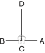

# CHOONG-JANG

> 🔊 **Prononciation :** [충장](../audio/tul/choong-jang.m4a)

> **Grade :** 2e Dan

* **Nombre de mouvements :**  52
* **Diagramme au sol :**  (Hanja ou lettre capitale I)

| Diagramme | Description |
| ------ | ------ |
|  | CHOONG-JANG est le pseudonyme donné au général Kim Duk Ryang de la dynastie Yi (XIVe siècle). La forme se termine par une attaque de la main gauche pour symboliser sa mort tragique en prison à l'âge de 27 ans, avant d'avoir pu exprimer pleinement tout son potentiel. |

[CHOONG-JANG]()

## Origine et contexte historique

* **Contexte politique d'injustice :** Leader d'une armée de volontaires patriotiques contre les invasions japonaises, il fut victime de fausses accusations de trahison politique montées de toutes pièces par des rivaux jaloux au sein de la cour Joseon. Son martyre symbolise la tragédie d'un esprit juste brisé par la paranoïa et la corruption des élites au pouvoir.

## Liste Détaillée des Mouvements

### Posture de départ : position de préparation fermée A

1. Déplacer le pied droit vers A pour former une position assise vers D tout en exécutant un blocage latéral-avant avec l'avant-bras intérieur droit et en étendant l'avant-bras gauche côté-vers le bas.
   *([Annun so orun an palmok yobap makgi](../Techniques/Annun-So-Orun-An-Palmok-Yobap-Makgi.md))*
2. Exécuter un blocage latéral-avant avec l'avant-bras intérieur gauche en étendant l'avant-bras droit côté vers le bas tout en maintenant une position assise vers D.
   *([Annun so wen an palmok yobap makgi](../Techniques/Annun-So-Wen-An-Palmok-Yobap-Makgi.md))*
3. Ramener le pied droit vers le pied gauche pour former une position fermée vers D tout en exécutant un coup de poing en angle avec le poing gauche.
   *(Moa so wen joomuk giokja jirugi)*

   > *Exécuter en mouvement lent.*

4. Déplacer le pied gauche vers D pour former une position de marche gauche vers tout en exécutant une pique haute vers D avec la pique à deux doigts droit.
   *([Gunnun so doo songarak nopunde bandae tulgi](../jirugi/doo-songarak-tulgi.md))*
5. Déplacer le pied droit vers D pour former une position de marche droite vers tout en exécutant une pique haute vers D avec la pique à deux doigts gauche.
   *([Gunnun so doo songarak nopunde bandae tulgi](../jirugi/doo-songarak-tulgi.md))*
6. Exécuter une frappe frontale vers D avec le revers du poing droit tout en maintenant une position de marche droite vers D.
   *(Gunnun so dung joomuk ap taerigi)*
7. Déplacer le pied gauche vers D pour former une position de marche gauche vers D tout en exécutant un blocage montant avec l'avant-bras gauche.
   *([Gunnun so palmok chookyo makgi](../Techniques/Gunnun-So-Palmok-Chookyo-Makgi.md))*
8. Déplacer le pied droit vers D pour former une position de marche droite vers D en même temps en exécutant un coup de poing moyen vers D avec le poing droit.
   *([gunnun so kaunde jirugi](../Techniques/Gunnun-So-Kaunde-Jirugi.md))*
9. Déplacer le pied droit vers C en tournant dans le sens anti-horaire puis glisser vers C pour former une position en L droite vers D tout en exécutant un blocage de garde moyen vers D avec l'avant-bras.
   *([Niunja so palmok kaunde daebi makgi](../makgi/palmok-daebi-makgi.md))*
10. Exécuter un coup de pied avant fouetté bas vers D avec le pied droit en gardant le position de la mains comme s'ils étaient en 9.
   *([Najunde apcha busigi](../chagi/apcha-busigi.md))*
11. Abaisser le pied droit vers D pour former une position basse droite vers D tout en exécutant une pique haute vers D avec le droit à plat bout des doigts.
   *([Nachuo so opun sonkut nopunde tulgi](../Techniques/Nachuo-So-Opun-Sonkut-Nopunde-Tulgi.md))*
12. Exécuter un coup de pied circulaire haut vers D avec le pied droit d'appui le corps avec les deux mains et le genou gauche.
   *([Nopunde dollyo chagi](../chagi/dollyo-chagi.md))*
13. Abaisser le pied droit vers D puis exécuter un coup de poing haut vers D avec le poing droit tout en pressant le sol avec la paume gauche.
   *(Joomuk nopunde jirugi)*
14. Déplacer le pied gauche vers D en tournant dans le sens horaire pour former une position en L gauche vers C tout en en piquant vers D avec le gauche côté coude.
   *([Niunja so yop palkup tulgi](../Techniques/Niunja-So-Yop-Palkup-Tulgi.md))*
15. Déplacer le pied gauche vers C en tournant dans le sens horaire pour former une position en L gauche vers D en même temps en exécutant un blocage de garde moyen vers D avec l'avant-bras.
   *([Niunja so palmok kaunde daebi makgi](../makgi/palmok-daebi-makgi.md))*
16. Déplacer le pied droit vers C pour former une position en L droite vers D tout en exécutant un blocage en levant avec la paume gauche.
   *([Niunja so sonbadak bandae duro makgi](../Techniques/Niunja-So-Sonbadak-Bandae-Duro-Makgi.md))*
17. Déplacer le pied gauche vers C pour former une position en L gauche vers D tout en exécutant une frappe extérieure moyenne vers D avec le tranchant de la main droite.
   *([Niunja so sonkal kaunde bakuro taerigi](../Techniques/Niunja-So-Sonkal-Kaunde-Bakuro-Taerigi.md))*
18. Exécuter un blocage en pression avec un poings croisés tout en formant une position de marche gauche vers C en pivotant avec le pied droit.
   *([Gunnun so kyocha joomuk noollo makgi](../Techniques/Gunnun-So-Kyocha-Joomuk-Noollo-Makgi.md))*
19. Exécuter un coup de pied avant fouetté bas vers C avec le genou droit tout en tirant les deux mains dans la direction opposée comme si en saisissant l'adversaire’s jambe.
   *([Moorup najunde apcha busigi](../chagi/moorup-apcha-busigi.md))*
20. Abaisser le pied droit vers C pour former une position en L droite vers D tout en exécutant un blocage de garde moyen vers D avec un tranchant de la main.
   *([Niunja so sonkal kaunde daebi makgi](../Techniques/Niunja-So-Sonkal-Kaunde-Daebi-Makgi.md))*
21. Déplacer le pied droit vers D en un en glissant mouvement pour former une position en L droite vers C tout en en piquant vers D avec le droit côté coude.
   *([Niunja so yop palkup tulgi](../Techniques/Niunja-So-Yop-Palkup-Tulgi.md))*
22. Exécuter un blocage de garde moyen vers D avec un tranchant de la main tout en formant une position en L gauche vers D en pivotant avec le pied gauche.
   *([Niunja so sonkal kaunde daebi makgi](../Techniques/Niunja-So-Sonkal-Kaunde-Daebi-Makgi.md))*
23. Exécuter un coup de pied latéral perçant moyen vers D avec le pied droit tout en tirant les deux mains dans la direction opposée.
   *([Kaunde yopcha jirugi](../chagi/yop-cha-jirugi.md))*
24. Abaisser le pied droit vers D puis exécuter un blocage en pression avec une paumes jumelées tout en formant une position sur la jambe arrière droite vers C, en pivotant avec le pied droit.
   *([Dwitbal so sang sonbadak noollo makgi](../Techniques/Dwitbal-So-Sang-Sonbadak-Noollo-Makgi.md))*
25. Déplacer le pied droit vers C pour former une position de marche droite vers C tout en exécutant un blocage frontal haut vers C avec l'avant-bras extérieur droit puis une frappe latérale haute vers C avec le revers du poing droit, en maintenant une position de marche droite vers C.
   *([Gunnun so bakat palmok nopunde ap makgi](../makgi/ap-makgi.md), [dung joomuk nopunde yop taerigi](../Techniques/Dung-Joomuk-Nopunde-Yop-Taerigi.md))*
26. Exécuter une pique haute vers D avec le gauche à plat bout des doigts tout en formant une position en L droite vers D en pivotant avec le pied droit.
   *(Niunja so opun sonkut nopunde bandae tulgi)*
27. Exécuter un coup de pied avant fouetté bas vers D avec le pied droit tout en amenant la paume droite sur le gauche arrière main.
   *([Najunde apcha busigi](../chagi/apcha-busigi.md))*
28. Abaisser le pied droit vers D pour former une position de marche gauche vers C en pivotant avec le pied gauche tout en en piquant vers D avec le droit arrière coude, en plaçant le gauche côté poing sur le poing droit.
   *([Gunnun so dwit palkup bandae tulgi](../jirugi/dwit-palkup-tulgi.md))*

   > *Exécuter en mouvement lent.*

29. Exécuter une frappe descendante avec le gauche arrière main tout en formant une position en L droite vers C, en pivotant avec le pied droit.
   *([Niunja so sondung bandae naeryo taerigi](../jirugi/naeryo-taerigi.md))*

   > *Exécuter en un mouvement étampé.*

30. Frapper du poing la paume gauche avec le poing droit tout en maintenant une position en L droite vers C.
   *([Niunja so kaunde baro jirugi](../Techniques/Niunja-So-Kaunde-Baro-Jirugi.md))*
31. Déplacer le pied droit vers C en un mouvement étampé pour former une position en L gauche vers C tout en exécutant une frappe descendante avec le droit arrière main.
   *([Niunja so sondung bandae naeryo taerigi](../jirugi/naeryo-taerigi.md))*
32. Frapper du poing la paume droite avec le poing gauche tout en maintenant une position en L gauche vers C.
   *([Niunja so kaunde baro jirugi](../Techniques/Niunja-So-Kaunde-Baro-Jirugi.md))*
33. Exécuter une frappe extérieure moyenne vers D avec le tranchant de la main gauche tout en formant une position en L droite vers D, en pivotant avec le pied droit.
   *([Niunja so sonkal kaunde bakuro taerigi](../Techniques/Niunja-So-Sonkal-Kaunde-Bakuro-Taerigi.md))*

   > *Exécuter en un mouvement étampé.*

34. Exécuter une frappe latérale-avant haute vers D avec le revers du poing droit en frappant la paume gauche avec le coude droit tout en formant une position de marche gauche vers D, en glissant le pied gauche.
   *(Gunnun so dung joomuk nopunde bandae yobap taerigi)*
35. Déplacer le pied droit vers D pour former une position en L gauche vers D tout en exécutant une frappe extérieure moyenne vers D avec le tranchant de la main droite.
   *([Niunja so sonkal kaunde bakuro taerigi](../Techniques/Niunja-So-Sonkal-Kaunde-Bakuro-Taerigi.md))*

   > *Exécuter en un mouvement étampé.*

36. Exécuter une frappe latérale-avant haute vers D avec le revers du poing gauche en frappant la paume droite avec le coude gauche tout en formant une position de marche droite vers D, en glissant le pied droit.
   *(Gunnun so dung joomuk nopunde bandae yobap taerigi)*
37. Exécuter un blocage de garde bas vers C avec un revers de la main tout en formant une position en L droite vers C en pivotant avec le pied droit.
   *([Niunja so sonkal dung najunde daebi makgi](../makgi/najunde-daebi-makgi.md))*
38. Exécuter un blocage en forme de 9 droit tout en formant une position de marche gauche vers C en glissant le pied gauche.
   *([Gunnun so bandae gutja makgi](../makgi/gutja-makgi.md))*
39. Déplacer le pied droit vers C pour former une position en L gauche vers C tout en exécutant un blocage de garde bas vers C avec un revers de la main.
   *([Niunja so sonkal dung najunde daebi makgi](../makgi/najunde-daebi-makgi.md))*
40. Exécuter un blocage en forme de 9 gauche tout en formant une position de marche droite vers C en glissant le pied droit.
   *([Gunnun so bandae gutja makgi](../makgi/gutja-makgi.md))*
41. Déplacer le pied droit vers D pour former une position de marche gauche vers C tout en exécutant une frappe horizontale avec un double tranchant de la main.
   *(Gunnun so sang sonkal soopyong taerigi)*
42. Exécuter une frappe haute vers C avec l'arc de main droite tout en maintenant une position de marche gauche vers C.
   *(Gunnun so bandal son nopunde bandae taerigi)*
43. Exécuter un coup de pied avant fouetté moyen vers C avec le pied droit en gardant le position de la mains comme s'ils étaient en 42.
   *([Kaunde apcha busigi](../chagi/apcha-busigi.md))*
44. Abaisser le pied droit vers C pour former une position de marche droite vers C tout en exécutant une frappe haute vers C avec l'arc de main gauche.
   *(Gunnun so bandal son nopunde bandae taerigi)*
45. Exécuter un coup de pied avant fouetté moyen vers C avec le pied gauche en gardant le position de la mains comme s'ils étaient en 44.
   *([Kaunde apcha busigi](../chagi/apcha-busigi.md))*
46. Abaisser le pied gauche vers C pour former une position de marche gauche vers C tout en exécutant un coup de poing moyen vers C avec le poing droit.
   *([Gunnun so kaunde bandae jirugi](../Techniques/Gunnun-So-Kaunde-Bandae-Jirugi.md))*
47. Exécuter un coup de poing moyen vers C avec le poing gauche tout en maintenant une position de marche gauche vers C.
   *([Gunnun so kaunde jirugi](../Techniques/Gunnun-So-Kaunde-Jirugi.md))*

   > *Exécuter 46 et 47 en mouvement rapide.*

48. Ramener le pied droit vers le pied gauche pour former une position fermée vers C tout en exécutant un coup de poing semi-circulaire haut avec un poings jumelés à phalanges saillantes.
   *(Moa so sang inji joomuk nopunde bandal jirugi)*
49. Déplacer le pied gauche vers B en tournant dans le sens anti-horaire pour former une position de marche gauche vers B tout en exécutant un blocage bas vers B avec le tranchant de la main gauche.
   *([Gunnun so sonkal najunde makgi](../makgi/najunde-makgi.md))*
50. Exécuter un coup de poing haut vers B avec le poing ouvert droit tout en maintenant une position de marche gauche vers B.
   *(Gunnun so pyon joomuk nopunde bandae jirugi)*
51. Déplacer le pied gauche sur ligne AB pour former une position de marche droite vers A tout en exécutant un blocage bas vers A avec le tranchant de la main droite.
   *([Gunnun so sonkal najunde makgi](../makgi/najunde-makgi.md))*
52. Exécuter un coup de poing haut vers A avec le poing ouvert gauche tout en maintenant une position de marche droite vers A.
   *(Gunnun so pyon joomuk nopunde bandae jirugi)*

### FIN : ramener le pied gauche à la posture de départ.
