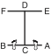

# CHOONG-MOO

> 🔊 **Prononciation :** [충무](../audio/tul/choong-moo.m4a)

> **Grade :** 1er Gup — Ceinture rouge barre noire

* **Nombre de mouvements :**  30
* **Diagramme au sol :**  (Hanja ou lettre capitale I)

| Diagramme | Description |
| ------ | ------ |
|  | CHOONG-MOO est le nom posthume donné au grand amiral Yi Soon-Sin de la dynastie Yi. Il a conçu le premier navire de guerre blindé (Kobukson) en 1592, précurseur du sous-marin moderne. La forme se termine par une attaque de la main gauche pour symboliser sa mort regrettable au combat avant d'avoir pu exprimer pleinement son potentiel au roi. |

[CHOONG-MOO](https://vimeo.com/106885318)

## Liste Détaillée des Mouvements

### Posture de départ : position parallèle de préparation

1. Déplacer le pied gauche vers B pour former une position en L droite vers B tout en exécutant un blocage double du tranchant de la main.
   *([Niunja so sang sonkal makgi](../makgi/sang-sonkal-makgi.md))*
2. Déplacer le pied droit vers B pour former une position de marche droite vers B tout en exécutant une frappe frontale haute vers B avec le tranchant de la main droite et ramener le gauche arrière main en avant du avant.
   *([Gunnun so sonkal nopunde ap taerigi](../Techniques/Sonkal-Nopunde-Ap-Taerigi.md))*
3. Déplacer le pied droit vers A en tournant dans le sens horaire pour former une position en L gauche vers A tout en exécutant un blocage de garde moyen vers A avec un tranchant de la main.
   *([niunja so sonkal kaunde daebi makgi](../Techniques/Niunja-So-Sonkal-Kaunde-Daebi-Makgi.md))*
4. Déplacer le pied gauche vers A pour former une position de marche gauche vers A tout en exécutant une pique haute vers A avec le gauche à plat bout des doigts.
   *([Gunnun so opun sonkut nopunde tulgi](../Techniques/Gunnun-So-Opun-Sonkut-Nopunde-Tulgi.md))*
5. Déplacer le pied gauche vers D pour former une position en L droite vers D tout en exécutant un blocage de garde moyen vers D avec un tranchant de la main.
   *([Niunja so sonkal kaunde daebi makgi](../Techniques/Niunja-So-Sonkal-Kaunde-Daebi-Makgi.md))*
6. Tourner le visage vers C pour former un gauche position de préparation pliée A vers C.
   *([Guburyo junbi sogi A](../Techniques/Guburyo-Junbi-Sogi-A.md))*
7. Exécuter un coup de pied latéral perçant moyen vers C avec le pied droit.
   *([Kaunde yopcha jirugi](../chagi/yop-cha-jirugi.md))*
8. Abaisser le pied droit vers C pour former une position en L droite vers D tout en exécutant un blocage de garde moyen vers D avec un tranchant de la main.
   *([Niunja so sonkal kaunde daebi makgi](../Techniques/Niunja-So-Sonkal-Kaunde-Daebi-Makgi.md))*
9. Exécuter un coup de pied latéral perçant sauté vers D avec le pied droit aussitôt après en déplaçant il vers D puis atterrir vers D pour former une position en L gauche vers D tout en exécutant un blocage de garde moyen vers D avec un tranchant de la main.
   *([Twimyo yopcha jirugi](../chagi/twimyo-yopcha-jirugi.md), [wen niunja so sonkal kaunde daebi makgi](../Techniques/Niunja-So-Sonkal-Kaunde-Daebi-Makgi.md))*
10. Déplacer le pied gauche vers E en tournant dans le sens anti-horaire pour former une position en L droite vers E en même temps en exécutant un blocage bas vers E avec l'avant-bras gauche.
   *([Niunja so palmok najunde yop makgi](../makgi/yop-makgi.md))*
11. Étendre les deux mains vers le haut comme si vers saisir l'adversaire’s tête tout en formant une position de marche gauche vers E, en glissant le pied gauche.
12. Exécuter un coup de pied montant vers E avec le genou droit en tirant les deux mains vers le bas.
   *([Moorup ollyo chagi](../chagi/moorup-ollyo-chagi.md))*
13. Abaisser le pied droit vers le pied gauche puis déplacer le pied gauche vers F pour former une position de marche gauche vers F tout en exécutant une frappe frontale haute vers F avec le revers de la main droite, en amenant le gauche arrière main sous le coude droit articulation.
   *(Gunnun so sonkal dung nopunde bandae ap taerigi)*
14. Exécuter un coup de pied circulaire haut vers DF avec le pied droit puis abaisser il vers le pied gauche.
   *([Nopunde dollyo chagi](../chagi/dollyo-chagi.md))*
15. Exécuter un coup de pied arrière perçant moyen vers F avec le pied gauche.
   *([Kaunde dwitcha jirugi](../chagi/dwit-cha-jirugi.md))*

   > *Exécuter 14 et 15 en mouvement rapide.*

16. Abaisser le pied gauche vers F pour former une position en L gauche vers E tout en exécutant un blocage de garde moyen vers E avec l'avant-bras.
   *([niunja so palmok kaunde daebi makgi](../makgi/palmok-daebi-makgi.md))*
17. Exécuter un coup de pied circulaire moyen vers DE avec le pied gauche.
   *([kaunde dollyo chagi](../chagi/dollyo-chagi.md))*
18. Abaisser le pied gauche vers le pied droit puis déplacer le pied droit vers C pour former une position fixe droite vers C tout en exécutant un blocage en U vers C.
   *([Gojung so digutja makgi](../Techniques/Gojung-So-Digutja-Makgi.md))*
19. Sauter et pivoter autour dans le sens anti-horaire, à la réception sur la même place pour former une position en L gauche vers C tout en exécutant un blocage de garde moyen vers C avec un tranchant de la main.
   *(Twigi, [wen niunja so sonkal kaunde daebi makgi](../Techniques/Niunja-So-Sonkal-Kaunde-Daebi-Makgi.md))*
20. Déplacer le pied gauche vers C pour former une position de marche gauche vers C en même temps en exécutant une pique basse vers C avec la pique de doigts renversée droit.
   *([Gunnun so dwijibun sonkut najunde tulgi](../Techniques/Gunnun-So-Dwijibun-Sonkut-Najunde-Tulgi.md))*
21. Exécuter une frappe arrière latérale vers D avec le revers du poing droit et un blocage bas vers C avec l'avant-bras gauche tout en formant une position en L droite vers C, en tirant le pied gauche.
   *(Niunja so dung joomuk baro yopdwi taerigi wa [palmok najunde bandae makgi](../makgi/bandae-makgi.md))*
22. Déplacer le pied droit vers C pour former une position de marche droite vers C tout en exécutant une pique moyenne vers C avec le droit droit bout des doigts.
   *([Gunnun so sun sonkut kaunde tulgi](../Techniques/Sun-Sonkut-Kaunde-Tulgi.md))*
23. Déplacer le pied gauche vers B en tournant dans le sens anti-horaire pour former une position de marche gauche vers B tout en exécutant un blocage haut vers B avec le gauche double avant-bras.
   *([Gunnun so doo palmok nopunde makgi](../Techniques/Gunnun-So-Doo-Palmok-Nopunde-Makgi.md))*
24. Déplacer le pied droit vers B pour former une position assise vers C tout en exécutant un blocage frontal moyen vers C avec l'avant-bras droit puis une frappe latérale haute vers B avec le revers du poing droit.
   *([Annun so orun palmok kaunde ap makgi](../Techniques/Annun-So-Orun-Palmok-Kaunde-Ap-Makgi.md), [orun dung joomuk nopunde yop taerigi](../Techniques/Dung-Joomuk-Nopunde-Yop-Taerigi.md))*
25. Exécuter un coup de pied latéral perçant moyen vers A avec le pied droit en tournant dans le sens anti-horaire puis abaisser il vers A.
   *([Kaunde yopcha jirugi](../chagi/yop-cha-jirugi.md))*
26. Exécuter un coup de pied latéral perçant moyen vers A avec le pied gauche en tournant dans le sens horaire.
   *([Kaunde yopcha jirugi](../chagi/yop-cha-jirugi.md))*
27. Abaisser le pied gauche vers A puis exécuter un blocage d'arrêt vers B avec un tranchant des mains croisées tout en formant une position en L gauche vers B en pivotant avec le pied gauche.
   *([Niunja so kyocha sonkal momchau makgi](../makgi/momchau-makgi.md))*
28. Déplacer le pied gauche vers B pour former une position de marche gauche vers B tout en exécutant un blocage montant vers B avec une paumes jumelées.
   *(Gunnun so sang sonbadak ollyo makgi)*
29. Déplacer le pied gauche sur ligne AB puis exécuter un blocage montant avec l'avant-bras droit tout en formant une position de marche droite vers A.
   *([Gunnun so palmok chookyo makgi](../Techniques/Gunnun-So-Palmok-Chookyo-Makgi.md))*
30. Exécuter un coup de poing moyen vers A avec le poing gauche tout en maintenant une position de marche droite vers A.
   *([Gunnun so kaunde bandae jirugi](../Techniques/Gunnun-So-Kaunde-Bandae-Jirugi.md))*

### FIN : ramener le pied gauche à la posture de départ.

---

[← Index des formes](README.md) · [Histoire du Tul](../Theorie/encyclopedie-historique-tuls.md)
