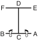

# DAN-GUN

> **Grade :** 8e Gup — Ceinture jaune

* **Nombre de mouvements :**  21
* **Diagramme au sol :**  (Hanja ou lettre capitale I)

| Diagramme | Description |
| ------ | ------ |
|  | DAN-GUN est nommé d'après le saint Dan-Gun, le fondateur légendaire de la Corée en l'an 2333 avant J.-C. |

[DAN-GUN](https://vimeo.com/108059486)

## Liste Détaillée des Mouvements

### Posture de départ : Position parallèle de préparation (Parallel Ready Stance / Narani Junbi Sogi).

1. Déplacer le pied gauche vers B pour former une position en L droite vers B tout en exécutant un blocage de garde moyen vers B avec le tranchant de la main (Niunja So Sonkal Kaunde Daebi Makgi).
2. Avancer le pied droit vers B pour former une position de marche droite vers B tout en exécutant un coup de poing haut vers B avec le poing droit (Gunnun So Nopunde Jirugi).
3. Déplacer le pied droit vers A, en tournant dans le sens horaire pour former une position en L gauche vers A tout en exécutant un blocage de garde moyen vers A avec le tranchant de la main (Niunja So Sonkal Kaunde Daebi Makgi).
4. Avancer le pied gauche vers A pour former une position de marche gauche vers A tout en exécutant un coup de poing haut vers A avec le poing gauche (Gunnun So Nopunde Jirugi).
5. Déplacer le pied gauche vers D pour former une position de marche gauche vers D tout en exécutant un blocage bas vers D avec l'avant-bras gauche (Gunnun So Palmok Najunde Makgi).
6. Avancer le pied droit vers D pour former une position de marche droite vers D tout en exécutant un coup de poing haut vers D avec le poing droit (Gunnun So Nopunde Jirugi).
7. Avancer le pied gauche vers D pour former une position de marche gauche vers D tout en exécutant un coup de poing haut vers D avec le poing gauche (Gunnun So Nopunde Jirugi).
8. Avancer le pied droit vers D pour former une position de marche droite vers D tout en exécutant un coup de poing haut vers D avec le poing droit (Gunnun So Nopunde Jirugi).
9. Déplacer le pied gauche vers E, en tournant dans le sens anti-horaire pour former une position en L droite vers E tout en exécutant un blocage double de l'avant-bras vers E (Niunja So Sang Palmok Makgi).
10. Avancer le pied droit vers E pour former une position de marche droite vers E tout en exécutant un coup de poing haut vers E avec le poing droit (Gunnun So Nopunde Jirugi).
11. Déplacer le pied droit vers F, en tournant dans le sens horaire pour former une position en L gauche vers F tout en exécutant un blocage double de l'avant-bras vers F (Niunja So Sang Palmok Makgi).
12. Avancer le pied gauche vers F pour former une position de marche gauche vers F tout en exécutant un coup de poing haut vers F avec le poing gauche (Gunnun So Nopunde Jirugi).
13. Déplacer le pied gauche vers C pour former une position de marche gauche vers C tout en exécutant un blocage bas vers C avec l'avant-bras gauche (Gunnun So Palmok Najunde Makgi).
14. Exécuter un blocage ascendant avec l'avant-bras gauche tout en maintenant la position de marche gauche vers C (les mouvements 13 et 14 sont exécutés en un mouvement continu) (Gunnun So Palmok Chookyo Makgi).
15. Avancer le pied droit vers C pour former une position de marche droite vers C tout en exécutant un blocage ascendant avec l'avant-bras droit (Gunnun So Palmok Chookyo Makgi).
16. Avancer le pied gauche vers C pour former une position de marche gauche vers C tout en exécutant un blocage ascendant avec l'avant-bras gauche (Gunnun So Palmok Chookyo Makgi).
17. Avancer le pied droit vers C pour former une position de marche droite vers C tout en exécutant un blocage ascendant avec l'avant-bras droit (Gunnun So Palmok Chookyo Makgi).
18. Déplacer le pied gauche vers B, en tournant dans le sens anti-horaire pour d'obtenir une position en L droite vers B tout en exécutant une frappe latérale moyenne vers B avec le tranchant de la main gauche (Niunja So Sonkal Kaunde Bakuro Taerigi).
19. Avancer le pied droit vers B pour former une position de marche droite vers B tout en exécutant un coup de poing haut vers B avec le poing droit (Gunnun So Nopunde Jirugi).
20. Déplacer le pied droit vers A, en tournant dans le sens horaire pour former une position en L gauche vers A tout en exécutant une frappe latérale moyenne vers A avec le tranchant de la main droite (Niunja So Sonkal Kaunde Bakuro Taerigi).
21. Avancer le pied gauche vers A pour former une position de marche gauche vers A tout en exécutant un coup de poing haut vers A avec le poing gauche (Gunnun So Nopunde Jirugi).

### FIN : Ramener le pied gauche vers la posture de départ (Ready Posture).

---

[← Index des formes](index.md) · [Recueil complet](toutes-les-formes.md) · [Histoire du Tul](../Theorie/encyclopedie-historique-tuls.md)
