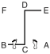

# DO-SAN

> **Grade :** 7e Gup — Ceinture jaune barre verte

* **Nombre de mouvements :**  24
* **Diagramme au sol :**  (Zigzag / Marche d'escalier)

| Diagramme | Description |
| ------ | ------ |
|  | DO-SAN est le pseudonyme du patriote Ahn Chang-Ho (1878-1938). Les 24 mouvements représentent toute sa vie qu'il a consacrée à l'avancement de l'éducation en Corée et à son mouvement d'indépendance. |

[DO-SAN](https://vimeo.com/109846979)

## Liste Détaillée des Mouvements

### Posture de départ : position parallèle de préparation

1. Déplacer le pied gauche vers B, pour former une position de marche gauche vers B tout en exécutant un blocage latéral haut vers B avec l'avant-bras extérieur gauche.
   *(Gunnun so bakat palmok nopunde yop makgi)*
2. Exécuter un coup de poing moyen vers B avec le poing droit tout en maintenant une position de marche gauche vers B.
   *(Gunnun so kaunde bandae jirugi)*
3. Déplacer le pied gauche sur ligne AB, puis tourner dans le sens horaire pour former une position de marche droite vers A tout en exécutant un blocage latéral haut vers A avec l'avant-bras extérieur droit.
   *(Gunnun so bakat palmok nopunde yop makgi)*
4. Exécuter un coup de poing moyen vers A avec le poing gauche tout en maintenant une position de marche droite vers A.
   *(Gunnun so kaunde bandae jirugi)*
5. Déplacer le pied gauche vers D, pour former une position en L droite vers D tout en exécutant un blocage de garde moyen vers D avec un tranchant de la main.
   *(Niunja so sonkal kaunde daebi makgi)*
6. Déplacer le pied droit vers D pour former une position de marche droite vers D tout en exécutant une pique moyenne vers D avec la pique de doigts droite droit.
   *(Gunnun so sun sonkut kaunde tulgi)*
7. Vriller le tranchant de la main droite conjointement avec le corps dans le sens anti-horaire jusqu'à ce que sa paume fait visage vers le bas puis déplacer le pied gauche vers D, en tournant dans le sens anti-horaire pour former une position de marche gauche vers D tout en exécutant une frappe latérale haute vers D avec le revers du poing gauche.
   *(Jappyosul tae, gunnun so dung joomuk nopunde yop taerigi)*
8. Déplacer le pied droit vers D pour former une position de marche droite vers D tout en exécutant une frappe latérale haute vers D avec le revers du poing droit.
   *(Gunnun so dung joomuk nopunde yop taerigi)*
9. Déplacer le pied gauche vers E, en tournant dans le sens anti-horaire pour former une position de marche gauche vers E tout en exécutant un blocage latéral haut vers E avec l'avant-bras extérieur gauche.
   *(Gunnun so bakat palmok nopunde yop makgi)*
10. Exécuter un coup de poing moyen vers E avec le poing droit tout en maintenant une position de marche gauche vers E.
   *(Gunnun so kaunde bandae jirugi)*
11. Déplacer le pied gauche sur ligne EF, puis tourner dans le sens horaire pour former une position de marche droite vers F tout en exécutant un blocage latéral haut vers F avec l'avant-bras extérieur droit.
   *(Gunnun so bakat palmok nopunde yop makgi)*
12. Exécuter un coup de poing moyen vers F avec le poing gauche tout en maintenant une position de marche droite vers F.
   *(Gunnun so kaunde bandae jirugi)*
13. Déplacer le pied gauche vers CE pour former une position de marche gauche vers CE, en même temps en exécutant un blocage en écartement haut vers CE avec l'avant-bras extérieur.
   *(Gunnun so bakat palmok nopunde hechyo makgi)*
14. Exécuter un coup de pied avant fouetté moyen vers CE avec le pied droit, en gardant le position de la mains comme s'ils étaient en 13.
   *(Kaunde apcha busigi)*
15. Abaisser le pied droit vers CE pour former une position de marche droite vers CE tout en exécutant un coup de poing moyen vers CE avec le poing droit.
   *(Gunnun so kaunde jirugi)*
16. Exécuter un coup de poing moyen vers CE avec le poing gauche tout en maintenant une position de marche droite vers CE.
   *(Gunnun so kaunde bandae jirugi)*

   > *Exécuter 15 et 16 en mouvement rapide.*

17. Déplacer le pied droit vers CF pour former une position de marche droite vers CF tout en exécutant un blocage en écartement haut vers CF avec l'avant-bras extérieur.
   *(Gunnun so bakat palmok nopunde hechyo makgi)*
18. Exécuter un coup de pied avant fouetté moyen vers CF avec le pied gauche, en gardant le position de la mains comme s'ils étaient en 17.
   *(Kaunde apcha busigi)*
19. Abaisser le pied gauche vers CF pour former une position de marche gauche vers CF tout en exécutant un coup de poing moyen vers CF avec le poing gauche.
   *(Gunnun so kaunde jirugi)*
20. Exécuter un coup de poing moyen vers CF avec le poing droit tout en maintenant une position de marche gauche vers CF.
   *(Gunnun so kaunde jirugi)*

   > *Exécuter 19 et 20 en mouvement rapide.*

21. Déplacer le pied gauche vers C pour former une position de marche gauche vers C, en même temps en exécutant un blocage montant avec l'avant-bras gauche.
   *(Gunnun so palmok chookyo makgi)*
22. Déplacer le pied droit vers C pour former une position de marche droite vers C tout en exécutant un blocage montant avec l'avant-bras droit.
   *(Gunnun so palmok chookyo makgi)*
23. Déplacer le pied gauche vers B, en tournant dans le sens anti-horaire pour former une position assise vers D tout en exécutant une frappe latérale moyenne vers B avec le tranchant de la main gauche.
   *(Annun so wen sonkal kaunde yop taerigi)*
24. Ramener le pied gauche vers le pied droit puis déplacer le pied droit vers A pour former une position assise vers D tout en exécutant une frappe latérale moyenne vers A avec le tranchant de la main droite.
   *(Annun so orun sonkal kaunde yop taerigi)*

### FIN : ramener le pied droit à la posture de départ.

---

[← Index des formes](README.md) · [Histoire du Tul](../Theorie/encyclopedie-historique-tuls.md)
