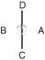

# EUI-AM

> 🔊 **Prononciation :** [의암](../audio/tul/eui-am.m4a)

> **Grade :** 2e Dan

* **Nombre de mouvements :**  45
* **Diagramme au sol :**  (Ligne verticale unique)

| Diagramme | Description |
| ------ | ------ |
|  | EUI-AM est le pseudonyme de Son Byong Hi, leader du mouvement d'indépendance de la Corée du 1er mars 1919. Les 45 mouvements rappellent son âge lorsqu'il changea le nom de Dong Hak (culture orientale) en Chondo Kyo (religion de la voie céleste) en 1905. Le diagramme symbolise son esprit indomptable. |

[EUI-AM](https://vimeo.com/133457472)

## Liste Détaillée des Mouvements

### Posture de départ : position de préparation fermée D

1. Déplacer le pied droit vers C pour former une position de marche gauche vers D tout en exécutant un blocage intérieur bas vers D avec le tranchant de la main droite.
   *([Gunnun so sonkal najunde bandae anuro makgi](../makgi/anuro-makgi.md))*
2. Déplacer le pied gauche vers C pour former une position de marche droite vers D tout en exécutant un blocage latéral haut vers D avec l'avant-bras extérieur gauche.
   *([Gunnun so bakat palmok nopunde bandae yop makgi](../Techniques/Gunnun-So-Bakat-Palmok-Nopunde-Yop-Makgi.md))*
3. Exécuter un coup de poing moyen vers D avec le poing droit tout en maintenant une position de marche droite vers D.
   *([Gunnun so kaunde jirugi](../Techniques/Gunnun-So-Kaunde-Jirugi.md))*
4. Exécuter un coup de pied vrillé bas vers D avec le pied gauche en gardant le position de la mains comme s'ils étaient en 3.
   *([Najunde bituro chagi](../chagi/bituro-chagi.md))*
5. Abaisser le pied gauche vers D pour former une position de marche gauche vers D tout en exécutant un blocage descendant avec un poings croisés.
   *([Gunnun so kyocha joomuk naeryo makgi](../makgi/naeryo-makgi.md))*
6. Exécuter un blocage montant avec le tranchant de la main droite, en maintenant une position de marche gauche vers D.
   *([Gunnun so sonkal bandae chookyo makgi](../makgi/chookyo-makgi.md))*

   > *Exécuter 5 et 6 en mouvement continu.*

7. Sauter vers D, pour former une position en X droite vers BD tout en exécutant une frappe latérale haute vers D avec le revers du poing droit en amenant la pulpe des doigts gauche vers le droit côté poing.
   *(Twigi, [orun kyocha so dung joomuk nopunde yop taerigi](../Techniques/Dung-Joomuk-Nopunde-Yop-Taerigi.md))*
8. Déplacer le pied gauche vers C pour former une position en L droite vers C tout en exécutant un coup de poing moyen vers C avec le poing gauche.
   *([Niunja so kaunde yop jirugi](../Techniques/Niunja-So-Kaunde-Yop-Jirugi.md))*
9. Exécuter un coup de pied circulaire inversé moyen vers AC avec le pied droit.
   *([Kaunde bandae dollyo chagi](../chagi/bandae-dollyo-chagi.md))*
10. Abaisser le pied droit vers C en un en écrasant mouvement pour former une position assise vers A tout en exécutant une frappe latérale moyenne vers C avec le tranchant de la main droite.
   *([Annun so orun sonkal kaunde yop taerigi](../Techniques/Annun-So-Orun-Sonkal-Kaunde-Yop-Taerigi.md))*
11. Exécuter un coup de pied latéral perçant moyen vers C avec le pied gauche tout en tournant dans le sens horaire en tirant les deux mains dans la direction opposée.
   *([Kaunde yopcha jirugi](../chagi/yop-cha-jirugi.md))*
12. Abaisser le pied gauche vers C pour former une position de marche gauche vers C tout en exécutant un coup de poing semi-circulaire haut avec le poing droit.
   *(Gunnun so nopunde bandae bandal jirugi)*
13. Exécuter un coup de poing circulaire moyen avec le poing gauche tout en formant une position parallèle vers C en tirant le pied droit.
   *(Narani so wen joomuk kaunde dollyo jirugi)*

   > *Exécuter en mouvement lent.*

14. Déplacer le pied gauche vers D pour former une position de marche droite vers C tout en exécutant un blocage intérieur bas avec le tranchant de la main gauche.
   *([Gunnun so sonkal najunde bandae anuro makgi](../makgi/anuro-makgi.md))*
15. Déplacer le pied droit vers D pour former une position de marche gauche vers C en même temps en exécutant un blocage latéral haut vers C avec l'avant-bras extérieur droit.
   *([Gunnun so bakat palmok nopunde bandae yop makgi](../Techniques/Gunnun-So-Bakat-Palmok-Nopunde-Yop-Makgi.md))*
16. Exécuter un coup de poing moyen vers C avec le poing gauche tout en maintenant une position de marche gauche vers C.
   *([Gunnun so kaunde jirugi](../Techniques/Gunnun-So-Kaunde-Jirugi.md))*
17. Exécuter un coup de pied vrillé bas vers C avec le pied droit, en gardant le position de la mains comme s'ils étaient en 16.
   *([Najunde bituro chagi](../chagi/bituro-chagi.md))*
18. Abaisser le pied droit vers C pour former une position de marche droite vers C tout en exécutant un blocage descendant avec un poings croisés.
   *([Gunnun so kyocha joomuk naeryo makgi](../makgi/naeryo-makgi.md))*
19. Exécuter un blocage montant avec le tranchant de la main gauche tout en maintenant une position de marche droite vers C.
   *([Gunnun so sonkal bandae chookyo makgi](../makgi/chookyo-makgi.md))*

   > *Exécuter 18 et 19 en mouvement continu.*

20. Sauter vers C pour former une position en X gauche vers BC tout en exécutant une frappe latérale haute vers C avec le revers du poing gauche et en amenant la pulpe des doigts droit vers le gauche côté poing.
   *(Twigi, [wen kyocha so dung joomuk nopunde yop taerigi](../Techniques/Dung-Joomuk-Nopunde-Yop-Taerigi.md))*
21. Déplacer le pied droit vers D, pour former une position en L gauche vers D tout en exécutant un coup de poing moyen vers D avec le poing droit.
   *([Niunja so kaunde yop jirugi](../Techniques/Niunja-So-Kaunde-Yop-Jirugi.md))*
22. Exécuter un coup de pied circulaire inversé moyen vers AD avec le pied gauche.
   *([kaunde bandae dollyo chagi](../chagi/bandae-dollyo-chagi.md))*
23. Abaisser le pied gauche vers D en un en écrasant mouvement pour former une position assise vers A en même temps en exécutant une frappe latérale moyenne vers D avec un tranchant de la main gauche.
   *([Annun so wen sonkal kaunde yop taerigi](../Techniques/Annun-So-Wen-Sonkal-Kaunde-Yop-Taerigi.md))*
24. Exécuter un coup de pied latéral perçant moyen vers D avec le pied droit tout en tournant dans le sens anti-horaire en tirant les deux mains dans la direction opposée.
   *([Kaunde yopcha jirugi](../chagi/yop-cha-jirugi.md))*
25. Abaisser le pied droit vers D pour former une position de marche droite vers D tout en exécutant un coup de poing semi-circulaire haut avec le poing gauche.
   *(Gunnun so nopunde bandae bandal jirugi)*
26. Exécuter un coup de poing circulaire moyen avec le poing droit tout en formant une position parallèle vers D en tirant le pied gauche.
   *(Narani so orun joomuk kaunde dollyo jirugi)*

   > *Exécuter en mouvement lent.*

27. Déplacer le pied droit vers D pour former une position de marche droite vers D en même temps en exécutant un blocage en écartement moyen avec un tranchant de la main.
   *([Gunnun so sonkal kaunde hechyo makgi](../makgi/hechyo-makgi.md))*
28. Exécuter un blocage circulaire vers BD avec le revers de la main gauche tout en maintenant une position de marche droite vers D.
   *([Gunnun so sonkal dung dollimyo makgi](../makgi/dollimyo-makgi.md))*
29. Exécuter un blocage descendant avec un alterné paume tout en formant une position sur la jambe arrière gauche vers D en tirant le pied droit.
   *([Dwitbal so euhkallin sonbadak naeryo makgi](../Techniques/Dwitbal-So-Euhkallin-Sonbadak-Naeryo-Makgi.md))*
30. Exécuter un coup de poing moyen vers D avec le poing gauche tout en formant une position en L gauche vers D en glissant le pied droit.
   *([Niunja so kaunde baro jirugi](../Techniques/Niunja-So-Kaunde-Baro-Jirugi.md))*
31. Exécuter un blocage intérieur bas vers D avec le revers de la main droite tout en décalant vers C en maintenant une position en L gauche vers D.
   *([Niunja so sonkal dung najunde bandae anuro makgi](../makgi/anuro-makgi.md))*
32. Déplacer le pied gauche vers D pour former une position de marche gauche vers D tout en exécutant un blocage en écartement moyen avec un tranchant de la main.
   *([Gunnun so sonkal kaunde hechyo makgi](../makgi/hechyo-makgi.md))*
33. Exécuter un blocage circulaire vers AD avec le revers de la main droite tout en maintenant une position de marche gauche vers D.
   *([Gunnun so sonkal dung dollimyo makgi](../makgi/dollimyo-makgi.md))*
34. Exécuter un blocage descendant avec un alterné paume tout en formant une position sur la jambe arrière droite vers D en tirant gauche pied.
   *([Dwitbal so euhkallin sonbadak naeryo makgi](../Techniques/Dwitbal-So-Euhkallin-Sonbadak-Naeryo-Makgi.md))*
35. Exécuter un coup de poing moyen vers D avec le poing droit tout en formant une position en L droite vers D en glissant le pied gauche.
   *([Niunja so kaunde baro jirugi](../Techniques/Niunja-So-Kaunde-Baro-Jirugi.md))*
36. Exécuter un blocage intérieur bas vers D avec le revers de la main gauche tout en décalant vers C en maintenant une position en L droite vers D.
   *([Niunja so sonkal dung najunde bandae anuro makgi](../makgi/anuro-makgi.md))*
37. Exécuter un coup de pied circulaire inversé haut vers BD avec le pied droit.
   *([nopunde bandae dollyo chagi](../chagi/bandae-dollyo-chagi.md))*
38. Abaisser le pied droit vers D pour former une position sur la jambe arrière gauche vers D tout en exécutant un blocage de garde moyen vers D avec l'avant-bras.
   *([Dwitbal so palmok kaunde daebi makgi](../Techniques/Dwitbal-So-Palmok-Kaunde-Daebi-Makgi.md))*
39. Exécuter un coup de pied circulaire inversé haut vers AD avec le pied gauche.
   *([Nopunde bandae dollyo chagi](../chagi/bandae-dollyo-chagi.md))*
40. Abaisser le pied gauche vers D pour former une position sur la jambe arrière droite vers D tout en exécutant un blocage de garde moyen vers D avec l'avant-bras.
   *([Dwitbal so palmok kaunde daebi makgi](../Techniques/Dwitbal-So-Palmok-Kaunde-Daebi-Makgi.md))*
41. Déplacer le pied gauche vers le côté arrière du pied droit puis le pied droit vers C pour former une position en L droite vers D tout en exécutant un blocage extérieur bas vers D avec le tranchant de la main gauche.
   *([Niunja so sonkal najunde bandae makgi](../makgi/bandae-makgi.md))*
42. Exécuter un coup de poing moyen vers D avec le poing droit tout en formant une position de marche gauche vers D en glissant le pied droit.
   *([Gunnun so kaunde bandae jirugi](../Techniques/Gunnun-So-Kaunde-Bandae-Jirugi.md))*
43. Déplacer le pied gauche vers C pour former une position en L gauche vers D tout en exécutant un blocage bas vers D avec le tranchant de la main droite.
   *([Niunja so sonkal najunde bandae makgi](../makgi/bandae-makgi.md))*
44. Exécuter un coup de poing moyen vers D avec le poing gauche tout en formant une position de marche droite vers D en glissant le pied gauche.
   *([Gunnun so kaunde bandae jirugi](../Techniques/Gunnun-So-Kaunde-Bandae-Jirugi.md))*
45. Exécuter un coup de poing haut vers D avec le poing droit tout en maintenant une position de marche droite vers D.
   *([Gunnun so nopunde jirugi](../Techniques/Gunnun-So-Nopunde-Jirugi.md))*

### FIN : ramener le pied droit à la posture de départ

---

[← Index des formes](README.md) · [Histoire du Tul](../Theorie/encyclopedie-historique-tuls.md)
