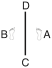

# GE-BAEK

> 🔊 **Prononciation :** [계백](../audio/tul/ge-baek.m4a)

> **Grade :** 1er Dan

* **Nombre de mouvements :**  44
* **Diagramme au sol :**  (Ligne verticale unique)

| Diagramme | Description |
| ------ | ------ |
|  | GE-BAEK est nommé d'après Ge-Baek, un grand général de la dynastie Baek Je (660 apr. J.-C.). Le diagramme représente sa discipline militaire sévère et rigoureuse. |

[GE-BAEK](https://vimeo.com/132834004)

## Origine et contexte historique

* **Contexte tragique et militaire :** En 660, le royaume de Baekje fut envahi par une coalition écrasante de 50 000 soldats de Silla alliés à 130 000 troupes de la dynastie chinoise des Tang. Conscient de l'issue fatale de la bataille, le général Ge-Baek préféra tuer sa propre famille pour lui éviter l'esclavage et le viol par les vainqueurs avant de charger héroïquement à la tête de ses 5 000 guerriers lors de la bataille de Hwangsanbeol, illustrant la rigueur d'un code moral militaire poussé jusqu'au sacrifice suprême.

## Liste Détaillée des Mouvements

### Posture de départ : position parallèle de préparation

1. Déplacer le pied droit vers C pour former une position en L droite vers D tout en exécutant un blocage d'arrêt vers D avec un tranchant des mains croisées.
   *([Niunja so kyocha sonkal momchau makgi](../makgi/momchau-makgi.md))*
2. Exécuter un coup de pied vrillé bas vers D avec le pied droit en gardant le position de la mains comme s'ils étaient en 1.
   *([Najunde bituro chagi](../chagi/bituro-chagi.md))*
3. Abaisser le pied droit vers D pour former une position de marche droite vers D tout en exécutant un coup de poing moyen vers D avec le poing droit.
   *([Gunnun so kaunde jirugi](../Techniques/Gunnun-So-Kaunde-Jirugi.md))*
4. Exécuter un coup de poing moyen vers D avec le poing gauche tout en maintenant une position de marche droite vers D.
   *([Gunnun so kaunde bandae jirugi](../Techniques/Gunnun-So-Kaunde-Bandae-Jirugi.md))*

   > *Exécuter 3 et 4 en mouvement rapide.*

5. Déplacer le pied droit vers C pour former une position de marche gauche vers D tout en exécutant un blocage montant avec l'avant-bras gauche.
   *([Gunnun so palmok chookyo makgi](../Techniques/Gunnun-So-Palmok-Chookyo-Makgi.md))*
6. Exécuter un blocage bas vers D avec l'avant-bras gauche tout en maintenant une position de marche gauche vers D.
   *([Gunnun so palmok najunde makgi](../Techniques/Gunnun-So-Palmok-Najunde-Makgi.md))*

   > *Exécuter 5 et 6 en mouvement continu.*

7. Exécuter un blocage haut vers AD avec un double arc main tout en regardant à travers il en maintenant une position de marche gauche vers D.
   *([Gunnun so nopunde doo bandalson makgi](../makgi/doo-bandalson-makgi.md))*
8. Tourner le visage vers D tout en formant un droit position de préparation pliée A vers D.
   *([Guburyo junbi sogi A](../Techniques/Guburyo-Junbi-Sogi-A.md))*
9. Abaisser le pied gauche vers AD pour former une position assise vers AC tout en exécutant un blocage en levant vers AC avec la paume gauche.
   *([Annun so wen sonbadak duro makgi](../Techniques/Annun-So-Wen-Sonbadak-Duro-Makgi.md))*
10. Exécuter un coup de poing moyen vers AC avec le poing droit tout en maintenant une position assise vers AC.
   *([Annun so orun joomuk kaunde jirugi](../Techniques/Annun-So-Orun-Joomuk-Kaunde-Jirugi.md))*

   > *Exécuter 9 et 10 en mouvement lié.*

11. Exécuter une frappe frontale vers AC avec le revers du poing gauche tout en maintenant une position assise vers AC.
   *([Annun so wen dung joomuk ap taerigi](../Techniques/Annun-So-Wen-Dung-Joomuk-Ap-Taerigi.md))*
12. Déplacer le pied droit sur ligne AB puis déplacer le pied gauche vers C pour former une position en L droite vers C tout en exécutant un blocage de garde moyen vers C avec un tranchant de la main.
   *([Niunja so sonkal kaunde daebi makgi](../Techniques/Niunja-So-Sonkal-Kaunde-Daebi-Makgi.md))*
13. Exécuter un coup de pied avant fouetté latéral bas vers C avec le pied gauche en gardant le position de la mains comme s'ils étaient en 12.
   *([Najunde yobap cha busigi](../Techniques/Najunde-Yobap-Cha-Busigi.md))*
14. Abaisser le pied gauche vers C pour former une position basse gauche vers C tout en exécutant une pique haute vers C avec le gauche à plat bout des doigts.
   *([Nachuo so opun sonkut nopunde tulgi](../Techniques/Nachuo-So-Opun-Sonkut-Nopunde-Tulgi.md))*
15. Exécuter une pique haute vers C avec le droit à plat bout des doigts tout en maintenant une position basse gauche vers C.
   *([Nachuo so opun sonkut nopunde bandae tulgi](../Techniques/Nachuo-So-Opun-Sonkut-Nopunde-Tulgi.md))*
16. Exécuter un coup de pied latéral perçant moyen vers C avec le pied droit tout en tirant les deux mains dans la direction opposée.
   *([Kaunde yopcha jirugi](../chagi/yop-cha-jirugi.md))*
17. Abaisser le pied droit vers C pour former une position en L droite vers D tout en exécutant un blocage de garde moyen vers D avec l'avant-bras.
   *([Niunja so palmok kaunde daebi makgi](../makgi/palmok-daebi-makgi.md))*
18. Déplacer le pied droit vers D en tournant dans le sens anti-horaire pour former une position en L droite vers C tout en exécutant un blocage de garde moyen vers C avec l'avant-bras.
   *([Niunja so palmok kaunde daebi makgi](../makgi/palmok-daebi-makgi.md))*
19. Déplacer le pied gauche vers D en tournant dans le sens anti-horaire pour former une position en L droite vers D tout en exécutant un blocage de garde moyen vers D avec un tranchant de la main.
   *([Niunja so sonkal kaunde daebi makgi](../Techniques/Niunja-So-Sonkal-Kaunde-Daebi-Makgi.md))*
20. Déplacer le pied gauche sur ligne CD pour former une position assise vers A tout en exécutant un blocage en forme de 9 droit.
   *([Annun so orun gutja makgi](../Techniques/Annun-So-Orun-Gutja-Makgi.md))*
21. Déplacer le pied droit vers D, en tournant dans le sens anti-horaire pour former une position de marche gauche vers C tout en exécutant un blocage bas vers C avec le tranchant de la main gauche.
   *([Gunnun so sonkal najunde makgi](../makgi/najunde-makgi.md))*
22. Exécuter un coup de pied circulaire moyen vers BC avec le pied droit puis abaisser il vers C.
   *([Kaunde dollyo chagi](../chagi/dollyo-chagi.md))*
23. Exécuter un coup de pied latéral perçant sauté vers C avec le pied droit.
   *([Twimyo yopcha jirugi](../chagi/twimyo-yopcha-jirugi.md))*

   > *Exécuter 22 et 23 en mouvement rapide.*

   > *Distance de saut : 1 position de marche depuis le pied arrière de la position précédente, et 1 largeur d'épaules depuis le pied avant.*

24. Atterrir vers C pour former une position de marche droite vers C tout en exécutant un coup de poing vertical haut vers C avec un poings jumelés.
   *([Gunnun so sang joomuk nopunde sewo jirugi](../Techniques/Gunnun-So-Sang-Joomuk-Nopunde-Sewo-Jirugi.md))*
25. Exécuter un blocage haut vers AC avec un double arc de main tout en regardant à travers il en maintenant une position de marche droite vers C.
   *([Gunnun so nopunde doo bandalson makgi](../makgi/doo-bandalson-makgi.md))*
26. Exécuter un coup de poing renversé vers C avec le poing gauche tout en maintenant une position de marche droite vers C.
   *([Gunnun so bandae dwijibo jirugi](../Techniques/Gunnun-So-Bandae-Dwijibo-Jirugi.md))*
27. Déplacer le pied droit sur ligne CD, pour former une position de marche gauche vers D tout en en frappant la paume gauche avec le droit avant coude.
   *([Gunnun so ap palkup bandae taerigi](../Techniques/Gunnun-So-Ap-Palkup-Bandae-Taerigi.md))*
28. Sauter vers D, pour former une position en X droite vers BD tout en exécutant un blocage haut vers D avec le droit double avant-bras.
   *([Twigi](../Techniques/Twigi.md), orun kyocha so doo palmok nopunde makgi)*

   > *Distance de saut : 1 position de marche.*

29. Déplacer le pied gauche vers BC pour former une position assise vers BD, en même temps en exécutant un blocage en levant vers BD avec la paume droite.
   *([Annun so orun sonbadak duro makgi](../Techniques/Annun-So-Orun-Sonbadak-Duro-Makgi.md))*
30. Exécuter un coup de poing moyen vers BD avec le poing gauche tout en maintenant une position assise vers BD.
   *([Annun so wen joomuk kaunde ap jirugi](../Techniques/Annun-So-Wen-Joomuk-Kaunde-Ap-Jirugi.md))*

   > *Exécuter 29 et 30 en mouvement lié.*

31. Exécuter une frappe frontale vers BD avec le revers du poing droit tout en maintenant une position assise vers BD.
   *([Annun so orun dung joomuk ap taerigi](../Techniques/Annun-So-Orun-Dung-Joomuk-Ap-Taerigi.md))*
32. Déplacer le pied gauche vers C, pour former une position de marche gauche vers C, en même temps en exécutant une frappe frontale haute vers C avec le revers de la main droite.
   *(Gunnun so sonkal dung nopunde bandae ap taerigi)*
33. Déplacer le pied gauche vers A environ moitié une épaule largeur tout en exécutant un coup de pied circulaire moyen vers C avec le pied droit.
   *([Kaunde dollyo chagi](../chagi/dollyo-chagi.md))*

   > *Distance de saut : 1/2 largeur d'épaules.*

34. Abaisser le pied droit vers C, puis tourner dans le sens anti-horaire pour former une position de marche gauche vers D, en pivotant avec le pied droit tout en exécutant un coup de poing vertical haut vers D avec un poings jumelés.
   *([Gunnun so sang joomuk nopunde sewo jirugi](../Techniques/Gunnun-So-Sang-Joomuk-Nopunde-Sewo-Jirugi.md))*
35. Exécuter un coup de poing moyen vers D avec le poing à phalange médiane droit, en amenant le gauche côté en premier en avant de la épaule droite tout en formant une position en L droite vers D en tirant le pied gauche.
   *(Niunja so joongji joomuk kaunde baro jirugi)*
36. Déplacer le pied droit vers D pour former une position assise vers B, en même temps en exécutant gauche blocage en forme de 9.
   *([Annun so wen gutja makgi](../Techniques/Annun-So-Wen-Gutja-Makgi.md))*
37. Exécuter un blocage de garde bas vers C avec un revers de la main tout en maintenant une position assise vers B.
   *([Annun so sonkal dung najunde C-bang daebi makgi](../Techniques/Annun-So-Sonkal-Dung-Najunde-C-Bang-Daebi-Makgi.md))*
38. Exécuter un blocage de garde bas vers D avec un tranchant de la main tout en maintenant une position assise vers B.
   *([Annun so sonkal najunde D-bang daebi makgi](../Techniques/Annun-So-Sonkal-Najunde-D-Bang-Daebi-Makgi.md))*

   > *Exécuter 37 et 38 en mouvement continu.*

39. Déplacer le pied gauche vers D en un mouvement étampé pour former une position assise vers A tout en exécutant un blocage en W avec l'avant-bras extérieur.
   *([Annun so wen bakat palmok san makgi](../Techniques/Annun-So-Wen-Bakat-Palmok-San-Makgi.md))*
40. Déplacer le pied gauche vers C en un mouvement étampé pour former une position assise vers B tout en exécutant un blocage en W avec l'avant-bras extérieur.
   *([Annun so wen bakat palmok san makgi](../Techniques/Annun-So-Wen-Bakat-Palmok-San-Makgi.md))*
41. Déplacer le pied droit vers C pour former une position de marche droite vers C tout en exécutant un blocage montant avec l'avant-bras droit.
   *([Gunnun so palmok chookyo makgi](../Techniques/Gunnun-So-Palmok-Chookyo-Makgi.md))*
42. Exécuter un coup de poing moyen vers C avec le poing gauche tout en maintenant une position de marche droite vers C.
   *([Gunnun so kaunde bandae jirugi](../Techniques/Gunnun-So-Kaunde-Bandae-Jirugi.md))*
43. Déplacer le pied droit sur ligne CD pour former une position de marche gauche vers D tout en exécutant un blocage montant avec l'avant-bras gauche.
   *([Gunnun so palmok chookyo makgi](../Techniques/Gunnun-So-Palmok-Chookyo-Makgi.md))*
44. Exécuter un coup de poing moyen vers D avec le poing droit tout en maintenant une position de marche gauche vers D.
   *([Gunnun so kaunde bandae jirugi](../Techniques/Gunnun-So-Kaunde-Bandae-Jirugi.md))*

### FIN : ramener le pied droit à la posture de départ.
