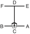

# HWA-RANG

> 🔊 **Prononciation :** [화랑](../audio/tul/hwa-rang.m4a)

> **Grade :** 2e Gup — Ceinture rouge

* **Nombre de mouvements :**  29
* **Diagramme au sol :**  (Hanja ou lettre capitale I)

| Diagramme | Description |
| ------ | ------ |
|  | HWA-RANG est nommé d'après le groupe de jeunes guerriers d'élite Hwa-Rang, originaire de la dynastie Silla au début du VIIe siècle. Les 29 mouvements font référence à la 29e division d'infanterie de l'armée coréenne, où le Taekwon-Do s'est développé jusqu'à sa pleine maturité. |

[HWA-RANG](https://vimeo.com/100918421)

## Origine et contexte historique

* **Contexte de chevalerie militaire :** Les Hwa-Rangs s'entraînaient à escalader les montagnes et nager dans les eaux glacées tout en respectant un code de conduite en 5 points dicté par le moine Won Kang (loyauté envers le roi, obéissance aux parents, honneur envers les amis, bravoure au combat, et justice dans l'usage de la force). Ce code spirituel et moral a transformé des techniques de combat primitives en un art martial noble et structuré.

## Liste Détaillée des Mouvements

### Posture de départ : position de préparation fermée C

1. Déplacer le pied gauche vers B pour former une position assise vers D tout en exécutant un blocage poussée moyen vers D avec la paume gauche.
   *([Annun so wen sonbadak kaunde yobap miro makgi](../Techniques/Annun-So-Wen-Sonbadak-Kaunde-Yobap-Miro-Makgi.md))*
2. Exécuter un coup de poing moyen vers D avec le poing droit tout en maintenant une position assise vers D.
   *([Annun so orun joomuk kaunde ap jirugi](../Techniques/Annun-So-Orun-Joomuk-Kaunde-Ap-Jirugi.md))*
3. Exécuter un coup de poing moyen vers D avec le poing gauche tout en maintenant une position assise vers D.
   *([Annun so wen joomuk kaunde ap jirugi](../Techniques/Annun-So-Wen-Joomuk-Kaunde-Ap-Jirugi.md))*
4. Exécuter un blocage double des avant-bras tout en formant une position en L gauche vers A, en pivotant avec le pied gauche.
   *([Niunja so sang palmok makgi](../Techniques/Niunja-So-Sang-Palmok-Makgi.md))*
5. Exécuter un coup de poing montant avec le poing gauche tout en tirant le côté du poing droit devant l'épaule gauche, en maintenant une position en L gauche vers A.
   *(Niunja so baro ollyo jirugi)*
6. Exécuter un coup de poing moyen vers A avec le poing droit tout en formant une position fixe droite vers A en un en glissant mouvement.
   *([Gojung so kaunde yop jirugi](../Techniques/Gojung-So-Kaunde-Yop-Jirugi.md))*
7. Exécuter une frappe descendante avec le tranchant de la main droite tout en formant une position verticale gauche vers A, en tirant le pied droit.
   *([Soojik so sonkal bandae naeryo taerigi](../jirugi/naeryo-taerigi.md))*
8. Déplacer le pied gauche vers A pour former une position de marche gauche vers A tout en exécutant un coup de poing moyen vers A avec le poing gauche.
   *([Gunnun so kaunde jirugi](../Techniques/Gunnun-So-Kaunde-Jirugi.md))*
9. Déplacer le pied gauche vers D pour former une position de marche gauche vers D tout en exécutant un blocage bas vers D avec l'avant-bras gauche.
   *([Gunnun so palmok najunde makgi](../Techniques/Gunnun-So-Palmok-Najunde-Makgi.md))*
10. Déplacer le pied droit vers D pour former une position de marche droite vers D tout en exécutant un coup de poing moyen vers D avec le poing droit.
   *([Gunnun so kaunde jirugi](../Techniques/Gunnun-So-Kaunde-Jirugi.md))*
11. Tirer le pied gauche vers le pied droit tout en amenant la paume gauche vers le devant du poing droit, tout en pliant le coude droit environ 45 degrés vers l'extérieur.
12. Exécuter un coup de pied latéral perçant moyen vers D avec le pied droit tout en tirant les deux mains dans la direction opposée puis l'abaisser vers D pour former une position en L gauche vers D, tout en exécutant une frappe extérieure moyenne vers D avec le tranchant de la main droite.
   *([Kaunde yopcha jirugi](../chagi/yop-cha-jirugi.md), [niunja so sonkal kaunde bakuro taerigi](../Techniques/Niunja-So-Sonkal-Kaunde-Bakuro-Taerigi.md))*
13. Déplacer le pied gauche vers D pour former une position de marche gauche vers D tout en exécutant un coup de poing moyen vers D avec le poing gauche.
   *([Gunnun so kaunde jirugi](../Techniques/Gunnun-So-Kaunde-Jirugi.md))*
14. Déplacer le pied droit vers D pour former une position de marche droite vers D tout en exécutant un coup de poing moyen vers D avec le poing droit.
   *([Gunnun so kaunde jirugi](../Techniques/Gunnun-So-Kaunde-Jirugi.md))*
15. Déplacer le pied gauche vers E en tournant dans le sens anti-horaire pour former une position en L droite vers E tout en exécutant un blocage de garde moyen vers E avec le tranchant de la main.
   *([Niunja so sonkal kaunde daebi makgi](../Techniques/Niunja-So-Sonkal-Kaunde-Daebi-Makgi.md))*
16. Déplacer le pied droit vers E pour former une position de marche droite vers E tout en exécutant une pique moyenne vers E avec le bout des doigts droit.
   *([Gunnun so sun sonkut kaunde tulgi](../Techniques/Sun-Sonkut-Kaunde-Tulgi.md))*
17. Déplacer le pied droit sur ligne EF pour former une position en L droite vers F tout en exécutant un blocage de garde moyen vers F avec le tranchant de la main.
   *([Niunja so sonkal kaunde daebi makgi](../Techniques/Niunja-So-Sonkal-Kaunde-Daebi-Makgi.md))*
18. Exécuter un coup de pied circulaire haut vers DF avec le pied droit puis l'abaisser vers F.
   *([Nopunde dollyo chagi](../chagi/dollyo-chagi.md))*
19. Exécuter un coup de pied circulaire haut vers CF avec le pied gauche puis l'abaisser vers F pour former une position en L droite vers F tout en exécutant un blocage de garde moyen vers F avec le tranchant de la main.
   *([Nopunde dollyo chagi](../chagi/dollyo-chagi.md), [niunja so sonkal kaunde daebi makgi](../Techniques/Niunja-So-Sonkal-Kaunde-Daebi-Makgi.md))*
   > *Exécuter 18 et 19 en mouvement rapide.*
20. Déplacer le pied gauche vers C pour former une position de marche gauche vers C tout en exécutant un blocage bas vers C avec l'avant-bras gauche.
   *([Gunnun so palmok najunde makgi](../Techniques/Gunnun-So-Palmok-Najunde-Makgi.md))*
21. Exécuter un coup de poing moyen vers C avec le poing droit tout en formant une position en L droite vers C, en tirant le pied gauche.
   *([Niunja so kaunde baro jirugi](../Techniques/Niunja-So-Kaunde-Baro-Jirugi.md))*
22. Déplacer le pied droit vers C pour former une position en L gauche vers C tout en exécutant un coup de poing moyen vers C avec le poing gauche.
   *([Niunja so kaunde baro jirugi](../Techniques/Niunja-So-Kaunde-Baro-Jirugi.md))*
23. Déplacer le pied gauche vers C pour former une position en L droite vers C tout en exécutant un coup de poing moyen vers C avec le poing droit.
   *([Niunja so kaunde baro jirugi](../Techniques/Niunja-So-Kaunde-Baro-Jirugi.md))*
24. Exécuter un blocage en pression avec les poings croisés tout en formant une position de marche gauche vers C, en glissant le pied gauche vers C.
   *([Gunnun so kyocha joomuk noollo makgi](../Techniques/Gunnun-So-Kyocha-Joomuk-Noollo-Makgi.md))*
25. Déplacer le pied droit vers C en un en glissant mouvement pour former une position en L droite vers D tout en piquant vers C avec le coude droit.
   *([Niunja so yop palkup tulgi](../Techniques/Niunja-So-Yop-Palkup-Tulgi.md))*
26. Ramener le pied gauche vers le pied droit, en tournant dans le sens anti-horaire pour former une position fermée vers B tout en exécutant un blocage latéral-avant avec l'avant-bras intérieur droit tout en étendant l'avant-bras gauche vers le côté vers le bas.
   *(Moa so orun an palmok yobap makgi)*
27. Exécuter un blocage latéral-avant avec l'avant-bras intérieur gauche, en étendant l'avant-bras droit vers le côté vers le bas tout en maintenant une position fermée vers B.
   *(Moa so wen an palmok yobap makgi)*
28. Déplacer le pied gauche vers B pour former une position en L droite vers B tout en exécutant un blocage de garde moyen vers B avec le tranchant de la main.
   *([Niunja so sonkal kaunde daebi makgi](../Techniques/Niunja-So-Sonkal-Kaunde-Daebi-Makgi.md))*
29. Ramener le pied gauche vers le pied droit puis déplacer le pied droit vers A pour former une position en L gauche vers A tout en exécutant un blocage de garde moyen vers A avec le tranchant de la main.
   *([Niunja so sonkal kaunde daebi makgi](../Techniques/Niunja-So-Sonkal-Kaunde-Daebi-Makgi.md))*

### FIN : ramener le pied droit à la posture de départ
