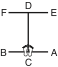

# JOONG-GUN

> **Grade :** 4e Gup — Ceinture bleue

* **Nombre de mouvements :**  32
* **Diagramme au sol :**  (Hanja ou lettre capitale I)

| Diagramme | Description |
| ------ | ------ |
|  | JOONG-GUN est nommé d'après le patriote Ahn Joong-Gun qui assassina Hiro-Bumi Ito, le premier gouverneur général japonais de la Corée, connu pour avoir été le principal artisan de la fusion Corée-Japon. Les 32 mouvements de ce Tul représentent l'âge de M. Ahn lorsqu'il fut exécuté à la prison de Lui-Shung en 1910. |

[JOONG-GUN](https://vimeo.com/95926168)

## Liste Détaillée des Mouvements

### Posture de départ : position de préparation fermée B

1. Déplacer le pied gauche vers B pour former une position en L droite vers B tout en exécutant un blocage moyen vers B avec le revers de la main gauche.
   *(Niunja so sonkal dung kaunde makgi)*
2. Exécuter un coup de pied avant fouetté latéral bas vers B avec le pied gauche, en gardant le position de la mains comme s'ils étaient en 1.
   *(Najunde yobap cha busigi)*
3. Abaisser le pied gauche vers B puis déplacer le pied droit vers B pour former une position sur la jambe arrière gauche vers B tout en exécutant un blocage montant avec une paume droite.
   *(Dwitbal so sonbadak bandae ollyo makgi)*
4. Déplacer le pied droit vers A pour former une position en L gauche vers A, en même temps en exécutant un blocage moyen vers A avec un revers de la main droite.
   *(Niunja so sonkal dung kaunde makgi)*
5. Exécuter un coup de pied avant fouetté latéral bas vers A avec le pied droit, en gardant le position de la mains comme s'ils étaient en 4.
   *(Najunde yobap cha busigi)*
6. Abaisser le pied droit vers A puis déplacer le pied gauche vers A pour former une position sur la jambe arrière droite vers A tout en exécutant un blocage montant avec une paume gauche.
   *(Dwitbal so sonbadak bandae ollyo makgi)*
7. Déplacer le pied gauche vers D pour former une position en L droite vers D tout en exécutant un blocage de garde moyen vers D avec un tranchant de la main.
   *(Niunja so sonkal kaunde daebi makgi)*
8. Exécuter une frappe montante du coude droit tout en formant une position de marche gauche vers D, en glissant le pied gauche vers D.
   *(Gunnun so wi palkup bandae taerigi)*
9. Déplacer le pied droit vers D pour former une position en L gauche vers D tout en exécutant un blocage de garde moyen vers D avec un tranchant de la main.
   *(Niunja so sonkal kaunde daebi makgi)*
10. Exécuter une frappe montante du coude gauche tout en formant une position de marche droite vers D, en glissant le pied droit vers D.
   *(Gunnun so wi palkup bandae taerigi)*
11. Déplacer le pied gauche vers D pour former une position de marche gauche vers D tout en exécutant un coup de poing vertical haut vers D avec un poings jumelés.
   *(Gunnun so sang joomuk nopunde sewo jirugi)*
12. Déplacer le pied droit vers D pour former une position de marche droite vers D tout en exécutant un coup de poing renversé vers D avec un poings jumelés.
   *(Gunnun so sang joomuk dwijibo jirugi)*
13. Déplacer le pied droit sur ligne CD puis tourner dans le sens anti-horaire pour former une position de marche gauche vers C tout en exécutant un blocage montant avec un poings croisés.
   *(Gunnun so kyocha joomuk chookyo makgi)*
14. Déplacer le pied gauche vers E pour former une position en L droite vers E tout en exécutant une frappe latérale haute vers E avec le revers du poing gauche.
   *(Niunja so dung joomuk nopunde yop taerigi)*
15. Vriller le poing gauche dans le sens anti-horaire jusqu'à ce que le revers du poing fait visage vers le bas, en même temps pour former une position de marche gauche vers E, en glissant le pied gauche vers E.
   *(Gunnun so jappyosul tae)*
16. Exécuter un coup de poing haut vers E avec le poing droit tout en maintenant une position de marche gauche vers E.
   *(gunnun so nopunde bandae jirugi)*

   > *Exécuter 15 et 16 en mouvement rapide.*

17. Ramener le pied gauche vers le pied droit puis déplacer le pied droit vers F, pour former une position en L gauche vers F tout en exécutant une frappe latérale haute vers F avec un revers du poing droit.
   *(Niunja so dung joomuk nopunde yop taerigi)*
18. Vriller le poing droit dans le sens horaire jusqu'à ce que le revers du poing fait visage vers le bas, en même temps pour former une position de marche droite vers F, en glissant le pied droit vers F.
   *(Gunnun so jappyosul tae)*
19. Exécuter un coup de poing haut vers F avec le poing gauche tout en maintenant une position de marche droite vers F.
   *(Gunnun so nopunde bandae jirugi)*

   > *Exécuter 18 et 19 en mouvement rapide.*

20. Ramener le pied droit vers le pied gauche puis déplacer le pied gauche vers C pour former une position de marche gauche vers C tout en exécutant un blocage haut vers C avec un gauche double avant-bras.
   *(Gunnun so doo palmok nopunde makgi)*
21. Exécuter un coup de poing moyen vers C avec le poing gauche tout en formant une position en L droite vers C, en tirant le pied gauche.
   *(Niunja so kaunde yop jirugi)*
22. Exécuter un coup de pied latéral perçant moyen vers C avec le pied droit.
   *(Kaunde yopcha jirugi)*
23. Abaisser le pied droit vers C pour former une position de marche droite vers C tout en exécutant un blocage haut vers C avec le droit double avant-bras.
   *(Gunnun so doo palmok nopunde makgi)*
24. Exécuter un coup de poing moyen vers C avec le poing droit tout en formant une position en L gauche vers C, en tirant le pied droit.
   *(Niunja so kaunde yop jirugi)*
25. Exécuter un coup de pied latéral perçant moyen vers C avec le pied gauche.
   *(Kaunde yopcha jirugi)*
26. Abaisser le pied gauche vers C pour former une position en L droite vers C tout en exécutant un blocage de garde moyen vers C avec l'avant-bras.
   *(Niunja so palmok kaunde daebi makgi)*
27. Exécuter un blocage en pression avec la paume droite tout en formant une position basse gauche vers C, en glissant le pied gauche vers C.
   *(Nachuo so sonbadak bandae noollo makgi)*

   > *Exécuter en mouvement lent.*

28. Déplacer le pied droit vers C pour former une position en L gauche vers C tout en exécutant un blocage de garde moyen vers C avec l'avant-bras.
   *(Niunja so palmok kaunde daebi makgi)*
29. Exécuter un blocage en pression avec la paume gauche tout en formant une position basse droite vers C, en glissant le pied droit vers C.
   *(Nachuo so sonbadak bandae noollo makgi)*

   > *Exécuter en mouvement lent.*

30. Ramener le pied gauche vers le pied droit pour former une position fermée vers A tout en exécutant un coup de poing en angle avec le poing droit.
   *(Moa so orun giokja jirugi)*

   > *Exécuter en mouvement lent.*

31. Déplacer le pied droit vers A pour former une position fixe droite vers A tout en exécutant un blocage en U vers A.
   *(Gojung so digutja makgi)*
32. Ramener le pied droit vers le pied gauche puis déplacer le pied gauche vers B pour former une position fixe gauche vers B, en même temps en exécutant un blocage en U vers B.
   *(Gojung so digutja makgi)*

### FIN : ramener le pied gauche à la posture de départ.

---

[← Index des formes](README.md) · [Histoire du Tul](../Theorie/encyclopedie-historique-tuls.md)
