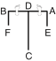

# JUCHE

> 🔊 **Prononciation :** [주체](../audio/tul/juche.m4a)

> **Grade :** 2e Dan

* **Nombre de mouvements :**  45
* **Diagramme au sol :**  (Mont Baekdu / la montagne)

| Diagramme | Description |
| ------ | ------ |
|  | JUCHE est l'idée philosophique selon laquelle l'homme est le maître de tout et décide de tout; autrement dit, que l'homme est le maître de son destin. Cette idée tire ses racines historiques du Mont Baekdu, symbole de la force du peuple coréen. Le diagramme représente ce mont sacré. |

[JUCHE](https://youtu.be/ipD-SQHzNmY?si=UahIY9-TPVKZVkrd)

## Origine et contexte historique

* **Contexte socio-philosophique :** Conçu à l'origine sous le nom de *Ko-Dang* (en l'honneur de Cho Man-Shik), ce Tul fut renommé *Juche* par le Général Choi pour exprimer l'esprit d'indépendance nationale totale et de souveraineté de la Corée face à l'influence culturelle et politique des grandes puissances mondiales (États-Unis, URSS, Chine).

## Liste Détaillée des Mouvements

### Posture de départ : position parallèle avec les deux coudes latéraux

1. Déplacer le pied gauche vers B pour former une position assise vers D tout en exécutant un blocage parallèle avec l'avant-bras intérieur.
   *([Annun so an palmok narani makgi](../Techniques/Annun-So-An-Palmok-Narani-Makgi.md))*
2. Exécuter un blocage crocheté moyen vers D avec la paume droite tout en se redressant vers D.
   *([Sonbadak kaunde golcho makgi](../Techniques/Sonbadak-Kaunde-Golcho-Makgi.md))*
3. Exécuter un coup de poing moyen vers D avec le poing gauche tout en formant une position assise vers D.
   *([Annun so wen joomuk kaunde jirugi](../Techniques/Annun-So-Wen-Joomuk-Kaunde-Jirugi.md))*
4. Tirer le tranchant interne du pied droit vers l'articulation du genou gauche pour former une position sur une jambe gauche vers D tout en exécutant un blocage parallèle avec l'avant-bras extérieur.
   *([Waebal so bakat palmok narani makgi](../makgi/narani-makgi.md))*
5. Exécuter un coup de pied latéral perçant moyen vers A puis un coup de pied crocheté inversé haut vers B consécutivement avec le pied droit en gardant les mains dans la position du mouvement 4.
   *([Kaunde yopcha jirugi](../chagi/yop-cha-jirugi.md), [orun nopunde bandae dollyo gorochagi](../chagi/bandae-dollyo-goro-chagi.md))*

   > *Exécuter en mouvement lent.*

6. Abaisser le pied droit vers B en mouvement sauté pour former une position en X droite vers F tout en exécutant une frappe descendante vers B avec le revers du poing droit.
   *(Twigi, [orun kyocha so dung joomuk baro naeryo taerigi](../jirugi/naeryo-taerigi.md))*

   > *Distance de saut : 1 position de marche.*

7. Exécuter un coup de pied crocheté moyen puis un coup de pied latéral perçant haut vers F consécutivement avec le pied gauche tout en tirant les deux poings devant la poitrine.
   *(Kaunde golcho chagi, [wen nopunde yopcha jirugi](../chagi/yop-cha-jirugi.md))*
8. Abaisser le pied gauche vers F en un mouvement étampé pour former une position assise vers B tout en exécutant une coupe croisée extérieure haute vers F avec le bout des doigts gauche à plat.
   *([Annun so wen opun sonkut nopunde bakuro ghutgi](../Techniques/Annun-So-Wen-Opun-Sonkut-Nopunde-Bakuro-Ghutgi.md))*
9. Exécuter une frappe haute du coude droit vers BF pressant le côté du poing droit avec la paume gauche tout en formant une position de marche gauche vers BF.
   *(Gunnun so nopun palkup bandae taerigi)*
10. Croiser le pied gauche par-dessus le pied droit pour former une position en X droite vers B tout en exécutant un blocage frontal bas vers B avec le revers de la main gauche, en amenant la pulpe des doigts de la main droite sur l'arrière de l'avant-bras gauche.
   *([Kyocha so sonkal dung najunde bandae ap makgi](../makgi/ap-makgi.md))*
11. Déplacer le pied droit vers A pour former une position en L gauche vers A tout en exécutant un blocage de garde moyen vers A avec le tranchant de la main.
   *([Niunja so sonkal kaunde daebi makgi](../Techniques/Niunja-So-Sonkal-Kaunde-Daebi-Makgi.md))*
12. Exécuter une frappe en vol vers A avec le tranchant de la main gauche tout en pivotant dans le sens anti-horaire puis atterrir vers A pour former une position en L droite vers A avec le bras gauche étendu.
   *([Sonkal twio dolymyo taerigi](../Techniques/Sonkal-Twio-Dolymyo-Taerigi.md))*

   > *Distance de saut : 1 position en L.*

13. Déplacer le pied droit vers A pour former une position assise vers D tout en exécutant un blocage parallèle avec l'avant-bras intérieur.
   *([Annun so an palmok narani makgi](../Techniques/Annun-So-An-Palmok-Narani-Makgi.md))*
14. Exécuter un blocage crocheté moyen vers D avec la paume gauche tout en se redressant vers D.
   *([Sonbadak kaunde golcho makgi](../Techniques/Sonbadak-Kaunde-Golcho-Makgi.md))*
15. Exécuter un coup de poing moyen vers D avec le poing droit tout en formant une position assise vers D.
   *([Annun so orun joomuk kaunde jirugi](../Techniques/Annun-So-Orun-Joomuk-Kaunde-Jirugi.md))*
16. Tirer le tranchant interne du pied gauche vers l'articulation du genou droit pour former une position sur une jambe droite vers D tout en exécutant un blocage parallèle avec l'avant-bras extérieur.
   *([Waebal so bakat palmok narani makgi](../makgi/narani-makgi.md))*
17. Exécuter un coup de pied latéral perçant moyen vers B puis un coup de pied crocheté inversé haut vers A consécutivement avec le pied gauche en gardant les mains dans la position du mouvement 16.
   *([Kaunde yopcha jirugi](../chagi/yop-cha-jirugi.md), [wen nopunde bandae dollyo gorochagi](../chagi/bandae-dollyo-goro-chagi.md))*

   > *Exécuter en mouvement lent.*

18. Abaisser le pied gauche vers A en mouvement sauté pour former une position en X gauche vers E tout en exécutant une frappe descendante vers A avec le revers du poing gauche.
   *(Twigi, [wen kyocha so dung joomuk baro naeryo taerigi](../jirugi/naeryo-taerigi.md))*

   > *Distance de saut : 1 position de marche.*

19. Exécuter un coup de pied crocheté moyen puis un coup de pied latéral perçant haut vers E consécutivement avec le pied droit tout en tirant les deux poings devant la poitrine.
   *(Kaunde golcho chagi, [orun nopunde yopcha jirugi](../chagi/yop-cha-jirugi.md))*
20. Abaisser le pied droit vers E en un mouvement étampé pour former une position assise vers A tout en exécutant une coupe croisée extérieure haute vers E avec le bout des doigts droit à plat.
   *([Annun so orun opun sonkut nopunde bakuro ghutgi](../Techniques/Annun-So-Orun-Opun-Sonkut-Nopunde-Bakuro-Ghutgi.md))*
21. Exécuter une frappe haute du coude gauche vers AE pressant le côté du poing gauche avec la paume droite tout en formant une position de marche droite vers AE.
   *(Gunnun so nopun palkup bandae taerigi)*
22. Croiser le pied droit par-dessus le pied gauche pour former une position en X gauche vers A tout en exécutant un blocage frontal bas vers A avec le revers de la main droite, en amenant la pulpe des doigts de la main gauche sur l'arrière de l'avant-bras droit.
   *([Kyocha so sonkal dung najunde bandae ap makgi](../makgi/ap-makgi.md))*
23. Déplacer le pied gauche vers B pour former une position en L droite vers B tout en exécutant un blocage de garde moyen vers B avec le tranchant de la main.
   *([niunja so sonkal kaunde daebi makgi](../Techniques/Niunja-So-Sonkal-Kaunde-Daebi-Makgi.md))*
24. Exécuter une frappe en vol vers B avec le tranchant de la main droite tout en pivotant dans le sens horaire puis atterrir vers B pour former une position en L gauche vers B avec le bras droit étendu.
   *([Sonkal twio dolmyo taerigi](../Techniques/Sonkal-Twio-Dolmyo-Taerigi.md))*

   > *Distance de saut : 1 position en L.*

25. Exécuter un coup de pied en pioche vers B avec le pied gauche puis l'abaisser vers B pour former une position arrière rapprochée sur la jambe droite vers B tout en exécutant un blocage de garde moyen avec l'avant-bras.
   *(Gokaeng-i chagi, [orun dwitbal so palmok kaunde daebi makgi](../Techniques/Dwitbal-So-Palmok-Kaunde-Daebi-Makgi.md))*
26. Ramener le pied droit vers le pied gauche pour former une position fermée avec un ciel main vers D.
   *(Moa so hanulson)*

   > *Exécuter en mouvement lent.*

27. Glisser vers C pour former une position arrière rapprochée sur la jambe gauche vers D tout en exécutant une pique descendante avec le coude droit.
   *([Dwitbal so sun palkup bandae naeryo tulgi](../Techniques/Dwitbal-So-Sun-Palkup-Bandae-Naeryo-Tulgi.md))*
28. Exécuter une frappe semi-circulaire haute avec la main arquée gauche tout en formant une position de marche droite vers D, en glissant le pied droit.
   *(Gunnun so bandal son nopunde bandae bandal taerigi)*
29. Glisser vers C pour former une position arrière rapprochée sur la jambe droite vers D tout en exécutant une pique descendante avec le coude gauche.
   *([Dwitbal so sun palkup bandae naeryo tulgi](../Techniques/Dwitbal-So-Sun-Palkup-Bandae-Naeryo-Tulgi.md))*
30. Exécuter une frappe semi-circulaire haute avec la main arquée droite tout en formant une position de marche gauche vers D, en glissant le pied gauche.
   *(Gunnun so bandal son nopunde bandae bandal taerigi)*
31. Déplacer le pied gauche vers C pour former une position de marche droite vers D tout en exécutant une frappe intérieure haute vers D avec un double tranchant de la main.
   *(Gunnun so sang sonkal nopunde anuro taerigi)*
32. Déplacer le pied droit vers C pour former une position de marche gauche vers D tout en exécutant un coup de poing descendant avec le poing droit.
   *([Gunnun so bandae naeryo jirugi](../jirugi/naeryo-jirugi.md))*
33. Déplacer le pied gauche derrière le pied droit puis glisser vers C pour former une position en L droite vers D tout en exécutant un blocage descendant avec l'avant-bras extérieur gauche.
   *([Niunja so bakat palmok bandae naeryo makgi](../makgi/naeryo-makgi.md))*
34. Exécuter un coup de pied circulaire inversé en esquive vers D avec le pied droit tout en sautant en s'éloignant de D puis atterrir vers C pour former une position en L gauche vers D tout en exécutant un blocage de garde moyen vers D avec l'avant-bras.
   *([Pihamyo bandae dollyo chagi](../chagi/bandae-dollyo-chagi.md), wen niunja so palmok kaunde daebi makgi)*

   > *Distance de saut : 1 position en L.*

35. Déplacer le pied droit derrière le pied gauche puis glisser vers C pour former une position en L gauche vers D tout en exécutant un blocage descendant avec l'avant-bras extérieur droit.
   *([Niunja so bakat palmok bandae naeryo makgi](../makgi/naeryo-makgi.md))*
36. Exécuter un coup de pied circulaire inversé en esquive vers D avec le pied gauche tout en sautant en s'éloignant de D puis atterrir vers C pour former une position en L droite vers D tout en exécutant un blocage de garde moyen vers D avec l'avant-bras.
   *([Pihamyo bandae dollyo chagi](../chagi/bandae-dollyo-chagi.md), orun niunja so palmok kaunde daebi makgi)*

   > *Distance de saut : 1 position en L.*

37. Déplacer le pied droit vers D puis le pied gauche vers D puis exécuter un coup de pied sauté simultané (vrillé coup de pied avec le pied gauche, côté perçant avec le pied droit) tout en sautant vers D.
   *(Twimyo sangbang chagi,[yop bituro chagi](../chagi/bituro-chagi.md))*

   > *Distance de saut : 1 position de marche.*

38. Atterrir vers D pour former une position diagonale gauche vers D tout en exécutant un blocage montant avec une paumes jumelées.
   *([Sasun so sang sonbadak chookyo makgi](../makgi/chookyo-makgi.md))*
39. Glisser vers D pour former une position arrière rapprochée sur la jambe droite vers C tout en exécutant une pique latérale vers D avec le coude droit.
   *([Dwitbal so yop palkup tulgi](../Techniques/Dwitbal-So-Yop-Palkup-Tulgi.md))*
40. Tourner le visage vers D tout en formant un droit position de préparation pliée B vers C puis exécuter un coup de pied arrière perçant moyen vers D avec le pied gauche.
   *(Guburyo junbi sogi B, [wen kaunde dwitcha jirugi](../chagi/dwit-cha-jirugi.md))*

   > *Exécuter en mouvement lent.*

41. Abaisser le pied gauche vers D en un mouvement étampé pour former une position en L droite vers D tout en exécutant une frappe horizontale vers D avec le revers du poing gauche.
   *(Niunja so dung joomuk bandae soopyong taerigi)*
42. Exécuter une coupe croisée intérieure haute vers D avec le bout des doigts droit à plat tout en formant une position parallèle vers D, en tirant le pied droit.
   *(Narani so orun opun sonkut nopunde anuro ghutgi)*
43. Exécuter un coup de poing frontal et un coup de poing renversé vers D consécutivement avec le poing droit tout en sautant vers D puis atterrir vers D pour former une position fermée vers D avec le poing droit étendu.
   *([Twimyo orun joomuk ap jirugi](../Techniques/Twimyo-Orun-Joomuk-Ap-Jirugi.md), orun joomuk dwijibo jirigi)*

   > *Distance de saut : 1 position en L.*

44. Déplacer le pied droit vers D pour former une position de marche droite vers D tout en exécutant une frappe descendante frontale avec le tranchant de la main gauche.
   *([Gunnun so sonkal bandae ap naeryo taerigi](../jirugi/naeryo-taerigi.md))*
45. Déplacer le pied gauche vers D pour former une position de marche gauche vers D tout en exécutant un coup de poing moyen vers D avec le poing droit.
   *([Gunnun so kaunde bandae jirugi](../Techniques/Gunnun-So-Kaunde-Bandae-Jirugi.md))*

### FIN : ramener le pied droit à la posture de départ.
