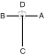

# KO-DANG

> 🔊 **Prononciation :** [고당](../audio/tul/ko-dang.m4a)

> **Grade :** 2e Dan — forme alternative à Juche

* **Nombre de mouvements :**  39
* **Diagramme au sol :**  (Hanja ou lettre capitale I)

| Diagramme | Description |
| ------ | ------ |
|  | KO-DANG est le pseudonyme du patriote Cho Man Shik, qui a dédié sa vie au mouvement d'indépendance de la Corée et à l'éducation de son peuple. Les 39 mouvements correspondent au nombre de ses emprisonnements et à la latitude (39e) de son lieu de naissance. |

## Liste Détaillée des Mouvements

### Posture de départ : Position de préparation fermée C (Closed Ready Stance C / Moa Chunbi Sogi C).

1. Déplacer le pied droit vers AC pour former une position assise vers AD tout en exécutant un blocage pressant moyen vers AD avec la paume gauche ([Annun So Sonbadak Kaunde Miro Makgi](../Techniques/Annun-So-Sonbadak-Kaunde-Miro-Makgi.md)).
2. Exécuter un coup de poing moyen vers AD avec le poing droit tout en maintenant la position assise ([Annun So Kaunde Bandae Jirugi](../Techniques/Annun-So-Kaunde-Bandae-Jirugi.md)).
3. Déplacer le pied droit sur la ligne CD pour former une position en L droite vers D tout en exécutant un blocage de garde moyen vers D avec l'avant-bras ([Niunja So Palmok Kaunde Daebi Makgi](../makgi/palmok-daebi-makgi.md)).
4. Exécuter un blocage bas vers AD avec l'avant-bras extérieur droit et un blocage de côté moyen vers D avec l'avant-bras intérieur gauche tout en maintenant la position en L droite vers D ([Niunja So Bakat Palmok Najunde Makgi](../makgi/bakat-palmok-makgi.md), [An Palmok Kaunde Yop Makgi](../Techniques/An-Palmok-Kaunde-Yop-Makgi.md)).
5. Déplacer le pied gauche vers BC pour former une position assise vers BD tout en exécutant un blocage pressant moyen vers BD with la paume droite ([Annun So Sonbadak Kaunde Miro Makgi](../Techniques/Annun-So-Sonbadak-Kaunde-Miro-Makgi.md)).
6. Exécuter un coup de poing moyen vers BD avec le poing gauche tout en maintenant la position assise ([Annun So Kaunde Bandae Jirugi](../Techniques/Annun-So-Kaunde-Bandae-Jirugi.md)).
7. Déplacer le pied gauche sur la ligne CD pour former une position en L gauche vers D tout en exécutant un blocage de garde moyen vers D avec l'avant-bras ([Niunja So Palmok Kaunde Daebi Makgi](../makgi/palmok-daebi-makgi.md)).
8. Exécuter un blocage bas vers BD avec l'avant-bras extérieur gauche et un blocage de côté moyen vers D with l'avant-bras intérieur droit tout en maintenant la position en L gauche vers D ([Niunja So Bakat Palmok Najunde Makgi](../makgi/bakat-palmok-makgi.md), [An Palmok Kaunde Yop Makgi](../Techniques/An-Palmok-Kaunde-Yop-Makgi.md)).
9. Tourner le visage vers C tout en formant une position de préparation avec flexion gauche B vers D ([Guburyo Junbi So B](../Techniques/Guburyo-Junbi-So-B.md)).
10. Exécuter un coup de pied arrière percutant moyen vers C avec le pied droit ([Kaunde Dwitcha Jirugi](../chagi/dwit-cha-jirugi.md)).
11. Poser le pied droit au sol vers C pour former une position en L droite vers D tout en exécutant un blocage moyen vers D avec le tranchant de la main gauche ([Niunja So Sonkal Kaunde Makgi](../makgi/kaunde-makgi.md)).
12. Tourner le visage vers C tout en formant une position de préparation avec flexion droite B vers D ([Guburyo Junbi So B](../Techniques/Guburyo-Junbi-So-B.md)).
13. Exécuter un coup de pied arrière percutant moyen vers C avec le pied gauche ([Kaunde Dwitcha Jirugi](../chagi/dwit-cha-jirugi.md)).
14. Poser le pied gauche au sol vers C pour former une position en L gauche vers D tout en exécutant un blocage moyen vers D avec le tranchant de la main droite ([Niunja So Sonkal Kaunde Makgi](../makgi/kaunde-makgi.md)).
15. Déplacer le pied droit vers C pour former une position en L droite vers D tout en exécutant une poussée vers le bas vers D avec le coude gauche rectiligne (Niunja So Sun Palkup Naeryo Tulgi).
16. Déplacer le pied gauche vers C pour former une position en L gauche vers D tout en exécutant une poussée vers le bas vers D avec le coude droit rectiligne (Niunja So Sun Palkup Naeryo Tulgi).
17. Déplacer le pied gauche vers D pour former une position de marche gauche vers D tout en exécutant un blocage pressant vers D avec la paume droite (Gunnun So Sonbadak Noollo Makgi).
18. Déplacer le pied droit vers D pour former une position de marche droite vers D tout en exécutant un blocage pressant vers D avec la paume gauche (Gunnun So Sonbadak Noollo Makgi).
19. Déplacer le pied droit vers C pour former une position en L droite vers D tout en exécutant un blocage vers le bas vers D with l'avant-bras extérieur gauche ([Niunja So Bakat Palmok Naeryo Makgi](../makgi/naeryo-makgi.md)).
20. Déplacer le pied droit vers D pour former une position en L gauche vers D tout en exécutant un blocage vers le bas vers D avec l'avant-bras extérieur droit ([Niunja So Bakat Palmok Naeryo Makgi](../makgi/naeryo-makgi.md)).
21. Déplacer le pied gauche vers D pour former une position de pied arrière droite vers D tout en exécutant un blocage ascendant vers D avec la paume gauche ([Dwitbal So Sonbadak Ollyo Makgi](../Techniques/Dwitbal-So-Sonbadak-Ollyo-Makgi.md)).
22. Déplacer le pied droit vers D pour former une position de pied arrière gauche vers D tout en exécutant un blocage ascendant vers D avec la paume droite ([Dwitbal So Sonbadak Ollyo Makgi](../Techniques/Dwitbal-So-Sonbadak-Ollyo-Makgi.md)).
23. Déplacer le pied droit vers C pour former une position de pied arrière droite vers D, puis exécuter un coup de pied de côté frontal moyen vers D avec le pied gauche, en conservant la position des mains ([Dwitbal Sogi](../Techniques/Dwitbal-Sogi.md), Kaunde Yobap Cha Busigi).
24. Poser le pied gauche au sol vers D pour former une position de marche gauche vers D tout en exécutant une frappe vers l'intérieur haute vers D avec double tranchant de la main (Gunnun So Sang Sonkal Nopunde Anuro Taerigi).
25. Exécuter un blocage ascendant avec le tranchant de la main gauche tout en maintenant la position de marche gauche vers D ([Gunnun So Sonkal Chookyo Makgi](../makgi/chookyo-makgi.md)).
26. Exécuter un blocage de garde bas vers D avec le tranchant de la main tout en formant une position en L droite vers D en ramenant le pied gauche ([Niunja So Sonkal Najunde Daebi Makgi](../makgi/sonkal-daebi-makgi.md)).
27. Exécuter un coup de poing vers le bas vers D avec le poing droit tout en formant une position de marche gauche vers D, en faisant glisser le pied gauche ([Gunnun So Naeryo Jirugi](../jirugi/naeryo-jirugi.md)).
28. Déplacer le pied gauche vers l'arrière de côté du pied droit, puis glisser vers C pour former une position en L droite vers D tout en exécutant un blocage de garde moyen vers D avec le tranchant de la main ([Niunja So Sonkal Kaunde Daebi Makgi](../Techniques/Niunja-So-Sonkal-Kaunde-Daebi-Makgi.md)).
29. Sauter et atterrir sur place pour former une position en L droite vers D tout en exécutant un blocage de garde moyen vers D with le tranchant de la main (Twigi, [Niunja So Sonkal Kaunde Daebi Makgi](../Techniques/Niunja-So-Sonkal-Kaunde-Daebi-Makgi.md)).
30. Sauter vers D pour former une position en X droite vers BD tout en exécutant une frappe de côté haute vers D avec le revers du poing droit (Twigi, [Orun Kyocha So Dung Joomuk Nopunde Yop Taerigi](../Techniques/Dung-Joomuk-Nopunde-Yop-Taerigi.md)).
31. Déplacer le pied gauche vers C pour former une position de marche gauche vers C tout en exécutant un blocage de côté haut vers C avec l'avant-bras extérieur gauche ([Gunnun So Bakat Palmok Nopunde Yop Makgi](../Techniques/Gunnun-So-Bakat-Palmok-Nopunde-Yop-Makgi.md)).
32. Déplacer le pied gauche sur la ligne CD pour former une position de marche droite vers D tout en exécutant un blocage de côté haut vers D avec l'avant-bras extérieur droit ([Gunnun So Bakat Palmok Nopunde Yop Makgi](../Techniques/Gunnun-So-Bakat-Palmok-Nopunde-Yop-Makgi.md)).
33. Déplacer le pied gauche vers D pour former une position en L droite vers D tout en exécutant un coup de poing remontant vers D avec le poing droit et en amenant le poing gauche devant l'épaule droite (Niunja So Dwijibo Jirugi).
34. Exécuter un coup de pied de côté crocheté moyen vers A avec le pied droit (Kaunde Yopcha Goro Chagi).
35. Poser le pied droit au sol vers A pour former une position en L gauche vers A tout en exécutant une frappe croisée haute vers A avec le bout des doigts à plat droite (Niunja So Opun Sonkut Nopunde Ghutgi).
36. Ramener le pied droit vers le pied gauche, puis exécuter un coup de pied de côté crocheté moyen vers B avec le pied gauche (Kaunde Yopcha Goro Chagi).
37. Poser le pied gauche au sol vers B pour former une position en L droite vers B tout en exécutant une frappe croisée haute vers B avec le bout des doigts à plat gauche (Niunja So Opun Sonkut Nopunde Ghutgi).
38. Ramener le pied gauche vers le pied droit, puis déplacer le pied droit vers A pour former une position en L gauche vers A tout en exécutant un blocage de garde haut vers A with le tranchant de la main ([Niunja So Sonkal Nopunde Daebi Makgi](../makgi/sonkal-daebi-makgi.md)).
39. Ramener le pied droit vers le pied gauche, puis déplacer le pied gauche vers B pour former une position en L droite vers B tout en exécutant un blocage de garde haut vers B with le tranchant de la main ([Niunja So Sonkal Nopunde Daebi Makgi](../makgi/sonkal-daebi-makgi.md)).

### FIN : Déplacer le pied gauche pour revenir en position parallèle de préparation C, faisant face à D.

---

[← Index des formes](README.md) · [Histoire du Tul](../Theorie/encyclopedie-historique-tuls.md)
