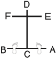

# KWANG-GAE

> **Grade :** 1er Dan

* **Nombre de mouvements :**  39
* **Diagramme au sol :**  (Hanja pour l'Érudit / Lettré - Représente l'expansion du territoire)

| Diagramme | Description |
| ------ | ------ |
|  | KWANG-GAE porte le nom de Kwang-Gae-Toh-Wang, le 19e roi de la dynastie Koguryo, qui a reconquis tous les territoires perdus de la Mandchourie. Le diagramme symbolise l'expansion et la récupération des territoires, et ses 39 mouvements correspondent aux deux premiers chiffres de l'an 391 apr. J.-C., l'année de son couronnement. |

[KWANG-GAE](https://vimeo.com/133453588)

## Liste Détaillée des Mouvements

### Posture de départ : position parallèle avec les mains vers le ciel

1. Ramener le pied gauche vers le pied droit, pour former un position de préparation fermée B vers D, en amenant les deux mains en un circulaire mouvement.
   *(Moa junbi sogi B)*
2. Déplacer le pied gauche vers D, pour former une position de marche gauche vers D tout en exécutant un coup de poing renversé vers D avec le poing droit.
   *(Gunnun so bandae dwijibo jirugi)*

   > *Exécuter en mouvement lent.*

3. Déplacer le pied droit vers D, pour former une position de marche droite vers D tout en exécutant un coup de poing renversé vers D avec le poing gauche.
   *(Gunnun so bandae dwijibo jirugi)*

   > *Exécuter en mouvement lent.*

4. Déplacer le pied gauche vers le côté avant du pied droit, puis déplacer le pied droit vers D, pour former une position de marche droite vers D, en même temps en exécutant un blocage crocheté haut vers D avec la paume droite.
   *(Gunnun so sonbadak nopunde golcho makgi)*

   > *Exécuter en un double en avançant mouvement.*

5. Déplacer le pied droit vers C en un en glissant mouvement pour former une position en L droite vers D, en même temps en exécutant un blocage de garde bas vers D avec un tranchant de la main.
   *(Niunja so sonkal najunde daebi makgi)*
6. Déplacer le pied droit vers le côté avant du pied gauche puis déplacer le pied gauche vers D, pour former une position de marche gauche vers D tout en exécutant un blocage crocheté haut vers D avec la paume gauche.
   *(Gunnun so sonbadak nopunde golcho makgi)*

   > *Exécuter en un double en avançant mouvement.*

7. Déplacer le pied gauche vers C en un en glissant mouvement pour former une position en L gauche vers D tout en exécutant un blocage de garde bas vers D avec un tranchant de la main.
   *(Niunja so sonkal najunde daebi makgi)*
8. Déplacer le pied gauche vers D, pour former une position sur la jambe arrière droite vers D tout en exécutant un blocage de garde haut vers D avec un tranchant de la main.
   *(Dwitbal so sonkal nopunde daebi makgi)*
9. Déplacer le pied droit vers D, pour former une position sur la jambe arrière gauche vers D tout en exécutant un blocage de garde haut vers D avec un tranchant de la main.
   *(Dwitbal so sonkal nopunde daebi makgi)*
10. Déplacer le pied gauche vers le côté avant du pied droit puis tourner dans le sens anti-horaire, en pivotant avec le pied gauche, pour former une position de marche gauche vers C tout en exécutant un blocage montant vers C avec la paume droite.
   *(Gunnun so sonbadak bandae ollyo makgi)*

   > *Exécuter en mouvement lent.*

11. Déplacer le pied droit vers C, pour former une position de marche droite vers C tout en exécutant un blocage montant vers C avec la paume gauche.
   *(Gunnun so sonbadak bandae ollyo makgi)*

   > *Exécuter en mouvement lent.*

12. Exécuter un blocage frontal bas avec le tranchant de la main droite en un circulaire mouvement, en frappant la paume gauche tout en amenant le pied gauche vers le pied droit pour former une position fermée vers C.
   *(Moa so orun sonkal najunde ap makgi)*
13. Exécuter un coup de pied pressant vers E avec le pied gauche, en gardant le position de la mains comme s'ils étaient en 12.
   *(Bakuro noollo chagi)*
14. Exécuter un coup de pied latéral perçant moyen vers E avec le pied gauche, en gardant le position de la mains comme s'ils étaient en 13.
   *(Kaunde yopcha jirugi)*

   > *Exécuter 13 et 14 en un coup de pied consécutif.*

15. Abaisser le pied gauche vers E, pour former une position en L droite vers E tout en exécutant une frappe intérieure haute vers E avec le tranchant de la main droite et en amenant le gauche côté poing en avant de la épaule droite.
   *(Niunja so sonkal nopunde anuro taerigi)*
16. Exécuter une frappe descendante vers E avec le gauche côté poing tout en formant une position fermée vers C, en tirant le pied gauche vers le pied droit.
   *(Moa so wen yop joomuk naeryo taerigi)*
17. Exécuter un coup de pied pressant vers F avec le pied droit, en gardant le position de la mains comme s'ils étaient en 16.
   *(Bakuro noollo chagi)*
18. Exécuter un coup de pied latéral perçant moyen vers F avec le pied droit, en gardant le position de la mains comme s'ils étaient en 17.
   *(Kaunde yopcha jirugi)*

   > *Exécuter 17 et 18 en un coup de pied consécutif.*

19. Abaisser le pied droit vers F, pour former une position en L gauche vers F tout en exécutant une frappe intérieure haute vers F avec le tranchant de la main et en amenant le droit côté poing en avant de la épaule gauche.
   *(Niunja so sonkal nopunde anuro taerigi)*
20. Exécuter une frappe descendante vers F avec le droit côté poing tout en formant une position fermée vers C, en tirant le pied droit vers le pied gauche.
   *(Moa so orun yop joomuk naeryo taerigi)*
21. Déplacer le pied gauche vers C, pour former une position basse gauche vers C tout en exécutant un blocage en pression avec la paume droite.
   *(Nachuo so sonbadak bandae noollo makgi)*

   > *Exécuter en mouvement lent.*

22. Déplacer le pied droit vers C, pour former une position basse droite vers C tout en exécutant un blocage en pression avec la paume gauche.
   *(Nachuo so sonbadak bandae noollo makgi)*

   > *Exécuter en mouvement lent.*

23. Déplacer le pied droit vers D en un en écrasant mouvement pour former une position assise vers F tout en exécutant une frappe latérale haute vers D avec le revers du poing droit.
   *(Annun so orun dung joomuk nopunde yop taerigi)*
24. Exécuter un blocage moyen vers D avec le droit double avant-bras tout en formant une position de marche droite vers D, en pivotant avec le pied gauche.
   *(Gunnun so doo palmok kaunde makgi)*
25. Exécuter un blocage bas vers D avec l'avant-bras gauche tout en décalant vers C, en maintenant une position de marche droite vers D, en gardant le position de la main droite comme il était en 24.
   *(Gunnun so palmok najunde bandae makgi)*
26. Exécuter une pique haute vers D avec la pique de doigts à plat droit tout en formant une position basse droite vers D, en glissant le pied droit vers D.
   *(Nachuo so opun sonkut nopunde tulgi)*

   > *Exécuter en mouvement lent.*

27. Déplacer le pied gauche sur ligne CD en un en écrasant mouvement pour former une position assise vers F tout en exécutant une frappe latérale haute vers C avec le revers du poing gauche.
   *(Annun so wen dung joomuk nopunde yop taerigi)*
28. Exécuter un blocage moyen vers C avec le gauche double avant-bras tout en formant une position de marche gauche vers C, en pivotant avec le pied gauche.
   *(Gunnun so doo palmok kaunde makgi)*
29. Exécuter un blocage inversé bas vers C avec l'avant-bras droit tout en décalant vers D, en maintenant une position de marche gauche vers C, en gardant le position de la main gauche comme il était en 28.
   *(Gunnun so palmok najunde bandae makgi)*
30. Exécuter une pique haute vers C avec la pique de doigts à plat gauche tout en formant une position basse gauche vers C, en glissant le pied gauche vers C.
   *(Nachuo so opun sonkut nopunde tulgi)*

   > *Exécuter en mouvement lent.*

31. Déplacer le pied droit vers C en un en écrasant mouvement, pour former une position de marche droite vers C tout en exécutant un coup de poing vertical haut vers C avec un poings jumelés.
   *(Gunnun so sang joomuk nopunde sewo jirugi)*
32. Déplacer le pied gauche vers A en un en écrasant mouvement, pour former une position de marche gauche vers A tout en exécutant un coup de poing renversé vers A avec un poings jumelés.
   *(Gunnun so sang joomuk dwijibo jirugi)*
33. Exécuter un coup de pied avant fouetté moyen vers A avec le pied droit, en gardant le position de la mains comme s'ils étaient en 32.
   *(Kaunde apcha busigi)*
34. Abaisser le pied droit vers le pied gauche, puis déplacer le pied gauche vers A pour former une position en L gauche vers B tout en exécutant un blocage de garde moyen vers B avec un tranchant de la main.
   *(Niunja so sonkal kaunde daebi makgi)*
35. Déplacer le pied gauche vers B, pour former une position de marche gauche vers B tout en exécutant un coup de poing haut vers B avec le poing gauche.
   *(Gunnun so nopunde jirugi)*
36. Déplacer le pied droit vers B en en écrasant mouvement, pour former une position de marche droite vers B tout en exécutant un coup de poing renversé vers B avec un poings jumelés.
   *(Gunnun so sang joomuk dwijibo jirugi)*
37. Exécuter un coup de pied avant fouetté moyen vers B avec le pied gauche, en gardant le position de la mains comme s'ils étaient en 36.
   *(Kaunde apcha busigi)*
38. Abaisser le pied gauche vers le pied droit, puis déplacer le pied droit vers B pour former une position en L droite vers A en même temps en exécutant un blocage de garde moyen vers A avec un tranchant de la main.
   *(Niunja so sonkal kaunde daebi makgi)*
39. Déplacer le pied droit vers A, pour former une position de marche droite vers A tout en exécutant un coup de poing haut vers A avec le poing droit.
   *(Gunnun so nopunde jirugi)*

### FIN : ramener le pied gauche à la posture de départ.

---

[← Index des formes](README.md) · [Histoire du Tul](../Theorie/encyclopedie-historique-tuls.md)
