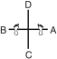

# MOON-MOO

> **Grade :** 4e Dan

* **Nombre de mouvements :**  61
* **Diagramme au sol :**  (Hanja pour l'Érudit / Lettré)

| Diagramme | Description |
| ------ | ------ |
|  | Moon-Moo rend hommage au 30e roi de la dynastie Silla. Selon son vœu, son corps fut immergé en mer près de Dae Wang Am (le rocher du grand roi) pour que son âme défende à jamais la Corée contre les invasions maritimes japonaises. Les 61 mouvements symbolisent l'an 661 apr. J.-C., lorsqu'il accéda au trône. |

[MOON-MOO](https://youtu.be/kJGzK_pHiU0?si=EjTYeeye13y92tbJ)

## Liste Détaillée des Mouvements

### Posture de départ : position parallèle de préparation

1. Tourner le visage vers B tout en formant un droit position de préparation pliée A vers B.
   *([Guburyo junbi sogi A](../Techniques/Guburyo-Junbi-Sogi-A.md))*

   > *Exécuter en mouvement lent.*

2. Exécuter un coup de pied latéral perçant haut vers B avec le pied gauche.
   *([Nopunde yopcha jirugi](../chagi/yop-cha-jirugi.md))*

   > *Exécuter en mouvement lent.*

3. Exécuter un coup de pied latéral perçant haut vers B avec le pied gauche.
   *([Nopunde yopcha jirugi](../chagi/yop-cha-jirugi.md))*

   > *Exécuter 2 et 3 en un coup de pied double.*

4. Abaisser le pied gauche vers B pour former une position assise vers D tout en exécutant une pique moyenne vers D avec la pique de doigts à plat droit.
   *([Annun so orun opun sonkut kaunde tulgi](../Techniques/Annun-So-Orun-Opun-Sonkut-Kaunde-Tulgi.md))*
5. Exécuter un coup de pied crocheté inversé haut vers B avec le pied droit.
   *([Nopunde bandae dollyo gorochagi](../chagi/bandae-dollyo-goro-chagi.md))*

   > *Exécuter en mouvement lent.*

6. Abaisser le pied droit vers B en mouvement sauté pour former une position en X droite vers C tout en exécutant une frappe latérale moyenne vers B avec le tranchant de la main droite.
   *([Twigi](../Techniques/Twigi.md), orun kyocha so sonkal kaunde yop taerigi)*
7. Déplacer le pied gauche vers A pour former une position de marche gauche vers A tout en exécutant un blocage en pression vers A avec la paume droite.
   *([Gunnun so sonbadak bandae noollo makgi](../Techniques/Gunnun-So-Sonbadak-Bandae-Noollo-Makgi.md))*
8. Déplacer le pied droit vers A pour former une position de marche droite vers A en même temps en exécutant un blocage en pression avec la paume gauche.
   *([Gunnun so sonbadak bandae noollo makgi](../Techniques/Gunnun-So-Sonbadak-Bandae-Noollo-Makgi.md))*
9. Exécuter un blocage latéral haut vers B avec le tranchant de la main gauche et un blocage latéral bas vers A avec le tranchant de la main droite tout en formant une position sur une jambe droite vers D, en tirant le gauche inversé tranchant du pied vers le genou droit articulation.
   *([Waebal so sonkal najunde baro yop makgi](../makgi/yop-makgi.md) wa [sonkal nopunde bandae yop makgi](../makgi/yop-makgi.md))*

   > *Exécuter en mouvement lent.*

10. Abaisser le pied gauche vers le pied droit puis tourner le visage vers A tout en formant un gauche position de préparation pliée A vers A.
   *([Guburyo junbi sogi A](../Techniques/Guburyo-Junbi-Sogi-A.md))*

   > *Exécuter en mouvement lent.*

11. Exécuter un coup de pied latéral perçant haut vers A avec le pied droit.
   *([Nopunde yopcha jirugi](../chagi/yop-cha-jirugi.md))*

   > *Exécuter en mouvement lent.*

12. Exécuter un coup de pied latéral perçant haut vers A avec le pied droit.
   *([Nopunde yopcha jirugi](../chagi/yop-cha-jirugi.md))*

   > *Exécuter 11 et 12 en un coup de pied double.*

13. Abaisser le pied droit vers A pour former une position assise vers D tout en exécutant une pique moyenne vers D avec la pique de doigts à plat gauche.
   *([Annun so wen opun sonkut kaunde tulgi](../Techniques/Annun-So-Wen-Opun-Sonkut-Kaunde-Tulgi.md))*
14. Exécuter un coup de pied crocheté inversé haut vers A avec le pied gauche.
   *([Nopunde bandae dollyo gorochagi](../chagi/bandae-dollyo-goro-chagi.md))*

   > *Exécuter en mouvement lent.*

15. Abaisser le pied gauche vers A en mouvement sauté pour former une position en X gauche vers C tout en exécutant une frappe latérale moyenne vers A avec le tranchant de la main gauche.
   *(Twigi, [wen kyocha so sonkal kaunde yop taerigi](../Techniques/Wen-Kyocha-So-Sonkal-Kaunde-Yop-Taerigi.md))*
16. Déplacer le pied droit vers B pour former une position de marche droite vers B tout en exécutant un blocage en pression vers B avec la paume gauche.
   *([Gunnun so sonbadak bandae noollo makgi](../Techniques/Gunnun-So-Sonbadak-Bandae-Noollo-Makgi.md))*
17. Déplacer le pied gauche vers B pour former une position de marche gauche vers B en même temps en exécutant un blocage en pression avec la paume droite.
   *([Gunnun so sonbadak bandae noollo makgi](../Techniques/Gunnun-So-Sonbadak-Bandae-Noollo-Makgi.md))*
18. Exécuter un blocage latéral haut vers A avec le tranchant de la main droite et un blocage latéral bas vers B avec le tranchant de la main gauche tout en formant une position sur une jambe gauche vers D, en tirant le droit inversé tranchant du pied vers le genou gauche articulation.
   *([Waebal so sonkal najunde baro yop makgi](../makgi/yop-makgi.md) wa [sonkal nopunde bandae yop makgi](../makgi/yop-makgi.md))*

   > *Exécuter en mouvement lent.*

19. Tourner le visage vers C tout en formant un gauche position de préparation pliée B vers D.
   *([Guburyo junbi sogi B](../Techniques/Guburyo-Junbi-Sogi-B.md))*
20. Exécuter un coup de pied arrière perçant haut vers C avec le pied droit.
   *([Nopunde dwitcha jirugi](../chagi/dwit-cha-jirugi.md))*

   > *Exécuter en mouvement lent.*

21. Abaisser le pied droit vers C pour former une position de marche gauche vers D tout en exécutant un coup de poing moyen vers D avec le poing droit.
   *([Gunnun so kaunde bandae jirugi](../Techniques/Gunnun-So-Kaunde-Bandae-Jirugi.md))*
22. Tourner le visage vers C tout en formant un droit position de préparation pliée B vers D.
   *([Guburyo junbi sogi B](../Techniques/Guburyo-Junbi-Sogi-B.md))*
23. Exécuter un coup de pied arrière perçant haut vers C avec le pied gauche.
   *([Nopunde dwitcha jirugi](../chagi/dwit-cha-jirugi.md))*

   > *Exécuter en mouvement lent.*

24. Abaisser le pied gauche vers C pour former une position de marche droite vers D tout en exécutant un coup de poing moyen vers D avec le poing gauche.
   *([Gunnun so kaunde bandae jirugi](../Techniques/Gunnun-So-Kaunde-Bandae-Jirugi.md))*
25. Glisser vers C pour former une position sur la jambe arrière droite vers D tout en exécutant un blocage descendant avec la paume gauche.
   *([Dwitbal so sonbadak bandae naeryo makgi](../Techniques/Dwitbal-So-Sonbadak-Bandae-Naeryo-Makgi.md))*
26. Exécuter un coup de pied avant fouetté latéral moyen vers D avec le pied gauche en gardant le position de la mains comme s'ils étaient en 25.
   *(Kaunde yobap cha busigi)*
27. Abaisser le pied gauche vers D puis déplacer le pied droit vers C en un en écrasant mouvement pour former une position assise vers A tout en exécutant une frappe latérale moyenne vers C avec le droit côté poing.
   *([Annun so orun yop joomuk kaunde yop taerigi](../Techniques/Annun-So-Orun-Yop-Joomuk-Kaunde-Yop-Taerigi.md))*
28. Glisser vers C en maintenant une position assise vers A tout en exécutant un blocage en levant avec la paume gauche.
   *([Annun so wen sonbadak duro makgi](../Techniques/Annun-So-Wen-Sonbadak-Duro-Makgi.md))*
29. Exécuter un coup de poing moyen vers A avec le poing droit tout en maintenant une position assise vers A.
   *([Annun so orun joomuk kaunde jirugi](../Techniques/Annun-So-Orun-Joomuk-Kaunde-Jirugi.md))*

   > *Exécuter 28 et 29 en mouvement lié.*

30. Exécuter un blocage latéral bas vers D avec le tranchant de la main gauche tout en maintenant une position assise vers A.
   *([Annun so wen sonkal najunde yop makgi](../Techniques/Annun-So-Wen-Sonkal-Najunde-Yop-Makgi.md))*
31. Déplacer le pied gauche juste au-delà du pied droit en mouvement vif tout en exécutant un coup de pied latéral poussant moyen vers C avec le pied droit.
   *([Kaunde yopcha milgi](../chagi/yop-cha-milgi.md))*
32. Abaisser le pied droit vers C puis exécuter un coup de pied circulaire inversé haut vers C avec le pied gauche.
   *([Nopunde bandae dollyo chagi](../chagi/bandae-dollyo-chagi.md))*
33. Abaisser le pied gauche vers C pour former une position de marche gauche vers C tout en exécutant un blocage latéral haut vers C avec le tranchant de la main gauche.
   *([Gunnun so sonkal nopunde yop makgi](../makgi/nopunde-yop-makgi.md))*
34. Glisser vers D pour former une position sur la jambe arrière gauche vers C tout en exécutant un blocage descendant avec la paume droite.
   *([Dwitbal so sonbadak bandae naeryo makgi](../Techniques/Dwitbal-So-Sonbadak-Bandae-Naeryo-Makgi.md))*
35. Exécuter un coup de pied avant fouetté latéral moyen vers C avec le pied droit en gardant le position de la mains comme s'ils étaient en 34.
   *(Kaunde yobap cha busigi)*
36. Abaisser le pied droit vers C puis déplacer le pied gauche vers D en un en écrasant mouvement pour former une position assise vers A tout en exécutant une frappe latérale moyenne vers D avec le gauche côté poing.
   *([Annun so wen yop joomuk kaunde yop taerigi](../Techniques/Annun-So-Wen-Yop-Joomuk-Kaunde-Yop-Taerigi.md))*
37. Glisser vers D en maintenant une position assise vers A tout en exécutant un blocage en levant avec la paume droite.
   *([Annun so orun sonbadak duro makgi](../Techniques/Annun-So-Orun-Sonbadak-Duro-Makgi.md))*
38. Exécuter un coup de poing moyen vers A avec le poing gauche tout en maintenant une position assise vers A.
   *([Annun so wen joomuk kaunde jirugi](../Techniques/Annun-So-Wen-Joomuk-Kaunde-Jirugi.md))*

   > *Exécuter 37 et 38 en mouvement lié.*

39. Exécuter un blocage latéral bas vers C avec le tranchant de la main droite tout en maintenant une position assise vers A.
   *([Annun so orun sonkal najunde yop makgi](../Techniques/Annun-So-Orun-Sonkal-Najunde-Yop-Makgi.md))*
40. Déplacer le pied droit juste au-delà du pied gauche en mouvement vif tout en exécutant un coup de pied latéral poussant moyen vers D avec le pied gauche.
   *([kaunde yopcha milgi](../chagi/yop-cha-milgi.md))*
41. Abaisser le pied gauche vers D puis exécuter un coup de pied circulaire inversé haut vers D avec le pied droit.
   *([Nopunde bandae dollyo chagi](../chagi/bandae-dollyo-chagi.md))*
42. Abaisser le pied droit vers D pour former une position de marche droite vers D tout en exécutant un blocage latéral haut vers D avec le tranchant de la main droite.
   *([Gunnun so sonkal nopunde yop makgi](../makgi/nopunde-yop-makgi.md))*
43. Déplacer le pied gauche vers D puis exécuter un coup de pied vrillé haut vers AD avec le pied droit.
   *([Nopunde bituro chagi](../chagi/bituro-chagi.md))*
44. Abaisser le pied droit vers C pour former une position de marche gauche vers D tout en exécutant une frappe arrière latérale vers C avec le revers du poing droit et en étendant le poing gauche vers D.
   *(Gunnun so dung joomuk bandae yopdwi taerigi)*
45. Exécuter une frappe frontale vers D avec le revers du poing droit tout en décalant vers C en maintenant une position de marche gauche vers D.
   *(Gunnun so dung joomuk bandae ap taerigi)*
46. Déplacer le pied droit vers D puis exécuter un coup de pied vrillé haut vers BD avec le pied gauche.
   *([Nopunde bituro chagi](../chagi/bituro-chagi.md))*
47. Abaisser le pied gauche vers C pour former une position de marche droite vers D tout en exécutant une frappe arrière latérale vers C avec le revers du poing gauche et en étendant le poing droit vers D.
   *(Gunnun so dung joomuk bandae yopdwi taerigi)*
48. Exécuter une frappe frontale vers D avec le revers du poing gauche tout en décalant vers C en maintenant une position de marche droite vers D.
   *(Gunnun so dung joomuk bandae ap taerigi)*
49. Exécuter un coup de pied balayé vers D avec le tranchant de la plante du pied gauche en gardant le position de la mains comme s'ils étaient en 48 puis abaisser il vers D pour former une position en L droite vers D tout en exécutant un blocage de garde moyen vers D avec l'avant-bras.
   *([Yop bal badak suroh chagi](../chagi/suroh-chagi.md))*
50. Exécuter un coup de pied d'arrêt latéral vers D puis de nouveau un coup de pied latéral pénétrant moyen vers D avec le pied gauche pour former un blocage de garde de l'avant-bras.
   *(Yopcha momchugi, [wen kaunde yopcha tulgi](../chagi/yop-cha-tulgi.md))*

   > *Exécuter en un coup de pied consécutif.*

51. Abaisser le pied gauche vers D pour former une position en L droite vers D tout en exécutant une frappe extérieure moyenne vers D avec le tranchant de la main gauche.
   *([Niunja so sonkal kaunde bakuro taerigi](../Techniques/Niunja-So-Sonkal-Kaunde-Bakuro-Taerigi.md))*
52. Exécuter un coup de pied balayé vers D avec le tranchant de la plante du pied droit puis abaisser il vers D pour former une position en L gauche vers D tout en exécutant un blocage de garde moyen vers D avec l'avant-bras.
   *([Yop bal badak suroh chagi](../chagi/suroh-chagi.md), wen niunja so palmok kaunde daebi makgi)*
53. Exécuter un coup de pied d'arrêt latéral vers D puis de nouveau un coup de pied latéral pénétrant moyen vers D avec le pied droit pour former un blocage de garde de l'avant-bras.
   *(Yopcha momchugi, [orun kaunde yopcha tulgi](../chagi/yop-cha-tulgi.md))*

   > *Exécuter en un coup de pied consécutif.*

54. Abaisser le pied droit vers D pour former une position en L gauche vers D tout en exécutant une frappe extérieure moyenne vers D avec le tranchant de la main droite.
   *([Niunja so sonkal kaunde bakuro taerigi](../Techniques/Niunja-So-Sonkal-Kaunde-Bakuro-Taerigi.md))*
55. Déplacer le pied droit vers C puis tourner dans le sens anti-horaire en pivotant avec le pied droit pour former une position de marche gauche vers C tout en exécutant un coup de poing moyen vers C avec le poing droit.
   *([Gunnun so kaunde bandae jirugi](../Techniques/Gunnun-So-Kaunde-Bandae-Jirugi.md))*
56. Sauter vers C pour former une position en X droite vers AC tout en exécutant un coup de poing bas vers C avec le poing gauche et en amenant le poing droit sur la épaule gauche.
   *([Twigi](../Techniques/Twigi.md), orun kyocha so najunde bandae jirugi)*
57. Sauter vers D pour former une position en X gauche vers AD tout en exécutant un coup de poing bas vers D avec le poing droit et en amenant le poing gauche sur la épaule droite.
   *(Twigi, [wen kyocha so najunde bandae jirugi](../Techniques/Wen-Kyocha-So-Najunde-Bandae-Jirugi.md))*
58. Sauter vers exécuter un coup de pied en vol vers D avec le pied droit tout en pivotant dans le sens horaire.
   *([Twio dolmyo chagi](../Techniques/Twio-Dolmyo-Chagi.md))*
59. Atterrir vers D pour former une position en L gauche vers D tout en exécutant un blocage de garde moyen vers D avec un tranchant de la main.
   *([Niunja so sonkal kaunde daebi makgi](../Techniques/Niunja-So-Sonkal-Kaunde-Daebi-Makgi.md))*
60. Déplacer le pied droit vers le côté arrière du pied gauche puis le pied gauche vers C pour former une position de marche droite vers D tout en exécutant un blocage montant avec l'arc de main gauche.
   *([Gunnun so bandal son bandae chookyo makgi](../makgi/chookyo-makgi.md))*
61. Exécuter un coup de poing haut vers D avec le poing droit tout en maintenant une position de marche droite vers D.
   *([gunnun so nopunde jirugi](../Techniques/Gunnun-So-Nopunde-Jirugi.md))*

### FIN : ramener le pied droit à la posture de départ.

---

[← Index des formes](README.md) · [Histoire du Tul](../Theorie/encyclopedie-historique-tuls.md)
