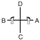

# SAJU MAKGI (EXERCICE FONDAMENTAL — QUATRE DIRECTIONS BLOCAGE)

> 🔊 **Prononciation :** [사주 막기](../audio/tul/saju-makgi.m4a)

> **Grade :** 10e Gup — Ceinture blanche

* **Nombre de mouvements :**  16 (Pratiqué à droite et à gauche, soit 8 mouvements par côté)
* **Diagramme au sol :**  (Croix / Quatre directions)

| Diagramme | Description |
| ------ | ------ |
|  | Exercice de blocage fondamental de base pour débutants, enseignant les déplacements, le blocage bas avec le tranchant de la main (Knife-hand low block) et le blocage moyen de l'avant-bras intérieur. |

[Blocage 4 directions](https://vimeo.com/113658014?fl=pl&fe=cm)

## Origine et contexte

* **Contexte socio-technique :** Établit la notion de protection et de préservation de soi, pilier moral du Taekwon-Do où la défense précède toujours l'attaque.

## Liste Détaillée des Mouvements

### Posture de départ : Position parallèle de préparation (Parallel Ready Stance / Narani Junbi Sogi).

1. Reculer le pied droit vers C pour former une position de marche gauche vers D tout en exécutant un blocage bas avec le tranchant de la main vers D avec le tranchant de la main gauche ([Gunnun So Sonkal Najunde Makgi](../makgi/najunde-makgi.md)).
2. Avancer le pied droit vers D pour former une position de marche droite vers D tout en exécutant un blocage latéral moyen avec l'avant-bras intérieur vers D avec l'avant-bras intérieur droit ([Gunnun So An Palmok Kaunde Yop Makgi](../Techniques/An-Palmok-Kaunde-Yop-Makgi.md)).
3. Déplacer le pied droit vers A pour former une position de marche gauche vers B tout en exécutant un blocage bas avec le tranchant de la main vers B avec le tranchant de la main gauche ([Gunnun So Sonkal Najunde Makgi](../makgi/najunde-makgi.md)).
4. Avancer le pied droit vers B pour former une position de marche droite vers B tout en exécutant un blocage latéral moyen avec l'avant-bras intérieur vers B avec l'avant-bras intérieur droit ([Gunnun So An Palmok Kaunde Yop Makgi](../Techniques/An-Palmok-Kaunde-Yop-Makgi.md)).
5. Déplacer le pied droit vers D pour former une position de marche gauche vers C tout en exécutant un blocage bas avec le tranchant de la main vers C avec le tranchant de la main gauche ([Gunnun So Sonkal Najunde Makgi](../makgi/najunde-makgi.md)).
6. Avancer le pied droit vers C pour former une position de marche droite vers C tout en exécutant un blocage latéral moyen avec l'avant-bras intérieur vers C avec l'avant-bras intérieur droit ([Gunnun So An Palmok Kaunde Yop Makgi](../Techniques/An-Palmok-Kaunde-Yop-Makgi.md)).
7. Déplacer le pied droit vers B pour former une position de marche gauche vers A tout en exécutant un blocage bas avec le tranchant de la main vers A avec le tranchant de la main gauche ([Gunnun So Sonkal Najunde Makgi](../makgi/najunde-makgi.md)).
8. Avancer le pied droit vers A pour former une position de marche droite vers A tout en exécutant un blocage latéral moyen avec l'avant-bras intérieur vers A avec l'avant-bras intérieur droit ([Gunnun So An Palmok Kaunde Yop Makgi](../Techniques/An-Palmok-Kaunde-Yop-Makgi.md)).

### FIN : Ramener le pied droit vers la posture de départ (Ready Posture).
