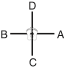

# SAJU TULGI (EXERCICE FONDAMENTAL — QUATRE DIRECTIONS ATTAQUE)

> **Grade :** 10e Gup — Ceinture blanche

* **Nombre de mouvements :** 8 (Pratiqué à droite et à gauche, soit 4 mouvements par côté)
* **Diagramme au sol :** (Croix / Quatre directions)

| Diagramme | Description |
| --------- | ----------- |
|  | Bien qu'il ne s'agisse pas d'un Tul officiel, Saju Tulgi est un exercice fondamental d'attaque de base pour les débutants, permettant d'apprendre la position en "L" (Niunja Sogi) et le coup de coude latéral. |

## Liste Détaillée des Mouvements

### Posture de départ : Position fermé "C" (Close Ready Stance C / Moa Sogi C)

1. Glisser vers D, en formant une posture en L droite face à C, tout en portant un coup de coude latéral droit vers D.
2. Glisser vers B, en formant une posture en L droite face à A, tout en portant un coup de coude latéral droit vers B.
3. Glisser vers C, en formant une posture en L droite face à D, tout en portant un coup de coude latéral droit vers C.
4. Glisser vers A, en formant une posture en L droite face à B, tout en portant un coup de coude latéral droit vers A.

### FIN : Ramener le pied droit en posture de préparation. Répéter l'enchaînement du côté gauche

---

[← Index des formes](README.md) · [Histoire du Tul](../Theorie/encyclopedie-historique-tuls.md)
