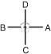

# SAM-IL

> **Grade :** 3e Dan

* **Nombre de mouvements :**  33
* **Diagramme au sol :**  (Hanja pour l'Érudit / Lettré ou la Croix)

| Diagramme | Description |
| ------ | ------ |
|  | SAM-IL désigne la date historique du mouvement d'indépendance de la Corée qui débuta dans tout le pays le 1er mars 1919. Les 33 mouvements du Tul représentent les 33 patriotes qui ont planifié et dirigé ce soulèvement national. |

[SAM-IL](https://youtu.be/BqMGIy6aO1k?si=btpwTEl-PGoAw7sN)

## Liste Détaillée des Mouvements

### Posture de départ : Position de préparation fermée C (Closed Ready Stance C / Moa Chunbi Sogi C).

1. Glisser vers D pour former une position en L droite vers D tout en exécutant un blocage de garde moyen vers D avec l'avant-bras (Niunja So Palmok Kaunde Daebi Makgi).
2. Déplacer le pied droit vers D pour former une position de marche droite vers D tout en exécutant un blocage haut vers D avec le double avant-bras droit (Gunnun So Doo Palmok Nopunde Makgi).
3. Déplacer le pied gauche vers D pour former une position de marche gauche vers D tout en exécutant un blocage de côté haut vers D avec le tranchant de la main droite et en plaçant la paume gauche sur l'avant-bras droit (Gunnun So Sonkal Nopunde Yop Makgi).
4. Exécuter un coup de pied torsadé moyen vers A avec le pied droit, en conservant la position des mains du mouvement 3 (Kaunde Bituro Chagi).
5. Poser le pied droit au sol vers D pour former une position de marche droite vers D tout en exécutant un coup de poing moyen vers D avec le poing droit (Gunnun So Kaunde Jirugi).
6. Déplacer le pied droit sur la ligne CD pour former une position assise vers B tout en exécutant un blocage en coin moyen avec le tranchant de la main inversé (Annun So Sonkal Dung Kaunde Hechyo Makgi).
7. Exécuter un coup de poing vers le bas vers C avec le bout des doigts de la main droite vers le haut, tout en formant une position de marche gauche vers C, en pivotant sur le pied droit (Gunnun So Dwijibun Sonkut Najunde Tulgi).
8. Exécuter un blocage de côté haut vers D with l'avant-bras extérieur droit et un blocage bas vers C with l'avant-bras gauche, tout en formant une position en L droite vers C en ramenant le pied gauche (Niunja So Bakat Palmok Nopunde Yop Makgi, Palmok Najunde Makgi).
9. Déplacer le pied droit vers C pour former une position assise vers A tout en exécutant un blocage en coin moyen avec le tranchant de la main inversé (Annun So Sonkal Dung Kaunde Hechyo Makgi).
10. Exécuter un coup de poing bas vers C avec double poing tout en formant une position en L gauche vers C, en ramenant le pied droit (Niunja So Sang Joomuk Najunde Jirugi).
11. Déplacer le pied gauche vers C pour former une position de marche gauche vers C tout en exécutant un blocage haut vers BC avec double main en arc et en regardant à travers (Gunnun So Doo Bandalson Nopunde Makgi).
12. Déplacer le pied droit vers C pour former une position de marche droite vers C tout en exécutant un coup de poing moyen vers C avec le poing gauche (Gunnun So Kaunde Bandae Jirugi).
13. Déplacer le pied droit sur la ligne CD pour former une position en L droite vers D tout en exécutant un coup de poing bas vers D avec double poing (Niunja So Sang Joomuk Najunde Jirugi).
14. Déplacer le pied gauche vers B pour former une position en L droite vers B tout en exécutant un blocage de garde haut vers B avec le tranchant de la main inversé (Niunja So Sonkal Dung Nopunde Daebi Makgi).
15. Exécuter un blocage en U vers B tout en formant une position fixe gauche vers B, en faisant glisser le pied gauche (Gojung So Digutja Makgi).
16. Exécuter un coup de pied balayé vers B avec la plante de côté droite, puis poser le pied vers B pour former une position fixe droite vers B tout en exécutant un blocage en U vers B (Suroh Chagi, Gojung So Digutja Makgi).
17. Sauter et tourner dans le sens anti-horaire, puis atterrir sur place pour former une position en L gauche vers B tout en exécutant un blocage de garde moyen vers B avec le tranchant de la main (Twigi, Niunja So Sonkal Kaunde Daebi Makgi).
18. Exécuter un coup de pied de côté percutant moyen vers B avec le pied droit, tout en maintenant un blocage de garde avec le tranchant de la main (Kaunde Yopcha Jirugi).
19. Poser le pied droit à côté du pied gauche, puis déplacer le pied gauche vers A pour former une position de marche gauche vers A tout en frappant la paume gauche avec le coude frontal droit (Gunnun So Ap Palkup Taerigi).
20. Déplacer le pied droit vers A en tournant dans le sens anti-horaire pour former une position diagonale gauche vers D tout en poussant vers C avec le coude arrière gauche (soutenant le poing gauche avec la paume droite) et en tournant le visage vers C (Sasun So Dwit Palkup Tulgi).
21. Exécuter un blocage pressant avec les poignets croisés en X tout en formant une position de marche droite vers AD (Gunnun So Kyocha Joomuk Noollo Makgi).
22. Déplacer le pied gauche vers A en frappant le sol du pied pour former une position assise vers C tout en exécutant un blocage en W avec l'avant-bras extérieur (Annun So Bakat Palmok San Makgi).
23. Exécuter un coup de pied de côté percutant moyen vers A avec le pied gauche tout en maintenant un blocage de garde de l'avant-bras (Kaunde Yopcha Jirugi).
24. Poser le pied gauche au sol sur la ligne A, puis exécuter un blocage de garde bas vers B avec le tranchant de la main tout en formant une position en L gauche vers B, en pivotant sur le pied gauche (Niunja So Sonkal Najunde Daebi Makgi).
25. Déplacer le pied gauche vers B pour former une position de pied arrière droite vers B tout en exécutant un blocage ascendant avec la paume gauche (Dwitbal So Sonbadak Ollyo Makgi).
26. Déplacer le pied droit vers B pour former une position de pied arrière gauche vers B tout en exécutant un blocage pressant avec double paume (Dwitbal So Sang Sonbadak Noollo Makgi).
27. Déplacer le pied gauche vers C en frappant le sol du pied pour former une position de marche gauche vers C tout en exécutant un coup de poing remontant avec double poing vers C (Gunnun So Sang Dwijibo Jirugi).
28. Déplacer le pied droit vers C pour former une position en L gauche vers C tout en exécutant un blocage bas vers C avec l'avant-bras droit et en ramenant le poing gauche sous l'aisselle gauche (Niunja So Palmok Najunde Makgi).
29. Exécuter un coup de poing moyen vers C avec le poing gauche tout en maintenant la position en L gauche vers C, et en amenant le poing droit au-dessus de l'épaule gauche (Niunja So Kaunde Jirugi).
30. Exécuter un blocage de face moyen avec l'avant-bras droit tout en formant une position de marche gauche vers D, en pivotant sur le pied droit (Gunnun So Palmok Kaunde Ap Makgi).
31. Exécuter un coup de poing haut vers D avec le poing gauche tout en maintenant la position de marche gauche vers D (Gunnun So Nopunde Bandae Jirugi).
32. Exécuter un coup de pied frontal bas vers D with le pied gauche, en conservant la position des mains du mouvement 31 (Najunde Apcha Busigi).
33. Poser le pied gauche au sol vers D, puis déplacer le pied droit vers D en frappant le sol du pied pour former une position de marche droite vers D tout en exécutant un coup de poing vertical haut avec double poing vers D (Gunnun So Sang Joomuk Nopunde Sewo Jirugi).

### FIN : Ramener le pied gauche vers la posture de départ (Ready Posture).

---

[← Index des formes](index.md) · [Recueil complet](toutes-les-formes.md) · [Histoire du Tul](../Theorie/encyclopedie-historique-tuls.md)
