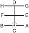

# SE-JONG

> **Grade :** 5e Dan

* **Nombre de mouvements :**  24
* **Diagramme au sol :**  (Hanja pour le 'Roi')

| Diagramme | Description |
| ------ | ------ |
|  | SE-JONG est nommé d'après le plus grand roi de l'histoire coréenne, Se-Jong le Grand, qui inventa l'alphabet coréen (Hangul) en 1443, et qui était également un météorologue réputé. Le diagramme (王) représente le Roi, tandis que les 24 mouvements correspondent aux 24 lettres de cet alphabet national. |

## Liste Détaillée des Mouvements

### Posture de départ : position de préparation fermée B

1. Déplacer le pied gauche vers B, pour former une position de marche gauche vers B en même temps en exécutant un blocage bas vers B avec l'avant-bras gauche.
   *(Gunnun so palmok najunde makgi)*
2. Ramener le pied gauche vers le pied droit, puis déplacer le pied droit vers A pour former une position en L gauche vers A tout en exécutant un blocage double des avant-bras.
   *(Niunja so sang palmok makgi)*
3. Exécuter un coup de pied latéral perçant moyen vers D avec le pied droit.
   *(Kaunde yopcha jirugi)*
4. Abaisser le pied droit vers D, puis déplacer le pied gauche vers F pour former une position de marche gauche vers F tout en exécutant un blocage montant avec l'avant-bras gauche.
   *(Gunnun so palmok chookyo makgi)*
5. Ramener le pied gauche vers le pied droit, puis déplacer le pied droit vers E pour former une position assise vers D tout en exécutant une frappe moyenne vers E avec le tranchant de la main droite.
   *(Annun so orun sonkal kaunde yop taerigi)*
6. Ramener le pied droit vers le pied gauche, pour former un position de préparation fermée B vers D.
   *(Moa junbi sogi B)*
7. Sauter vers D pour former une position en X gauche vers DG tout en exécutant une frappe latérale haute vers D avec le revers du poing gauche, en amenant la pulpe des doigts droit vers le gauche côté poing.
   *(Twigi, wen kyocha so dung joomuk nopunde baro yop taerigi)*
8. Déplacer le pied droit vers G, pour former une position de marche droite vers G tout en exécutant un coup de poing haut vers G avec le poing droit.
   *(Gunnun so nopunde jirugi)*
9. Déplacer le pied droit sur ligne GH pour former une position fixe gauche vers H tout en exécutant un blocage de garde haut vers H avec l'avant-bras.
   *(Gojung so palmok nopunde daebi makgi)*
10. Déplacer le pied droit vers H, pour former une position de marche droite vers H tout en exécutant une pique moyenne vers H avec le droit droit bout des doigts.
   *(Gunnun so sun sonkut kaunde tulgi)*
11. Ramener le pied droit vers le pied gauche, puis déplacer le pied gauche vers G pour former une position de marche gauche vers G tout en exécutant une frappe latérale haute vers G avec le revers du poing gauche.
   *(Gunnun so dung joomuk nopunde yop taerigi)*
12. Déplacer le pied gauche sur ligne GH pour former une position assise vers C tout en exécutant un blocage en levant avec la paume gauche.
   *(Annun so wen sonbadak duro makgi)*
13. Exécuter un coup de pied circulaire moyen vers C avec le pied gauche.
   *(Kaunde dollyo chagi)*
14. Abaisser le pied gauche vers C en mouvement sauté, pour former une position en X gauche vers CF tout en exécutant un blocage haut vers C avec le gauche double avant-bras.
   *(Twigi, wen kyocha so doo palmok nopunde makgi)*
15. Déplacer le pied droit vers F pour former une position assise vers C tout en étendant le poing droit horizontalement vers C.
   *(Annun sogi)*

   > *Exécuter en mouvement lent.*

16. Exécuter une frappe frontale vers C avec le revers du poing gauche tout en maintenant une position assise vers C.
   *(Annun so wen dung joomuk ap taerigi)*
17. Ramener le pied droit derrière le pied gauche, puis déplacer le pied gauche vers E, pour former une position diagonale gauche vers C tout en exécutant un blocage en pression avec une paumes jumelées.
   *(Sasun so sang sonbadak noollo makgi)*
18. Exécuter un blocage moyen vers C avec un double arc de main tout en formant une position de marche gauche vers CE.
   *(Gunnun so kaunde doo bandalson makgi)*
19. Tirer le gauche inversé tranchant du pied vers le genou droit articulation pour former une position sur une jambe droite vers C en même temps en exécutant un blocage latéral haut vers F avec l'avant-bras extérieur droit et un blocage latéral bas vers E avec l'avant-bras gauche.
   *(Waebal so bakat palmok nopunde baro yop makgi wa palmok najunde bandae yop makgi)*
20. Abaisser le pied gauche vers D pour former une position de marche droite vers C tout en exécutant un blocage en pression avec la paume droite.
   *(Gunnun so sonbadak baro noollo makgi)*

   > *Exécuter en mouvement lent.*

21. Tirer le cou-de-pied gauche vers le creux du droit jambe pour former une position sur une jambe droite vers C tout en en frappant la paume gauche avec le droit arrière avant-bras.
   *(Waebal so dungpalmok baro taerigi)*
22. Abaisser le pied gauche vers C, en tournant dans le sens horaire pour former une position fixe droite vers D tout en en piquant vers C avec le gauche côté coude.
   *(Gojung so yop palkup tulgi)*
23. Déplacer le pied droit vers A, pour former une position en L gauche vers A tout en exécutant un blocage de garde haut vers A avec un tranchant de la main.
   *(Niunja so sonkal nopunde daebi makgi)*
24. Ramener le pied droit vers le pied gauche, puis déplacer le pied gauche vers B pour former une position en L droite vers B tout en exécutant un coup de poing moyen vers B avec le poing droit.
   *(Niunja so kaunde baro jirugi)*

### FIN : ramener le pied gauche à la posture de départ.

---

[← Index des formes](README.md) · [Histoire du Tul](../Theorie/encyclopedie-historique-tuls.md)
