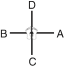

# SO-SAN

> 🔊 **Prononciation :** [서산](../audio/tul/so-san.m4a)

> **Grade :** 5e Dan

* **Nombre de mouvements :**  72
* **Diagramme au sol :**  (Hanja pour l'Érudit / Lettré)

| Diagramme | Description |
| ------ | ------ |
|  | SO-SAN est le pseudonyme du moine célèbre Choi Hyong Ung (1520-1604) de la dynastie Yi. Les 72 mouvements font référence à son âge lorsqu'il organisa un corps d'élite de moines-soldats, avec l'aide de son élève Sa Myunh Dang, afin de repousser les pirates japonais qui s'étaient emparés de la quasi-totalité de la péninsule coréenne en 1592. |

## Origine et contexte historique

* **Contexte socio-religieux :** Alors que les moines étaient socialement marginalisés par les élites confucéennes Joseon, So-San et son disciple Sa-Myung Dang prirent les armes par compassion humaine pour sauver la population de la famine et de l'extermination, illustrant l'intégration totale de la force au service de la préservation de la vie.

## Liste Détaillée des Mouvements

### Posture de départ : position de préparation fermée A

1. Glisser vers C pour former une position arrière rapprochée sur la jambe droite vers D tout en exécutant un blocage de garde moyen vers D avec l'avant-bras.
   *([Dwitbal so palmok kaunde daebi makgi](../Techniques/Dwitbal-So-Palmok-Kaunde-Daebi-Makgi.md))*
2. Exécuter un coup de poing vertical moyen vers D avec le poing droit tout en formant une position de marche gauche vers D, en glissant le pied gauche.
   *(Gunnun so kaunde bandae sewo jirugi)*
3. Glisser vers C pour former une position arrière rapprochée sur la jambe gauche vers D tout en exécutant un blocage de garde moyen vers D avec l'avant-bras.
   *([Dwitbal so palmok kaunde daebi makgi](../Techniques/Dwitbal-So-Palmok-Kaunde-Daebi-Makgi.md))*
4. Exécuter un coup de poing vertical moyen vers D avec le poing gauche tout en formant une position de marche droite vers D, en glissant le pied droit.
   *(Gunnun so kaunde bandae sewo jirugi)*
5. Exécuter un blocage latéral haut vers BC avec le tranchant de la main droite tout en formant une position de marche gauche vers BC.
   *([Gunnun so sonkal nopunde bandae yop makgi](../makgi/yop-makgi.md))*
6. Exécuter un coup de poing moyen vers BD avec le poing gauche tout en formant une position assise vers BD.
   *([Annun so wen joomuk kaunde jirugi](../Techniques/Annun-So-Wen-Joomuk-Kaunde-Jirugi.md))*
   > *Exécuter 5 et 6 en mouvement rapide.*
7. Exécuter un blocage latéral haut vers BD avec le tranchant de la main gauche tout en formant une position de marche droite vers BD.
   *([Gunnun so sonkal nopunde bandae yop makgi](../makgi/yop-makgi.md))*
8. Exécuter un coup de poing moyen vers BD avec le poing droit tout en formant une position assise vers BD.
   *([Annun so orun joomuk kaunde jirugi](../Techniques/Annun-So-Orun-Joomuk-Kaunde-Jirugi.md))*
   > *Exécuter 7 et 8 en mouvement rapide.*
9. Déplacer le pied droit vers C en tournant dans le sens horaire pour former une position parallèle vers A tout en exécutant une frappe horizontale avec un double tranchant de la main.
   *(Narani so sang sonkal soopyong taerigi)*
10. Exécuter un coup de pied latéral perçant haut vers C avec le pied droit en gardant les mains dans la position du mouvement 9.
   *([Nopunde yopcha jirugi](../chagi/yop-cha-jirugi.md))*
11. Exécuter un coup de pied circulaire haut vers D avec le pied droit.
   *([Nopunde dollyo chagi](../chagi/dollyo-chagi.md))*
   > *Exécuter 10 et 11 en un coup de pied consécutif.*
12. Abaisser le pied droit vers D en mouvement sauté pour former une position en X droite vers BD tout en exécutant une frappe latérale haute vers D avec le revers du poing droit et en amenant la pulpe des doigts de la main gauche vers le côté du poing droit.
   *([Twigi](../Techniques/Twigi.md), orun kyocha so dung joomuk nopunde baro yop taerigi)*
   > *Distance de saut : 1 position de marche.*
13. Déplacer le pied gauche vers C pour former une position parallèle vers B tout en exécutant une frappe horizontale avec un double tranchant de la main.
   *(Narani so sang sonkal soopyong taerigi)*
14. Exécuter un coup de pied latéral perçant haut vers C avec le pied gauche en gardant les mains dans la position du mouvement 13.
   *([Nopunde yopcha jirugi](../chagi/yop-cha-jirugi.md))*
15. Exécuter un coup de pied circulaire haut vers D avec le pied gauche.
   *([Nopunde dollyo chagi](../chagi/dollyo-chagi.md))*
   > *Exécuter 14 et 15 en un coup de pied consécutif.*
16. Abaisser le pied gauche vers D en mouvement sauté pour former une position en X gauche vers AD tout en exécutant une frappe latérale haute vers D avec le revers du poing gauche et en amenant la pulpe des doigts de la main droite vers le côté du poing gauche.
   *(Twigi, [wen kyocha so dung joomuk nopunde baro yop taerigi](../Techniques/Wen-Kyocha-So-Dung-Joomuk-Nopunde-Baro-Yop-Taerigi.md))*
   > *Distance de saut : 1 position de marche.*
17. Déplacer le pied gauche vers A pour former une position en L droite vers A en exécutant un coup de poing bas vers A avec un gauche double poing.
   *([Niunja so doo joomuk najunde jirugi](../Techniques/Niunja-So-Doo-Joomuk-Najunde-Jirugi.md))*
18. Ramener la paume droite sur le devant du poing gauche puis vriller les dans le sens anti-horaire jusqu'à ce que le revers du poing gauche fait visage vers le bas tout en formant une position de marche gauche vers A, en glissant le pied gauche. exécuter en mouvement de relâchement.
   *([Gunnun so jappyosul tae](../Techniques/Gunnun-So-Jappyosul-Tae.md))*
19. Exécuter un coup de poing haut vers A avec le poing droit tout en maintenant une position de marche gauche vers A.
   *([Gunnun so nopunde bandae jirugi](../Techniques/Gunnun-So-Nopunde-Jirugi.md))*
20. Déplacer le pied gauche sur ligne AB pour former une position en L gauche vers B tout en exécutant un coup de poing bas vers B avec un droit double poing.
   *([Niunja so doo joomuk najunde jirugi](../Techniques/Niunja-So-Doo-Joomuk-Najunde-Jirugi.md))*
21. Ramener la paume gauche sur le devant du poing droit puis vriller les dans le sens horaire jusqu'à ce que le revers du poing droit fait visage vers le bas tout en formant une position de marche droite vers B, en glissant le pied droit. exécuter en mouvement de relâchement.
   *([Gunnun so jappyosul tae](../Techniques/Gunnun-So-Jappyosul-Tae.md))*
22. Exécuter un coup de poing haut vers B avec le poing gauche tout en maintenant une position de marche droite vers B.
   *([Gunnun so nopunde bandae jirugi](../Techniques/Gunnun-So-Nopunde-Jirugi.md))*
23. Glisser vers B pour former une position en L droite vers B tout en exécutant un coup de poing renversé vers B avec le poing à phalange médiane droit et en amenant le côté du poing gauche devant l'épaule droite.
   *(Niunja so joongji joomuk baro dwijibo jirugi)*
24. Exécuter une frappe frontale vers B avec le revers du poing droit tout en formant une position de marche gauche vers B, en glissant le pied droit.
   *([Gunnun so dung joomuk bandae ap taerigi](../Techniques/Gunnun-So-Dung-Joomuk-Bandae-Ap-Taerigi.md))*
25. Glisser vers A, en tournant dans le sens horaire pour former une position en L gauche vers A tout en exécutant un coup de poing renversé vers A avec le poing à phalange médiane gauche et en amenant le côté du poing droit devant l'épaule gauche.
   *(Niunja so joongji joomuk baro dwijibo jirugi)*
26. Exécuter une frappe frontale vers A avec le revers du poing gauche tout en formant une position de marche droite vers A, en glissant le pied gauche.
   *([Gunnun so dung joomuk bandae ap taerigi](../Techniques/Gunnun-So-Dung-Joomuk-Bandae-Ap-Taerigi.md))*
27. Déplacer le pied gauche vers D pour former un droit position de marche de préparation vers C.
   *([Gunnun junbi sogi](../Techniques/Gunnun-Junbi-Sogi.md))*
28. Sauter pour exécuter un coup de pied avant fouetté sauté vers C avec le pied droit.
   *([Twimyo apcha busigi](../chagi/apcha-busigi.md))*
   > *Distance de saut : 1 position de marche.*
29. Atterrir vers C pour former une position en L gauche vers C tout en exécutant un blocage de garde moyen vers C avec le tranchant de la main.
   *([Niunja so sonkal kaunde daebi makgi](../Techniques/Niunja-So-Sonkal-Kaunde-Daebi-Makgi.md))*
30. Déplacer le pied droit vers D pour former une position de marche gauche vers C tout en exécutant un blocage frontal haut avec l'avant-bras droit.
   *([Gunnun so palmok nopunde bandae ap makgi](../makgi/ap-makgi.md))*
31. Exécuter un coup de poing moyen vers C avec le poing gauche tout en décalant vers C, en maintenant une position de marche gauche vers C.
   *([Gunnun so kaunde jirugi](../Techniques/Gunnun-So-Kaunde-Jirugi.md))*
32. Tourner dans le sens horaire, en pivotant avec le pied gauche pour former une position de marche droite vers D tout en exécutant un blocage frontal haut avec l'avant-bras gauche.
   *([Gunnun so palmok nopunde bandae ap makgi](../makgi/ap-makgi.md))*
33. Exécuter un coup de poing moyen vers D avec le poing droit tout en décalant vers D, en maintenant une position de marche droite vers D.
   *([Gunnun so kaunde jirugi](../Techniques/Gunnun-So-Kaunde-Jirugi.md))*
34. Exécuter un double blocage moyen des mains arquées vers BC tout en formant une position de marche gauche vers BC et en regardant à travers les mains.
   *([Gunnun so kaunde doo bandalson makgi](../makgi/doo-bandalson-makgi.md))*
35. Exécuter une frappe intérieure haute vers BC avec le tranchant de la main droite et en amenant le côté du poing gauche devant l'épaule droite tout en maintenant une position de marche gauche vers BC.
   *(Gunnun so sonkal nopunde bandae anuro taerigi)*
36. Exécuter un blocage circulaire vers BD avec l'avant-bras intérieur gauche tout en formant une position de marche droite vers D.
   *([Gunnun so an palmok dollimyo makgi](../makgi/dollimyo-makgi.md))*
37. Exécuter un coup de poing haut vers D avec le poing droit tout en maintenant une position de marche droite vers D.
   *([Gunnun so nopunde jirugi](../Techniques/Gunnun-So-Nopunde-Jirugi.md))*
38. Exécuter un coup de pied avant fouetté bas vers D avec le pied gauche en gardant les mains dans la position du mouvement 37.
   *([Najunde apcha busigi](../chagi/apcha-busigi.md))*
39. Abaisser le pied gauche vers D pour former une position de marche gauche vers D tout en exécutant un coup de poing moyen vers D avec le poing gauche.
   *([Gunnun so kaunde jirugi](../Techniques/Gunnun-So-Kaunde-Jirugi.md))*
40. Exécuter un coup de poing moyen vers D avec le poing droit tout en maintenant une position de marche gauche vers D.
   *([gunnun so kaunde bandae jirugi](../Techniques/Gunnun-So-Kaunde-Bandae-Jirugi.md))*
   > *Exécuter 39 et 40 en mouvement rapide.*
41. Exécuter un blocage montant avec les tranchants des mains croisées tout en maintenant une position de marche gauche vers D.
   *([Gunnun so kyocha sonkal chookyo makgi](../makgi/chookyo-makgi.md))*
42. Exécuter un double blocage moyen des mains arquées vers AC tout en formant une position de marche droite vers AC et en regardant à travers les mains.
   *([Gunnun so kaunde doo bandalson makgi](../makgi/doo-bandalson-makgi.md))*
43. Exécuter une frappe intérieure haute vers AC avec le tranchant de la main gauche et en amenant le côté du poing droit devant l'épaule gauche tout en maintenant une position de marche droite vers AC.
   *(Gunnun so sonkal nopunde bandae anuro taerigi)*
44. Exécuter un blocage circulaire vers AD avec l'avant-bras intérieur droit tout en formant une position de marche gauche vers D.
   *([Gunnun so an palmok dollimyo makgi](../makgi/dollimyo-makgi.md))*
45. Exécuter un coup de poing haut vers D avec le poing gauche tout en maintenant une position de marche gauche vers D.
   *([Gunnun So joomuk nopunde jirugi](../Techniques/Joomuk-Nopunde-Jirugi.md))*
46. Exécuter un coup de pied avant fouetté bas vers D avec le pied droit en gardant les mains dans la position du mouvement 45.
   *([Najunde apcha busigi](../chagi/apcha-busigi.md))*
47. Abaisser le pied droit vers D pour former une position de marche droite vers D tout en exécutant un coup de poing moyen vers D avec le poing droit.
   *([Gunnun so kaunde jirugi](../Techniques/Gunnun-So-Kaunde-Jirugi.md))*
48. Exécuter un coup de poing moyen vers D avec le poing gauche tout en maintenant une position de marche droite vers D.
   *([Gunnun so kaunde bandae jirugi](../Techniques/Gunnun-So-Kaunde-Bandae-Jirugi.md))*
   > *Exécuter 47 et 48 en mouvement rapide.*
49. Exécuter un blocage montant avec les tranchants des mains croisées tout en maintenant une position de marche droite vers D.
   *([Gunnun so kyocha sonkal chookyo makgi](../makgi/chookyo-makgi.md))*
50. Déplacer le pied gauche vers D, puis glisser vers D, en tournant dans le sens anti-horaire pour former une position en L droite vers C tout en exécutant un blocage de garde bas vers C avec le tranchant de la main.
   *([Niunja so sonkal najunde daebi makgi](../makgi/sonkal-daebi-makgi.md))*
51. Sauter vers C, en pivotant dans le sens anti-horaire pour former une position en L droite vers D tout en exécutant un blocage de garde moyen vers D avec l'avant-bras.
   *([Twigi](../Techniques/Twigi.md), orun niunja so palmok kaunde daebi makgi)*
   > *Distance de saut : 1 position en L.*
52. Exécuter un blocage bas vers D avec le tranchant de la main droite et un blocage extérieur moyen vers D avec l'avant-bras intérieur gauche tout en formant une position de marche gauche vers D, en glissant le pied gauche.
   *([Gunnun so an palmok kaunde baro bakuro makgi](../makgi/bakuro-makgi.md) wa [sonkal najunde bandae makgi](../makgi/bandae-makgi.md))*
53. Exécuter un coup de poing haut vers D avec le poing droit tout en maintenant une position de marche gauche vers D.
   *([Gunnun so nopunde bandae jirugi](../Techniques/Gunnun-So-Nopunde-Jirugi.md))*
   > *Exécuter 52 et 53 en mouvement continu.*
54. Exécuter un coup de poing moyen vers D avec le poing gauche tout en formant une position en L droite vers D, en tirant le pied gauche.
   *([Niunja so kaunde yop jirugi](../Techniques/Niunja-So-Kaunde-Yop-Jirugi.md))*
55. Déplacer le pied droit vers D, puis glisser vers D, en tournant dans le sens horaire pour former une position en L gauche vers C tout en exécutant un blocage de garde bas vers C avec le tranchant de la main.
   *([Niunja so sonkal najunde daebi makgi](../makgi/sonkal-daebi-makgi.md))*
56. Sauter vers C, en pivotant dans le sens horaire pour former une position en L gauche vers D tout en exécutant un blocage de garde moyen vers D avec l'avant-bras.
   *(Twigi, [wen niunja so palmok kaunde daebi makgi](../Techniques/Wen-Niunja-So-Palmok-Kaunde-Daebi-Makgi.md))*
   > *Distance de saut : 1 position en L.*
57. Exécuter un blocage bas vers D avec le tranchant de la main gauche et un blocage extérieur moyen vers D avec l'avant-bras intérieur droit tout en formant une position de marche droite vers D en glissant le pied droit.
   *([gunnun so an palmok kaunde baro bakuro makgi](../makgi/bakuro-makgi.md) wa [sonkal najunde bandae makgi](../makgi/bandae-makgi.md))*
58. Exécuter un coup de poing haut vers D avec le poing gauche tout en maintenant une position de marche droite vers D.
   *([Gunnun so nopunde bandae jirugi](../Techniques/Gunnun-So-Nopunde-Jirugi.md))*
   > *Exécuter 57 et 58 en mouvement continu.*
59. Exécuter un coup de poing moyen vers D avec le poing droit tout en formant une position en L gauche vers D, en tirant le pied droit.
   *([Niunja so kaunde yop jirugi](../Techniques/Niunja-So-Kaunde-Yop-Jirugi.md))*
60. Déplacer le pied droit derrière le pied gauche, puis glisser vers C, pour former une position en L gauche vers D tout en exécutant un blocage en levant avec la paume droite.
   *([Niunja so sonbadak bandae duro makgi](../Techniques/Niunja-So-Sonbadak-Bandae-Duro-Makgi.md))*
61. Décaler vers D, en maintenant une position en L gauche vers D tout en exécutant un coup de poing moyen vers D avec le poing gauche.
   *([Niunja so kaunde baro jirugi](../Techniques/Niunja-So-Kaunde-Baro-Jirugi.md))*
62. Tourner dans le sens horaire tout en formant un gauche position de préparation pliée A vers C.
   *([Guburyo junbi sogi A](../Techniques/Guburyo-Junbi-Sogi-A.md))*
63. Exécuter un coup de pied latéral perçant haut vers C avec le pied droit, en gardant les mains dans la position du mouvement 62.
   *([Nopunde yopcha jirugi](../chagi/yop-cha-jirugi.md))*
64. Abaisser le pied droit vers C, pour former une position de marche droite vers C tout en exécutant un coup de poing moyen vers C avec le poing gauche.
   *([Gunnun so kaunde bandae jirugi](../Techniques/Gunnun-So-Kaunde-Bandae-Jirugi.md))*
65. Déplacer le pied droit vers D, pour former une position en L droite vers C tout en exécutant un blocage de garde moyen vers C avec le tranchant de la main.
   *([Niunja so sonkal kaunde daebi makgi](../Techniques/Niunja-So-Sonkal-Kaunde-Daebi-Makgi.md))*
66. Déplacer le pied gauche derrière le pied droit, puis glisser vers D, pour former une position en L droite vers C tout en exécutant un blocage en levant avec la paume gauche.
   *([Niunja so sonbadak bandae duro makgi](../Techniques/Niunja-So-Sonbadak-Bandae-Duro-Makgi.md))*
67. Décaler vers C, en maintenant une position en L droite vers C tout en exécutant un coup de poing moyen vers C avec le poing droit.
   *([Niunja so kaunde baro jirugi](../Techniques/Niunja-So-Kaunde-Baro-Jirugi.md))*
68. Tourner dans le sens anti-horaire tout en formant un droit position de préparation pliée A vers C.
   *([Guburyo junbi sogi A](../Techniques/Guburyo-Junbi-Sogi-A.md))*
69. Exécuter un coup de pied latéral perçant haut vers D avec le pied gauche, en gardant les mains dans la position du mouvement 68.
   *([Nopunde yopcha jirugi](../chagi/yop-cha-jirugi.md))*
70. Abaisser le pied gauche vers D pour former une position de marche gauche vers D tout en exécutant un coup de poing moyen vers D avec le poing droit.
   *([Gunnun so kaunde bandae jirugi](../Techniques/Gunnun-So-Kaunde-Bandae-Jirugi.md))*
71. Déplacer le pied gauche vers C pour former une position en L gauche vers D tout en exécutant un blocage de garde moyen vers D avec le tranchant de la main.
   *([Niunja so sonkal kaunde daebi makgi](../Techniques/Niunja-So-Sonkal-Kaunde-Daebi-Makgi.md))*
72. Exécuter un coup de poing haut vers D avec le poing droit tout en formant une position de marche droite vers D, en glissant le pied droit.
   *([Gunnun so nopunde jirugi](../Techniques/Gunnun-So-Nopunde-Jirugi.md))*
   > *Exécuter 71 et 72 en mouvement continu.*

### FIN : ramener le pied droit à la posture de départ
