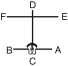

# TOI-GYE

> **Grade :** 3e Gup — Ceinture bleue barre rouge

* **Nombre de mouvements :**  37
* **Diagramme au sol :**  (Hanja pour l'Érudit / Lettré)

| Diagramme | Description |
| ------ | ------ |
|  | TOI-GYE est le nom de plume du célèbre érudit Yi Hwang (XVIe siècle), une autorité reconnue sur le néo-confucianisme. Les 37 mouvements se rapportent à son lieu de naissance situé sur le 37e degré de latitude, et le diagramme représente l'érudit (lettré). |

[TOI-GYE](https://vimeo.com/96867780)

## Liste Détaillée des Mouvements

### Posture de départ : position de préparation fermée B

1. Déplacer le pied gauche vers B pour former une position en L droite vers B tout en exécutant un blocage moyen vers B avec l'avant-bras intérieur gauche.
   *([Niunja so an palmok kaunde makgi](../Techniques/Niunja-So-An-Palmok-Kaunde-Makgi.md))*
2. Exécuter une pique basse vers B avec le droit renversé bout des doigts tout en formant une position de marche gauche vers B, en glissant le pied gauche vers B.
   *(Gunnun so dwijibun sonkut najunde tulgi)*
3. Ramener le pied gauche vers le pied droit pour former une position fermée vers D tout en exécutant une frappe arrière latérale vers C avec le revers du poing droit, en étendant le bras gauche vers le côté vers le bas.
   *(Moa so orun dung joomuk yopdwi taerigi)*

   > *Exécuter en mouvement lent.*

4. Déplacer le pied droit vers A pour former une position en L gauche vers A tout en exécutant un blocage moyen vers A avec l'avant-bras intérieur droit.
   *([Niunja so an palmok kaunde makgi](../Techniques/Niunja-So-An-Palmok-Kaunde-Makgi.md))*
5. Exécuter une pique basse vers A avec le gauche renversé bout des doigts tout en formant une position de marche droite vers A, en glissant le pied droit vers A.
   *(Gunnun so dwijibun sonkut najunde tulgi)*
6. Ramener le pied droit vers le pied gauche pour former une position fermée vers D tout en exécutant une frappe arrière latérale vers C avec le revers du poing gauche, en étendant le bras droit vers le côté vers le bas.
   *(Moa so wen dung joomuk yopdwi taerigi)*

   > *Exécuter en mouvement lent.*

7. Déplacer le pied gauche vers D pour former une position de marche gauche vers D tout en exécutant un blocage en pression avec un poings croisés.
   *([Gunnun so kyocha joomuk noollo makgi](../Techniques/Gunnun-So-Kyocha-Joomuk-Noollo-Makgi.md))*
8. Exécuter un coup de poing vertical haut vers D avec un poings jumelés tout en maintenant une position de marche gauche vers D.
   *([Gunnun so sang joomuk nopunde sewo jirugi](../Techniques/Gunnun-So-Sang-Joomuk-Nopunde-Sewo-Jirugi.md))*

   > *Exécuter 7 et 8 en mouvement continu.*

9. Exécuter un coup de pied avant fouetté moyen vers D avec le pied droit, en gardant le position de la mains comme s'ils étaient en 8.
   *([Kaunde apcha busigi](../chagi/apcha-busigi.md))*
10. Abaisser le pied droit vers D pour former une position de marche droite vers D tout en exécutant un coup de poing moyen vers D avec le poing droit.
   *([Gunnun so kaunde jirugi](../Techniques/Gunnun-So-Kaunde-Jirugi.md))*
11. Exécuter un coup de poing moyen vers D avec le poing gauche tout en maintenant une position de marche droite vers D.
   *([Gunnun so kaunde bandae jirugi](../Techniques/Gunnun-So-Kaunde-Bandae-Jirugi.md))*
12. Ramener le pied gauche vers le pied droit pour former une position fermée vers F tout en exécutant une double pique du coude latérale.
   *([Moa so sang yop palkup tulgi](../jirugi/sang-yop-palkup-tulgi.md))*

   > *Exécuter en mouvement lent.*

13. Déplacer le pied droit vers F en un en écrasant mouvement pour former une position assise vers C tout en exécutant un blocage en W vers C avec l'avant-bras extérieur droit.
   *([Annun so bakat palmok san makgi](../Techniques/Annun-So-Bakat-Palmok-San-Makgi.md))*
14. Déplacer le pied gauche vers F en un en écrasant mouvement en tournant dans le sens horaire pour former une position assise vers D tout en exécutant un blocage en W vers D avec l'avant-bras extérieur gauche.
   *([Annun so bakat palmok san makgi](../Techniques/Annun-So-Bakat-Palmok-San-Makgi.md))*
15. Déplacer le pied gauche vers E en un en écrasant mouvement en tournant dans le sens horaire pour former une position assise vers C tout en exécutant un blocage en W vers C avec l'avant-bras extérieur gauche.
   *([Annun so bakat palmok san makgi](../Techniques/Annun-So-Bakat-Palmok-San-Makgi.md))*
16. Déplacer le pied droit vers E en un en écrasant mouvement en tournant dans le sens anti-horaire pour former une position assise vers D tout en exécutant un blocage en W vers D avec l'avant-bras extérieur droit.
   *([Annun so bakat palmok san makgi](../Techniques/Annun-So-Bakat-Palmok-San-Makgi.md))*
17. Déplacer le pied gauche vers E en un en écrasant mouvement en tournant dans le sens horaire pour former une position assise vers C tout en exécutant un blocage en W vers C avec l'avant-bras extérieur gauche.
   *([Annun so bakat palmok san makgi](../Techniques/Annun-So-Bakat-Palmok-San-Makgi.md))*
18. Déplacer le pied gauche vers F en un en écrasant mouvement en tournant dans le sens horaire pour former une position assise vers D tout en exécutant un blocage en W vers D avec l'avant-bras extérieur gauche.
   *([Annun so bakat palmok san makgi](../Techniques/Annun-So-Bakat-Palmok-San-Makgi.md))*
19. Ramener le pied droit vers le pied gauche puis déplacer le pied gauche vers D pour former une position en L droite vers D tout en exécutant un blocage poussée bas vers D avec le gauche double avant-bras.
   *([Niunja so doo palmok najunde miro makgi](../makgi/miro-makgi.md))*
20. Étendre les deux mains vers le haut comme si vers saisir l'adversaire’s tête tout en formant une position de marche gauche vers D, en glissant le pied gauche vers D.
   *(gunnun sogi)*
21. Exécuter un coup de pied montant avec le genou droit tout en tirant les deux mains vers le bas.
   *([Moorup ollyo chagi](../chagi/moorup-ollyo-chagi.md))*
22. Abaisser le pied droit vers le pied gauche puis déplacer le pied gauche vers C pour former une position en L droite vers C tout en exécutant un blocage de garde moyen vers C avec un tranchant de la main.
   *([Niunja so sonkal kaunde daebi makgi](../Techniques/Niunja-So-Sonkal-Kaunde-Daebi-Makgi.md))*
23. Exécuter un coup de pied avant fouetté latéral bas vers C avec le pied gauche, en gardant le position de la mains comme s'ils étaient en 22.
   *([Najunde yobap cha busigi](../Techniques/Najunde-Yobap-Cha-Busigi.md))*
24. Abaisser le pied gauche vers C pour former une position de marche gauche vers C tout en exécutant une pique haute vers C avec le gauche à plat bout des doigts.
   *([Gunnun so opun sonkut nopunde tulgi](../Techniques/Gunnun-So-Opun-Sonkut-Nopunde-Tulgi.md))*
25. Déplacer le pied droit vers C pour former une position en L gauche vers C tout en exécutant un blocage de garde moyen vers C avec un tranchant de la main.
   *([Niunja so sonkal kaunde daebi makgi](../Techniques/Niunja-So-Sonkal-Kaunde-Daebi-Makgi.md))*
26. Exécuter un coup de pied avant fouetté latéral bas vers C avec le pied droit, en gardant le position de la mains comme s'ils étaient en 25.
   *([Najunde yobap cha busigi](../Techniques/Najunde-Yobap-Cha-Busigi.md))*
27. Abaisser le pied droit vers C pour former une position de marche droite vers C tout en exécutant une pique haute vers C avec le droit à plat bout des doigts.
   *([Gunnun so opun sonkut nopunde tulgi](../Techniques/Gunnun-So-Opun-Sonkut-Nopunde-Tulgi.md))*
28. Déplacer le pied droit vers D pour former une position en L droite vers C tout en exécutant une frappe arrière latérale vers D avec le revers du poing droit et un blocage bas vers C avec l'avant-bras gauche.
   *(Niunja so dung joomuk baro yopdwi taerigi wa [palmok najunde bandae makgi](../makgi/bandae-makgi.md))*
29. Sauter vers C pour former une position en X droite vers A tout en exécutant un blocage en pression avec un poings croisés.
   *([Twigi](../Techniques/Twigi.md), orun kyocha so kyocha joomuk noollo makgi)*
30. Déplacer le pied droit vers C pour former une position de marche droite vers C tout en exécutant un blocage haut vers C avec le droit double avant-bras.
   *([Gunnun so doo palmok nopunde makgi](../Techniques/Gunnun-So-Doo-Palmok-Nopunde-Makgi.md))*
31. Déplacer le pied gauche vers B pour former une position en L droite vers B tout en exécutant un blocage de garde bas vers B avec un tranchant de la main.
   *([Niunja so sonkal najunde daebi makgi](../makgi/sonkal-daebi-makgi.md))*
32. Exécuter un blocage circulaire vers BD avec l'avant-bras intérieur droit tout en formant une position de marche gauche vers B, en glissant le pied gauche vers B.
   *([Gunnun so an palmok dollimyo makgi](../makgi/dollimyo-makgi.md))*
33. Ramener le pied gauche vers le pied droit puis déplacer le pied droit vers A pour former une position en L gauche vers A, en même temps en exécutant un blocage de garde bas vers A avec un tranchant de la main.
   *([Niunja so sonkal najunde daebi makgi](../makgi/sonkal-daebi-makgi.md))*
34. Exécuter un blocage circulaire vers AD avec l'avant-bras intérieur gauche tout en formant une position de marche droite vers A, en glissant le pied droit vers A.
   *([Gunnun so an palmok dollimyo makgi](../makgi/dollimyo-makgi.md))*
35. Exécuter un blocage circulaire vers CE avec l'avant-bras intérieur droit tout en formant une position de marche gauche vers CE.
   *([Gunnun so an palmok dollimyo makgi](../makgi/dollimyo-makgi.md))*
36. Exécuter un blocage circulaire vers AD avec l'avant-bras intérieur gauche tout en formant une position de marche droite vers A.
   *([Gunnun so an palmok dollimyo makgi](../makgi/dollimyo-makgi.md))*
37. Déplacer le pied droit sur ligne AB pour former une position assise vers D tout en exécutant un coup de poing moyen vers D avec le poing droit.
   *([Annun so orun joomuk kaunde jirugi](../Techniques/Annun-So-Orun-Joomuk-Kaunde-Jirugi.md))*

### FIN : ramener le pied droit à la posture de départ.

---

[← Index des formes](README.md) · [Histoire du Tul](../Theorie/encyclopedie-historique-tuls.md)
