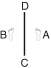

# TONG-IL

> 🔊 **Prononciation :** [통일](../audio/tul/tong-il.m4a)

> **Grade :** 6e Dan

* **Nombre de mouvements :**  56
* **Diagramme au sol :**  (Ligne verticale unique - Symbolise la race homogène unifiée)

| Diagramme | Description |
| ------ | ------ |
|  | TONG-IL exprime la résolution et la volonté inébranlable d'unifier la Corée, divisée de force depuis l'année 1945. Le diagramme (\|) symbolise le peuple coréen homogène, uni et indivisible. |

## Origine et contexte historique

* **Contexte géopolitique moderne :** Tong-Il est le Tul le plus haut de l'école Chang-Hun. Il incarne l'aspiration suprême de paix, d'unité fraternelle et le deuil spirituel d'une nation scindée en deux par les tensions idéologiques de la Guerre Froide. Il appelle chaque pratiquant à œuvrer activement pour la justice internationale et l'unification pacifique des peuples.

## Liste Détaillée des Mouvements

### Posture de départ : position parallèle avec les dos des mains superposés

1. Déplacer le pied droit vers C pour former une position de marche gauche vers D tout en exécutant un coup de poing moyen vers D avec les poings jumelés.
   *(Gunnun so sang joomuk kaunde jirugi)*
   > *Exécuter en mouvement lent.*
2. Déplacer le pied gauche vers C pour former une position de marche droite vers D tout en exécutant une frappe horizontale avec un double tranchant de la main.
   *([Gunnun so sang sonkal soopyong taerigi](../Techniques/Gunnun-So-Sang-Sonkal-Soopyong-Taerigi.md))*
   > *Exécuter en mouvement lent.*
3. Déplacer le pied gauche vers D, pour former une position arrière rapprochée sur la jambe droite vers D tout en exécutant un blocage intérieur moyen vers D avec l'avant-bras extérieur gauche.
   *([Dwitbal so bakat palmok kaunde anuro bandae makgi](../Techniques/Dwitbal-So-Bakat-Palmok-Kaunde-Anuro-Bandae-Makgi.md))*
4. Exécuter un blocage intérieur bas vers D avec la paume droite tout en formant une position de marche gauche vers D, en glissant le pied droit, et en amenant le côté du poing gauche devant l'épaule droite.
   *([Gunnun so sonbadak najunde anuro bandae makgi](../makgi/bandae-makgi.md))*
5. Déplacer le pied droit vers D, pour former une position en L gauche vers D tout en exécutant un coup de poing moyen vers D avec le poing droit.
   *([Niunja so kaunde yop jirugi](../Techniques/Niunja-So-Kaunde-Yop-Jirugi.md))*
6. Exécuter un coup de poing moyen vers D avec le poing gauche tout en maintenant une position en L gauche vers D.
   *([Niunja so kaunde baro jirugi](../Techniques/Niunja-So-Kaunde-Baro-Jirugi.md))*
   > *Exécuter 5 et 6 en mouvement rapide.*
7. Déplacer le pied gauche vers D en un mouvement étampé pour former une position en L droite vers D tout en exécutant une frappe extérieure haute vers D avec le revers de la main gauche.
   *(Niunja so sondung nopunde bakuro taerigi)*
8. Exécuter un coup de pied vertical vers l'intérieur vers la paume gauche avec le tranchant interne du pied droit.
   *([Balkal dung anuro sewo chagi](../Techniques/Balkal-Dung-Anuro-Sewo-Chagi.md))*
9. Abaisser le pied droit vers D en un mouvement étampé, pour former une position en L gauche vers D tout en exécutant une frappe extérieure haute vers D avec le revers de la main droite.
   *(Niunja so sondung nopunde bakuro taerigi)*
10. Exécuter un coup de pied vertical vers l'intérieur vers la paume droite avec le tranchant interne du pied gauche.
   *([Balkal dung anuro sewo chagi](../Techniques/Balkal-Dung-Anuro-Sewo-Chagi.md))*
11. Abaisser le pied gauche vers D, puis exécuter un blocage horizontal avec une paumes jumelées tout en formant une position en L droite vers D, en glissant le pied gauche.
   *(Niunja so sang sonbadak soopyong makgi)*
   > *Exécuter en mouvement lent.*
12. Déplacer le pied droit vers D, pour former une position de marche droite vers D tout en exécutant un blocage latéral haut vers D avec le revers de la main droite.
   *([Gunnun so sonkal dung nopunde yop makgi](../makgi/nopunde-yop-makgi.md))*
   > *Exécuter en mouvement lent.*
13. Exécuter un blocage latéral moyen vers D avec le revers de la main gauche tout en maintenant une position de marche droite vers D.
   *([Gunnun so sonkal dung kaunde bandae yop makgi](../makgi/yop-makgi.md))*
   > *Exécuter en mouvement lent.*
14. Exécuter un coup de poing moyen vers D avec le poing droit tout en maintenant une position de marche droite vers D.
   *([Gunnun so kaunde jirugi](../Techniques/Gunnun-So-Kaunde-Jirugi.md))*
15. Exécuter un coup de poing moyen vers D avec le poing gauche tout en maintenant une position de marche droite vers D.
   *([Gunnun so kaunde bandae jirugi](../Techniques/Gunnun-So-Kaunde-Bandae-Jirugi.md))*
   > *Exécuter 14 et 15 en mouvement rapide.*
16. Exécuter un coup de pied descendant vers AC avec le pied droit, en gardant les mains dans la position du mouvement 15.
   *([Naeryo chagi](../chagi/naeryo-chagi.md))*
17. Abaisser le pied droit vers C en un mouvement étampé, pour former une position en L gauche vers C tout en exécutant une frappe descendante vers C avec le revers du poing droit.
   *([Niunja so dung joomuk bandae naeryo taerigi](../jirugi/naeryo-taerigi.md))*
18. Exécuter un coup de pied vertical vers l'extérieur vers BC avec le pied gauche, en gardant les mains dans la position du mouvement 17.
   *([Bakuro sewo chagi](../Techniques/Bakuro-Sewo-Chagi.md))*
19. Abaisser le pied gauche vers C en un mouvement étampé pour former une position en L droite vers C tout en exécutant une frappe descendante vers C avec le revers du poing gauche.
   *([Niunja so dung joomuk bandae naeryo taerigi](../jirugi/naeryo-taerigi.md))*
20. Exécuter un coup de poing haut vers D avec le poing gauche tout en formant une position de marche droite vers D, en pivotant avec le pied gauche.
   *([Gunnun so nopunde bandae jirugi](../Techniques/Gunnun-So-Nopunde-Jirugi.md))*
21. Exécuter un coup de poing haut vers D avec le poing droit tout en maintenant une position de marche droite vers D.
   *([Gunnun so nopunde jirugi](../Techniques/Gunnun-So-Nopunde-Jirugi.md))*
   > *Exécuter 20 et 21 en mouvement rapide.*
22. Déplacer le pied gauche vers D, pour former une position arrière rapprochée sur la jambe droite vers D tout en exécutant un blocage montant avec le dos du poignet gauche.
   *([Dwitbal so sonmok dung bandae ollyo makgi](../Techniques/Dwitbal-So-Sonmok-Dung-Bandae-Ollyo-Makgi.md))*
23. Déplacer le pied droit vers D pour former une position arrière rapprochée sur la jambe gauche vers D tout en exécutant un blocage montant avec le dos du poignet droit.
   *([Dwitbal so sonmok dung bandae ollyo makgi](../Techniques/Dwitbal-So-Sonmok-Dung-Bandae-Ollyo-Makgi.md))*
24. Déplacer le pied gauche vers C, pour former une position de marche gauche vers C tout en exécutant un blocage en pression avec la paume gauche.
   *([Gunnun so sonbadak baro noollo makgi](../Techniques/Gunnun-So-Sonbadak-Baro-Noollo-Makgi.md))*
25. Déplacer le pied droit vers C pour former une position de marche droite vers C tout en exécutant un blocage en pression avec la paume droite.
   *([Gunnun so sonbadak baro noollo makgi](../Techniques/Gunnun-So-Sonbadak-Baro-Noollo-Makgi.md))*
   > *Exécuter 24 et 25 en mouvement lent.*
26. Ramener le pied gauche vers le pied droit pour former une position fermée vers C tout en amenant le revers des deux mains devant le bas-ventre en un mouvement circulaire, en frappant la paume gauche avec le tranchant de la main droite.
   *(Moa sogi)*
27. Déplacer le pied gauche vers D, pour former une position de marche gauche vers D tout en exécutant un blocage montant avec le tranchant de la main gauche.
   *([Gunnun so sonkal chookyo makgi](../makgi/chookyo-makgi.md))*
28. Exécuter un coup de poing haut vers D avec le poing droit tout en maintenant une position de marche gauche vers D.
   *([Gunnun so nopunde bandae jirugi](../Techniques/Gunnun-So-Nopunde-Jirugi.md))*
29. Glisser vers D pour former une position en L gauche vers D tout en exécutant un coup de poing renversé vers D avec le poing gauche, en amenant le côté du poing droit devant l'épaule gauche.
   *(Niunja so baro dwijibo jirugi)*
30. Déplacer le pied droit vers C, pour former une position de marche gauche vers D tout en exécutant une pique haute avec le bout des doigts droit en angle.
   *(Gunnun so homi sonkut nopunde bandae tulgi)*
31. Déplacer le pied gauche sur ligne CD pour former une position de marche droite vers C tout en exécutant un blocage montant avec le tranchant de la main droite.
   *([Gunnun so sonkal chookyo makgi](../makgi/chookyo-makgi.md))*
32. Exécuter un coup de poing haut vers C avec le poing gauche tout en maintenant une position de marche droite vers C.
   *([Gunnun so nopunde bandae jirugi](../Techniques/Gunnun-So-Nopunde-Jirugi.md))*
33. Glisser vers C pour former une position en L droite vers C tout en exécutant un coup de poing renversé vers C avec le poing droit, en amenant le côté du poing gauche devant l'épaule droite.
   *(Niunja so baro dwijibo jirugi)*
34. Déplacer le pied gauche vers D, pour former une position de marche droite vers C tout en exécutant une pique haute avec le bout des doigts gauche en angle.
   *(Gunnun so homi sonkut nopunde bandae tulgi)*
35. Exécuter un blocage de garde bas vers C avec un revers de la main en un mouvement circulaire tout en formant une position en L gauche vers C, en pivotant avec le pied gauche.
   *([Niunja so sonkal dung najunde daebi makgi](../makgi/najunde-daebi-makgi.md))*
36. Exécuter un blocage de garde bas vers D avec un revers de la main en un mouvement circulaire tout en formant une position en L droite vers D, en pivotant avec le pied droit.
   *([Niunja so sonkal dung najunde daebi makgi](../makgi/najunde-daebi-makgi.md))*
37. Exécuter un blocage bas vers D avec l'avant-bras droit et un blocage extérieur moyen vers D avec le tranchant de la main gauche tout en formant une position de marche gauche vers D, en glissant le pied gauche.
   *([Gunnun so sonkal kaunde baro bakuro makgi](../makgi/bakuro-makgi.md) wa [palmok najunde bandae makgi](../makgi/bandae-makgi.md))*
38. Déplacer le pied droit vers D en un mouvement étampé pour former une position de marche droite vers D tout en exécutant un coup de poing vertical haut vers D avec les poings jumelés.
   *([Gunnun so sang joomuk nopunde sewo jirugi](../Techniques/Gunnun-So-Sang-Joomuk-Nopunde-Sewo-Jirugi.md))*
39. Tirer le tranchant interne du pied droit vers l'articulation du genou gauche, pour former une position sur une jambe gauche vers D tout en frappant la paume gauche avec l'arrière de l'avant-bras droit.
   *([Waebal so dungpalmok bandae taerigi](../Techniques/Waebal-So-Dungpalmok-Bandae-Taerigi.md))*
40. Exécuter un coup de pied arrière perçant moyen vers C avec le pied droit, en tirant les deux mains dans la direction opposée.
   *([Kaunde dwitcha jirugi](../chagi/dwit-cha-jirugi.md))*
41. Abaisser le pied droit vers C pour former une position assise vers A tout en exécutant un blocage en W avec l'avant-bras extérieur.
   *([Annun so bakat palmok san makgi](../Techniques/Annun-So-Bakat-Palmok-San-Makgi.md))*
42. Glisser vers C en maintenant une position assise vers A tout en exécutant un blocage en W avec l'avant-bras extérieur.
   *([Annun so bakat palmok san makgi](../Techniques/Annun-So-Bakat-Palmok-San-Makgi.md))*
43. Déplacer le pied droit vers D en un mouvement étampé, en tournant dans le sens anti-horaire pour former une position assise vers B tout en exécutant un blocage en W avec l'avant-bras extérieur.
   *([Annun so orun bakat palmok san makgi](../Techniques/Annun-So-Orun-Bakat-Palmok-San-Makgi.md))*
44. Glisser vers C, en maintenant une position assise vers B tout en exécutant un blocage en W avec l'avant-bras extérieur.
   *([Annun so bakat palmok san makgi](../Techniques/Annun-So-Bakat-Palmok-San-Makgi.md))*
45. Tirer le tranchant interne du pied gauche vers l'articulation du genou droit, pour former une position sur une jambe droite vers C tout en frappant la paume droite avec l'arrière de l'avant-bras gauche.
   *([Waebal so dungpalmok bandae taerigi](../Techniques/Waebal-So-Dungpalmok-Bandae-Taerigi.md))*
46. Exécuter un coup de pied arrière perçant haut vers D avec le pied gauche, en tirant les deux mains dans la direction opposée.
   *([Nopunde dwitcha jirugi](../chagi/dwit-cha-jirugi.md))*
47. Abaisser le pied gauche vers C en mouvement sauté, pour former une position en X gauche vers C tout en exécutant un blocage en pression avec les poings croisés.
   *(Twigi, [wen kyocha so kyocha joomuk noollo makgi](../Techniques/Wen-Kyocha-So-Kyocha-Joomuk-Noollo-Makgi.md))*
   > *Distance de saut : 1 position de marche.*
48. Déplacer le pied droit vers D, pour former une position de marche gauche vers C tout en exécutant une frappe frontale avec le dessous du poing gauche.
   *(Gunnun so mit joomuk ap taerigi)*
49. Déplacer le pied droit vers C pour former une position de marche droite vers C tout en exécutant une frappe frontale avec le dessous du poing droit.
   *(Gunnun so mit joomuk ap taerigi)*
50. Exécuter un blocage poussée moyen vers C avec la paume gauche tout en maintenant une position de marche droite vers C.
   *([Gunnun so sonbadak kaunde bandae miro makgi](../makgi/miro-makgi.md))*
51. Exécuter un blocage circulaire vers A avec le tranchant de la main droite tout en formant une position de marche gauche vers AD.
   *([Gunnun so sonkal dollimyo makgi](../makgi/dollimyo-makgi.md))*
52. Déplacer le pied gauche vers C pour former une position de marche gauche vers C tout en exécutant un blocage poussée moyen vers C avec la paume droite.
   *([Gunnun so sonbadak kaunde bandae miro makgi](../makgi/miro-makgi.md))*
53. Exécuter un blocage circulaire vers B avec le tranchant de la main gauche tout en formant une position de marche droite vers BD.
   *([Gunnun so sonkal dollimyo makgi](../makgi/dollimyo-makgi.md))*
54. Exécuter un coup de pied latéral perçant haut vers D avec le pied droit, pour former un blocage de garde de l'avant-bras, puis l'abaisser vers le pied gauche pour former une position fermée vers D tout en exécutant une double pique arrière du coude latérale.
   *([Nopunde yopcha jirugi](../chagi/yop-cha-jirugi.md))*
55. Déplacer le pied gauche vers D, pour former une position assise vers A tout en exécutant un coup de poing latéral moyen vers D avec le poing gauche.
   *([Annun so wen joomuk kaunde yop jirugi](../Techniques/Annun-So-Wen-Joomuk-Kaunde-Yop-Jirugi.md))*
56. Exécuter un coup de poing moyen vers D avec le poing droit tout en formant une position de marche gauche vers D, en pivotant avec le pied gauche.
   *([Gunnun so kaunde bandae jirugi](../Techniques/Gunnun-So-Kaunde-Bandae-Jirugi.md))*

### FIN : ramener le pied droit à la posture de départ
