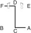

# UL-JI

> **Grade :** 4e Dan

* **Nombre de mouvements :**  42
* **Diagramme au sol :**  (En forme de Z inversé/caractère 乙)

| Diagramme | Description |
| ------ | ------ |
|  | UL-JI est nommé d'après le général Ul-Ji Moon Dok qui défendit la Corée avec succès en 612 apr. J.-C. contre un million de soldats chinois de la dynastie Sui, dirigés par Yang Je. En employant des tactiques de guérilla d'usure de type harcèlement rapide, Ul-Ji parvint à décimer une grande partie des forces ennemies. Le diagramme représente son nom de famille. Les 42 mouvements correspondent à l'âge du Général Choi Hong Hi lorsqu'il créa ce Tul. |

[UL-JI](https://youtu.be/714ULIHB2JU?si=pFTkQQyt-kemMtTy)

## Liste Détaillée des Mouvements

### Posture de départ : position parallèle avec les dos des mains croisés

1. Déplacer le pied gauche vers C pour former une position de marche droite vers D tout en exécutant une frappe horizontale avec jumelé côté poings.
   *(Gunnun so sang yop joomuk soopyong taerigi)*
2. Déplacer le pied droit vers C pour former une position de marche gauche vers D tout en exécutant un blocage en pression avec un poings croisés.
   *(Gunnun so kyocha joomuk noollo makgi)*
3. Exécuter un blocage montant avec un tranchant des mains croisées tout en maintenant une position de marche gauche vers D.
   *(Gunnun so kyocha sonkal chookyo makgi)*

   > *Exécuter 2 et 3 en mouvement continu.*

4. Exécuter une frappe frontale haute vers D avec le tranchant de la main droite en amenant la paume gauche sur le coude droit articulation tout en maintenant une position de marche gauche vers D.
   *(Gunnun so sonkal nopunde bandae ap taerigi)*
5. Déplacer le pied gauche vers C pour former une position assise vers B tout en exécutant une frappe horizontale vers C avec le gauche arrière main.
   *(Annun so wen sondung soopyong taerigi)*
6. Exécuter un coup de pied semi-circulaire moyen vers la paume gauche avec le pied droit.
   *(Kaunde bandal chagi)*
7. Abaisser le pied droit vers C, pour former une position assise vers A tout en en frappant la paume gauche avec le droit avant coude.
   *(Annun so orun ap palkup taerigi)*
8. Piquer vers B avec le gauche arrière coude en plaçant le droit côté poing sur le poing gauche tout en maintenant une position assise vers A.
   *(Annun so wen dwit palkup tulgi)*
9. Exécuter une frappe arrière latérale vers B avec le revers du poing droit et en étendant le bras gauche vers le côté-vers le bas tout en maintenant une position assise vers A.
   *(Annun so orun dung joomuk yopdwi taerigi)*
10. Ramener le pied gauche vers le pied droit, pour former une position fermée vers D, en même temps en piquant avec un jumelé côté coude.
   *(Moa so sang yop palkup tulgi)*
11. Croiser le pied gauche par-dessus le pied droit, pour former une position en X droite vers D tout en tournant le visage vers A, en gardant le position de la mains comme s'ils étaient en 10.
   *(Kyocha sogi)*

   > *Exécuter en mouvement rapide.*

12. Exécuter un coup de pied latéral perçant moyen vers A avec le pied droit en gardant le position de la mains comme s'ils étaient en 11.
   *(Kaunde yopcha jirugi)*
13. Abaisser le pied droit vers A, puis croiser le pied gauche par-dessus le pied droit, pour former une position en X droite vers D tout en exécutant une pique horizontale avec un jumelé coude.
   *(Kyocha so sang palkup soopyong tulgi)*
14. Déplacer le pied droit vers A pour former la position assise vers D tout en exécutant un coup de poing horizontal droit vers A.
   *(Annun so orun soopyong jirugi)*
15. Exécuter une frappe frontale haute vers D avec droit tranchant de la main, en amenant le gauche arrière main en avant du avant tout en se tenant vers le haut vers D.
   *(Sonkal nopunde ap taerigi)*
16. Exécuter un blocage double du tranchant de la main vers B tout en formant une position en L droite vers B, en pivotant avec le pied droit.
   *(Niunja so sang sonkal makgi)*
17. Sauter vers exécuter un coup de pied en vol vers B avec le pied droit tout en pivotant dans le sens horaire.
   *(Twio dolmyo chagi)*
18. Atterrir vers B pour former une position de marche droite vers B tout en exécutant un blocage moyen vers B avec le droit double avant-bras.
   *(Gunnun so doo palmok kaunde makgi)*
19. Ramener le pied gauche vers le pied droit pour former un position de préparation fermée B vers D.
   *(Moa junbi sogi B)*
20. Sauter vers D pour former une position en X droite vers BD tout en exécutant une frappe latérale haute vers B avec le revers du poing droit en amenant la pulpe des doigts gauche vers le droit côté poing.
   *(Twigi, orun kyocha so dung joomuk nopunde baro yop taerigi)*
21. Déplacer le pied gauche vers C pour former une position de marche droite vers D tout en exécutant un blocage montant avec l'avant-bras gauche.
   *(Gunnun so palmok bandae chookyo makgi)*
22. Exécuter un coup de pied avant fouetté moyen vers D avec le pied gauche en gardant le position de la mains comme s'ils étaient en 21.
   *(Kaunde apcha busigi)*
23. Abaisser le pied gauche vers D pour former une position de marche gauche vers D tout en exécutant un coup de poing haut vers D avec le poing droit.
   *(Gunnun so nopunde bandae jirugi)*
24. Déplacer le pied droit vers D pour former une position de marche droite vers D tout en exécutant une pique moyenne vers D avec la pique de doigts droite droit.
   *(Gunnun so sun sonkut kaunde tulgi)*
25. Déplacer le pied gauche vers D en tournant dans le sens anti-horaire pour former une position assise vers A tout en exécutant une frappe latérale haute vers D avec le revers du poing gauche.
   *(Annun so wen dung joomuk nopunde yop taerigi)*
26. Déplacer le pied droit vers F en tournant dans le sens anti-horaire pour former un droit position de marche de préparation vers F.
   *(Gunnun junbi sogi)*
27. Sauter vers exécuter un coup de pied haut sauté vers F avec le pied droit.
   *(Twimyo nopi chagi)*
28. Atterrir vers F pour former une position fixe droite vers F tout en exécutant un blocage d'arrêt vers F avec un tranchant des mains croisées.
   *(Gojung so kyocha sonkal momchau makgi)*
29. Déplacer le pied gauche vers F pour former une position en L droite vers F tout en exécutant un blocage en pression avec un poings croisés.
   *(Niunja so kyocha joomuk noollo makgi)*
30. Exécuter un coup de pied avant fouetté latéral moyen vers F avec le pied gauche tout en exécutant un blocage en écartement moyen avec l'avant-bras intérieur.
   *(Kaunde yobap cha busigi wa anpalmok kaunde hechyo makgi)*
31. Abaisser le pied gauche vers F pour former une position de marche gauche vers F tout en exécutant un coup de poing vertical haut vers F avec un poings jumelés.
   *(Gunnun so sang joomuk nopunde sewo jirugi)*
32. Déplacer le pied droit vers F pour former une position fixe droite vers F tout en exécutant un blocage extérieur moyen avec le tranchant de la main droite et un blocage poussée moyen avec la paume gauche.
   *(Gojung so sonkal kaunde bakuro baro makgi wa sonbadak kaunde bandae miro makgi)*
33. Glisser vers F pour former une position en L droite vers F tout en exécutant un coup de poing moyen vers F avec le poing gauche.
   *(Niunja so kaunde yop jirugi)*
34. Déplacer le pied gauche vers le côté arrière du pied droit et le pied droit vers E pour former une position en L droite vers F puis sauter vers E en maintenant une position en L droite vers F tout en exécutant un blocage de garde moyen vers F avec l'avant-bras.
   *(Niunja sogi, twigi, orun niunja so palmok kaunde daebi makgi)*
35. Exécuter un coup de pied circulaire moyen vers DF avec le pied droit.
   *(Kaunde dollyo chagi)*
36. Abaisser le pied droit vers F puis exécuter un coup de pied arrière perçant moyen vers F avec le pied gauche.
   *(Kaunde dwitcha jirugi)*
37. Abaisser le pied gauche vers F pour former une position en L droite vers F tout en exécutant un blocage de garde moyen vers F avec l'avant-bras.
   *(Niunja so palmok kaunde daebi makgi)*
38. Déplacer le pied gauche vers E pour former une position en L gauche vers F tout en exécutant un blocage montant vers F avec la paume droite.
   *(Niunja so sonbadak bandae ollyo makgi)*
39. Déplacer le pied droit vers E pour former une position de marche droite vers E tout en exécutant un blocage circulaire vers ED avec l'avant-bras intérieur gauche.
   *(Gunnun so anpalmok dollimyo makgi)*
40. Exécuter un blocage circulaire vers DE avec l'avant-bras intérieur droit tout en formant une position de marche gauche vers DF.
   *(Gunnun so anpalmok dollimyo makgi)*
41. Déplacer le pied gauche sur ligne EF pour former une position assise vers D tout en exécutant un coup de poing moyen vers D avec le poing gauche.
   *(Annun so wen joomuk kaunde jirugi)*
42. Exécuter un coup de poing moyen vers D avec le poing droit tout en maintenant une position assise vers D.
   *(Annun so orun joomuk kaunde jirugi)*

### FIN : ramener le pied gauche à la posture de départ.

---

[← Index des formes](README.md) · [Histoire du Tul](../Theorie/encyclopedie-historique-tuls.md)
