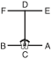

# WON-HYO

> **Grade :** 6e Gup — Ceinture verte

* **Nombre de mouvements :**  28
* **Diagramme au sol :**  (Hanja ou lettre capitale I)

| Diagramme | Description |
| ------ | ------ |
|  | WON-HYO fut le moine célèbre qui introduisit le bouddhisme sous la dynastie Silla en l'an 686. |

[WON-HYO](https://vimeo.com/107541045)

## Liste Détaillée des Mouvements

### Posture de départ : position de préparation fermée A

1. Déplacer le pied gauche vers B pour former une position en L droite vers B tout en exécutant un blocage double des avant-bras.
   *([Niunja so sang palmok makgi](../Techniques/Niunja-So-Sang-Palmok-Makgi.md))*
2. Exécuter une frappe intérieure haute vers B avec le tranchant de la main droite tout en amenant le gauche côté poing en avant de la épaule droite, en maintenant une position en L droite vers B.
   *(Niunja so sonkal nopunde anuro taerigi)*
3. Exécuter un coup de poing moyen vers B avec le poing gauche tout en formant une position fixe gauche vers B, en glissant le pied gauche vers B.
   *(Gojung so kaunde yop jirugi)*
4. Ramener le pied gauche vers le pied droit puis déplacer le pied droit vers A, pour former une position en L gauche vers A tout en exécutant un blocage double des avant-bras.
   *([Niunja so sang palmok makgi](../Techniques/Niunja-So-Sang-Palmok-Makgi.md))*
5. Exécuter une frappe intérieure haute vers A avec le tranchant de la main gauche tout en amenant le droit côté poing en avant de la épaule gauche, en maintenant une position en L gauche vers A.
   *(Niunja so sonkal nopunde anuro taerigi)*
6. Exécuter un coup de poing moyen vers A avec le poing droit tout en formant une position fixe droite vers A, en glissant le pied droit vers A.
   *(Gojung so kaunde yop jirugi)*
7. Ramener le pied droit vers le pied gauche puis tourner le visage vers D tout en formant un droit position de préparation pliée A vers D.
   *(guburyo junbi sogi A)*
8. Exécuter un coup de pied latéral perçant moyen vers D avec le pied gauche.
   *([Kaunde yopcha jirugi](../chagi/yop-cha-jirugi.md))*
9. Abaisser le pied gauche vers D pour former une position en L droite vers D tout en exécutant un blocage de garde moyen vers D avec un tranchant de la main.
   *([Niunja so sonkal kaunde daebi makgi](../Techniques/Niunja-So-Sonkal-Kaunde-Daebi-Makgi.md))*
10. Déplacer le pied droit vers D pour former une position en L gauche vers D tout en exécutant un blocage de garde vers D avec un tranchant de la main.
   *([Niunja so sonkal kaunde daebi makgi](../Techniques/Niunja-So-Sonkal-Kaunde-Daebi-Makgi.md))*
11. Déplacer le pied gauche vers D pour former une position en L droite vers D tout en exécutant un blocage de garde moyen vers D avec un tranchant de la main.
   *([Niunja so sonkal kaunde daebi makgi](../Techniques/Niunja-So-Sonkal-Kaunde-Daebi-Makgi.md))*
12. Déplacer le pied droit vers D pour former une position de marche droite vers D tout en exécutant une pique moyenne vers D avec le droit droit bout des doigts.
   *([Gunnun so sun sonkut kaunde tulgi](../Techniques/Sun-Sonkut-Kaunde-Tulgi.md))*
13. Déplacer le pied gauche vers E en tournant dans le sens anti-horaire pour former une position en L droite vers E, en même temps en exécutant un blocage double des avant-bras.
   *([Niunja so sang palmok makgi](../Techniques/Niunja-So-Sang-Palmok-Makgi.md))*
14. Exécuter une frappe intérieure haute vers E avec le tranchant de la main droite tout en amenant le gauche côté poing en avant de la épaule droite, en maintenant une position en L droite vers E.
   *(Niunja so sonkal nopunde anuro taerigi)*
15. Exécuter un coup de poing moyen vers E avec le poing gauche tout en formant une position fixe gauche vers E, en glissant le pied gauche vers E.
   *(Gojung so kaunde yop jirugi)*
16. Ramener le pied gauche vers le pied droit puis déplacer le pied droit vers F, pour former une position en L gauche vers F tout en exécutant un blocage double des avant-bras.
   *([Niunja so sang palmok makgi](../Techniques/Niunja-So-Sang-Palmok-Makgi.md))*
17. Exécuter une frappe intérieure haute vers F avec le tranchant de la main gauche tout en amenant le droit côté poing en avant de la épaule gauche, en maintenant une position en L gauche vers F.
   *(Niunja so sonkal nopunde anuro taerigi)*
18. Exécuter un coup de poing moyen vers F avec le poing droit tout en formant une position fixe droite vers F, en glissant le pied droit vers F.
   *(Gojung so kaunde yop jirugi)*
19. Ramener le pied droit vers le pied gauche puis déplacer le pied gauche vers C pour former une position de marche gauche vers C tout en exécutant un blocage circulaire vers CF avec l'avant-bras intérieur droit.
   *([Gunnun so an palmok dollimyo makgi](../makgi/dollimyo-makgi.md))*
20. Exécuter un coup de pied avant fouetté bas vers C avec le pied droit, en gardant le position de la mains comme s'ils étaient en 19.
   *([Najunde apcha busigi](../chagi/apcha-busigi.md))*
21. Abaisser le pied droit vers C pour former une position de marche droite vers C tout en exécutant un coup de poing moyen vers C avec le poing gauche.
   *([Gunnun so kaunde bandae jirugi](../Techniques/Gunnun-So-Kaunde-Bandae-Jirugi.md))*
22. Exécuter un blocage circulaire vers CE avec l'avant-bras intérieur gauche tout en maintenant une position de marche droite vers C.
   *([Gunnun so an palmok dollimyo makgi](../makgi/dollimyo-makgi.md))*
23. Exécuter un coup de pied avant fouetté bas vers C avec le pied gauche, en gardant le position de la mains comme s'ils étaient en 22.
   *([Najunde apcha busigi](../chagi/apcha-busigi.md))*
24. Abaisser le pied gauche vers C pour former une position de marche gauche vers C tout en exécutant un coup de poing moyen vers C avec le poing droit.
   *([Gunnun so kaunde bandae jirugi](../Techniques/Gunnun-So-Kaunde-Bandae-Jirugi.md))*
25. Tourner le visage vers C pour former un gauche position de préparation pliée A vers C.
   *(Guburyo junbi sogi A)*
26. Exécuter un coup de pied latéral perçant moyen vers C avec le pied droit.
   *([Kaunde yopcha jirugi](../chagi/yop-cha-jirugi.md))*
27. Abaisser le pied droit sur ligne CD puis déplacer le pied gauche vers B, en tournant dans le sens anti-horaire pour former une position en L droite vers B, à la même en exécutant un blocage de garde moyen vers B avec l'avant-bras.
   *([Niunja so palmok kaunde daebi makgi](../makgi/palmok-daebi-makgi.md))*
28. Ramener le pied gauche vers le pied droit puis déplacer le pied droit vers A pour former une position en L gauche vers A tout en exécutant un blocage de garde moyen vers A avec l'avant-bras.
   *([Niunja so palmok kaunde daebi makgi](../makgi/palmok-daebi-makgi.md))*

### FIN : ramener le pied droit à la posture de départ.

---

[← Index des formes](README.md) · [Histoire du Tul](../Theorie/encyclopedie-historique-tuls.md)
