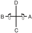

# YONG-GAE

> 🔊 **Prononciation :** [연개](../audio/tul/yon-gae.m4a)

> **Grade :** 4e Dan

* **Nombre de mouvements :**  49
* **Diagramme au sol :**  (Hanja ou lettre capitale I)

| Diagramme | Description |
| ------ | ------ |
|  | YONG-GAE est nommé d'après le célèbre général Yon Gae Somoon de la dynastie Koguryo. Les 49 mouvements représentent l'année 649 apr. J.-C., lorsqu'il détruisit l'armée impériale chinoise des Tang forte de près de 300 000 soldats à Ansi Sung, les obligeant à battre en retraite et à quitter la Corée. |

[YONG-GAE](https://youtu.be/wpGFNOtmwcE?si=dPkUQNtz1e8xhWKF)

## Origine et contexte historique

* **Contexte socio-politique :** Représente l'affirmation d'une résistance nationale farouche et le refus catégorique de se soumettre à un empire étranger expansionniste, un message puissant de fierté pour les générations futures.

## Liste Détaillée des Mouvements

### Posture de départ : position de préparation du guerrier A

1. Glisser vers C pour former une position en L droite vers D tout en exécutant un blocage de garde bas vers D avec un revers de la main.
   *([Niunja so sonkal dung najunde daebi makgi](../makgi/najunde-daebi-makgi.md))*

   > *Exécuter en un mouvement circulaire.*

2. Exécuter un coup de poing haut vers D avec le poing allongé droit tout en formant une position de marche gauche vers D en pivotant avec le pied gauche.
   *(Gunnun so ghin joomuk nopunde bandae jirugi)*

   > *Exécuter en mouvement lent.*

3. Glisser vers C pour former une position en L gauche vers D tout en exécutant un blocage de garde moyen vers D avec l'avant-bras.
   *([Niunja so palmok kaunde daebi makgi](../makgi/palmok-daebi-makgi.md))*
4. Exécuter une frappe extérieure moyenne vers D avec le tranchant de la main droite tout en sautant vers D puis atterrir vers D pour former une position en L gauche vers D avec le tranchant de la main droite étendu vers D.
   *([Twimyo sonkal bakuro taerigi](../Techniques/Twimyo-Sonkal-Bakuro-Taerigi.md))*

   > *Distance de saut : 1 position en L.*

5. Décaler vers C en maintenant une position en L gauche vers D tout en exécutant un blocage d'arrêt vers D avec les poings croisés.
   *([Niunja so kyocha joomuk momchau makgi](../makgi/momchau-makgi.md))*
6. Exécuter une coupe croisée extérieure haute vers D avec le bout des doigts droit à plat tout en formant une position de marche droite vers D, en glissant le pied droit.
   *(Gunnun so opun sonkut nopunde bakuro ghutgi)*
7. Exécuter une pique descendante avec le coude droit tout en formant une position arrière rapprochée sur la jambe gauche vers D, en tirant le pied droit.
   *([Dwitbal so sun palkup bandae naeryo tulgi](../Techniques/Dwitbal-So-Sun-Palkup-Bandae-Naeryo-Tulgi.md))*
8. Sauter vers D pour former une position en X gauche vers AD tout en exécutant une frappe latérale haute vers D avec le revers du poing gauche.
   *(Twigi, [wen kyocha so dung joomuk nopunde yop taerigi](../Techniques/Dung-Joomuk-Nopunde-Yop-Taerigi.md))*

   > *Distance de saut : 1 position de marche.*

9. Déplacer le pied droit vers C pour former une position de marche gauche vers D tout en exécutant un blocage extérieur bas vers D avec le tranchant de la main droite.
   *([Gunnun so sonkal najunde bandae bakuro makgi](../makgi/bakuro-makgi.md))*
10. Déplacer le pied droit sur ligne AB pour former une position parallèle vers D tout en exécutant un blocage crocheté moyen vers D avec la paume gauche.
   *([Narani so wen sonbadak kaunde golcho makgi](../Techniques/Sonbadak-Kaunde-Golcho-Makgi.md))*
11. Exécuter un coup de poing moyen vers D avec le poing droit tout en maintenant une position parallèle vers D.
   *(Narani so orun joomuk kaunde jirugi)*
12. Glisser vers C pour former une position en L gauche vers D tout en exécutant un blocage de garde bas vers D avec un revers de la main.
   *([Niunja so sonkal dung najunde daebi makgi](../makgi/najunde-daebi-makgi.md))*

   > *Exécuter en un mouvement circulaire.*

13. Exécuter un coup de poing haut vers D avec le poing allongé gauche tout en formant une position de marche droite vers D, en pivotant avec le pied droit.
   *(Gunnun so ghin joomuk nopunde bandae jirugi)*

   > *Exécuter en mouvement lent.*

14. Glisser vers C pour former une position en L droite vers D tout en exécutant un blocage de garde moyen vers D avec l'avant-bras.
   *([Niunja so palmok kaunde daebi makgi](../makgi/palmok-daebi-makgi.md))*
15. Exécuter une frappe extérieure moyenne vers D avec le tranchant de la main gauche tout en sautant vers D puis atterrir vers D pour former une position en L droite vers D avec le tranchant de la main gauche étendu vers D.
   *([Twimyo sonkal kaunde bakuro taerigi](../Techniques/Twimyo-Sonkal-Kaunde-Bakuro-Taerigi.md))*

   > *Distance de saut : 1 position en L.*

16. Décaler vers C en maintenant une position en L droite vers D tout en exécutant un blocage d'arrêt vers D avec les poings croisés.
   *([Niunja so kyocha joomuk momchau makgi](../makgi/momchau-makgi.md))*
17. Exécuter une coupe croisée extérieure haute vers D avec le bout des doigts gauche à plat tout en formant une position de marche gauche vers D, en glissant le pied gauche.
   *(Gunnun so opun sonkut nopunde bakuro ghutgi)*
18. Exécuter une pique descendante avec le coude gauche tout en formant une position arrière rapprochée sur la jambe droite vers D, en tirant le pied gauche.
   *([Dwitbal so sun palkup bandae naeryo tulgi](../Techniques/Dwitbal-So-Sun-Palkup-Bandae-Naeryo-Tulgi.md))*
19. Sauter vers D pour former une position en X droite vers BD tout en exécutant une frappe latérale haute vers D avec le revers du poing droit.
   *(Twigi, [orun kyocha so dung joomuk nopunde yop taerigi](../Techniques/Dung-Joomuk-Nopunde-Yop-Taerigi.md))*

   > *Distance de saut : 1 position de marche.*

20. Déplacer le pied gauche vers C pour former une position de marche droite vers D tout en exécutant un blocage extérieur bas vers D avec le tranchant de la main gauche.
   *([Gunnun so sonkal najunde bandae bakuro makgi](../makgi/bakuro-makgi.md))*
21. Déplacer le pied gauche sur ligne AB pour former une position parallèle vers D tout en exécutant un blocage crocheté moyen vers D avec la paume droite.
   *([Narani so orun sonbadak kaunde golcho makgi](../Techniques/Sonbadak-Kaunde-Golcho-Makgi.md))*
22. Exécuter un coup de poing moyen vers D avec le poing gauche tout en maintenant une position parallèle vers D.
   *(Narani so wen joomuk kaunde jirugi)*
23. Déplacer le pied droit vers A pour former une position assise vers D tout en exécutant un blocage en W avec le revers de la main.
   *([Annun so sonkal dung san makgi](../Techniques/Annun-So-Sonkal-Dung-San-Makgi.md))*
24. Croiser le pied gauche par-dessus le pied droit pour former une position en X droite vers D tout en exécutant une pique horizontale avec un jumelé coude.
   *([Kyocha so sang palkup soopyong tulgi](../Techniques/Kyocha-So-Sang-Palkup-Soopyong-Tulgi.md))*
25. Déplacer le pied droit vers A pour former une position assise vers D tout en exécutant un blocage d'arrêt vers D avec un jumelé droit avant-bras.
   *([Annun so sang sun palmok momchau makgi](../Techniques/Annun-So-Sang-Sun-Palmok-Momchau-Makgi.md))*
26. Croiser le pied gauche par-dessus le pied droit pour former une position en X droite vers D tout en exécutant un coup de poing montant avec le poing droit, en tirant le côté du poing gauche devant l'épaule droite.
   *(Kyocha so baro ollyo jirugi)*
27. Exécuter un coup de pied crocheté inversé haut vers B avec le pied droit.
   *([Nopunde bandae dollyo gorochagi](../chagi/bandae-dollyo-goro-chagi.md))*
28. Abaisser le pied droit vers B puis exécuter un coup de pied latéral perçant haut vers B avec le pied gauche en tirant les deux mains devant la poitrine tout en tournant dans le sens horaire.
   *([Nopunde yopcha jirugi](../chagi/yop-cha-jirugi.md))*
29. Abaisser le pied gauche vers B en mouvement sauté pour former une position en X gauche vers BD tout en exécutant une frappe descendante vers B avec le revers du poing gauche.
   *(Twigi, [wen kyocha so dung joomuk baro naeryo taerigi](../jirugi/naeryo-taerigi.md))*

   > *Distance de saut : 1 position de marche.*

30. Déplacer le pied gauche vers B pour former une position assise vers D tout en exécutant un blocage en W avec le revers de la main.
   *([Annun so sonkal dung san makgi](../Techniques/Annun-So-Sonkal-Dung-San-Makgi.md))*
31. Croiser le pied droit par-dessus le pied gauche pour former une position en X gauche vers D tout en exécutant une pique horizontale avec un jumelé coude.
   *([Kyocha so sang palkup soopyong tulgi](../Techniques/Kyocha-So-Sang-Palkup-Soopyong-Tulgi.md))*
32. Déplacer le pied gauche vers B pour former une position assise vers D tout en exécutant un blocage d'arrêt vers D avec un jumelé droit avant-bras.
   *([Annun so sang sun palmok momchau makgi](../Techniques/Annun-So-Sang-Sun-Palmok-Momchau-Makgi.md))*
33. Croiser le pied droit par-dessus le pied gauche pour former une position en X gauche vers D tout en exécutant un coup de poing montant avec le poing gauche, en tirant le côté du poing droit devant l'épaule gauche.
   *(Kyocha so baro ollyo jirugi)*
34. Exécuter un coup de pied crocheté inversé haut vers A avec le pied gauche.
   *([Nopunde bandae dollyo gorochagi](../chagi/bandae-dollyo-goro-chagi.md))*
35. Abaisser le pied gauche vers A puis exécuter un coup de pied latéral perçant haut vers A avec le pied droit en tirant les deux mains devant la poitrine tout en tournant dans le sens anti-horaire.
   *([Nopunde yopcha jirugi](../chagi/yop-cha-jirugi.md))*
36. Abaisser le pied droit vers A en mouvement sauté pour former une position en X droite vers AD tout en exécutant une frappe descendante vers A avec le revers du poing droit.
   *(Twigi, [orun kyocha so dung joomuk baro naeryo taerigi](../jirugi/naeryo-taerigi.md))*

   > *Distance de saut : 1 position de marche.*

37. Déplacer le pied gauche vers C pour former une position en L gauche vers D tout en exécutant un blocage de garde moyen vers D avec l'avant-bras.
   *([Niunja so palmok kaunde daebi makgi](../makgi/palmok-daebi-makgi.md))*
38. Déplacer le pied gauche vers D en tournant dans le sens anti-horaire pour former une position arrière rapprochée sur la jambe gauche vers C tout en exécutant un blocage à la taille vers C avec l'avant-bras intérieur droit.
   *([Dwitbal so an palmok bandae hori makgi](../Techniques/Dwitbal-So-An-Palmok-Bandae-Hori-Makgi.md))*
39. Déplacer le pied droit vers C légèrement puis le pied gauche vers D en un mouvement étampé pour former une position en L droite vers D tout en exécutant une frappe extérieure haute vers D avec le tranchant de la main gauche.
   *([Niunja so sonkal nopunde bakuro taerigi](../Techniques/Niunja-So-Sonkal-Nopunde-Bakuro-Taerigi.md))*
40. Décaler vers C en maintenant une position en L droite vers D tout en exécutant un blocage de garde moyen vers D avec l'avant-bras.
   *([Niunja so palmok kaunde daebi makgi](../makgi/palmok-daebi-makgi.md))*
41. Déplacer le pied droit vers D en tournant dans le sens horaire pour former une position arrière rapprochée sur la jambe droite vers C tout en exécutant un blocage à la taille vers C avec l'avant-bras intérieur gauche.
   *([Dwitbal so an palmok bandae hori makgi](../Techniques/Dwitbal-So-An-Palmok-Bandae-Hori-Makgi.md))*
42. Déplacer le pied gauche vers C légèrement puis le pied droit vers D en un mouvement étampé pour former une position en L gauche vers D tout en exécutant une frappe extérieure haute vers D avec le tranchant de la main droite.
   *([Niunja so sonkal nopunde bakuro taerigi](../Techniques/Niunja-So-Sonkal-Nopunde-Bakuro-Taerigi.md))*
43. Déplacer le pied droit vers C en tournant dans le sens anti-horaire pour former une position en L droite vers D tout en exécutant un blocage de garde moyen vers D avec l'avant-bras.
   *([Niunja so palmok kaunde daebi makgi](../makgi/palmok-daebi-makgi.md))*
44. Sauter pour exécuter un coup de pied en vol vers D avec le pied droit tout en pivotant dans le sens horaire puis atterrir vers D pour former une position en L gauche vers D tout en exécutant un blocage de garde moyen vers D avec le tranchant de la main.
   *(Twio dolmyo chagi, [wen niunja so sonkal kaunde daebi makgi](../Techniques/Niunja-So-Sonkal-Kaunde-Daebi-Makgi.md))*

   > *Distance de saut : 1 largeur d'épaules depuis le pied avant.*

45. Sauter pour exécuter un coup de pied en vol vers D avec le pied gauche tout en pivotant dans le sens anti-horaire puis atterrir vers D pour former une position en L droite vers D tout en exécutant un blocage de garde moyen vers D avec le tranchant de la main.
   *(Twio dolmyo chagi, [orun niunja so sonkal kaunde daebi makgi](../Techniques/Niunja-So-Sonkal-Kaunde-Daebi-Makgi.md))*

   > *Distance de saut : 1 largeur d'épaules depuis le pied avant.*

46. Exécuter un blocage intérieur bas vers D avec le revers de la main droite en tirant le côté du poing gauche devant l'épaule droite tout en formant une position de marche gauche vers D, en glissant le pied droit vers C.
   *([Gunnun so sonkal dung najunde bandae anuro makgi](../makgi/anuro-makgi.md))*
47. Glisser vers C pour former une position en L gauche vers D tout en piquant vers C avec le coude gauche.
   *([Niunja so yop palkup tulgi](../Techniques/Niunja-So-Yop-Palkup-Tulgi.md))*
48. Exécuter un blocage intérieur bas vers D avec le revers de la main gauche en tirant le côté du poing droit devant l'épaule gauche tout en formant une position de marche droite vers D, en glissant le pied gauche vers C.
   *([Gunnun so sonkal dung najunde bandae anuro makgi](../makgi/anuro-makgi.md))*
49. Glisser vers C pour former une position en L droite vers D tout en piquant vers C avec le coude droit.
   *([Niunja so yop palkup tulgi](../Techniques/Niunja-So-Yop-Palkup-Tulgi.md))*

### FIN : ramener le pied droit à la posture de départ.
