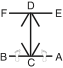

# YOO-SIN

> 🔊 **Prononciation :** [유신](../audio/tul/yoo-sin.m4a)

> **Grade :** 3e Dan

* **Nombre de mouvements :**  68
* **Diagramme au sol :**  (Hanja pour l'Érudit / Lettré)

| Diagramme | Description |
| ------ | ------ |
|  | YOO-SIN est nommé d'après le général Kim Yoo Sin, commandant en chef de la dynastie Silla. Les 68 mouvements font référence à l'année 668 apr. J.-C., date à laquelle il unifia la Corée. La posture de départ simule un sabre dégainé du côté droit plutôt que gauche, symbolisant l'erreur tragique de Yoo Sin d'avoir suivi les ordres de son roi d'allier des forces étrangères (les Tang chinois) contre sa propre nation. |

[YOO-SIN](https://youtu.be/JOAeFLPXgFc?si=ENMVuJWWswqnYmFY)

## Liste Détaillée des Mouvements

### Posture de départ : position de préparation du guerrier B

1. Déplacer le pied gauche vers B pour former une position assise vers D tout en étendant les deux coudes sur les côtés horizontalement.
   *([Annun sogi](../Techniques/Annun-Sogi.md))*
2. Exécuter un coup de poing en angle vers C avec le poing gauche tout en glissant vers A, en maintenant une position assise vers D.
   *([Annun so wen joomuk C-bang giokja jirugi](../Techniques/Annun-So-Wen-Joomuk-C-Bang-Giokja-Jirugi.md))*
3. Exécuter un coup de poing en angle vers C avec le poing droit tout en glissant vers B, en maintenant une position assise vers D.
   *([Annun so orun joomuk C-bang giokja jirugi](../Techniques/Annun-So-Orun-Joomuk-C-Bang-Giokja-Jirugi.md))*
      > *Exécuter 2 et 3 en mouvement rapide.*
4. Exécuter un blocage crocheté moyen vers D avec la paume droite tout en se redressant vers D.
   *([Sonbadak kaunde golcho makgi](../Techniques/Sonbadak-Kaunde-Golcho-Makgi.md))*
5. Exécuter un coup de poing moyen vers D avec le poing gauche tout en formant une position assise vers D.
   *([Annun so wen joomuk kaunde jirugi](../Techniques/Annun-So-Wen-Joomuk-Kaunde-Jirugi.md))*
6. Exécuter un blocage crocheté moyen vers D avec la paume gauche tout en se redressant vers D.
   *([Sonbadak kaunde golcho makgi](../Techniques/Sonbadak-Kaunde-Golcho-Makgi.md))*
7. Exécuter un coup de poing moyen vers D avec le poing droit tout en formant une position assise vers D.
   *([Annun so orun joomuk kaunde jirugi](../Techniques/Annun-So-Orun-Joomuk-Kaunde-Jirugi.md))*
8. Déplacer le pied gauche vers BD pour former une position de marche gauche vers BD tout en exécutant un blocage latéral haut vers BD avec l'avant-bras extérieur gauche.
   *([Gunnun so bakat palmok nopunde yop makgi](../Techniques/Gunnun-So-Bakat-Palmok-Nopunde-Yop-Makgi.md))*
9. Exécuter un blocage circulaire vers D avec l'avant-bras intérieur droit tout en maintenant une position de marche gauche vers BD.
   *([Gunnun so an palmok dollimyo makgi](../makgi/dollimyo-makgi.md))*
10. Exécuter un blocage en levant avec la paume gauche tout en formant une position assise vers AD.
   *([Annun so wen sonbadak duro makgi](../Techniques/Annun-So-Wen-Sonbadak-Duro-Makgi.md))*
11. Exécuter un coup de poing moyen vers AD avec le poing droit tout en maintenant une position assise vers AD.
   *([Annun so orun joomuk kaunde jirugi](../Techniques/Annun-So-Orun-Joomuk-Kaunde-Jirugi.md))*
      > *Exécuter 10 et 11 en mouvement lié.*
12. Ramener le pied gauche vers le pied droit, puis déplacer le pied droit vers AD pour former une position de marche droite vers AD tout en exécutant un blocage latéral haut vers AD avec l'avant-bras extérieur droit.
   *([Gunnun so bakat palmok nopunde yop makgi](../Techniques/Gunnun-So-Bakat-Palmok-Nopunde-Yop-Makgi.md))*
13. Exécuter un blocage circulaire vers D avec l'avant-bras intérieur gauche tout en maintenant une position de marche droite vers AD.
   *([Gunnun so an palmok dollimyo makgi](../makgi/dollimyo-makgi.md))*
14. Exécuter un blocage en levant avec la paume droite tout en formant une position assise vers BD.
   *([Annun so orun sonbadak duro makgi](../Techniques/Annun-So-Orun-Sonbadak-Duro-Makgi.md))*
15. Exécuter un coup de poing moyen vers BD avec le poing gauche tout en maintenant une position de marche droite vers BD.
   *([Annun so wen joomuk kaunde jirugi](../Techniques/Annun-So-Wen-Joomuk-Kaunde-Jirugi.md))*
      > *Exécuter 14 et 15 en mouvement lié.*
16. Exécuter un blocage crocheté haut vers BC avec la paume droite tout en formant une position de marche gauche vers BC.
   *(Gunnun so sonbadak nopunde bandae golcho makgi)*
17. Exécuter un coup de poing moyen vers BD avec le poing gauche tout en formant une position assise vers BD.
   *([Annun so wen joomuk kaunde jirugi](../Techniques/Annun-So-Wen-Joomuk-Kaunde-Jirugi.md))*
18. Exécuter un blocage crocheté haut vers AD avec la paume gauche tout en formant une position de marche droite vers AD.
   *(Gunnun so sonbadak nopunde bandae golcho makgi)*
19. Exécuter un coup de poing moyen vers BD avec le poing droit tout en formant position assise vers BD.
   *([Annun so orun joomuk kaunde jirugi](../Techniques/Annun-So-Orun-Joomuk-Kaunde-Jirugi.md))*
      > *Exécuter 16, 17, 18 et 19 en mouvement continu.*
20. Déplacer le pied droit vers C, pour former une position de marche gauche vers D tout en exécutant un blocage en pression avec les poings croisés.
   *([Gunnun so kyocha joomuk noollo makgi](../Techniques/Gunnun-So-Kyocha-Joomuk-Noollo-Makgi.md))*
21. Exécuter un blocage montant avec les tranchants des mains croisées tout en maintenant une position de marche gauche vers D.
   *([Gunnun so kyocha sonkal chookyo makgi](../makgi/chookyo-makgi.md))*
      > *Exécuter 20 et 21 en mouvement continu.*
22. Exécuter un coup de poing moyen vers D avec le poing droit, en glissant la paume gauche vers le haut vers l'articulation du coude droit tout en maintenant une position de marche gauche vers D.
   *([Gunnun so kaunde bandae jirugi](../Techniques/Gunnun-So-Kaunde-Bandae-Jirugi.md))*
23. Exécuter un coup de pied avant fouetté bas vers D avec le pied droit, en gardant les mains dans la position du mouvement 22.
   *([Najunde apcha busigi](../chagi/apcha-busigi.md))*
24. Abaisser le pied droit vers D, pour former une position de marche droite vers D tout en exécutant un coup de poing moyen vers D avec le poing gauche.
   *([Gunnun so kaunde bandae jirugi](../Techniques/Gunnun-So-Kaunde-Bandae-Jirugi.md))*
25. Exécuter un blocage en pression avec les poings croisés tout en maintenant une position de marche droite vers D.
   *([gunnun so kyocha joomuk noollo makgi](../Techniques/Gunnun-So-Kyocha-Joomuk-Noollo-Makgi.md))*
26. Exécuter un blocage montant avec les tranchants des mains croisées tout en maintenant une position de marche droite vers D.
   *([Gunnun so kyocha sonkal chookyo makgi](../makgi/chookyo-makgi.md))*
      > *Exécuter 25 et 26 en mouvement continu.*
27. Exécuter un coup de poing moyen vers D avec le poing gauche en glissant la paume droite vers le haut vers l'articulation du coude gauche tout en maintenant une position de marche droite vers D.
   *([gunnun so kaunde bandae jirugi](../Techniques/Gunnun-So-Kaunde-Bandae-Jirugi.md))*
28. Exécuter un coup de pied avant fouetté bas vers D avec le pied gauche, en gardant les mains dans la position du mouvement 27.
   *([Najunde apcha busigi](../chagi/apcha-busigi.md))*
29. Abaisser le pied gauche vers D pour former une position de marche gauche vers D tout en exécutant un coup de poing moyen vers D avec le poing droit.
   *([Gunnun so kaunde bandae jirugi](../Techniques/Gunnun-So-Kaunde-Bandae-Jirugi.md))*
30. Déplacer le pied droit vers D, pour former une position en L gauche vers D tout en exécutant un blocage de garde moyen vers D avec le tranchant de la main.
   *([Niunja so sonkal kaunde daebi makgi](../Techniques/Niunja-So-Sonkal-Kaunde-Daebi-Makgi.md))*
31. Déplacer le pied gauche vers D pour former une position en L droite vers D tout en exécutant un blocage de garde moyen vers D avec le tranchant de la main.
   *([Niunja so sonkal kaunde daebi makgi](../Techniques/Niunja-So-Sonkal-Kaunde-Daebi-Makgi.md))*
32. Déplacer le pied gauche vers C, pour former une position en L gauche vers D tout en exécutant un blocage de garde moyen vers D avec le tranchant de la main.
   *([Niunja so sonkal kaunde daebi makgi](../Techniques/Niunja-So-Sonkal-Kaunde-Daebi-Makgi.md))*
33. Déplacer le pied droit vers C pour former une position en L droite vers D tout en exécutant un blocage de garde moyen vers D avec le tranchant de la main.
   *([Niunja so sonkal kaunde daebi makgi](../Techniques/Niunja-So-Sonkal-Kaunde-Daebi-Makgi.md))*
34. Déplacer le pied droit vers D, pour former une position de marche droite vers D tout en exécutant un blocage haut vers D avec le double avant-bras droit.
   *([Gunnun so doo palmok nopunde makgi](../Techniques/Gunnun-So-Doo-Palmok-Nopunde-Makgi.md))*
35. Exécuter un blocage bas vers D avec l'avant-bras gauche, en gardant l'avant-bras droit dans la position du mouvement 34 tout en maintenant une position de marche droite vers D.
   *([Gunnun so palmok najunde bandae makgi](../Techniques/Gunnun-So-Palmok-Najunde-Makgi.md))*
      > *Exécuter 34 et 35 en mouvement rapide.*
36. Déplacer le pied gauche vers D pour former une position de marche gauche vers D tout en exécutant un blocage haut vers D avec le double avant-bras gauche.
   *([Gunnun so doo palmok nopunde makgi](../Techniques/Gunnun-So-Doo-Palmok-Nopunde-Makgi.md))*
37. Exécuter un blocage bas vers D avec l'avant-bras droit, en gardant l'avant-bras gauche dans la position du mouvement 36 tout en maintenant une position de marche gauche vers D.
   *([Gunnun so palmok najunde bandae makgi](../Techniques/Gunnun-So-Palmok-Najunde-Makgi.md))*
      > *Exécuter 36 et 37 en mouvement rapide.*
38. Déplacer le pied droit vers D, pour former une position de marche droite vers D tout en exécutant un coup de poing moyen vers D avec le poing droit.
   *([Gunnun so kaunde jirugi](../Techniques/Gunnun-So-Kaunde-Jirugi.md))*
39. Déplacer le pied gauche sur ligne CD, puis tourner dans le sens anti-horaire, en pivotant avec le pied gauche pour former une position en L droite vers C tout en exécutant un blocage haut vers C avec le revers de la main gauche.
   *([Niunja so sonkal dung nopunde yop makgi](../makgi/nopunde-yop-makgi.md))*
40. Ramener le pied droit vers le pied gauche pour former un position de préparation fermée C vers C.
   *([Moa junbi sogi C](../Techniques/Moa-Junbi-Sogi-C.md))*
41. Déplacer le pied droit vers CF en un mouvement étampé pour former une position de marche droite vers CG tout en exécutant un coup de poing renversé vers CF avec les poings jumelés.
   *([Gunnun so sang joomuk dwijibo jirugi](../Techniques/Gunnun-So-Sang-Joomuk-Dwijibo-Jirugi.md))*
42. Ramener le pied droit vers le pied gauche, puis déplacer le pied gauche vers CE en un mouvement étampé, pour former une position de marche gauche vers CE tout en exécutant un coup de poing renversé vers CE avec les poings jumelés.
   *([Gunnun so sang joomuk dwijibo jirugi](../Techniques/Gunnun-So-Sang-Joomuk-Dwijibo-Jirugi.md))*
43. Ramener le pied gauche vers le pied droit, puis déplacer le pied droit vers F pour former une position en L gauche vers F tout en exécutant un blocage moyen vers F avec l'avant-bras intérieur droit.
   *([Niunja so an palmok kaunde yop makgi](../Techniques/An-Palmok-Kaunde-Yop-Makgi.md))*
44. Exécuter un coup de poing moyen vers F avec le poing gauche tout en maintenant une position en L gauche vers F.
   *([Niunja so kaunde baro jirugi](../Techniques/Niunja-So-Kaunde-Baro-Jirugi.md))*
45. Ramener le pied gauche vers le pied droit pour former une position fermée vers C tout en exécutant un coup de poing en angle avec le poing droit.
   *(Moa so orun joomuk giokja jirugi)*
      > *Exécuter en mouvement lent.*
46. Déplacer le pied gauche vers E pour former une position en L droite vers E tout en exécutant un blocage moyen vers E avec l'avant-bras intérieur gauche.
   *([Niunja so an palmok kaunde yop makgi](../Techniques/An-Palmok-Kaunde-Yop-Makgi.md))*
47. Exécuter un coup de poing moyen vers E avec le poing droit tout en maintenant une position en L droite vers E.
   *([Niunja so kaunde baro jirugi](../Techniques/Niunja-So-Kaunde-Baro-Jirugi.md))*
48. Ramener le pied droit vers le pied gauche pour former une position fermée vers C tout en exécutant un coup de poing en angle avec le poing gauche.
   *(Moa so wen joomuk giokja jirugi)*
      > *Exécuter en mouvement lent.*
49. Déplacer le pied gauche vers E pour former une position fixe gauche vers E tout en exécutant un coup de poing en U vers E.
   *([Gojung so digutja jirugi](../Techniques/Gojung-So-Digutja-Jirugi.md))*
50. Ramener le pied gauche vers le pied droit, puis déplacer le pied droit vers E, pour former une position fixe droite vers E tout en exécutant un coup de poing en U vers E.
   *([Gojung so digutja jirugi](../Techniques/Gojung-So-Digutja-Jirugi.md))*
51. Déplacer le pied droit sur ligne CD en un mouvement étampé pour former une position assise vers E tout en exécutant une frappe frontale vers E avec le revers du poing droit.
   *([Annun so orun dung joomuk ap taerigi](../Techniques/Annun-So-Orun-Dung-Joomuk-Ap-Taerigi.md))*
52. Exécuter un coup de pied retourné vers D avec le pied droit, puis un blocage extérieur haut vers AC avec l'avant-bras extérieur droit, en gardant les mains dans la position du mouvement 51 tout en formant une position assise vers E.
   *([Doro chagi](../Techniques/Doro-Chagi.md), [annun so orun bakat palmok nopunde bakuro makgi](../Techniques/Annun-So-Orun-Bakat-Palmok-Nopunde-Bakuro-Makgi.md))*
53. Exécuter un coup de pied retourné vers C avec le pied gauche, puis un blocage frontal haut vers ED avec l'avant-bras extérieur droit, en gardant les mains dans la position du mouvement 52 tout en formant une position assise vers E.
   *([Doro chagi](../Techniques/Doro-Chagi.md), [annun so orun bakat palmok nopunde ap makgi](../Techniques/Annun-So-Orun-Bakat-Palmok-Nopunde-Ap-Makgi.md))*
54. Exécuter une frappe horizontale vers C avec le revers de la main droite tout en maintenant une position assise vers E.
   *([Annun so orun sondung soopyong taerigi](../Techniques/Annun-So-Orun-Sondung-Soopyong-Taerigi.md))*
55. Exécuter un coup de pied semi-circulaire moyen vers la paume droite avec le pied gauche.
   *([Kaunde bandal chagi](../chagi/bandal-chagi.md))*
56. Exécuter un coup de pied latéral perçant moyen vers C avec le pied gauche pour former un blocage de garde de l'avant-bras.
   *([Kaunde yopcha jirugi](../chagi/yop-cha-jirugi.md))*
      > *Exécuter 55 et 56 en un coup de pied consécutif.*
57. Abaisser le pied gauche vers C pour former une position assise vers B tout en exécutant une frappe horizontale vers C avec le revers de la main gauche.
   *([Annun so wen sondung soopyong taerigi](../Techniques/Annun-So-Wen-Sondung-Soopyong-Taerigi.md))*
58. Exécuter un coup de pied semi-circulaire moyen vers la paume gauche avec le pied droit.
   *([Kaunde bandal chagi](../chagi/bandal-chagi.md))*
59. Exécuter un coup de pied latéral perçant moyen vers C avec le pied droit, pour former un blocage de garde de l'avant-bras.
   *([Kaunde yopcha jirugi](../chagi/yop-cha-jirugi.md))*
      > *Exécuter 58 et 59 en un coup de pied consécutif.*
60. Abaisser le pied droit vers C, pour former une position assise vers A tout en exécutant un blocage en forme de 9 droit.
   *([Annun so orun gutja makgi](../Techniques/Annun-So-Orun-Gutja-Makgi.md))*
61. Changer la position des mains tout en maintenant une position assise vers A.
   *([Annun sogi](../Techniques/Annun-Sogi.md))*
62. Déplacer le pied gauche vers C, en tournant dans le sens horaire pour former une position assise vers B tout en exécutant un blocage en forme de 9 droit.
   *([Annun so orun gutja makgi](../Techniques/Annun-So-Orun-Gutja-Makgi.md))*
63. Changer la position des mains tout en maintenant une position assise vers B.
   *([Annun sogi](../Techniques/Annun-Sogi.md))*
64. Exécuter une frappe descendante vers D avec le côté du poing droit tout en formant une position verticale gauche vers, en tirant le pied gauche.
   *([Soojik so yop joomuk bandae naeryo taerigi](../jirugi/naeryo-taerigi.md))*
65. Déplacer le pied droit vers A pour former une position de marche gauche vers B tout en exécutant un coup de poing vertical haut vers B avec les poings jumelés.
   *([Gunnun so sang joomuk nopunde sewo jirugi](../Techniques/Gunnun-So-Sang-Joomuk-Nopunde-Sewo-Jirugi.md))*
66. Déplacer le pied droit vers B, en tournant dans le sens anti-horaire pour former une position de marche gauche vers A tout en exécutant un coup de poing vertical haut vers A avec les poings jumelés.
   *([Gunnun so sang joomuk nopunde sewo jirugi](../Techniques/Gunnun-So-Sang-Joomuk-Nopunde-Sewo-Jirugi.md))*
67. Ramener le pied droit vers le pied gauche, puis déplacer le pied gauche vers BD pour former une position en L droite vers BD tout en exécutant un blocage de garde moyen vers BD avec le tranchant de la main.
   *([Niunja so sonkal kaunde daebi makgi](../Techniques/Niunja-So-Sonkal-Kaunde-Daebi-Makgi.md))*
68. Ramener le pied gauche vers le pied droit, puis déplacer le pied droit vers AD pour former une position en L gauche vers AD tout en exécutant un blocage de garde moyen vers AD avec le tranchant de la main.
   *([Niunja so sonkal kaunde daebi makgi](../Techniques/Niunja-So-Sonkal-Kaunde-Daebi-Makgi.md))*

### FIN : ramener le pied droit à la posture de départ
