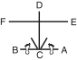

# YUL-GOK

> **Grade :** 5e Gup — Ceinture verte barre bleue

* **Nombre de mouvements :**  38
* **Diagramme au sol :**  (Hanja pour l'Érudit / Lettré)

| Diagramme | Description |
| ------ | ------ |
|  | YUL-GOK est le pseudonyme du grand philosophe et érudit Yi I (1536-1584), surnommé le 'Confucius de la Corée'. Les 38 mouvements de ce Tul se rapportent à son lieu de naissance situé sur le 38e degré de latitude, et le diagramme représente l'érudit (lettré). |

[YUL-GOK](https://vimeo.com/106753098)

## Liste Détaillée des Mouvements

### Posture de départ : position parallèle de préparation

1. Déplacer le pied gauche vers B pour former une position assise vers D tout en étendant le poing gauche vers D horizontalement.
   *(Annun sogi)*
2. Exécuter un coup de poing moyen vers D avec le poing droit tout en maintenant une position assise vers D.
   *(Annun so orun joomuk kaunde ap jirugi)*
3. Exécuter un coup de poing moyen vers D avec le poing gauche tout en maintenant une position assise vers D.
   *(Annun so wen joomuk kaunde ap jirugi)*

   > *Exécuter 2 et 3 en mouvement rapide.*

4. Ramener le pied gauche vers le pied droit puis déplacer le pied droit vers A pour former une position assise vers D tout en étendant le poing droit vers D horizontalement.
   *(Annun sogi)*
5. Exécuter un coup de poing moyen vers D avec le poing gauche tout en maintenant une position assise vers D.
   *(Annun so wen joomuk kaunde ap jirugi)*
6. Exécuter un coup de poing moyen vers D avec le poing droit tout en maintenant une position assise vers D.
   *(Annun so orun joomuk kaunde ap jirugi)*

   > *Exécuter 5 et 6 en mouvement rapide.*

7. Déplacer le pied droit vers AD pour former une position de marche droite vers AD tout en exécutant un blocage latéral moyen vers AD avec l'avant-bras intérieur droit.
   *(Gunnun so an palmok kaunde yop makgi)*
8. Exécuter un coup de pied avant fouetté bas vers AD avec le pied gauche en gardant le position de la mains comme s'ils étaient en 7.
   *(Najunde apcha busigi)*
9. Abaisser le pied gauche vers AD pour former une position de marche gauche vers AD tout en exécutant un coup de poing moyen vers AD avec le poing gauche.
   *(Gunnun so kaunde jirugi)*
10. Exécuter un coup de poing moyen vers AD avec le poing droit tout en maintenant une position de marche gauche vers AD.
   *(Gunnun so kaunde bandae jirugi)*

   > *Exécuter 9 et 10 en mouvement rapide.*

11. Déplacer le pied gauche vers BD pour former une position de marche gauche vers BD en même temps en exécutant un blocage latéral moyen vers BD avec l'avant-bras intérieur gauche.
   *(Gunnun so an palmok kaunde yop makgi)*
12. Exécuter un coup de pied avant fouetté bas vers BD avec le pied droit en gardant le position de la mains comme s'ils étaient en 11.
   *(Najunde apcha busigi)*
13. Abaisser le pied droit vers BD pour former une position de marche droite vers BD tout en exécutant un coup de poing moyen vers BD avec le poing droit.
   *(Gunnun so kaunde jirugi)*
14. Exécuter un coup de poing moyen vers BD avec le poing gauche tout en maintenant une position de marche droite vers BD.
   *(Gunnun so kaunde bandae jirugi)*

   > *Exécuter 13 et 14 en mouvement rapide.*

15. Exécuter un blocage crocheté moyen vers D avec la paume droite tout en formant une position de marche droite vers D, en pivotant avec le pied gauche.
   *(Gunnun so sonbadak kaunde golcho makgi)*
16. Exécuter un blocage crocheté moyen vers D avec la paume gauche tout en maintenant une position de marche droite vers D.
   *(Gunnun so sonbadak kaunde bandae golcho makgi)*
17. Exécuter un coup de poing moyen vers D avec le poing droit tout en maintenant une position de marche droite vers D.
   *(Gunnun so kaunde jirugi)*

   > *Exécuter 16 et 17 en mouvement lié.*

18. Déplacer le pied gauche vers D pour former une position de marche gauche vers D tout en exécutant un blocage crocheté moyen vers D avec la paume gauche.
   *(Gunnun so sonbadak kaunde golcho makgi)*
19. Exécuter un blocage crocheté moyen vers D avec la paume droite tout en maintenant une position de marche gauche vers D.
   *(Gunnun so sonbadak kaunde bandae golcho makgi)*
20. Exécuter un coup de poing moyen vers D avec le poing gauche tout en maintenant une position de marche gauche vers D.
   *(Gunnun so kaunde jirugi)*

   > *Exécuter 19 et 20 en mouvement lié.*

21. Déplacer le pied droit vers D pour former une position de marche droite vers D en même temps en exécutant un coup de poing moyen vers D avec le poing droit.
   *(Gunnun so kaunde jirugi)*
22. Tourner le visage vers D pour former un droit position de préparation pliée A vers D.
   *(Guburyo junbi sogi A)*
23. Exécuter un coup de pied latéral perçant moyen vers D avec le pied gauche.
   *(Kaunde yopcha jirugi)*
24. Abaisser le pied gauche vers D pour former une position de marche gauche vers D tout en en frappant la paume gauche avec le droit avant coude.
   *(Gunnun so ap palkup bandae taerigi)*
25. Tourner le visage vers C pour former un gauche position de préparation pliée A vers C.
   *(Guburyo junbi sogi A)*
26. Exécuter un coup de pied latéral perçant moyen vers C avec le pied droit.
   *(Kaunde yopcha jirugi)*
27. Abaisser le pied droit vers C pour former une position de marche droite vers C tout en en frappant la paume droite avec le gauche avant coude.
   *(Gunnun so ap palkup bandae taerigi)*
28. Déplacer le pied gauche vers E pour former une position en L droite vers E tout en exécutant un blocage double du tranchant de la main.
   *(Niunja so sang sonkal makgi)*
29. Déplacer le pied droit vers E pour former une position de marche droite vers E tout en exécutant une pique moyenne vers E avec le droit droit bout des doigts.
   *(Gunnun so sun sonkut kaunde tulgi)*
30. Déplacer le pied droit vers F en tournant dans le sens horaire pour former une position en L gauche vers F tout en exécutant un blocage double du tranchant de la main.
   *(Niunja so sang sonkal makgi)*
31. Déplacer le pied gauche vers F pour former une position de marche gauche vers F tout en exécutant une pique moyenne vers F avec le gauche droit bout des doigts.
   *(Gunnun so sun sonkut kaunde tulgi)*
32. Déplacer le pied gauche vers C pour former une position de marche gauche vers C tout en exécutant un blocage latéral haut vers C avec l'avant-bras extérieur gauche.
   *(Gunnun so bakat palmok nopunde yop makgi)*
33. Exécuter un coup de poing moyen vers C avec le poing droit tout en maintenant une position de marche gauche vers C.
   *(Gunnun so kaunde bandae jirugi)*
34. Déplacer le pied droit vers C pour former une position de marche droite vers C tout en exécutant un blocage latéral haut vers C avec l'avant-bras extérieur droit.
   *(Gunnun so bakat palmok nopunde yop makgi)*
35. Exécuter un coup de poing moyen vers C avec le poing gauche tout en maintenant une position de marche droite vers C.
   *(Gunnun so kaunde bandae jirugi)*
36. Sauter vers C pour former une position en X gauche vers B tout en exécutant une frappe latérale haute vers C avec le revers du poing gauche.
   *(Twigi, wen kyocha so dung joomuk nopunde yop taerigi)*
37. Déplacer le pied droit vers A pour former une position de marche droite vers A en même temps en exécutant un blocage haut vers A avec le droit double avant-bras.
   *(Gunnun so doo palmok nopunde makgi)*
38. Ramener le pied droit vers le pied gauche puis déplacer le pied gauche vers B pour former une position de marche gauche vers B tout en exécutant un blocage haut vers B avec le gauche double avant-bras.
   *(Gunnun so doo palmok nopunde makgi)*

### FIN : ramener le pied gauche à la posture de départ.

---

[← Index des formes](README.md) · [Histoire du Tul](../Theorie/encyclopedie-historique-tuls.md)
